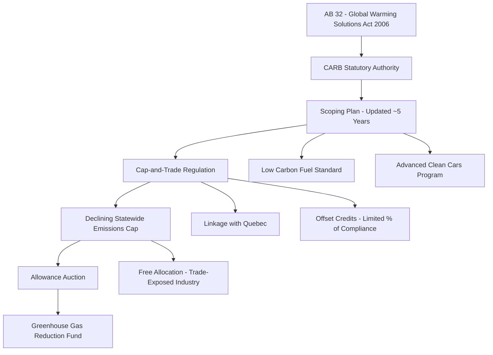

## State and Regional Climate Programs and California's Climate Framework

### Overview

In the absence of comprehensive federal climate legislation, states have become the primary laboratories for climate regulation in the United States, developing distinct regulatory architectures ranging from market-based cap-and-trade systems to command-and-control performance standards to disclosure-based approaches. California has emerged as the most influential single-state actor, both because of its unique statutory authority under the Clean Air Act to set vehicle emissions standards more stringent than federal standards, and because of its sheer market size, which allows state-level rules to function as de facto national standards (the so-called "California effect" or regulatory ripple effect). Regional multi-state programs, particularly the Regional Greenhouse Gas Initiative (RGGI) in the Northeast, represent a parallel cooperative federalism model built through interstate compact-like agreements rather than federal mandate.

This body of state and regional law matters administratively because it operates through distinct legal mechanisms — cap-and-trade market design, Clean Air Act waiver authority, state administrative procedure, and interstate compact-like cooperation — each raising its own preemption, dormant Commerce Clause, and administrative procedure questions.

### California's Climate Framework: Statutory Foundations

#### AB 32 — The Global Warming Solutions Act of 2006

**Key Points**

- AB 32 established California's foundational climate statute, directing the California Air Resources Board (CARB) to develop a comprehensive program to reduce statewide GHG emissions to 1990 levels by 2020 — a target California achieved ahead of schedule.
- AB 32 gave CARB broad authority to adopt "regulations to achieve the maximum technologically feasible and cost-effective reductions in greenhouse gas emissions," functioning as an enabling statute analogous to how the Clean Air Act empowers EPA, but drafted specifically with climate change as the express statutory purpose — a structural advantage the federal government lacks.
- Subsequent legislation extended and strengthened these targets: **SB 32** (2016) required a reduction to 40% below 1990 levels by 2030, and **AB 1279** (2022) established a statutory goal of carbon neutrality by 2045, alongside interim targets.
- [Unverified] The precise current statutory targets and any subsequent legislative amendments should be verified against the current California Health and Safety Code, as California has periodically revisited and tightened these targets through follow-on legislation.

#### CARB's Scoping Plan Process

CARB implements AB 32's mandate through periodic **Climate Change Scoping Plans**, comprehensive planning documents (updated roughly every five years) that establish the state's overall strategy and sector-specific measures for meeting statutory targets.

**Example**

The Scoping Plan process functions analogously to a State Implementation Plan (SIP) under the federal CAA, but is self-generated under state statutory authority rather than federally mandated: CARB models pathways across the electricity, transportation, industrial, and building sectors, then translates the Scoping Plan's targets into specific enforceable regulations (such as the Cap-and-Trade Regulation, Low Carbon Fuel Standard, and Advanced Clean Cars rules), each independently subject to California's Administrative Procedure Act rulemaking requirements.

### California Cap-and-Trade Program

#### Program Design

**Key Points**

- California's Cap-and-Trade Program, administered by CARB, is an economy-wide, declining-cap emissions trading system covering electricity generation and imports, large industrial facilities, and (since 2015) transportation fuel and natural gas distributors — making it one of the most comprehensive carbon markets globally in terms of sectoral coverage.
- The program sets a statewide emissions cap that declines annually, issues a corresponding number of allowances (each representing one metric ton of CO2-equivalent), and requires covered entities to surrender allowances matching their verified emissions at the end of each compliance period.
- Allowances are distributed through a combination of free allocation (particularly for emissions-intensive, trade-exposed industries to address leakage concerns) and quarterly auctions; auction proceeds are deposited into the state's **Greenhouse Gas Reduction Fund**, which finances programs including high-speed rail, affordable housing near transit, and the California Climate Investments portfolio.
- A **price floor** and **price containment mechanisms** (allowance price containment reserve, and later an Allowance Price Ceiling) are built into the program design to manage price volatility.
- Offset credits from qualified protocols (e.g., forestry, livestock methane capture, ozone-depleting substances destruction) may be used to satisfy a limited percentage of compliance obligations, subject to quantitative limits and quality-control protocols intended to ensure additionality and verifiability.

#### Linkage with Quebec

California's program is **linked** with Quebec's cap-and-trade system, meaning allowances issued by either jurisdiction are mutually recognized and can be used for compliance in either program, and joint auctions are held.

- [Inference] This linkage is legally significant because it demonstrates that subnational and even cross-national climate market integration is achievable through administrative agreements between environmental agencies (CARB and Quebec's Ministère de l'Environnement) without requiring a treaty or federal-level authorization, though such linkages raise their own questions about interstate compact clause implications addressed below.
- Ontario had previously linked to the California-Quebec market but withdrew after a change in provincial government, illustrating the political fragility of voluntary multi-jurisdictional linkage arrangements compared to a program with binding legislative or treaty-level commitment.

### California's Clean Air Act Waiver Authority

#### Section 209 Waiver Mechanism

Under CAA Section 209, states are generally preempted from setting their own motor vehicle emissions standards — except California, which may apply to EPA for a **waiver** of preemption due to its unique historical status as the only state that had established motor vehicle emissions programs prior to the CAA's enactment.

**Key Points**

- Once California receives a waiver for a particular standard, CAA Section 177 allows other states to adopt California's standards (rather than the federal standard) as their own, without needing a separate waiver — this is the legal mechanism behind the multi-state "Section 177 states" coalition that has historically adopted California's vehicle emissions and Zero-Emission Vehicle (ZEV) mandates.
- Waiver requests and denials have been a recurring point of federal-state conflict across presidential administrations: EPA has at various points denied, granted, and revisited waivers for specific California vehicle GHG and ZEV standards, with waiver denials and subsequent litigation over their validity a recurring feature of the regulatory landscape.
- [Unverified] The current status of any specific California waiver (including recent Advanced Clean Cars II and heavy-duty vehicle rules) should be verified against current EPA Federal Register notices and any pending litigation, as waiver status has been subject to reversal across administrations and continues to be actively litigated.
- [Inference] This waiver mechanism is a significant structural exception within an otherwise preemptive federal scheme, and functions as an alternate pathway for national-scale vehicle emissions policy: because a critical mass of Section 177 states collectively represents a large share of the U.S. vehicle market, automakers frequently design to the stricter California standard nationally rather than maintain two separate vehicle fleets, effectively giving California's standard national reach without federal legislative action.

### California Climate Corporate Disclosure Laws

**Key Points**

- California enacted the **Climate Corporate Data Accountability Act (SB 253)** and the **Climate-Related Financial Risk Act (SB 261)** in 2023, requiring large companies doing business in California (defined by revenue thresholds) to publicly disclose GHG emissions (Scope 1, Scope 2, and, on a delayed implementation timeline, Scope 3 emissions) and climate-related financial risks, respectively.
- [Unverified] Specific applicability thresholds, phase-in dates, and implementing regulations should be verified against current California Air Resources Board guidance, as these laws have been subject to implementation delays, CARB rulemaking to fill statutory gaps, and ongoing legal challenges (including a First Amendment compelled-speech challenge raised by business groups).
- [Inference] Because compliance is triggered by doing business in California regardless of a company's state of incorporation or headquarters, these statutes function as de facto national disclosure requirements for large companies, illustrating the same "California effect" dynamic seen in vehicle emissions standards, extended into securities and corporate disclosure law.

### Regional Greenhouse Gas Initiative (RGGI)

#### Program Structure

**Key Points**

- RGGI is a cooperative cap-and-trade program among a group of Northeast and Mid-Atlantic states, covering carbon dioxide emissions from fossil-fuel-fired electric power generation facilities above a specified capacity threshold — narrower in sectoral scope than California's program, which is economy-wide.
- RGGI operates through a **Memorandum of Understanding** among participating states and each state's individual implementing regulations, rather than a single unified multi-state statute — meaning each state must independently authorize its participation, and a state can withdraw unilaterally by regulatory or legislative action (as Pennsylvania and New Jersey have separately shown, through different mechanisms and at different times, that state-level participation in RGGI is not irrevocably fixed).
- Allowances are auctioned quarterly through a coordinated regional auction platform; proceeds are returned to member states, each of which independently determines how to allocate its share (commonly toward energy efficiency, renewable energy, and direct consumer bill assistance programs).
- RGGI's cap has been periodically tightened through program review processes conducted among member states, most notably following a comprehensive 2017 program review that adjusted the cap trajectory.
- [Inference] RGGI's reliance on an MOU rather than a binding interstate compact (which would require congressional consent under the Constitution's Compact Clause) reflects a deliberate legal design choice: an MOU-based cooperative arrangement is more legally flexible and avoids the congressional consent question, at the cost of making the arrangement more fragile to unilateral state withdrawal, as seen in states that have exited and, in at least one case, later rejoined the program through subsequent state action.

#### Compact Clause Considerations

[Inference] Because RGGI and similar interstate arrangements (and, arguably, the California-Quebec linkage) involve formal coordination among sovereign jurisdictions on a regulatory matter, they have prompted academic and occasional litigant discussion of whether such arrangements should be characterized as interstate compacts requiring congressional consent under Article I, Section 10 of the U.S. Constitution. The prevailing legal structure of RGGI (independent state regulations coordinated through a non-binding MOU, rather than a single binding multi-state agreement altering state authority) has generally been designed to avoid triggering formal Compact Clause analysis, though this remains a debated area, and case law specifically testing RGGI's structure under the Compact Clause is limited.

### Renewable Portfolio Standards and Clean Electricity Standards

**Key Points**

- The majority of U.S. states have enacted some form of Renewable Portfolio Standard (RPS) or Clean Electricity Standard (CES), requiring load-serving entities to procure a specified percentage of electricity from qualifying renewable or zero-carbon resources by a target date.
- Design variation across states is substantial: eligible technology definitions differ (some states include large hydropower or nuclear as qualifying "clean" resources under a CES framework; others restrict RPS eligibility to specific renewable technologies), compliance mechanisms differ (tradeable Renewable Energy Certificates, or RECs, versus direct procurement mandates), and enforcement penalties (alternative compliance payments) vary considerably.
- California's RPS, integrated with its broader climate framework, is among the most stringent, targeting 100% clean electricity by a statutory deadline under **SB 100** (2018).
- [Inference] Because RECs can often be traded across state lines within regional grid operator footprints, RPS compliance markets create their own interstate legal questions around REC double-counting, resource shuffling, and whether out-of-state generation can satisfy in-state RPS obligations — issues that have generated litigation under the dormant Commerce Clause where RPS design has been challenged as discriminating against out-of-state or non-qualifying generation.

### Federal Preemption and Dormant Commerce Clause Challenges

State climate programs face two recurring constitutional and statutory vulnerabilities:

- **Field and conflict preemption**: Industry challengers have argued that certain state climate measures (for example, state restrictions or standards affecting interstate energy commodities, or building electrification ordinances affecting natural gas appliances) are preempted by federal statutes such as the Energy Policy and Conservation Act (EPCA), particularly where a state or local measure is argued to function as an indirect energy efficiency standard preempted by EPCA's express preemption provision for covered products.
- **Dormant Commerce Clause**: Because state climate programs (RPS resource eligibility rules, low carbon fuel standards, cap-and-trade offset protocols) can have the practical effect of favoring in-state or regionally proximate resources, or of regulating conduct occurring wholly outside the state's borders (extraterritoriality doctrine), they are recurrently challenged as unconstitutionally burdening interstate commerce. California's Low Carbon Fuel Standard has faced such challenges based on its lifecycle carbon-intensity scoring methodology, which some out-of-state fuel producers have argued penalizes fuels based on production location and transportation distance.
- [Inference] Courts have generally upheld the core structure of these programs against facial dormant Commerce Clause challenges (given legitimate non-discriminatory environmental justifications and the market-based design of most current programs), but litigation of this kind recurs with each new or amended state program, making it a persistent compliance risk factor rather than a fully settled question.

### Comparative Structural Summary

| Feature | California Cap-and-Trade | RGGI |
| --- | --- | --- |
| Sectoral scope | Economy-wide | Power sector only |
| Legal basis | State statute (AB 32/SB 32) | Multi-state MOU + individual state regulations |
| Linkage | Linked with Quebec | Multi-state regional program (no external linkage) |
| Offset use | Permitted, capped | [Unverified — verify current program rules] |
| Revenue use | Greenhouse Gas Reduction Fund | State-determined (efficiency, renewables, bill assistance) |
| Withdrawal mechanism | N/A (single state) | Unilateral state exit via regulation/legislation |

### Conclusion

California's climate framework and regional programs like RGGI illustrate two distinct but complementary models of subnational climate governance operating in the vacuum left by the absence of federal climate legislation: California's model combines a comprehensive, statutorily entrenched cap-and-trade system with unique CAA waiver authority that gives its vehicle standards de facto national reach, while RGGI demonstrates a looser, MOU-based cooperative federalism model among sovereign states that trades legal robustness for flexibility. Both models face recurring preemption and dormant Commerce Clause challenges precisely because they were not designed as part of a unified federal scheme, and both continue to shape — and, in California's case, frequently anticipate — the direction federal climate policy eventually takes.

**Related Topics**

- Clean Air Act Section 209/177 waiver litigation history in detail
- Dormant Commerce Clause doctrine applied to state environmental and energy regulation
- Interstate Compact Clause analysis and cooperative federalism models
- California Environmental Quality Act (CEQA) and its interaction with climate permitting
- Low Carbon Fuel Standards (California and Oregon) and lifecycle carbon-intensity methodology
- State climate superfund/cost-recovery statutes (e.g., climate accountability acts holding fossil fuel companies liable for adaptation costs)
- Renewable Energy Certificate (REC) markets and tracking systems (e.g., WREGIS, NEPOOL-GIS)
- Energy Policy and Conservation Act (EPCA) preemption of state appliance and building energy standards