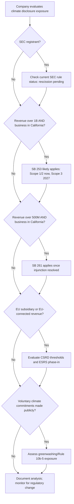

## Corporate Climate Disclosure Rules and Related Litigation

### Overview and Regulatory Landscape

Corporate climate disclosure law addresses the extent to which governments may compel publicly traded and large private companies to report greenhouse gas (GHG) emissions, climate-related financial risks, and governance practices related to climate change. This body of law sits at the intersection of securities regulation, environmental law, and constitutional free-speech doctrine. As of September 2026, the field is in a state of significant flux in the United States, characterized by federal retreat, state-level advancement, and active constitutional litigation, layered atop a maturing international framework that many U.S. multinationals must still follow.

Three regulatory tracks are essential to understand:

1. **Federal (SEC) track** — largely stalled/reversed.
2. **California track (SB 253 / SB 261)** — active, litigated, but substantially enforceable.
3. **International/EU track (CSRD, ISSB/IFRS S2)** — extraterritorial reach into U.S. multinationals.

---

### The SEC Climate-Related Disclosure Rules (2024)

**Key Points**

- **Adoption**: The SEC adopted "The Enhancement and Standardization of Climate-Related Disclosures for Investors" on March 6, 2024, under Release No. 33-11275.
- **Substantive requirements as adopted**: Registrants were required to disclose material climate-related risks, the entity's governance and oversight of those risks, risk-management processes, and — for larger filers — Scope 1 and Scope 2 GHG emissions. The rule notably dropped a mandatory Scope 3 (value-chain) emissions requirement that had appeared in the 2022 proposal, and it added financial-statement disclosure requirements for the effects of severe weather events and other natural conditions.
- **Legal theory of authority**: The SEC grounded the rule in its traditional securities-disclosure mandate under the Securities Act of 1933 and Securities Exchange Act of 1934, framing climate risk as material financial information for investors rather than environmental regulation per se.

**Litigation Timeline**

The Climate Rules were first proposed on March 21, 2022 and finalized on March 6, 2024, establishing a climate-related disclosure framework for registration statements and annual reports, including disclosures regarding climate-related risks, governance and oversight, and risk-management processes, as well as financial statement requirements for recording the effects of severe weather events. Litigation challenging the validity of the Climate Rules began almost immediately following their adoption, with petitions filed by states, industry groups, and (separately) environmental advocates who argued the rule did not go far enough. These petitions were consolidated in the U.S. Court of Appeals for the Eighth Circuit as *Iowa v. SEC*, No. 24-1522. [Gibson Dunn](https://www.gibsondunn.com/sec-proposes-rescission-of-climate-related-disclosure-rules/)[Gibson Dunn](https://www.gibsondunn.com/sec-proposes-rescission-of-climate-related-disclosure-rules/)

On April 4, 2024, the Commission stayed the climate disclosure rules pending completion of the consolidated litigation in the Eighth Circuit. [SEC.gov](https://www.sec.gov/newsroom/press-releases/2026-49-sec-proposes-rescission-climate-related-disclosure-rules)

Following the change in presidential administration, the SEC's posture shifted dramatically:

- On February 11, 2025, then-Acting Chairman Mark Uyeda stated the rule "is deeply flawed and could inflict significant harm on the capital markets and our economy." [SEC.gov](https://www.sec.gov/newsroom/speeches-statements/uyeda-statement-climate-change-021025)
- On March 27, 2025, the Commission voted to end its defense of the rules, with Uyeda stating the goal was "to cease the Commission's involvement in the defense of the costly and unnecessarily intrusive climate change disclosure rules." [sec](https://sec.gov/newsroom/press-releases/2025-58)
- Commissioner Caroline Crenshaw dissented sharply, characterizing the situation as leaving the rule formally on the books while the agency abandoned its defense — arguing this left the court and other parties "in a strange and perhaps untenable situation," with the majority effectively "crossing their fingers" that the rule would be struck down without the agency having to formally rescind it through notice-and-comment rulemaking (which the Administrative Procedure Act ordinarily requires for repeal, per *Perez v. Mortgage Bankers Association*). [SEC.gov](https://www.sec.gov/newsroom/speeches-statements/crenshaw-statement-climate-related-disclosures-032725)
- On April 24, 2025, the Eighth Circuit directed the SEC to clarify whether it intended to review or reconsider the rules, and if not, whether it would continue to adhere to them if the petitions for review were denied. [SEC.gov](https://www.sec.gov/newsroom/speeches-statements/crenshaw-statement-climate-related-disclosure-rules-litigation-072325)
- On July 23, 2025, the SEC submitted its court-ordered status report, indicating it did not intend to reconsider the rules through rulemaking but also would not defend them, effectively asking the court to resolve the litigation itself. [harvard](https://corpgov.law.harvard.edu/2025/08/13/sec-responds-to-eighth-circuit-asking-eighth-circuit-to-rule-on-climate-disclosure-litigation/)
- On September 12, 2025, the Eighth Circuit ordered the consolidated petitions held in abeyance until the Commission either reconsiders the rules via notice-and-comment rulemaking or renews its defense. [SEC.gov](https://www.sec.gov/newsroom/press-releases/2026-49-sec-proposes-rescission-climate-related-disclosure-rules)
- The Commission has since proposed formal rescission of the climate disclosure rules in their entirety, asserting that they exceed the scope of the agency's statutory authority. [SEC.gov](https://www.sec.gov/newsroom/press-releases/2026-49-sec-proposes-rescission-climate-related-disclosure-rules)

**[Inference]** Because the rescission is proceeding via notice-and-comment rulemaking rather than simple non-enforcement, it is likely to face its own legal challenges from states or environmental groups arguing the rescission itself is arbitrary and capricious or inadequately justified — mirroring the *State Farm* "arbitrary and capricious" standard for reversals of prior agency positions.

**Practical Effect for Practitioners**

- Companies should assume they do not need to continue planning for compliance with the 2024 SEC climate rules specifically, but climate-related disclosures may still be required under other pre-existing SEC rules and guidance (e.g., general materiality principles under Regulation S-K Item 105 (Risk Factors) and Item 303 (MD&A), and the SEC's 2010 climate change guidance, which was never rescinded). [Bracewell LLP](https://www.bracewell.com/resources/sec-ends-defense-of-climate-disclosure-rules/)
- Companies with foreign or California nexus may face separate mandatory obligations regardless of the SEC's course (see below).

---

### California's Climate Accountability Package: SB 253 and SB 261

California enacted the most significant U.S. state-level corporate climate disclosure regime through two 2023 statutes (signed into law in October 2023, with subsequent implementing amendments in 2024).

**SB 253 — Climate Corporate Data Accountability Act**

| Element | Requirement |
| --- | --- |
| Covered entities | Companies doing business in California with total annual revenue exceeding $1 billion |
| Scope 1 & 2 emissions | Disclosure required beginning 2026 (covering FY2025 data) |
| Scope 3 emissions | Disclosure required beginning 2027 (covering FY2026 data) |
| Assurance | Limited assurance phased in for Scope 1/2; expanding over time |
| Administering agency | California Air Resources Board (CARB) |

**SB 261 — Climate-Related Financial Risk Act**

| Element | Requirement |
| --- | --- |
| Covered entities | Companies doing business in California with revenue exceeding $500 million |
| Disclosure content | Climate-related financial risks (often TCFD-aligned) and mitigation/adaptation measures |
| Frequency | Biennial public disclosure |
| First deadline | January 1, 2026 (subsequently affected by injunction — see litigation below) |

**Related administrative development**: CARB approved implementing regulations for both SB 253 and SB 261 on February 26, 2026. CARB also formally adopted an annual fee structure: $3,106 per entity for SB 253 and $1,403 per entity for SB 261. [nixonpeabody](https://www.nixonpeabody.com/-/media/files/alerts/2026/03/california-climate-disclosure-laws-update.pdf)[watershed](https://watershed.com/blog/ninth-circuit-california-climate-disclosure)

**Litigation: *Chamber of Commerce v. Sanchez* (formerly *v. CARB*)**

In January 2024, the U.S. Chamber of Commerce, the California Chamber of Commerce, the American Farm Bureau Federation, and other business groups sued the California Air Resources Board, challenging SB 253 and SB 261 on multiple constitutional grounds, including the First Amendment, federal preemption (Supremacy Clause/Dormant Commerce Clause-adjacent extraterritoriality theories), and extraterritorial application. The district court dismissed the preemption and extraterritoriality claims, leaving only the First Amendment compelled-speech claim to proceed. [gtlaw](https://www.gtlaw.com/pl/insights/2025/8/california-climate-disclosure-laws-federal-court-denies-request-to-block-sb-253-and-261-plaintiffs-appeal)[gtlaw](https://www.gtlaw.com/pl/insights/2025/8/california-climate-disclosure-laws-federal-court-denies-request-to-block-sb-253-and-261-plaintiffs-appeal)

**The First Amendment theory**: Plaintiffs argued the emissions and climate-risk disclosure mandates compel companies to engage in "speculative, noncommercial, controversial, and politically-charged" speech that they would not otherwise make, implicating the compelled-speech doctrine typically analyzed under *Zauderer v. Office of Disciplinary Counsel* (commercial speech, rational-basis-like review for factual/uncontroversial disclosures) versus the more exacting scrutiny reserved for compelled ideological or controversial speech. [gtlaw](https://www.gtlaw.com/pl/insights/2025/8/california-climate-disclosure-laws-federal-court-denies-request-to-block-sb-253-and-261-plaintiffs-appeal)

**District court ruling (denial of preliminary injunction)**: On August 13, 2025, the U.S. District Court for the Central District of California denied plaintiffs' motion for a preliminary injunction. Judge Otis Wright II held that "plaintiffs have not shown a likelihood of success on the merits" of their First Amendment claims. The court distinguished the two statutes: SB 253's emissions data was deemed "purely factual and uncontroversial," subjecting it to the lower Zauderer-style scrutiny applicable to commercial disclosures, whereas SB 261's climate-risk reporting required a somewhat higher level of judicial scrutiny — but the court still found California's investor-protection rationale sufficient to survive that intermediate review. [akingump](https://www.akingump.com/en/california-climate-disclosure-laws-survive-preliminary-injunction-on-first-amendment-challenge-reporting-obligations-swiftly-approaching)[esgnews](https://esgnews.com/california-court-upholds-climate-disclosure-laws-rejects-chamber-of-commerce-challenge)

**Appeal to the Ninth Circuit**: Plaintiffs appealed the denial to the Ninth Circuit Court of Appeals and sought an injunction pending appeal. After failing to obtain relief from either the district court or the Ninth Circuit panel handling the emergency motion, plaintiffs — led by the U.S. Chamber of Commerce — filed an Emergency Application for Injunction Pending Appeal at the U.S. Supreme Court on November 10, 2025. [gtlaw](https://www.gtlaw.com/pl/insights/2025/8/california-climate-disclosure-laws-federal-court-denies-request-to-block-sb-253-and-261-plaintiffs-appeal)[gtlaw](https://www.gtlaw.com/en/insights/2025/11/new-california-climate-disclosure-law-deadlines-are-rapidly-approaching-compliance-considerations-for-companies)

**Ninth Circuit developments**:

- On November 18, 2025, the Ninth Circuit issued a formal injunction pausing enforcement of SB 261 specifically, while SB 253 remained enforceable. [watershed](https://watershed.com/blog/ninth-circuit-california-climate-disclosure)
- Oral arguments in the consolidated appeal, styled Chamber of Commerce et al. v. Sanchez, were heard by the Ninth Circuit on January 9, 2026. [watershed](https://watershed.com/blog/ninth-circuit-california-climate-disclosure)
- A ruling was expected in the second or third quarter of 2026, and **[Unverified]** whether a decision has issued as of this writing should be confirmed against current Ninth Circuit dockets, since appellate rulings can be delayed beyond projected windows. [watershed](https://watershed.com/blog/ninth-circuit-california-climate-disclosure)

**Current compliance posture (as of early-to-mid 2026)**:

- SB 253 reporting is moving forward for the 2026–27 reporting cycles, while SB 261 remains effectively voluntary pending the Ninth Circuit's ruling, given the injunction on its enforcement. [nixonpeabody](https://www.nixonpeabody.com/-/media/files/alerts/2026/03/california-climate-disclosure-laws-update.pdf)
- Reported SB 253 compliance deadline dates vary slightly across secondary sources (some citing August 10, 2026; others November 10, 2026) — **[Unverified]**, practitioners should confirm the operative deadline directly against the current CARB regulatory text, since implementing dates were still being finalized through CARB's February 2026 rulemaking.
- Approximately 2,600 companies are covered by SB 253 and approximately 4,100 by SB 261. [watershed](https://watershed.com/blog/ninth-circuit-california-climate-disclosure)

**[Inference]** The bifurcated outcome — SB 253 (hard emissions data) surviving scrutiny more easily than SB 261 (forward-looking risk narratives) — reflects a broader doctrinal pattern likely to recur in other disclosure litigation: mandates to disclose objectively verifiable, backward-looking data face a much lower constitutional hurdle than mandates to disclose forward-looking, judgment-laden risk assessments.

---

### Comparative Framework: SEC Rule vs. SB 253/261 vs. EU CSRD

```mermaid
flowchart TD
    A[Corporate Climate Disclosure Regimes] --> B[SEC 2024 Rule]
    A --> C[California SB 253 / SB 261]
    A --> D[EU CSRD / ESRS]
    A --> E[ISSB IFRS S2]

    B --> B1[Status: Stayed then rescission proposed]
    B --> B2[Trigger: SEC registrant status]
    B --> B3[Scope: Material risk plus Scope 1 and 2 for large filers]

    C --> C1[Status: SB253 enforceable; SB261 enjoined pending 9th Cir.]
    C --> C2[Trigger: Doing business in California plus revenue threshold]
    C --> C3[Scope: Scope 1, 2, 3 emissions plus climate financial risk]

    D --> D1[Status: In force, phased-in by company size]
    D --> D2[Trigger: EU-connected revenue or listing thresholds]
    D --> D3[Scope: Double materiality, full ESRS topics]

    E --> E1[Status: Voluntary unless adopted by jurisdiction]
    E --> E2[Trigger: Jurisdictional adoption, e.g., UK, Japan, Australia]
    E --> E3[Scope: Climate-related financial disclosures, TCFD-based]
```

**Key Points on extraterritorial reach**: A U.S. company with no SEC climate obligations may still face mandatory disclosure exposure through (1) California nexus (SB 253/261), (2) EU subsidiary or revenue thresholds under the Corporate Sustainability Reporting Directive (CSRD), or (3) voluntary/mandatory adoption of ISSB standards by a foreign regulator where the company is listed. **[Inference]** This layering means "SEC rescission" does not equal "no disclosure obligation" for large multinationals — a common misconception addressed in current client alerts, several of which explicitly warn companies to continue monitoring state and international obligations even as federal rules recede.

---

### Constitutional Doctrine Underlying the Litigation

**Compelled Commercial Speech Framework**

$$\text{Scrutiny Level} = f(\text{factual nature}, \text{controversy}, \text{governmental interest})$$

- **Zauderer standard** (lower scrutiny): Applies to disclosures that are purely factual and uncontroversial, and reasonably related to a legitimate government interest (originally developed for attorney-advertising disclaimers). California's SB 253 emissions-reporting mandate was analyzed under this framework because raw GHG tonnage figures are objectively measurable.
- **Central Hudson intermediate scrutiny**: Applies to broader commercial speech regulation, requiring a substantial governmental interest and a reasonably tailored fit between means and ends. SB 261's climate-risk narrative disclosure was evaluated closer to this standard because it requires subjective risk characterization rather than raw data reporting.
- **Strict scrutiny** (not applied here but argued by plaintiffs): Reserved for compelled speech on genuinely ideological or non-factual matters; plaintiffs unsuccessfully argued climate risk disclosure was inherently ideological given contested policy debates about climate change.

**Related Doctrinal Precedent**

- ***National Institute of Family and Life Advocates v. Becerra*** (2018) — informs when disclosure mandates cross from factual/uncontroversial into ideologically compelled speech.
- ***Perez v. Mortgage Bankers Association*** (2015) — establishes that the APA requires agencies to use the same notice-and-comment procedures to repeal a rule as were used to adopt it, directly relevant to whether SEC can informally abandon the climate rule without formal rescission rulemaking. [SEC.gov](https://www.sec.gov/newsroom/speeches-statements/crenshaw-statement-climate-related-disclosures-032725)
- ***Motor Vehicle Mfrs. Ass'n v. State Farm*** (1983) — governs whether an agency's reversal of a prior substantive position is "arbitrary and capricious," relevant to any future challenge to the SEC's rescission rulemaking.

---

### Practical Compliance Considerations for Practitioners and In-House Counsel

**Example**

A hypothetical U.S.-headquartered manufacturer with $2 billion in global revenue, $150 million of which derives from California sales, and a wholly owned EU subsidiary generating €50 million in revenue would need to separately evaluate:

1. **SEC exposure**: None currently mandatory (rule stayed/being rescinded), but general materiality disclosure obligations under Items 105 and 303 remain live.
2. **California SB 253**: Likely covered (revenue exceeds $1 billion threshold and company "does business" in California); must track Scope 1/2 emissions for 2025 reporting year, with Scope 3 beginning 2026 reporting year — subject to final Ninth Circuit disposition.
3. **California SB 261**: Likely covered (revenue exceeds $500 million); reporting currently enjoined but company should prepare given uncertainty.
4. **EU CSRD**: EU subsidiary likely triggers CSRD reporting obligations depending on employee count and revenue thresholds under the EU's size-based phase-in schedule, independent of U.S. parent's obligations.

**Next Steps for Corporate Counsel**

- Maintain GHG inventory systems (Scope 1/2 at minimum) regardless of the SEC rule's fate, given persistent state and international obligations.
- Monitor the Ninth Circuit's disposition in *Chamber of Commerce v. Sanchez* and any Supreme Court action on the emergency application.
- Track CARB's finalized implementing regulations and enforcement discretion guidance, since CARB has signaled some flexibility on initial-year enforcement given the litigation posture.
- Reassess disclosure controls and procedures (Sarbanes-Oxley Section 302/404 implications) if voluntarily continuing climate disclosures for investor-relations purposes even absent a mandatory federal rule.
- Coordinate cross-functionally between legal, sustainability, and investor relations teams to ensure consistency between voluntary CDP/TCFD-aligned disclosures and any state-mandated filings, since inconsistent voluntary and mandatory disclosures can create independent securities-fraud exposure under Rule 10b-5.

---

### Climate Change Litigation Beyond Disclosure Mandates

Corporate climate accountability litigation extends beyond disclosure-rule challenges into several adjacent doctrinal categories relevant to this chapter:

**Climate Change Tort/Nuisance Litigation Against Emitters**

- Municipal and state plaintiffs (e.g., *City of New York v. Chevron Corp.*, *Honolulu v. Sunoco*, numerous similar suits by California counties/cities) have sued major fossil fuel companies under state-law public nuisance, failure-to-warn, and consumer-protection theories, seeking damages for climate adaptation costs.
- **[Inference]** These suits are procedurally distinct from disclosure litigation but often produce discoverable internal documents (e.g., historical corporate knowledge of climate science) that intersect with disclosure-adequacy questions — i.e., whether companies "knew" material climate risk and failed to disclose it, which can independently support securities-fraud claims.
- Removal/jurisdiction battles have been significant: defendants have sought to remove these cases to federal court and dismiss on federal common law preemption grounds; the Supreme Court's *City of Honolulu v. Sunoco* certiorari denial (2025) left the underlying state-law nuisance theories largely intact procedurally, though **[Unverified]** — confirm current status, as this area remains highly active with a circuit split on removal jurisdiction.

**Securities Fraud (Rule 10b-5) Climate Claims**

- Private plaintiffs and the SEC (under pre-existing enforcement authority independent of the 2024 rule) have brought "greenwashing" securities-fraud claims alleging companies made materially false or misleading statements about climate commitments, carbon-neutrality pledges, or ESG fund composition.
- Key theory: material misstatement/omission under Section 10(b) and Rule 10b-5, or state-law equivalents, distinct from any specific disclosure mandate — meaning greenwashing liability exposure persists regardless of the SEC climate rule's fate.

**State Attorney General Investigations**

- State AGs (both supporting and opposing corporate climate disclosure) have used state unfair/deceptive trade practices statutes and, in some cases, state securities law, to investigate corporate climate representations — creating a patchwork enforcement landscape independent of any federal rule.

---

### Illustrative Compliance Decision Flow

---

### Conclusion

The corporate climate disclosure landscape in the United States as of September 2026 is defined by federal retreat and state/international advance operating in parallel. The SEC's 2024 rule — once positioned as the flagship federal climate disclosure regime — has been effectively abandoned by the agency that adopted it, with formal rescission rulemaking now underway, though the Eighth Circuit litigation remains technically unresolved pending that rulemaking or a renewed defense. Simultaneously, California's SB 253 and SB 261 have survived First Amendment challenge at the district court level under a bifurcated Zauderer/intermediate-scrutiny analysis, with SB 253 continuing toward enforcement while SB 261 remains enjoined pending Ninth Circuit resolution of *Chamber of Commerce v. Sanchez*. For practitioners, the operative reality is that disclosure obligations have not disappeared merely because the federal rule stalled — they have migrated to state and international regimes, and companies with multi-jurisdictional footprints face a genuinely fragmented compliance landscape requiring continuous monitoring rather than a single-rule compliance program.

---

**Related Topics**

- State public nuisance climate litigation against fossil fuel majors (*City of New York v. Chevron*, *Honolulu v. Sunoco*)
- EU Corporate Sustainability Reporting Directive (CSRD) and ESRS double-materiality standard
- ISSB IFRS S1/S2 sustainability and climate disclosure standards
- Greenwashing enforcement under Rule 10b-5 and FTC Green Guides
- Administrative Procedure Act standards for rule rescission (*State Farm*, *Perez v. Mortgage Bankers Assn.*)
- Compelled commercial speech doctrine (*Zauderer*, *Central Hudson*, *NIFLA v. Becerra*)
- Scope 3 (value-chain) emissions accounting methodologies and audit/assurance standards
- Task Force on Climate-Related Financial Disclosures (TCFD) legacy framework and its successor bodies
- State-level climate superfund laws (New York, Vermont) and related industry litigation
- Shareholder derivative and proxy litigation over climate risk oversight (Caremark-style board oversight claims)