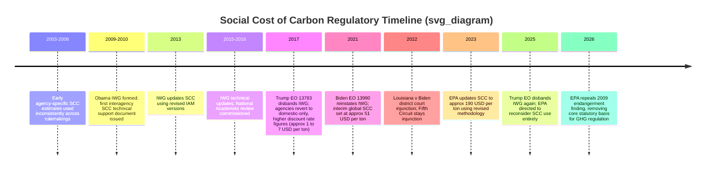
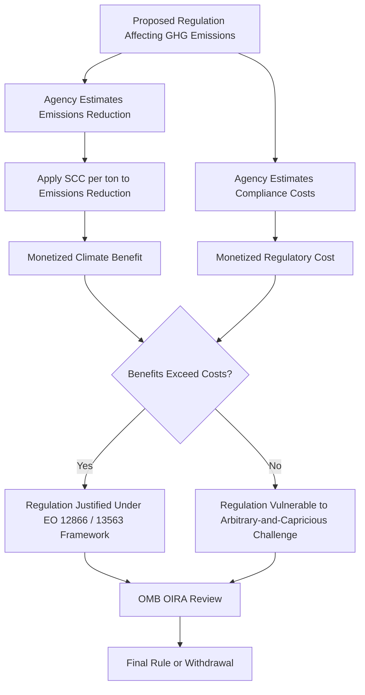

## The Social Cost of Carbon in Regulatory Cost-Benefit Analysis

### Definitional Foundations

The **social cost of carbon (SCC)** is a monetized estimate of the economic damage caused by one additional metric ton of carbon dioxide emitted in a given year, expressed in dollars per ton. It functions as the shadow price of carbon in regulatory cost-benefit analysis (CBA), converting an externality — a cost imposed on society that is not reflected in market prices — into a dollar figure that can be weighed against the compliance costs of a proposed regulation. Analogous figures exist for methane (SC-CH4) and nitrous oxide (SC-N2O), collectively termed the **social cost of greenhouse gases (SC-GHG)**.

**Key Points**

- The SCC is not a market price; it is a modeled estimate of marginal external damages (health impacts, agricultural losses, sea-level rise, extreme weather, ecosystem damage, etc.) attributable to incremental emissions.
- It enables agencies to satisfy the "benefits" side of cost-benefit analysis mandated by long-standing executive orders (originating with Reagan-era Executive Order 12291 and refined through Executive Order 12866 and Executive Order 13563) that require major regulations to be justified where benefits outweigh costs.
- Nobel laureate economist William Nordhaus's Dynamic Integrated Climate-Economy (DICE) model is foundational to the underlying economic methodology, for which he received the 2018 Nobel Memorial Prize in Economic Sciences.

---

### Economic Methodology: Integrated Assessment Models (IAMs)

**Key Points**

The SCC is derived using **integrated assessment models (IAMs)**, which couple a simplified climate model (translating emissions into temperature change) with a simplified economic-damage model (translating temperature change into monetized harm), then discount future damages to present value.

The three IAMs historically relied upon by the U.S. Interagency Working Group (IWG) were:

| Model | Full Name | Key Characteristic |
| --- | --- | --- |
| DICE | Dynamic Integrated Climate-Economy | Aggregated global damage function; simplest structure |
| FUND | Climate Framework for Uncertainty, Negotiation and Distribution | Regionally disaggregated; sector-specific damage functions |
| PAGE | Policy Analysis of the Greenhouse Effect | Explicit treatment of catastrophic/discontinuous risk |

**Core computational structure**:

$$SCC_t = \sum_{s=t}^{T} \frac{D_s(\Delta E_t)}{(1+r)^{s-t}}$$

Where $D_s$ represents monetized climate damages in year $s$ attributable to a marginal emission pulse in year $t$, and $r$ is the discount rate applied over the (very long) time horizon $T$ across which climate damages accrue.

**Discount rate sensitivity**: The choice of discount rate is the single most consequential and contested modeling parameter, because climate damages unfold over centuries while regulatory costs are borne in the near term.

- The Obama-era IWG primarily used discount rates of 2.5%, 3%, and 5%, reporting the 3% mean as the headline figure alongside a 95th-percentile high-impact estimate at 3%.
- Lower discount rates (e.g., 2% or below, as recommended by some economists including Nicholas Stern) produce substantially higher SCC values because they weight harm to future generations more heavily.
- Higher discount rates produce lower SCC values by discounting future harms more aggressively, a position associated with economists like William Nordhaus in his earlier work and favored by deregulation-oriented administrations.

**[Inference]** Because compounding operates over 100+ year horizons, a shift from a 3% to a 2% discount rate can more than double the resulting SCC figure — making the discount rate a more consequential lever than most disputes over the underlying climate science itself.

---

### Domestic vs. Global Damages Scope

A second major methodological and legal fault line concerns **geographic scope**:

- **Global scope**: Values all worldwide damages from a ton of U.S.-attributable emissions, on the rationale that greenhouse gases mix globally and cause harm regardless of emission source, and that U.S. welfare is affected by global damages through trade, security, and humanitarian channels.
- **Domestic-only scope**: Values only damages occurring within U.S. borders, producing a substantially lower figure.

**Historical figures illustrate the scope debate's magnitude**: the Trump administration's first-term domestic-only approach produced an SCC of approximately $1–$7 per ton, while the Obama/Biden-era global approach produced figures around $51 per ton (2021 IWG interim estimate) rising to approximately $190 per ton under the Biden administration's 2023 EPA update, which incorporated updated climate science, a lower discount rate, and expanded damage categories.

**[Inference]** The domestic-vs-global scope choice is less a matter of pure economics than of statutory and international-relations policy judgment, which is precisely why it has become the central battleground in separation-of-powers and major-questions-doctrine litigation described below.

---

### Regulatory and Institutional History

Note: rendered here strictly as unrendered fenced text per formatting requirements; the timeline block above uses Mermaid `timeline` syntax and is not rendered as a visual diagram in this response.

**Detailed narrative:**

**Bush and early Obama era**: For roughly two decades, agencies recognized that cost-benefit analysis of greenhouse-gas-affecting actions requires some estimate of climate damage costs, and regulators from multiple federal agencies developed guidelines for estimating the SCC prior to formal interagency coordination.

**2009–2010 — Formation of the Interagency Working Group (IWG)**: The Obama administration formally convened the IWG on the Social Cost of Carbon (later Social Cost of Greenhouse Gases), bringing together economists and scientists across agencies including EPA, Treasury, DOE, and the Council of Economic Advisers to produce standardized, government-wide estimates rather than allowing each agency to generate its own figure — addressing a consistency and legal-defensibility problem in prior ad hoc agency practice.

**2017 — First Trump administration**: Executive Order 13783 disbanded the IWG and withdrew its technical support documents, directing agencies that wished to consider the social cost of carbon to do so using domestic-only damages and higher discount rates, producing dramatically lower figures (approximately $1–$7/ton) than the IWG's global estimates.

**2021 — Biden administration, Executive Order 13990**: On his first day in office, President Biden issued EO 13990, reviving the IWG and restoring an interim global SCC estimate of approximately $51 per ton of CO2, pending a more comprehensive methodological update.

**2023 — EPA's updated SCC**: EPA promulgated a revised SCC methodology (used prominently in the 2023 power plant and vehicle-emissions rulemakings) that increased the central estimate to approximately $190 per ton, reflecting updated climate-damage science, revised discount-rate assumptions, and expanded damage categories (e.g., updated agricultural and mortality damage functions).

**2025 — Second Trump administration**: Within days of taking office, the administration issued a new executive order disbanding the IWG a second time, revoking its prior determinations, and directing EPA to reconsider using the social cost of carbon altogether "with the goal of eradicating 'abuse' that stands in the way of affordable energy production." Reporting has traced this order's language directly to the Heritage Foundation's Project 2025 policy blueprint. Separately, the administration directed EPA to submit a report on the legality and continuing applicability of the 2009 endangerment finding within 30 days.

**2026 — Repeal of the endangerment finding**: In February 2026, EPA formalized rescission of the 2009 endangerment finding, the foundational Clean Air Act determination that greenhouse gases endanger public health and welfare. The administration characterized this as the largest deregulatory action in U.S. history, projecting $1.3 trillion in regulatory savings, concentrated in reduced vehicle-manufacturing compliance costs. Because the endangerment finding underlies nearly all Clean Air Act greenhouse gas regulatory authority (light-, medium-, and heavy-duty vehicle standards; power plant rules; oil and gas sector rules), its repeal would remove the statutory predicate for those rules independent of any SCC dispute. EPA had signaled this move as early as July 2025, citing "serious concerns that many of the scientific underpinnings of the Endangerment Finding are materially weaker than previously believed" and arguing prior warming projections "appear unduly pessimistic."

**[Unverified]** — Practitioners should confirm the current litigation posture of the endangerment-finding repeal directly against agency dockets, as environmental groups have characterized this as certain to draw the largest legal challenge in the history of U.S. climate regulation, and case filings were still developing as of this writing.

---

### Major-Questions-Doctrine and APA Litigation: *Louisiana v. Biden*

**Key Points — Procedural History**

*Louisiana v. Biden* is the principal litigation testing whether a president can direct agency-wide use of a specific SCC methodology via executive order without formal notice-and-comment rulemaking.

- **April 2021**: Louisiana and nine other states (Alabama, Florida, Georgia, Kentucky, Mississippi, South Dakota, Texas, West Virginia, Wyoming) sued numerous federal agencies in the U.S. District Court for the Western District of Louisiana, seeking to enjoin implementation of the IWG's SCC estimate.
- **Plaintiffs' three core theories**:
  1. **APA procedural claim**: The SCC estimate functions as a substantive/legislative rule that should have undergone notice-and-comment rulemaking under the APA but did not.
  2. **Ultra vires/authority claim**: The President and IWG lack authority to enforce the SCC estimate because it is substantively unlawful under the APA and conflicts with existing statutory law.
  3. **Major-questions/domestic-scope claim**: The administration exceeded its congressionally delegated authority by basing regulatory policy on global damage considerations rather than solely domestic effects — implicating the major-questions doctrine, which requires clear congressional authorization for agency action of vast economic and political significance.
- **February 11, 2022 — District court injunction**: Judge James Cain (W.D. La.) granted a preliminary injunction, holding that the executive order requiring use of the SCC in federal decision-making violated the major-questions doctrine, and barring the government nationwide from implementing the SCC portion of the Biden climate order.
- **March 16, 2022 — Fifth Circuit stay**: A unanimous three-judge Fifth Circuit panel stayed the district court's injunction pending appeal, holding that the states lacked standing because any regulatory burden flowing from mere consideration of the SCC in agency analysis was too speculative to constitute concrete injury — since the SCC estimate itself does not compel any regulatory outcome, only informs analysis.
- **Fifth Circuit denial of rehearing en banc**: The full Fifth Circuit (17 active judges) declined to rehear the panel decision, leaving the stay in place.
- **May 26, 2022 — Supreme Court denial of emergency relief**: The U.S. Supreme Court denied the states' emergency application to vacate the Fifth Circuit's stay, in an unsigned order, allowing the Biden administration to continue using the SCC estimate while the underlying appeal proceeded. This left the standing-based stay in place rather than resolving the major-questions merits question.

**[Inference]** The Fifth Circuit's standing rationale — that using the SCC in agency *analysis* is not itself final agency action causing cognizable injury — means the core major-questions doctrine question about domestic-vs-global scope was never resolved on the merits in this case. This left the door open for future as-applied challenges to specific rules that rely on the global SCC figure, where a concrete regulatory burden (and thus standing) is more easily shown — a strategy environmental and industry litigants on both sides have since pursued in challenges to specific EPA and DOE rules rather than to the SCC methodology in the abstract.

---

### Standing Doctrine as the Recurring Procedural Barrier

**Key Points**

The standing analysis in *Louisiana v. Biden* reflects a structural feature of SCC litigation that recurs across administrations: because the SCC is an *input* to analysis rather than a self-executing regulatory mandate, plaintiffs challenging its use in the abstract face a persistent standing problem. Litigants have generally had more success (in either direction) when they challenge:

1. A specific final rule that relied on a particular SCC figure to justify its cost-benefit conclusion (ripe, concrete injury), rather than
2. The SCC methodology or executive order in isolation (speculative, not yet ripe).

**[Inference]** This dynamic likely explains why subsequent legal contests over SCC methodology — including anticipated challenges to the 2025–2026 rollback — are expected to be litigated primarily as challenges to specific downstream deregulatory rules (e.g., vehicle emissions standard rollbacks, endangerment finding repeal) rather than as freestanding challenges to the executive order disbanding the IWG.

---

### The SCC's Role Within the Cost-Benefit Analysis Framework

**Key Points on OMB/OIRA's Role**

- The Office of Information and Regulatory Affairs (OIRA), within OMB, reviews "significant" regulatory actions under Executive Order 12866, requiring agencies to demonstrate that benefits justify costs (or, for certain statutes, that benefits outweigh costs is not the exclusive test — some statutes like the Clean Air Act's NAAQS provisions bar cost consideration entirely under *Whitman v. American Trucking Associations*).
- The SCC's value therefore is not uniformly dispositive; its regulatory weight depends on the specific statute's cost-consideration mandate. Where a statute permits or requires cost-benefit balancing (e.g., many Department of Energy appliance efficiency rules, Department of Transportation fuel economy standards), the SCC figure can be outcome-determinative for whether a rule survives OIRA review and subsequent arbitrary-and-capricious challenge.

---

### Interaction With the Endangerment Finding and Chevron/Loper Bright Considerations

**[Inference]** The 2026 repeal of the endangerment finding operates on a different legal axis than the SCC dispute but interacts with it substantively: even if a future administration reinstated a high global SCC figure, EPA would lack Clean Air Act authority to translate that cost-benefit conclusion into binding GHG emission standards absent a valid endangerment finding. This makes the endangerment-finding repeal potentially more consequential to the ultimate regulatory outcome than the SCC dispute itself, since the SCC only matters once an agency has independent statutory authority to regulate.

Post-*Loper Bright Enterprises v. Raimondo* (2024), which eliminated *Chevron* deference to agency statutory interpretation, courts reviewing both the endangerment-finding repeal and any future SCC-dependent rule will exercise independent judgment on the underlying statutory questions (e.g., whether "endanger public health and welfare" was correctly or incorrectly applied), rather than deferring to the agency's reading — a significant shift in the litigation risk calculus for whichever administration's position is being challenged.

---

### Practical Application: Example Cost-Benefit Calculation

**Example**

Consider a hypothetical DOE appliance efficiency rule projected to reduce emissions by 5 million metric tons of CO2 annually over a 15-year analysis period, with annualized compliance costs to manufacturers of $150 million.

- **Under 2023 EPA methodology** (~$190/ton, global scope): Annual climate benefit ≈ 5,000,000 × $190 = $950 million, comfortably exceeding the $150 million cost — rule easily survives cost-benefit review.
- **Under first-Trump-era methodology** (~$5/ton, domestic-only scope): Annual climate benefit ≈ 5,000,000 × $5 = $25 million, far below the $150 million cost — the same rule, evaluated identically in every other respect, would fail cost-benefit justification under a discretionary-balancing statute.

**[Inference]** This example illustrates why the SCC figure functions as a de facto policy lever that can validate or invalidate the same physical regulation depending solely on which administration's methodology is applied — a dynamic that has made the SCC one of the most consequential yet least publicly visible numbers in U.S. administrative law, sometimes described by critics and advocates alike as "the most important number you've never heard of."

---

### Comparative International Approaches

**Key Points**

- The **U.K.** and **European Union** emissions trading systems effectively reveal a market-based carbon price through allowance trading, distinct from the U.S. model-based SCC approach, though EU shadow-price guidance for non-ETS sectors uses IAM-adjacent methodology.
- **Canada** maintains a federal carbon pricing backstop with an explicit statutory price trajectory, sidestepping much of the modeling controversy by setting price via legislation rather than damage-function estimation.
- **[Inference]** The comparative divergence suggests two competing regulatory design philosophies: price-discovery-based carbon pricing (EU/Canada style) versus damage-estimation-based shadow pricing for CBA purposes (U.S. style) — the latter being inherently more exposed to methodological and administration-driven volatility because it depends on contestable modeling assumptions rather than market-clearing prices.

---

### Conclusion

The social cost of carbon exemplifies how a seemingly technical economic modeling choice — discount rate, geographic damage scope, and underlying IAM selection — can function as a powerful, largely judicially unreviewed lever for climate policy, because courts (per *Louisiana v. Biden*) have generally treated the SCC's use in agency analysis as insufficiently concrete to confer standing for freestanding challenges. This has pushed the real legal battles downstream to challenges of specific rules and, increasingly, to the more foundational question of whether EPA retains statutory authority to regulate greenhouse gases at all following the 2026 repeal of the endangerment finding. For students of administrative and environmental law, the SCC saga is a paradigm case of how executive-order-driven policy swings, combined with narrow standing doctrine and evolving deference frameworks post-*Loper Bright*, can produce dramatic regulatory volatility without any change in the underlying governing statutes.

---

**Related Topics**

- The 2009 EPA Endangerment Finding and its 2026 repeal: *Massachusetts v. EPA* lineage and Clean Air Act Section 202(a) authority
- *Loper Bright Enterprises v. Raimondo* and the end of *Chevron* deference in climate rulemaking review
- The major questions doctrine in climate regulation (*West Virginia v. EPA*, 2022)
- Executive Order 12866 and OIRA cost-benefit review procedures
- Discount rate theory in intergenerational equity and environmental economics (Ramsey equation, Stern Review vs. Nordhaus debate)
- Standing doctrine for regulatory-analysis-input challenges vs. final-agency-action challenges
- State-level carbon pricing and cap-and-trade programs (California AB 32/Cap-and-Trade, RGGI)
- Corporate climate disclosure rules and related litigation (companion topic)
- Administrative Procedure Act notice-and-comment requirements for substantive vs. interpretive rules
- Vehicle emissions and fuel economy standards (CAFE) litigation following endangerment finding repeal