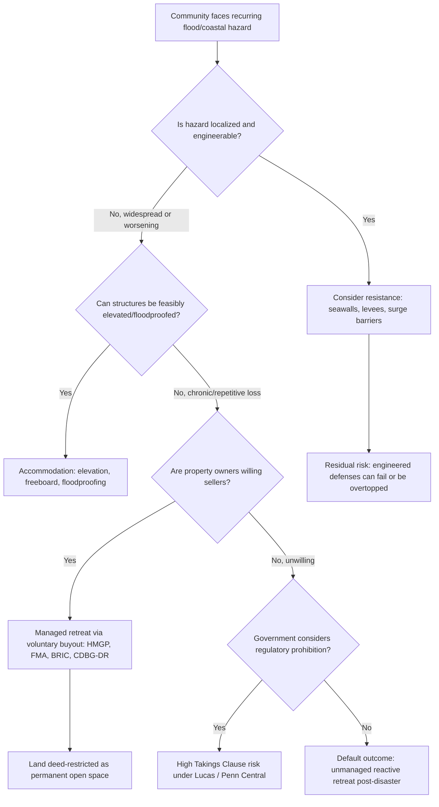

## Adaptation Law: Resilience Standards, Floodplain Management, and Managed Retreat

### Conceptual Framework: Adaptation vs. Mitigation

**Key Points**

Climate change law traditionally divides into two functional categories: **mitigation** (reducing GHG emissions to slow the rate of climate change) and **adaptation** (adjusting human systems to reduce vulnerability to climate impacts that are already occurring or locked in). Adaptation law is a distinct and increasingly dominant field because even aggressive mitigation cannot reverse warming already embedded in the climate system.

Adaptation law spans four conceptually distinct strategic responses to physical climate risk, particularly coastal and flood risk:

1. **Resistance** — engineering solutions that resist hazard forces (seawalls, levees, shoreline armoring, storm surge barriers).
2. **Accommodation** — modifying the built environment to coexist with hazards (elevating structures, floodproofing, resilient design standards).
3. **Managed retreat** — the planned, coordinated, proactive relocation of people, structures, and infrastructure away from hazard zones before disaster forces the issue.
4. **Unmanaged/reactive retreat** — post-disaster relocation that occurs without systematic planning, which has functioned as the de facto default strategy in much of the U.S. due to the legal and political difficulty of proactive retreat.

**[Inference]** The persistence of unmanaged retreat as the dominant real-world pattern, despite near-universal expert preference for managed retreat, reflects the fact that longstanding property, land-use, and tort law doctrines were developed for a relatively stable physical environment and are poorly suited to systematic pre-disaster relocation — a structural mismatch identified as a central theme in current legal scholarship on this topic.

---

### Resilience Standards: Building Codes and Land-Use Regulation

**Key Points**

Resilience standards operate primarily through two overlapping regulatory channels: building codes (structural/design requirements) and land-use/zoning law (locational restrictions).

**Building code and design-standard mechanisms**:

- **Freeboard requirements**: Many jurisdictions require new construction in flood zones to elevate the lowest floor a specified height (commonly 1–3 feet) above the FEMA-mapped Base Flood Elevation (BFE), providing a safety margin against mapping uncertainty and future sea-level rise.
- **Federal Flood Risk Management Standard (FFRMS)**: A federal standard (first established by Executive Order 13690 in 2015, rescinded in 2017, and subject to further shifts across administrations) requiring federally funded projects to be built to a higher flood-elevation standard than the traditional 100-year floodplain baseline, incorporating either a climate-informed science approach, a freeboard value approach, or the 500-year floodplain approach.
- **Coastal Construction Control Lines**: State-level setback requirements (e.g., Florida's Coastal Construction Control Line program) restricting construction seaward of a mapped erosion-hazard line.

**Land-use mechanisms**:

- **Floodplain overlay zoning districts**: Restrict or condition development within FEMA Special Flood Hazard Areas (SFHAs), often layered atop underlying zoning.
- **Transfer of development rights (TDR)**: Allows landowners in high-hazard zones to sell development rights to receiving areas outside the hazard zone, theoretically compensating for lost development value while achieving retreat-adjacent outcomes without formal government acquisition.
- **Rolling easements**: Property interests that automatically shift landward as the shoreline erodes or as sea level rises, preserving public beach access or conservation status without requiring repeated condemnation actions as the coastline migrates.

---

### The National Flood Insurance Program (NFIP) as Central Regulatory Infrastructure

**Key Points**

The National Flood Insurance Program, established in 1968, is the single most consequential piece of federal adaptation-adjacent law because it simultaneously (a) requires flood-hazard mapping that underlies most floodplain regulation nationwide, (b) mandates minimum floodplain management standards for community participation, and (c) has historically subsidized rather than discouraged building in flood-prone areas.

**Structural mechanics**:

- Participation is technically voluntary for communities, but federally backed mortgages in mapped Special Flood Hazard Areas require flood insurance as a condition of the loan, creating powerful de facto pressure for local participation.
- Communities that join the NFIP commit to minimum floodplain management standards (e.g., permit requirements for construction in the SFHA) in exchange for their residents' eligibility to purchase NFIP policies.
- The **Community Rating System (CRS)** provides premium discounts to communities that adopt floodplain management measures more stringent than the federal minimum, functioning as an incentive-based resilience-standard mechanism layered on top of the baseline regulatory floor.

**The repetitive-loss problem**: From 1978 to 2018, more than 36,000 NFIP-insured properties filed repeated claims for flood damage, illustrating what scholars term the "destroy-rebuild-repeat" cycle — federal subsidy structures have historically enabled reconstruction in the same hazard-exposed footprint after each loss event, undermining the program's own actuarial sustainability and working at cross-purposes with managed-retreat policy goals.

**[Inference]** Because NFIP subsidization and floodplain-management regulation are administered through the same statutory vehicle, meaningful reform toward managed retreat likely requires restructuring NFIP's rate-setting and repetitive-loss provisions rather than solely tightening local land-use ordinances, since local governments have limited incentive to restrict development so long as federal insurance continues to backstop losses regardless of local hazard-mitigation effort.

**Risk Rating 2.0**: FEMA's transition to actuarially-based, individualized property risk pricing (replacing the prior flat-zone-based rating system) represents an attempt to internalize true flood risk into insurance premiums, which — if fully implemented — would create market-based pressure toward retreat from the highest-risk properties without requiring direct regulatory prohibition.

---

### Managed Retreat: Mechanisms and Case Studies

**Key Points — Federal Buyout Programs**

Several federal agencies operate voluntary property acquisition ("buyout") programs that constitute the primary operational mechanism for managed retreat in the United States:

| Program | Administering Agency | Key Feature |
| --- | --- | --- |
| Hazard Mitigation Grant Program (HMGP) | FEMA | Post-disaster funding; requires a Presidential disaster declaration |
| Flood Mitigation Assistance (FMA) | FEMA | Pre-disaster, targets repetitive-loss NFIP properties |
| Building Resilient Infrastructure and Communities (BRIC) | FEMA | Pre-disaster, competitive, broader hazard-mitigation focus |
| CDBG-Disaster Recovery (CDBG-DR) | HUD | Highly flexible; frequently used for larger-scale buyout and relocation projects |

**Mechanics of a typical buyout**: A local or state government (as the applicant, since FEMA generally cannot contract directly with individual homeowners) negotiates a pre-disaster fair-market-value purchase with willing-seller homeowners, demolishes the structure, and the land is deed-restricted in perpetuity as open space, preventing future rebuilding — permanently removing the parcel from the housing stock and the hazard-exposure inventory.

**Illustrative case study — Taholah Village, Washington**: The Quinault Indian Nation initiated a project in 2017 to relocate Taholah Village inland and upgradient from its original site on the Pacific coast, which was vulnerable to both tsunami and storm surge risk. The village received $25 million in federal funding in 2022 to support relocation to a new site located approximately one mile inland, with significant construction completed by 2025, illustrating a fully realized, community-led, government-funded managed retreat implementation.

**Structural limitations of the voluntary buyout model**:

- **Voluntariness and adverse selection**: Because participation is voluntary, buyouts often produce a "swiss cheese" pattern of scattered vacant parcels rather than the fully cleared hazard zones needed for genuine risk reduction, since remaining holdout owners continue to require the same infrastructure and emergency services.
- **Slow timelines**: Buyout processes frequently take years from disaster to closing, during which owners remain in hazard-exposed properties or in insurance/mortgage limbo.
- **Equity concerns**: Buyout eligibility criteria, appraisal methodologies, and program awareness historically disadvantage lower-income and minority communities, even as those communities are often more exposed to flood risk and rely more heavily on subsidized flood insurance premiums.

---

### The Takings Clause as the Central Constitutional Constraint

**Key Points**

The Fifth Amendment's Takings Clause — "nor shall private property be taken for public use, without just compensation" — is the dominant constitutional constraint on regulatory (as opposed to voluntary/purchase-based) approaches to managed retreat, and is the doctrinal center of most adaptation-law litigation.

**Governing framework**:

$$\text{Regulatory Taking} = f(\text{economic impact}, \text{investment-backed expectations}, \text{character of government action})$$

- ***Lucas v. South Carolina Coastal Council*** (1992): Established that a regulation depriving land of *all* economically beneficial use constitutes a categorical (per se) taking requiring compensation, unless the restriction merely codifies a pre-existing background principle of state property or nuisance law. This case arose directly from a coastal setback/erosion-control regulation and remains the foundational precedent for challenges to coastal retreat and no-build zone regulations.
- ***Penn Central Transportation Co. v. City of New York*** (1978): Provides the multi-factor balancing test (economic impact, interference with investment-backed expectations, character of governmental action) applied to regulations that fall short of a total wipeout of value — the framework most floodplain and coastal setback regulations are analyzed under, since they typically restrict rather than eliminate all use.
- ***Nollan v. California Coastal Commission*** (1987) and ***Dolan v. City of Tigard*** (1994): Establish the "nexus" and "rough proportionality" requirements for exactions (e.g., conditioning a coastal development permit on a public-access easement), relevant where local governments attempt to extract retreat-adjacent concessions (rolling easements, setback dedications) as permit conditions.

**Practical implication for adaptation law**: Regulatory tools that flatly prohibit rebuilding after storm damage (an aggressive form of managed retreat) face the highest *Lucas* categorical-taking risk if they eliminate all economically viable use of the parcel, whereas tools that merely condition rebuilding on elevation, setback, or floodproofing requirements are more likely to survive under the more permissive *Penn Central* framework because some economically viable use typically remains.

**[Inference]** This doctrinal asymmetry likely explains why voluntary buyout programs, rather than regulatory prohibition, have become the dominant practical mechanism for managed retreat in the U.S.: buyouts sidestep takings liability entirely by compensating willing sellers at fair market value, while regulatory retreat mandates (down-zoning to prohibit rebuilding, hard no-build lines) carry substantial and often prohibitive takings litigation exposure for the enacting government.

---

### Comparative and Emerging Framework: New Zealand's Proposed Managed Retreat Legislation

**Key Points**

New Zealand has advanced further than most jurisdictions toward comprehensive, purpose-built managed-retreat legislation, offering a useful comparative model. An expert review panel evaluating New Zealand's Resource Management Act 1991 recommended that the RMA be repealed and replaced with two new statutes, alongside a third standalone **Managed Retreat and Climate Change Adaptation Act** specifically addressing the legal and funding complexities of managed retreat, on the panel's conclusion that "the complexities of the process of managed retreat... require new discrete legislation" rather than incremental amendment of general land-use law. The proposed framework would create a dedicated adaptation fund and empower local and central government to override standard planning rules where necessary to address climate change impacts.

**[Inference]** New Zealand's approach — treating managed retreat as warranting an entirely separate statutory framework rather than an extension of existing land-use or emergency-management law — reflects a recognition that retreat implicates a distinct bundle of legal problems (property compensation, funding mechanisms, community relocation governance, cultural/indigenous land considerations) that do not map cleanly onto either traditional zoning law or traditional disaster-relief law. The U.S. currently lacks an analogous comprehensive federal framework, instead relying on the patchwork of NFIP, HMGP/BRIC buyout programs, and state/local land-use ordinances described above.

---

### Decision Framework: Choosing an Adaptation Strategy

---

### Litigation and Legal Tension Points

**Key Points**

Beyond takings doctrine, several additional legal tension points recur in adaptation and retreat litigation:

- **Public trust doctrine**: Some coastal states apply public trust principles to argue that shoreline armoring or hard structures that interfere with natural beach migration and public access can be restricted or removed, even where doing so limits private littoral owners' options — creating tension with those owners' takings claims.
- **Due process and notice in floodplain remapping**: FEMA flood map updates that newly include previously unmapped properties within the SFHA can trigger insurance-purchase mandates and building-code triggers without any physical change to the property, generating due-process and administrative-procedure challenges to map accuracy and the adequacy of notice-and-appeal procedures.
- **Disparate impact and equity claims**: Buyout program design, eligibility criteria, and pre-disaster versus post-disaster funding availability have been challenged (or scrutinized under Fair Housing Act and environmental-justice frameworks) for disproportionately burdening or excluding lower-income and minority communities.
- **Insurance-market retreat as de facto adaptation policy**: Private insurers' withdrawal from high-wildfire and high-flood-risk markets (notably in California and Florida) functions as an unplanned, market-driven form of retreat pressure, raising novel questions about the interaction between state insurance regulation (rate suppression/approval authority) and climate risk-informed underwriting.

---

### Practical Application: Example Local Ordinance Analysis

**Example**

A coastal municipality adopts an ordinance prohibiting reconstruction of any residential structure damaged more than 50% of its pre-damage value ("substantial damage" — a standard NFIP-derived threshold) within a mapped V-zone (high-velocity coastal flood hazard area), effectively converting storm-damaged lots to permanent retreat.

- **Takings analysis**: Because the ordinance does not eliminate all economically viable use (the land retains value for open recreational use, or for relocation of a smaller/elevated structure outside the immediate hazard footprint, depending on ordinance design), a *Penn Central* balancing analysis would likely apply rather than a *Lucas* categorical taking — but the outcome would turn heavily on the specific economic-impact evidence presented (e.g., pre- versus post-ordinance appraised value) and the extent to which the "substantial damage" trigger merely codifies the community's pre-existing NFIP floodplain-management obligations, which could bring the *Lucas* background-principles exception into play.
- **[Inference]** A well-drafted ordinance would likely pair the reconstruction prohibition with an offer to purchase the parcel at pre-damage fair market value, converting a high-litigation-risk regulatory taking into a much lower-risk voluntary transaction — the same strategic logic underlying the federal buyout-program preference described above.

---

### Conclusion

Adaptation law occupies a distinctive position within climate change law because it operates almost entirely through pre-existing legal frameworks — property law, insurance regulation, zoning, and disaster-relief statutes — that were not designed with systematic, proactive relocation in mind. The dominance of voluntary buyout programs over regulatory retreat mandates in current U.S. practice is best understood as a direct consequence of Takings Clause doctrine, particularly the categorical-taking risk established in *Lucas*, which makes compensated acquisition far more legally durable than uncompensated prohibition. As sea-level rise, flood frequency, and wildfire risk intensify, the central open questions for this field are whether federal law will move toward the kind of purpose-built statutory framework New Zealand has proposed, whether NFIP reform can realign insurance incentives away from the destroy-rebuild-repeat cycle, and whether equity-conscious program design can be achieved without slowing the already protracted buyout timeline.

---

**Related Topics**

- Regulatory takings doctrine deep dive: *Lucas*, *Penn Central*, *Murr v. Wisconsin*, and background-principles defenses
- National Flood Insurance Program reform proposals and Risk Rating 2.0 methodology
- Public trust doctrine and coastal shoreline armoring restrictions
- Environmental justice in disaster recovery and buyout program design
- FEMA Building Resilient Infrastructure and Communities (BRIC) program structure and funding cycles
- State coastal zone management act frameworks (California Coastal Act, Florida Coastal Construction Control Line)
- Insurance-market retreat and state insurance rate regulation under climate stress (California FAIR Plan, Florida Citizens Property Insurance)
- Indigenous-led relocation governance models (Quinault Indian Nation, Isle de Jean Charles)
- Corporate climate disclosure rules and related litigation (companion topic)
- The social cost of carbon in regulatory cost-benefit analysis (companion topic)