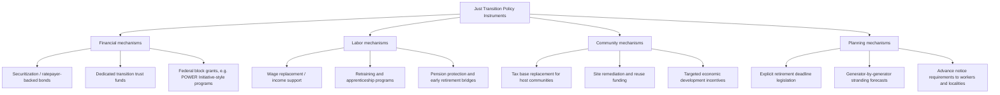

## Just Transition Policy and Stranded Asset Considerations

### Definitional Foundations

**Key Points**

**Just transition** refers to a fair distribution of the burdens and benefits of the transition to a low-carbon economy, with particular emphasis on protecting fossil fuel-dependent workers and communities from disproportionate harm. There is no single unified definition of just transition, but the concept traces its origins to the 1970s labor and environmental movements, which sought to reconcile job protection with environmental regulation before the term was later adapted to the climate-decarbonization context.

A **stranded asset** is an asset that loses economic value prior to the end of its anticipated useful life, typically because it becomes uneconomic to operate relative to alternatives, or because regulatory, market, or policy shifts (a "carbon bubble" scenario) render continued use infeasible. In the utility-regulation context, a stranded asset most commonly refers to a fossil fuel generation facility retired before full depreciation of its capital investment, leaving an "undepreciated" or "unrecovered" balance on a utility's books.

These two concepts are structurally linked: just transition policy exists largely *because* stranded-asset dynamics (uneconomic coal and gas plant retirements, mine closures) create concentrated, geographically specific economic disruption for workers and communities dependent on the retiring industry.

---

### The Economics and Scale of Stranded Fossil Assets

**Key Points**

- The Carbon Tracker Initiative's widely cited 2017 estimate found that regulated utilities were carrying approximately $185 billion in potential stranded assets in uneconomic coal generation units, a figure that has grown as renewable and gas generation costs have continued to decline relative to coal.
- From 2011 to 2020, approximately 95 gigawatts of U.S. coal-fired capacity closed, with an additional 25 gigawatts slated to close by 2025 — cutting national coal capacity by roughly one-third from its 2011 peak of 314 GW.
- Research modeling a 2035 clean-electricity-sector deadline (consistent with the Biden administration's stated decarbonization goal) found that of 10,435 U.S. fossil fuel generators operating as of 2018, just over 7,600 would already have reached the end of their typical operational lifespan by 2035 without any policy intervention. The remaining generators — roughly 27% of the fleet — would need to close before reaching their average retirement age, representing a loss of approximately 15% of the fleet's total remaining lifetime generating capacity. **[Inference]** This finding is significant for just transition policy design because it demonstrates that a large majority of decarbonization-driven closures track natural asset retirement timing rather than requiring premature shutdown, meaning the "stranding" problem — and the associated worker/community disruption requiring compensation — is concentrated in a definable minority of facilities that can be identified and planned for in advance.

**Illustrative case: WEPCO Oak Creek Power Plant** — At the end of 2025, Wisconsin Electric Power Company retired the Oak Creek coal-fired power plant, a 640 MW facility, seventeen years earlier than its planned retirement, with $645 million remaining unrecovered on the utility's books. Absent alternative financing, this unrecovered capital is typically passed through to ratepayers via continued rate-base recovery even though the plant no longer generates electricity — illustrating the core stranded-asset cost-allocation problem that just transition financing mechanisms are designed to address.

---

### Legal and Regulatory Mechanisms for Managing Stranded Assets

**Key Points — Securitization**

**Securitization** (also called ratepayer-backed bonds or ratepayer obligation charge bonds) is the primary legal-financial mechanism used by states to manage utility stranded-asset costs while funding just transition measures. The mechanism works as follows:

$$\text{Total Stranded Cost} = \text{Undepreciated Capital} + \text{Decommissioning Costs} - \text{Salvage Value}$$

**Mechanics**:

1. State legislation authorizes a utility to issue special ratepayer-backed bonds secured by a dedicated, statutorily guaranteed, non-bypassable charge on customer bills (distinct from the utility's general corporate credit).
2. Because the bonds are backed by a legislatively guaranteed revenue stream rather than the utility's general creditworthiness, they typically receive the highest available credit ratings (AAA), enabling issuance at interest rates often below 3% — substantially lower than a utility's regulated return on equity, which commonly runs 8–10%.
3. The utility uses bond proceeds to immediately recover the stranded undepreciated capital, replacing higher-cost equity/debt financing with the lower-cost securitized debt.
4. Ratepayers repay the bonds over an extended amortization period through the dedicated surcharge, at a lower total cost than continued cost-of-service recovery through the utility's normal rate base.
5. A portion of the resulting savings can be — and in several state statutes must be — directed to transition assistance for displaced coal-plant workers and host communities.

**State legislative precedent**:

- Colorado, Montana, and New Mexico passed securitization-authorizing legislation in 2019 specifically to refinance uneconomic but undepreciated coal plants, explicitly framed around consumer protection during accelerated retirement.
- Approximately 20 states have statutes permitting utility asset securitization as of recent surveys, though authorization requirements and the extent of mandated worker/community transition set-asides vary significantly by state.
- Illustrative outcomes: A Duke Energy Florida securitization of $1.3 billion in closed nuclear plant assets was issued at a 2.72% interest rate (versus Duke's much higher regulated rate of return), saving customers approximately $700 million over 20 years. Consumers Energy in Michigan received Public Utility Commission approval to sell $389.6 million in securitization bonds to capture the unrecovered net book value of 950 MW of coal capacity retired in 2016.

**[Inference]** Securitization functions as a rare "win-win" policy instrument in energy transition law because it simultaneously reduces net ratepayer costs relative to continued cost-of-service recovery, frees utility capital for reinvestment in clean generation, and creates a dedicated, legislatively protected funding stream for just transition worker/community assistance — explaining its rapid adoption across politically diverse states compared to more contested climate policy instruments.

---

### Regulatory Ratemaking Doctrine Underlying Stranded Cost Recovery

**Key Points**

The legal basis for utility stranded-cost recovery rests on traditional public utility ratemaking doctrine, under which regulators historically guaranteed utilities the opportunity to recover prudently incurred capital investments over the asset's useful life in exchange for accepting rate regulation (the regulatory compact). This doctrine creates the core legal tension in stranded-asset policy:

- **Utility/investor position**: Prudently approved capital investments carry a regulator-sanctioned expectation of full cost recovery (grounded in due-process and takings-adjacent utility law principles established in cases like *Duquesne Light Co. v. Barasch*, 1989, addressing the constitutional limits on denying utilities recovery of prudent investment), meaning regulators generally cannot simply disallow recovery of a stranded asset's remaining book value without triggering confiscatory-ratemaking concerns.
- **Ratepayer/consumer advocate position**: Requiring current and future ratepayers to pay for both (a) the remaining cost of a retired, non-operating asset and (b) the cost of new replacement generation is inequitable and economically distortive, particularly where retirement results from a plant becoming uneconomic due to market shifts largely foreseeable by the utility.
- **Securitization as doctrinal compromise**: By legislatively guaranteeing bond repayment through a dedicated charge (satisfying the utility's recovery expectation) while lowering the total cost of that recovery through superior bond financing (partially satisfying ratepayer cost-minimization interests), securitization statutes function as a negotiated middle path that avoids direct constitutional confrontation over the takings/confiscatory-rate question.

**[Inference]** This doctrinal structure explains why just transition worker/community funding is typically attached to securitization statutes as a policy rider rather than pursued through direct disallowance of utility cost recovery: disallowance risks constitutional challenge under confiscatory-ratemaking doctrine, whereas directing a portion of securitization *savings* to transition assistance does not implicate the utility's baseline recovery right.

---

### Political Economy Framework: The Compensation-for-Exit Model

**Key Points**

Recent political-economy scholarship models just transition policy as a strategic bargain between government and fossil fuel workers, drawing on game-theoretic (ultimatum game) frameworks: government compensates workers in exchange for their exit from the fossil fuel industry, which accelerates the broader clean energy transition by reducing worker and community political resistance to fossil fuel phase-out policy.

The success of this bargain depends on several identified parameters:

- **Quality of workers' outside options** — availability of comparable-wage employment elsewhere, which determines how much compensation is needed to induce voluntary exit.
- **Workers' cost of political mobilization** — the ease with which affected workers and communities can organize to block or delay phase-out policy, which affects government bargaining leverage.
- **Climatic benefits obtained from the phaseout** — the magnitude of emissions reduction achieved, which affects how much government is willing to pay for worker exit.
- **Government credibility** — the government's demonstrated reliability in delivering promised compensation, which is identified as a critical and frequently underappreciated variable; low government credibility (from political risk, capacity constraints, or low public trust) reduces the likelihood that workers will accept a transition bargain, thereby increasing both the cost and difficulty of achieving fossil fuel phaseouts.

**[Inference]** This framework suggests that just transition legislation lacking durable, legally enforceable funding commitments (e.g., discretionary appropriations subject to annual political renegotiation, as opposed to statutorily dedicated securitization-linked funding streams) is likely to be systematically less effective at securing worker and community acceptance of accelerated fossil fuel retirement, regardless of the nominal dollar value promised — because the credibility problem, not merely the compensation amount, drives bargaining outcomes.

---

### Comparative Legislative Approaches

**Key Points**

- Scholarship examining fossil electricity retirement timelines emphasizes that setting explicit, generator-specific closure deadlines (rather than aggregate sector-wide targets) enables advance community planning and can help avoid the deindustrialization harms observed in prior transitions, such as the historical collapse of the iron and steel industry and the ongoing challenges of the coal-region transition.
- Policy attention to *distributional* impacts — including the disproportionate concentration of stranded assets and associated job losses in lower-income states and regions — is identified as a critical design consideration, since a nationally aggregated "15% of capacity-years stranded" statistic can mask severe regional concentration of the resulting economic disruption.
- International comparative models (per IUCN/World Commission on Environmental Law analysis) emphasize that just transition requires coordinated legal reform across multiple sectors simultaneously — labor law, energy law, climate law, public participation law, and land-use/planning law — rather than a single standalone statute, and that managed, legislatively sequenced fossil fuel phase-out (as opposed to abrupt or purely market-driven closure) is a key mechanism for setting predictable expectations for workers, communities, and industry alike.

---

### Federal U.S. Policy Instruments (Illustrative, Subject to Political Volatility)

**Key Points**

**[Inference]** Federal just transition policy in the U.S. has historically operated through appropriations-based grant programs rather than durable statutory entitlement, making it considerably more exposed to reversal across administrations than state-level securitization statutes, which function through binding legislative bond authorizations.

- **Community and worker assistance grants**: Federal programs (historically including Department of Energy and Appalachian Regional Commission initiatives targeting coal-dependent regions) have provided grant funding for economic diversification, workforce retraining, and infrastructure investment in fossil-fuel-dependent communities, generally structured as competitive or formula grants subject to annual appropriations.
- **Executive order-driven sector targets**: The Biden administration's stated aim of a carbon-pollution-free electricity sector by 2035, announced via executive order shortly after taking office, functioned as an aggregate policy target rather than a binding statutory mandate, illustrating the vulnerability of executive-order-based climate and just-transition policy to reversal by subsequent administrations — a dynamic paralleling the social-cost-of-carbon and endangerment-finding rollbacks addressed elsewhere in this chapter.
- **[Unverified]** — The current administration's stance on federal just-transition grant funding as of 2026 should be independently verified against current appropriations and agency guidance, given the broader pattern of federal climate-program rollback documented across other topics in this chapter (SEC climate disclosure rescission, social cost of carbon reversal, endangerment finding repeal).

---

### Practical Application: Illustrative Rate Case Analysis

**Example**

A vertically integrated utility seeks to retire a 500 MW coal plant with $400 million in unrecovered capital investment, 15 years before the end of its originally projected useful life, because continued operation has become uneconomic relative to available wind, solar, and gas alternatives.

- **Without securitization**: The utility would typically seek continued cost-of-service recovery of the $400 million unrecovered balance through its general rate base, recovered via its normal allowed return on equity (e.g., 9.5%) over a shortened remaining recovery period — producing a higher monthly ratepayer surcharge than would result from bond financing, while providing no dedicated funding stream for displaced plant workers or the host community's tax-base loss.
- **With securitization** (assuming state authorization): The utility issues ratepayer-backed bonds at a market rate near 3% to retire the $400 million balance immediately, amortized over an extended period via a dedicated, non-bypassable charge. The interest-rate differential (9.5% equity-embedded return versus ~3% bond rate) generates substantial ratepayer savings, a defined portion of which the authorizing statute could direct toward a transition fund providing wage replacement, retraining, and local tax-base bridge payments to the host community — operationalizing the just-transition policy goal through the same transaction that resolves the stranded-asset accounting problem.

**[Inference]** This example illustrates why securitization statutes, rather than direct legislative appropriation, have become the preferred vehicle for funding just transition measures at the state level: the mechanism generates its own funding source (the interest-rate savings) rather than requiring new tax revenue or competing against other budget priorities in the legislative appropriations process.

---

### Conclusion

Just transition policy and stranded asset management are best understood as two sides of the same regulatory-economic problem: decarbonization requires retiring fossil fuel infrastructure before the end of its economically assumed useful life, and someone must bear the resulting unrecovered capital cost and worker/community disruption. Securitization has emerged as the dominant legal mechanism because it resolves the utility ratemaking doctrine tension (satisfying the regulatory-compact expectation of cost recovery) while generating the interest-rate savings that can fund worker and community transition assistance without new appropriations. The durability of just transition commitments, however, depends heavily on whether they are embedded in binding statutory mechanisms (like state securitization law) or in more easily reversible executive-branch policy — a distinction of increasing practical importance given the volatility documented across federal climate policy generally in the current period.

---

**Related Topics**

- Utility ratemaking doctrine and the regulatory compact (*Duquesne Light Co. v. Barasch*)
- State renewable portfolio standards and coal-plant retirement mandates
- The social cost of carbon in regulatory cost-benefit analysis (companion topic)
- Corporate climate disclosure rules and related litigation (companion topic)
- Federal coal-community economic diversification grant programs (Appalachian Regional Commission, DOE)
- Adaptation law: resilience standards, floodplain management, and managed retreat (companion topic)
- Carbon Tracker Initiative "carbon bubble" financial-risk methodology
- Comparative international just transition frameworks (EU Just Transition Mechanism, South Africa's Just Energy Transition Partnership)
- Labor law dimensions of energy-sector workforce transitions (union contract successorship, pension protection)
- Environmental justice and the distributional siting of both fossil fuel retirement and replacement clean energy infrastructure