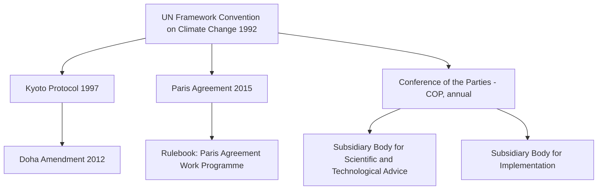
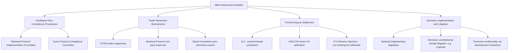

## The Structure and Enforcement of Multilateral Environmental Agreements

### Definitional Foundations

**Key Points**

A **multilateral environmental agreement (MEA)** is a legally binding international instrument, negotiated among three or more sovereign states, that establishes obligations relating to the protection of the environment. MEAs are the primary vehicle through which international environmental law is created, since there is no supranational environmental legislature; states create binding obligations through mutual consent expressed in treaty form, consistent with the foundational principle of state sovereignty in international law (*pacta sunt servanda* — agreements must be kept, codified in Article 26 of the Vienna Convention on the Law of Treaties).

MEAs are typically distinguished from bilateral environmental agreements (between two states) and from non-binding "soft law" instruments (declarations, resolutions, guidelines) that influence state behavior without creating formal legal obligations, though soft law frequently serves as a precursor to, or interpretive aid for, subsequent binding MEAs.

---

### The Framework Convention–Protocol Structure

**Key Points**

The dominant architectural model for modern MEAs is the **framework convention–protocol** structure, which separates broad, politically achievable general commitments (in the framework convention) from more specific, often more stringent, technical obligations (in subsequent protocols) that can be negotiated and ratified separately over time.

**Rationale for this structure**:

- Framework conventions can secure near-universal state participation by setting general principles and institutional architecture without requiring states to commit immediately to specific, costly obligations.
- Protocols allow technical and quantitative commitments (e.g., specific emissions targets, phase-out schedules) to be negotiated once scientific consensus and political will have matured, without reopening the entire underlying convention.
- This structure accommodates evolving scientific understanding, since protocols and their annexes can be updated through streamlined amendment procedures rather than full treaty renegotiation.

**Illustrative example — the climate regime**:

The United Nations Framework Convention on Climate Change (UNFCCC, 1992) established the general objective (stabilizing atmospheric GHG concentrations), core principles (common but differentiated responsibilities), and institutional architecture (the Conference of the Parties, subsidiary bodies, financial mechanism). The Kyoto Protocol (1997) and later the Paris Agreement (2015) were negotiated under this framework to establish more specific, evolving commitments — illustrating how the framework-protocol structure allows the underlying legal architecture to persist across decades while substantive commitments are periodically renegotiated as political and scientific conditions change.

**Other prominent framework-protocol examples**:

- The Vienna Convention for the Protection of the Ozone Layer (1985) and its Montreal Protocol on Substances that Deplete the Ozone Layer (1987), widely regarded as international environmental law's most successful enforcement model.
- The Convention on Biological Diversity (1992) and its Cartagena Protocol on Biosafety (2000) and Nagoya Protocol on Access and Benefit-Sharing (2010).
- The Basel Convention on the Control of Transboundary Movements of Hazardous Wastes (1989) and its Basel Ban Amendment.

---

### Core Institutional Architecture

**Key Points**

Most MEAs share a common institutional skeleton, adapted to the specific subject matter:

| Institution | Function |
| --- | --- |
| Conference of the Parties (COP) / Meeting of the Parties (MOP) | Supreme decision-making body; convenes periodically (often annually or biennially) to review implementation, adopt amendments, and set policy |
| Secretariat | Administrative body providing continuity between COP sessions; coordinates reporting, convenes meetings, maintains treaty documentation |
| Subsidiary/scientific advisory bodies | Provide technical and scientific input to inform COP decision-making (e.g., IPCC's relationship to UNFCCC, though the IPCC is formally independent) |
| Financial mechanism | Channels funding (often from developed to developing countries) to support treaty implementation (e.g., Global Environment Facility, Green Climate Fund, Multilateral Fund for the Montreal Protocol) |
| Compliance/implementation committee | Reviews party compliance and administers non-compliance procedures |

**[Inference]** The consistency of this institutional template across otherwise substantively unrelated MEAs (climate, biodiversity, hazardous waste, ozone) suggests that international environmental law has developed a recognizable "constitutional" architecture for treaty governance, even though no single instrument formally mandates this structure — it has emerged through diplomatic practice and institutional learning across successive treaty negotiations since the 1970s.

---

### Decision-Making and Amendment Procedures

**Key Points**

- **Consensus decision-making**: Most MEA governing bodies operate by consensus rather than formal voting, meaning any party can effectively block a decision by withholding consent. This protects state sovereignty and encourages broad participation but can produce lowest-common-denominator outcomes and negotiating deadlock, particularly evident in UNFCCC COP negotiations.
- **Amendment vs. annex adjustment**: Many MEAs distinguish between formal amendments (requiring the same ratification process as the original treaty, often needing a supermajority and subsequent domestic ratification by each party) and adjustments to technical annexes (which can enter into force more quickly, sometimes automatically for all parties unless a party affirmatively objects). The Montreal Protocol's adjustment procedure — allowing accelerated phase-out schedules for already-listed substances via a simplified process — is frequently cited as a key structural feature enabling its adaptive responsiveness to new scientific findings.
- **Common but differentiated responsibilities (CBDR)**: A recurring structural principle, first articulated prominently in Principle 7 of the 1992 Rio Declaration, under which developed and developing countries bear differentiated obligations reflecting their differing historical contributions to environmental harm and differing capacities to address it. CBDR is operationalized differently across MEAs — from the Kyoto Protocol's binding targets applying only to Annex I (developed) countries, to the Paris Agreement's more flexible "nationally determined contributions" (NDCs) applicable to all parties but calibrated to national circumstances.

---

### The Enforcement Problem: Structural Weaknesses

**Key Points**

International environmental law faces a structural enforcement deficit relative to domestic legal systems, rooted in the absence of a supranational authority with compulsory jurisdiction and coercive enforcement power over sovereign states. Several structural features compound this deficit:

- **No compulsory international environmental court**: Unlike domestic environmental law, there is no standing international tribunal with automatic, compulsory jurisdiction over MEA disputes. The International Court of Justice (ICJ) has jurisdiction only where states have consented (via treaty compromissory clauses, optional-clause declarations, or special agreement), and few MEAs mandate ICJ jurisdiction as the default dispute-resolution mechanism.
- **Reliance on self-reporting**: Compliance monitoring under most MEAs depends primarily on parties' self-reported national communications and inventories, creating verification challenges, particularly for emissions or trade data that individual states have incentive to underreport.
- **Absence of centralized coercive enforcement**: MEAs generally lack the equivalent of domestic regulatory enforcement powers (inspection, fines, criminal sanction) exercisable by a supranational body against a non-complying state; enforcement instead depends on diplomatic, financial, and reputational mechanisms operating through the treaty's own institutional architecture or through other states' unilateral or collective responses.
- **Withdrawal provisions**: Most MEAs include formal withdrawal clauses (e.g., Paris Agreement Article 28, permitting withdrawal after a minimum multi-year notice period), meaning the ultimate sanction available to a dissatisfied party is often simply exit rather than continued negotiation over compliance — illustrated by the United States' formal withdrawal and subsequent re-entry processes regarding the Paris Agreement across different presidential administrations.

**[Inference]** This structural enforcement deficit is not an oversight but reflects a deliberate sovereignty-preserving design choice embedded in the Westphalian state system: states have been unwilling to cede the degree of supranational authority (compulsory jurisdiction, coercive sanction) that would be necessary to create domestic-style enforcement, because doing so would constitute a much deeper surrender of sovereignty than most states are prepared to accept even for shared environmental goals.

---

### Non-Compliance Procedures: The Facilitative Model

**Key Points**

In lieu of coercive enforcement, most modern MEAs have developed **non-compliance procedures (NCPs)** — specialized institutional mechanisms designed to identify and address non-compliance through facilitative, cooperative means rather than adversarial litigation or punitive sanction.

**Common features of NCP design**:

1. **Trigger mechanisms**: Non-compliance can typically be triggered by (a) the non-complying party itself (self-reporting difficulty meeting obligations), (b) another party, or (c) the Secretariat based on reporting data — a multi-trigger design intended to reduce the political cost of raising compliance concerns compared to a purely adversarial state-versus-state complaint model.
2. **Implementation/compliance committees**: A standing body (often with balanced regional representation) reviews non-compliance cases and recommends responses to the COP/MOP.
3. **Facilitative rather than punitive response measures**: Typical responses include technical assistance, financial assistance, extended compliance timelines, and capacity-building support — reflecting a premise that non-compliance in many MEAs (particularly by developing countries) more often reflects capacity constraints than willful defection, making facilitation more effective than sanction.
4. **Graduated escalation**: Some NCPs (notably the Montreal Protocol's) provide for escalating responses in cases of sustained or willful non-compliance, up to and including suspension of specific treaty privileges (e.g., trade privileges in controlled substances under the Montreal Protocol).

**The Montreal Protocol Non-Compliance Procedure** is widely regarded as the most developed and effective NCP model, combining:

- A standing Implementation Committee reviewing compliance data.
- The Multilateral Fund, providing developing-country parties with financial and technical assistance to achieve compliance with phase-out schedules — directly linking compliance facilitation to a dedicated financing mechanism, which many scholars identify as a central reason for the Protocol's high compliance rate relative to other MEAs.
- Trade restrictions on controlled substances with non-parties, creating an economic incentive for near-universal participation (the Protocol has achieved effectively universal ratification).

**[Inference]** The Montreal Protocol's relative success compared to climate treaties is frequently attributed less to fundamentally different legal architecture than to the narrower, more technically tractable nature of the underlying problem (a finite list of substitutable chemical substances with available technological alternatives) combined with a robust, adequately funded compliance-assistance mechanism — suggesting that MEA enforcement effectiveness may depend as much on the problem's technical and economic structure as on the formal legal enforcement design.

---

### Trade Measures as an Enforcement Mechanism

**Key Points**

Several MEAs incorporate trade restrictions as both a substantive obligation and an indirect enforcement mechanism:

- **CITES (Convention on International Trade in Endangered Species, 1973)**: Directly regulates and restricts international trade in listed species and their derivatives, using a permit system administered by national authorities, with trade suspension as a sanction available against non-complying parties.
- **Montreal Protocol**: Restricts trade in controlled ozone-depleting substances with non-parties, creating a strong incentive for near-universal accession, since remaining outside the treaty would exclude a state from lawful trade in the relevant chemicals and products containing them.
- **Basel Convention**: Restricts transboundary movement of hazardous waste, particularly from OECD to non-OECD countries, using an informed-consent (prior notification) procedure as the primary compliance mechanism.

**[Inference]** Trade-restriction enforcement mechanisms function effectively primarily where the regulated substance or activity has significant, readily monitorable cross-border commercial value (chemicals, endangered species products, hazardous waste) — this model translates less easily to enforcement contexts like territorial GHG emissions, which are not themselves internationally traded commodities in the same directly monitorable sense, helping explain why climate treaties have not adopted analogous trade-sanction enforcement architecture.

---

### Interaction With WTO Law and Trade Dispute Risk

**Key Points**

MEA trade measures create potential friction with World Trade Organization (WTO) obligations, particularly the General Agreement on Tariffs and Trade (GATT) Articles I (most-favored-nation treatment) and XI (elimination of quantitative restrictions), since trade restrictions targeting non-parties or non-complying parties can constitute discriminatory trade measures.

- **GATT Article XX general exceptions**: Provides potential justification for otherwise WTO-inconsistent trade measures where "necessary to protect human, animal or plant life or health" (Article XX(b)) or "relating to the conservation of exhaustible natural resources" (Article XX(g)), subject to the chapeau requirement that the measure not constitute arbitrary or unjustifiable discrimination or a disguised restriction on trade.
- **Key WTO jurisprudence**: The *US–Shrimp/Turtle* Appellate Body decisions (1998, 2001) are foundational, holding that unilateral trade measures aimed at environmental protection can potentially satisfy Article XX, provided they are applied with sufficient flexibility and genuine engagement with affected exporting countries — establishing that environmental trade measures are not per se WTO-inconsistent but must meet a proportionality and non-discrimination standard.
- **[Inference]** No MEA trade measure has yet been definitively invalidated by the WTO dispute settlement system specifically as applied under an MEA's own framework (as opposed to unilateral national measures), which may reflect either genuine legal compatibility or simply that few such disputes have been formally litigated to conclusion — this remains an area of ongoing doctrinal uncertainty relevant to newer instruments like the EU's Carbon Border Adjustment Mechanism (CBAM), which operates adjacent to, but outside, the formal MEA framework.

---

### Dispute Settlement Mechanisms

**Key Points**

Where MEAs do provide for formal dispute settlement, mechanisms typically include a hierarchy of options, most of which remain optional or subject to state consent:

1. **Negotiation and diplomatic consultation** — the default first step under most MEA dispute clauses.
2. **Mediation and good offices** — third-party facilitated negotiation, non-binding.
3. **Arbitration** — binding but requires specific party consent, either through advance declaration or ad hoc agreement for the particular dispute (e.g., UNCLOS Annex VII arbitration, relevant to marine environmental disputes).
4. **International Court of Justice referral** — available only where jurisdiction has been separately established through treaty compromissory clause, optional clause declaration, or special agreement; relatively rare in practice for MEA-specific disputes, though the ICJ has addressed environmental questions in cases like *Gabčíkovo-Nagymaros Project* (Hungary/Slovakia, 1997) and the *Pulp Mills on the River Uruguay* case (Argentina v. Uruguay, 2010).
5. **Advisory opinions**: Notably, the ICJ issued a landmark advisory opinion on states' climate change obligations under international law (requested by the UN General Assembly), representing a significant recent development in clarifying the relationship between existing MEA obligations and broader customary international law duties — though advisory opinions are formally non-binding.

**[Inference]** The general reluctance of states to submit MEA disputes to binding third-party adjudication, even where nominally available, likely reflects the same sovereignty-preservation logic underlying the broader enforcement deficit: states prefer diplomatic and facilitative resolution mechanisms they can influence and exit, over binding adjudication whose outcome they cannot control.

---

### Alternative and Complementary Enforcement Pathways

**Key Points**

Given the formal enforcement deficit at the international level, several complementary pathways have developed to give MEA obligations practical effect:

- **Domestic implementing legislation**: Most MEA obligations achieve practical effect primarily through domestic legislation that transposes treaty commitments into enforceable national law (e.g., the U.S. Endangered Species Act implementing CITES obligations), meaning the "real" enforcement often occurs through ordinary domestic administrative and judicial mechanisms rather than international mechanisms.
- **Domestic and transnational climate litigation**: An increasingly significant enforcement-adjacent pathway, wherein national courts have been asked to interpret domestic constitutional or statutory provisions in light of international climate obligations (e.g., the Dutch Supreme Court's *Urgenda* decision, 2019, holding the Netherlands' emissions reduction efforts insufficient under the European Convention on Human Rights, informed by international climate consensus).
- **Reputational and diplomatic pressure**: COP proceedings, NGO monitoring (e.g., Climate Action Tracker), and peer review mechanisms create reputational costs for non-compliance that can influence state behavior even absent formal sanction.
- **Financial conditionality**: Development finance institutions and bilateral aid programs increasingly condition funding on environmental treaty compliance, creating an indirect economic enforcement channel outside the MEA's own formal architecture.

---

### Comparative Enforcement Model Summary

---

### Practical Application: Comparative Case Study

**Example**

Consider two hypothetical scenarios illustrating the enforcement spectrum:

1. **A developing-country party fails to meet an ozone-depleting substance phase-out deadline under the Montreal Protocol** due to lack of technical capacity. The Implementation Committee would likely first facilitate access to Multilateral Fund financing and technical assistance, treating the shortfall as a capacity problem rather than willful defection; only sustained, unaddressed non-compliance would trigger consideration of trade-privilege suspension.
2. **A developed-country party formally withdraws from a climate agreement** (as permitted under the treaty's own withdrawal clause) rather than remaining a party in non-compliance. Because withdrawal is a lawful exercise of a treaty-conferred right rather than a breach, no non-compliance procedure applies at all — the "enforcement" response is limited to diplomatic and reputational consequences plus the practical loss of influence over the treaty's ongoing development, illustrating how the formal legal enforcement architecture does not reach the most consequential form of "non-participation."

**[Inference]** This contrast illustrates a core insight for students of the field: MEA non-compliance procedures are generally well-designed to address *good-faith parties struggling to meet obligations*, but are structurally incapable of addressing *strategic non-participation or withdrawal by a party unwilling to be bound at all* — the latter remaining a matter of international relations and diplomacy rather than law.

---

### Conclusion

The structure of multilateral environmental agreements reflects a sustained institutional effort to balance two competing imperatives: the scientific and practical necessity of coordinated, often stringent, environmental obligations, against the political reality that states will not surrender the degree of sovereignty required for domestic-style coercive enforcement at the international level. The framework-protocol architecture, facilitative non-compliance procedures, and targeted trade-measure mechanisms represent the field's most successful adaptations to this constraint, with the Montreal Protocol standing as the paradigm case of an MEA achieving high compliance through a combination of technical tractability, dedicated financing, and calibrated trade incentives. Climate treaties, by contrast, illustrate the limits of this model when applied to a more diffuse, economically pervasive, and politically contested problem — pushing much of the practical enforcement burden onto domestic implementing legislation, national courts, and diplomatic pressure rather than the treaty's own formal institutional architecture.

---

**Related Topics**

- The Paris Agreement's nationally determined contributions (NDC) architecture and the "ratchet mechanism"
- The Montreal Protocol Multilateral Fund as a model for climate finance mechanisms
- WTO law and environmental trade measures (GATT Article XX jurisprudence, *US–Shrimp/Turtle*)
- The ICJ Advisory Opinion on climate change obligations and its doctrinal implications
- Domestic climate litigation as an MEA-enforcement-adjacent pathway (*Urgenda*, *Held v. Montana*, *Neubauer v. Germany*)
- Common but differentiated responsibilities (CBDR) and equity in international environmental law
- The Vienna Convention on the Law of Treaties as applied to MEA amendment and withdrawal
- Transboundary harm principles and customary international environmental law (*Trail Smelter*, *Rio Principle 2*)
- Corporate climate disclosure rules and related litigation (companion topic, domestic chapter)
- Just transition policy and stranded asset considerations (companion topic, domestic chapter)