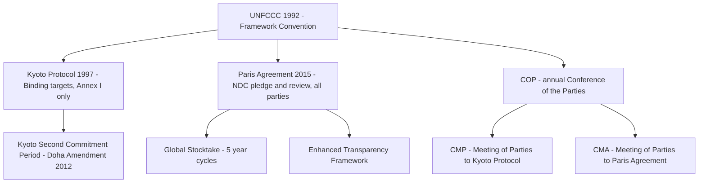

## The UNFCCC, the Kyoto Protocol, and the Paris Agreement Architecture

### Overview: Three Instruments, One Regime

**Key Points**

The international climate change legal regime rests on three sequentially layered treaty instruments, each building on and partially superseding its predecessor while remaining formally in force: the United Nations Framework Convention on Climate Change (UNFCCC, 1992), the Kyoto Protocol (1997), and the Paris Agreement (2015). All three operate under the same institutional umbrella — the UNFCCC's Conference of the Parties (COP) — illustrating the framework-protocol architectural model characteristic of modern multilateral environmental agreements.

---

### The UNFCCC (1992): The Parent Framework

**Key Points**

The United Nations Framework Convention on Climate Change was adopted at the 1992 Rio Earth Summit and entered into force in 1994. It was ratified by the U.S. Senate, giving it status as a binding Article II treaty under U.S. constitutional law — a legal status distinct from its two "child" instruments, discussed below.

**Core substantive elements**:

- **Ultimate objective** (Article 2): Stabilization of greenhouse gas concentrations in the atmosphere at a level that would prevent dangerous anthropogenic interference with the climate system, within a timeframe sufficient to allow ecosystems to adapt naturally, ensure food production is not threatened, and enable sustainable economic development.
- **Common but differentiated responsibilities (CBDR)** (Article 3): Establishes the foundational equity principle that developed and developing countries bear differentiated obligations reflecting their differing historical contributions to atmospheric GHG concentrations and differing capacities to respond — a principle that reappears, in evolving form, in both successor instruments.
- **Institutional architecture**: Establishes the Conference of the Parties (COP) as the supreme governing body, along with subsidiary bodies for scientific/technological advice (SBSTA) and implementation (SBI), and a financial mechanism (later operationalized through the Global Environment Facility and, subsequently, the Green Climate Fund).
- **No binding emissions targets**: The UNFCCC itself contains no binding numerical emissions reduction obligations — it is a pure framework instrument in the sense described in the broader MEA structural model, deferring specific quantitative commitments to subsequent protocols.

**Universality**: The UNFCCC has near-universal ratification (198 parties), reflecting the framework-convention design strategy of securing broad participation through general, low-cost-of-entry commitments.

---

### The Kyoto Protocol (1997): Binding Targets, Bifurcated Application

**Key Points**

The Kyoto Protocol, adopted in 1997 and entering into force in 2005, represented the first attempt to operationalize the UNFCCC's objective through legally binding, quantified emissions reduction targets.

**Core structural features**:

- **Annex I / Non-Annex I bifurcation**: Binding emissions reduction targets applied only to "Annex I" parties (developed countries and economies in transition), while "Non-Annex I" parties (developing countries, including major emerging emitters) had no binding quantitative obligations — a direct operationalization of the CBDR principle, but one that became the Protocol's central political vulnerability.
- **First commitment period (2008–2012)**: Annex I parties collectively committed to reducing GHG emissions by an average of 5.2% below 1990 levels.
- **Flexibility mechanisms**: The Protocol introduced three market-based mechanisms allowing parties to meet targets cost-effectively:
  1. **International Emissions Trading**: Allowed Annex I parties to trade portions of their emissions allowances (Assigned Amount Units).
  2. **Joint Implementation (JI)**: Allowed Annex I parties to earn emission reduction credits by investing in emissions-reducing projects in other Annex I countries.
  3. **Clean Development Mechanism (CDM)**: Allowed Annex I parties to earn Certified Emission Reductions by financing emissions-reducing projects in Non-Annex I (developing) countries, simultaneously supporting sustainable development in the host country.
- **Doha Amendment (2012)**: Established a second commitment period (2013–2020), but with substantially reduced participation after several major Annex I parties (including Canada, Japan, and Russia) declined to take on new targets.

**Structural weaknesses and eventual eclipse**:

- **U.S. non-ratification**: The United States signed but never ratified the Kyoto Protocol, following the U.S. Senate's unanimous passage of the Byrd-Hagel Resolution (1997), which opposed any climate treaty that did not include binding commitments from developing countries or that would seriously harm the U.S. economy — foreshadowing the binding/non-binding tension that would ultimately reshape the entire regime's architecture.
- **Non-participation by major emerging emitters**: Because China and other rapidly industrializing Non-Annex I countries had no binding targets despite their rapidly growing emissions, the Protocol's environmental effectiveness was structurally limited even among fully participating Annex I states.
- **[Inference]** The Kyoto Protocol's binary Annex I/Non-Annex I structure — treating "developed" and "developing" country status as fixed at the 1992 UNFCCC baseline rather than updating for subsequent economic change — is widely understood as the central design flaw that ultimately necessitated the Paris Agreement's fundamentally different, universally applicable architecture.

---

### The Paris Agreement (2015): Pledge-and-Review Architecture

**Key Points**

The Paris Agreement, adopted at COP21 in December 2015 and entering into force in November 2016, replaced the Kyoto Protocol's binary bifurcated-targets model with a universally applicable "pledge and review" (also called "bottom-up") architecture.

**Core substantive elements**:

- **Temperature goal** (Article 2): Holding the increase in global average temperature to well below 2°C above pre-industrial levels, while pursuing efforts to limit the increase to 1.5°C.
- **Nationally Determined Contributions (NDCs)**: Each party self-determines its own emissions reduction target and submits it as an NDC — a fundamental departure from Kyoto's externally negotiated, differentiated targets. Only the *procedural* obligations (to submit an NDC, to report on it, to update it every five years) are legally binding; the substantive content and ambition level of each NDC is self-determined and not legally enforceable.
- **The "ratchet mechanism" and progression requirement**: Each successive NDC must represent a progression beyond the party's current NDC and reflect its highest possible ambition, in light of CBDR and differing national circumstances — designed to create a legally binding upward ratchet on the process even though the substantive targets themselves remain non-binding.
- **Global Stocktake (GST)**: A five-yearly collective assessment of aggregate progress toward the Agreement's long-term goals, intended to inform each subsequent round of NDCs. The first Global Stocktake concluded at COP28 (Dubai, 2023).
- **Enhanced Transparency Framework (ETF)**: Establishes biennial reporting requirements for emissions inventories and NDC implementation progress, subject to technical expert review — the primary accountability mechanism given the absence of binding substantive targets.
- **Loss and damage provisions**: Article 8 recognizes the importance of addressing loss and damage associated with climate change impacts, though the Agreement explicitly does not establish liability or compensation remedies for loss and damage — a carefully negotiated limitation reflecting developed-country concerns about open-ended liability exposure.
- **Climate finance obligations**: Developed country parties are obligated to provide financial resources to assist developing country parties, continuing and extending the UNFCCC's differentiated financial-support architecture, operationalized in part through the Green Climate Fund.

**[Inference]** The shift from Kyoto's binding-target model to Paris's non-binding NDC model reflects a deliberate trade-off: sacrificing the *legal bindingness* of substantive commitments in exchange for near-universal participation (195+ parties, covering approximately 97% of global emissions) — a trade-off explicitly designed to avoid repeating Kyoto's fatal flaw of excluding major emitters, even at the cost of the Agreement's substantive enforceability.

---

### The U.S. Domestic Legal Status Question: Executive Agreement vs. Treaty

**Key Points**

A distinctive and recurring feature of Paris Agreement analysis is its unusual U.S. domestic legal status, which directly explains the instrument's vulnerability to reversal across successive administrations.

- The Obama administration joined the Paris Agreement in 2016 as a **sole executive agreement**, rather than submitting it to the Senate for the two-thirds supermajority ratification required for a formal Article II treaty — a strategic choice made precisely to avoid the near-certain failure of Senate ratification given the political composition of the Senate at the time.
- This status means the Paris Agreement, unlike the UNFCCC itself (which was Senate-ratified), can be exited or rejoined unilaterally by executive action alone, without requiring any congressional or Senate involvement — a structural asymmetry between the parent framework convention and its most consequential child instrument.

**Full U.S. participation history**:

| Date | Action | Mechanism |
| --- | --- | --- |
| April 2016 | U.S. signs Paris Agreement | Sole executive agreement |
| June 2017 | Trump announces intent to withdraw | Executive action |
| November 4, 2020 | Withdrawal becomes effective | Per Article 28's mandatory one-year notice period |
| February 19, 2021 | Biden administration rejoins | Executive action; effective 30 days after notification |
| January 20, 2025 | Trump issues Executive Order 14162, directing withdrawal | Executive action |
| January 27, 2025 | Formal notification of withdrawal submitted to UN Secretary-General (Depositary) | — |
| January 27, 2026 | Withdrawal becomes effective | Per Article 28's one-year notice period |

**[Inference]** This repeated cycle of U.S. entry, exit, re-entry, and exit — occurring entirely through unilateral executive action without any change in the underlying treaty text — demonstrates concretely how the Paris Agreement's non-treaty domestic status functions as a structural weakness distinct from, but compounding, its substantive non-binding NDC architecture: even a party's *membership* in the regime, not merely its target ambition, is subject to reversal by a single change in presidential administration.

**Practical and diplomatic effects of the 2025–2026 U.S. withdrawal**:

- The United States is again a non-party as of early 2026, notwithstanding its status as one of the largest historical and current emitters (responsible for roughly 14% of current global emissions per recent estimates), placing it among a small handful of non-party states.
- The withdrawal occurred amid broader U.S. federal climate-policy retrenchment discussed elsewhere in this course — including the SEC climate disclosure rule rescission, the reversal of the social cost of carbon methodology, and the 2026 repeal of the EPA's greenhouse gas endangerment finding — reflecting a coordinated shift away from climate regulation across both international and domestic legal tracks.
- Only 15 of 195 parties met the February 10, 2025 deadline to submit updated 2035 NDCs, with countries that missed the deadline collectively accounting for approximately 83% of global GHG emissions and nearly 80% of the world's economy — illustrating a broader pattern of ambition-cycle compliance strain across the regime, not limited to the U.S. withdrawal alone.

---

### COP30 and Recent Developments (2025)

**Key Points**

The 30th Conference of the Parties (COP30) concluded on November 22, 2025, producing a package of decisions known as the **Belém Political Package**, which placed renewed emphasis on scaling up international climate finance. **[Unverified]** — practitioners and students should confirm the specific substantive content and legal status of Belém Political Package commitments against the official COP30 decision text, as post-conference summaries can compress or generalize complex multi-track negotiated outcomes.

---

### Comparative Structural Analysis: Kyoto vs. Paris

| Feature | Kyoto Protocol | Paris Agreement |
| --- | --- | --- |
| Target-setting model | Externally negotiated, binding | Self-determined (NDC), non-binding substance |
| Party coverage | Annex I only (binding); Non-Annex I excluded | Universal (all parties) |
| CBDR operationalization | Binary categorical differentiation | Differentiated through self-determined ambition and finance flows |
| Compliance mechanism | Kyoto Compliance Committee (facilitative/enforcement branches) | No punitive enforcement; transparency and stocktake-driven peer pressure |
| Legally binding element | The numerical targets themselves | Only the procedural obligation to submit, report, and progressively update NDCs |
| U.S. participation | Signed, never ratified | Joined as executive agreement; withdrawn/rejoined/withdrawn |
| Market mechanisms | CDM, Joint Implementation, Emissions Trading | Article 6 cooperative approaches and a successor crediting mechanism (post-CDM) |

**[Inference]** The comparative table above illustrates that the Paris Agreement did not so much strengthen international climate law's binding force as fundamentally redesign what the instrument attempts to bind — trading substantive enforceability for procedural universality — a design choice whose long-term environmental effectiveness depends entirely on whether reputational, diplomatic, and domestic political pressures prove sufficient to drive genuine ambition in the absence of external legal compulsion.

---

### Enforcement and Compliance Architecture

**Key Points**

Consistent with the general MEA enforcement patterns, neither the Kyoto Protocol nor the Paris Agreement provides for coercive, centrally administered enforcement against non-complying or non-participating states.

- **Kyoto Compliance Committee**: Operated through facilitative and enforcement branches; the enforcement branch could, for parties failing to meet their targets, require the shortfall (plus a 30% penalty) to be made up in the next commitment period and could restrict the party's eligibility to participate in the flexibility mechanisms — a rare example of a quasi-punitive MEA compliance sanction, though its practical bite was limited by the absence of any external coercive enforcement mechanism.
- **Paris Agreement Article 15 mechanism**: Establishes a committee to facilitate implementation and promote compliance, explicitly described as expert-based, facilitative, non-adversarial, and non-punitive in nature — a deliberate design choice reflecting the broader shift toward a facilitative, capacity-building compliance model rather than Kyoto's more adversarial enforcement branch.
- **No exit penalty**: As illustrated by the U.S. experience, a party may withdraw entirely pursuant to Article 28's notice procedure without triggering any compliance or enforcement mechanism at all — because withdrawal is a lawful exercise of a treaty-conferred right, not a breach, reinforcing the point made in the broader MEA enforcement discussion that formal compliance architecture is structurally incapable of addressing strategic non-participation.

---

### Practical Application: Illustrative NDC Analysis

**Example**

Consider a hypothetical mid-sized industrialized country submitting its 2035 NDC under the Paris Agreement's framework. The country must:

1. Set a self-determined target (e.g., 55% emissions reduction below a chosen baseline year) — the specific percentage and baseline year are entirely at the country's discretion, subject only to the requirement that the new NDC represent progression beyond its prior submission.
2. Report the NDC to the UNFCCC Secretariat through the NDC registry.
3. Submit biennial transparency reports under the Enhanced Transparency Framework, subject to technical expert review (but not adjudicative dispute resolution).
4. Have its aggregate progress assessed, alongside all other parties, in the next Global Stocktake — a collective, non-individualized assessment that generates political and reputational pressure for future ambition rather than any individualized legal consequence for the specific country's shortfall.

**[Inference]** This example demonstrates that Paris Agreement "compliance" for an individual party consists almost entirely of *procedural* fidelity (timely submission and reporting) rather than *substantive* achievement of the announced target — a structural feature critical for accurately assessing "compliance" and "non-compliance" claims in this area, since a party can be in full legal compliance with the Paris Agreement while badly missing its own announced emissions target.

---

### Conclusion

The UNFCCC-Kyoto-Paris architecture traces a coherent evolutionary arc: from the UNFCCC's pure framework-setting function, through Kyoto's ambitious but ultimately structurally flawed binding, bifurcated-target model, to Paris's universally applicable but substantively non-binding pledge-and-review system. Each transition responded directly to the preceding instrument's central weakness — Kyoto addressed the UNFCCC's lack of quantified targets, and Paris addressed Kyoto's exclusion of major emerging emitters and the U.S. non-ratification problem — but each transition also traded away a measure of legal bindingness in exchange for broader participation. The recurring cycle of U.S. entry and exit, made structurally easy by the Paris Agreement's executive-agreement status, illustrates a broader theme relevant across this course: international climate law's practical effectiveness depends less on the formal strength of its legal text than on the durability of domestic political commitment to implement it, a vulnerability with no clear structural fix within the current treaty architecture.

---

**Related Topics**

- The structure and enforcement of multilateral environmental agreements (companion topic)
- Article 6 of the Paris Agreement: international carbon markets and cooperative approaches
- The Global Stocktake process and its influence on subsequent NDC ambition cycles
- U.S. constitutional law on treaties vs. executive agreements (*Missouri v. Holland*, the Case-Zablocki Act)
- Climate finance architecture: Green Climate Fund, loss and damage fund, and Belém Political Package commitments
- The social cost of carbon in regulatory cost-benefit analysis (companion topic, domestic chapter)
- Domestic climate litigation invoking international climate consensus (*Urgenda*, ICJ Advisory Opinion on climate obligations)
- Comparative national implementation of NDC commitments (EU Fit for 55, China's dual-carbon targets)
- The Kyoto Protocol's Clean Development Mechanism and its successor Article 6.4 crediting mechanism
- Just transition policy and stranded asset considerations (companion topic, domestic chapter)