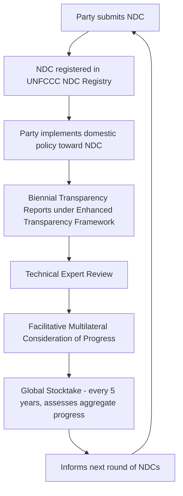

## Nationally Determined Contributions and International Compliance Mechanisms

### Definitional Foundations

**Key Points**

A **Nationally Determined Contribution (NDC)** is a self-determined climate action plan that each party to the Paris Agreement is legally obligated to prepare, communicate, and maintain, setting out its intended emissions reduction targets and, increasingly, adaptation commitments. NDCs are the operational core of the Paris Agreement's "pledge and review" architecture, replacing the Kyoto Protocol's externally negotiated, binding targets with a bottom-up model in which each state defines the substance of its own commitment.

The term evolved from **"Intended" Nationally Determined Contributions (INDCs)** — the provisional pledges submitted by parties in the lead-up to the 2015 Paris COP21 negotiations — which automatically converted into binding NDCs upon a party's ratification of the Paris Agreement, unless the party specified otherwise.

---

### The Binding/Non-Binding Distinction: What NDCs Actually Obligate

**Key Points**

The single most important analytical distinction in this area is between the *procedural* obligations surrounding NDCs, which are legally binding, and the *substantive* content of NDCs, which is not.

**Legally binding elements** (Paris Agreement Articles 3, 4):

- The obligation to prepare, communicate, and maintain successive NDCs.
- The obligation that each successive NDC represent a **progression** beyond the party's current NDC.
- The obligation that each NDC reflect the party's **highest possible ambition**, in light of common but differentiated responsibilities and respective capabilities (CBDR-RC), in light of different national circumstances.
- The obligation to submit NDCs on a five-year cycle.
- The obligation to provide information necessary for clarity, transparency, and understanding of the NDC (a technical reporting requirement, sometimes summarized as the "ICTU" information requirements).

**Non-binding elements**:

- The specific numerical target contained within the NDC (e.g., "45% reduction below 2005 levels by 2030").
- The specific policies, sectoral measures, or technologies a party chooses to achieve its target.
- Whether the party actually *achieves* its self-set target.

$$\text{NDC Legal Obligation} = \text{Procedural Compliance (binding)} + \text{Substantive Ambition (non-binding)}$$

**[Inference]** This bifurcation is frequently misunderstood in public discourse, where a country "missing its target" is often characterized as a treaty violation; under the Paris Agreement's actual legal architecture, a party that submits a progressively ambitious NDC, reports transparently, and simply fails to achieve the announced target has not breached any binding obligation — the only breach would arise from failing to submit, failing to update on schedule, or submitting a successive NDC that represents *regression* rather than progression.

---

### The NDC Submission and Ratchet Cycle

**Key Points**

This cyclical structure — termed the **"ratchet mechanism"** — is designed to create an ever-tightening feedback loop: the Global Stocktake's collective assessment of whether aggregate NDC ambition is sufficient to meet the Agreement's temperature goals is intended to inform and pressure each party toward greater ambition in its next NDC submission, five years later.

**First Global Stocktake**: Concluded at COP28 (Dubai, 2023), assessing collective progress toward the Paris Agreement's temperature and adaptation goals for the first time since the Agreement's adoption.

**2025 NDC cycle compliance snapshot**: Only 15 of 195 parties met the February 10, 2025 deadline to communicate their 2035 NDCs, with a total of 17 countries having submitted by February 19, 2025. Countries that missed the deadline collectively accounted for approximately 83% of global greenhouse gas emissions and nearly 80% of the world's economy — though this estimate likely understates the compliance gap further, since the estimate treats the U.S. as having submitted (it communicated its NDC in December 2024, prior to the new administration's subsequent withdrawal announcement). Andorra, Botswana, Brazil, Ecuador, Lesotho, the Marshall Islands, New Zealand, Saint Lucia, Singapore, Switzerland, the UK, the UAE, Uruguay, the US, and Zimbabwe were among the parties communicating new NDCs before the deadline, with Canada and Japan submitting shortly after.

**[Inference]** The scale of the 2025 submission shortfall — with parties representing the overwhelming majority of global emissions and economic activity missing the formal deadline — illustrates a structural weakness in the ratchet mechanism's timing assumptions: because there is no binding sanction for late submission (only reputational and diplomatic pressure), the five-year cycle's practical rigor depends entirely on voluntary compliance, and a widespread pattern of late or delayed submission risks compressing the interval available for the "highest possible ambition" requirement to have its intended effect before the next Global Stocktake.

---

### The Enhanced Transparency Framework (ETF): The Primary Accountability Mechanism

**Key Points**

Because NDC substantive targets are non-binding, the **Enhanced Transparency Framework** established under Paris Agreement Article 13 functions as the regime's primary compliance-adjacent mechanism — not by enforcing target achievement, but by ensuring that the international community can accurately observe and compare what each party has actually done.

**Core ETF components**:

- **Biennial Transparency Reports (BTRs)**: Required national reports covering GHG emissions inventories, progress toward the NDC, and (for developing countries) support needed and received. The first round of BTRs was due by the end of 2024, marking a significant strengthening of reporting rigor and frequency compared to the pre-Paris reporting regime.
- **Technical Expert Review (TER)**: Independent technical experts review each BTR for consistency, completeness, and accuracy against agreed methodologies (generally the IPCC's GHG inventory guidelines), producing a technical report that is not binding but generates a documented, internationally visible record.
- **Facilitative Multilateral Consideration of Progress (FMCP)**: A peer-review-style process in which parties can pose questions and share views on another party's reported progress, in a facilitative, non-adversarial format explicitly modeled to avoid the adversarial character of dispute settlement.
- **Common tabular formats and metrics**: The ETF replaced the prior bifurcated developed/developing country reporting tracks (a legacy of the Kyoto-era Annex I/Non-Annex I distinction) with a single, common framework applicable to all parties, subject to built-in flexibility provisions for developing countries lacking capacity — operationalizing the CBDR-RC principle through calibrated reporting rigor rather than through fundamentally different substantive obligations.

**[Inference]** The ETF's design — rigorous common reporting standards paired with a facilitative, non-punitive review process — reflects the same broader compliance philosophy found throughout modern MEAs (see the Montreal Protocol Implementation Committee model): the theory of change is that transparency and peer visibility alone can generate sufficient reputational pressure to drive ambition, without requiring coercive sanction, precisely because coercive sanction was never politically achievable in a universal-participation instrument.

---

### The Paris Agreement Implementation and Compliance Committee (Article 15)

**Key Points**

Article 15 of the Paris Agreement establishes a mechanism "to facilitate implementation and promote compliance," operationalized through a standing committee often referred to as the **Paris Agreement Implementation and Compliance Committee (PAICC)**.

**Defining characteristics**:

- **Expert-based composition**: Composed of technical experts rather than political representatives, intended to depoliticize compliance review.
- **Facilitative, non-adversarial, non-punitive**: The Agreement's text explicitly characterizes the Committee's function this way — a deliberate and pointed departure from the Kyoto Protocol's Compliance Committee, which included a more adversarial "enforcement branch" empowered to impose consequences (including a 30% penalty add-back to a non-complying party's next-period target and suspension of eligibility to use flexibility mechanisms).
- **Party-driven, not automatically triggered for target-shortfall**: The Committee's review generally focuses on procedural obligations (submission, reporting, transparency), not on whether a party achieved its self-set substantive target, consistent with the binding/non-binding distinction outlined above.
- **Attentive to differing capabilities**: The Committee's operating modalities give particular attention to parties' differing national capacities and circumstances, in keeping with CBDR-RC.

**Comparative table: Kyoto Compliance Committee vs. Paris Article 15 Mechanism**

| Feature | Kyoto Compliance Committee | Paris Article 15 Committee |
| --- | --- | --- |
| Structure | Facilitative branch + Enforcement branch | Single committee, facilitative only |
| Sanctions available | Target shortfall penalty (30% add-back); suspension from flexibility mechanisms | None — facilitation and support only |
| Trigger | Failure to meet binding numerical target | Primarily procedural non-compliance (failure to report, submit) |
| Tone | Quasi-adversarial/quasi-judicial | Explicitly non-adversarial |
| Consistency with underlying targets | Targets were binding, so sanctions had a clear breach to attach to | Targets are non-binding, so there is little substantive breach for sanctions to attach to |

**[Inference]** The absence of any punitive mechanism in the Paris Article 15 Committee is not an oversight but a direct structural consequence of the NDC architecture's non-binding substantive targets: a punitive enforcement branch analogous to Kyoto's would have little to enforce against, since a party missing its own self-set target has not thereby breached a binding obligation — meaning the shift to a purely facilitative compliance model logically follows from, rather than independently weakens, the underlying pledge-and-review design.

---

### The Global Stocktake as Aggregate (Not Individual) Compliance Mechanism

**Key Points**

The **Global Stocktake (GST)**, conducted every five years under Article 14, is best understood as a collective diagnostic mechanism rather than an individual-party compliance mechanism. It assesses aggregate global progress toward the Agreement's temperature, adaptation, and finance goals, without generating individualized findings of non-compliance against specific parties.

**Functional role in the compliance architecture**:

1. Synthesizes information from BTRs, technical expert reviews, IPCC science, and other sources into a collective assessment of whether the sum of all NDCs is consistent with the Agreement's temperature goals.
2. Generates outputs intended to inform — but not legally bind — the next round of individual NDC submissions.
3. Creates a periodic, high-visibility diplomatic moment (culminating at a COP) that can generate political pressure for individual parties to raise ambition, functioning as a "moment of reckoning" mechanism rather than a legal enforcement action.

**[Inference]** Because the GST operates at the aggregate level, it structurally cannot identify or sanction any individual party's inadequate ambition or non-compliance — this is a deliberate design feature consistent with the Agreement's overall avoidance of naming-and-shaming individual parties through a formal legal process, relying instead on the more diffuse pressure of the aggregate finding combined with each party's own domestic political accountability.

---

### Interaction With Domestic Legal Systems: NDCs as a Basis for Domestic Litigation

**Key Points**

Although NDCs create no directly enforceable international legal remedy for a party's underperformance, they have increasingly been invoked in **domestic and regional litigation** as evidence of a government's own acknowledged adequate-ambition benchmark, creating an important indirect compliance pathway operating through national courts rather than international mechanisms.

- Litigants in various jurisdictions have argued that a government's failure to implement policies sufficient to meet its own announced NDC constitutes a violation of separate domestic constitutional, administrative, or human-rights obligations (rather than a violation of the Paris Agreement itself, which typically lacks direct domestic legal effect or private rights of action).
- This pathway effectively imports the international NDC benchmark into domestic legal frameworks that do provide for judicial remedy and enforceable relief — illustrating the broader pattern (addressed in the companion MEA structure topic) whereby much of the practical "enforcement" of international environmental commitments occurs through domestic implementing mechanisms rather than the treaty's own institutional architecture.

**[Inference]** This litigation pathway is likely to grow in significance precisely because it compensates for the Paris Agreement's own lack of a binding substantive compliance mechanism — plaintiffs effectively use the government's own self-set NDC as an admission against interest regarding what level of ambition the government itself considers necessary and achievable, then seek domestic legal remedies unavailable at the international level.

---

### Practical Application: Analyzing a Hypothetical NDC Compliance Scenario

**Example**

Country X submits a 2030 NDC committing to a 50% emissions reduction below 2010 levels. By 2028, Country X's Biennial Transparency Report reveals it is on track to achieve only a 30% reduction. In 2030, Country X submits its next NDC (for the 2035 period), proposing a 55% reduction below 2010 levels.

**Compliance analysis under the Paris Agreement architecture**:

- **No breach from underachievement**: Country X's failure to reach the 50% target creates no legal breach, because the numerical target itself was never a binding obligation — only the obligation to report transparently on actual progress (which it did, via its BTR) is binding.
- **Progression requirement satisfied**: The new 2035 NDC (55% reduction) represents numerical progression beyond the 2030 NDC (50% reduction), satisfying Article 4's progression requirement, even though the country badly missed its prior target — because the progression requirement compares stated ambition levels between successive NDCs, not achieved results against prior stated ambition.
- **Potential FMCP scrutiny**: Other parties could raise questions about Country X's implementation gap during the Facilitative Multilateral Consideration of Progress process, but this generates only reputational and diplomatic consequences, not binding findings or sanctions.
- **Potential domestic litigation exposure**: Depending on Country X's domestic legal system, the documented gap between announced NDC ambition and actual policy implementation could form the evidentiary basis for domestic litigation invoking separate constitutional or statutory obligations — the indirect compliance pathway described above.

**[Inference]** This scenario illustrates the practical reality that Paris Agreement "compliance" analysis for exam and practice purposes should center on procedural fidelity (submission timing, progression, transparency) rather than substantive achievement, and that meaningful accountability for substantive underperformance, where it exists at all, is much more likely to arise through domestic legal channels than through any mechanism internal to the Agreement itself.

---

### Comparative Note: NDCs Compared to Kyoto's Quantified Emission Limitation Commitments

**Key Points**

| Dimension | Kyoto QELROs (Quantified Emission Limitation and Reduction Objectives) | Paris NDCs |
| --- | --- | --- |
| Origin of target | Negotiated collectively, assigned to each Annex I party | Self-determined unilaterally by each party |
| Legal status of numerical target | Binding | Non-binding |
| Universality | Annex I only | All parties |
| Consequence of shortfall | Formal penalty mechanism (30% add-back, mechanism suspension) | No formal penalty; facilitative review only |
| Flexibility for differing capability | Binary Annex I/Non-Annex I categorization | Calibrated through self-determination and CBDR-RC language within a universal framework |

**[Inference]** The shift from QELROs to NDCs represents the clearest illustration in international environmental law of a deliberate trade-off between legal bindingness and universal participation — a design choice whose ultimate environmental adequacy remains an open empirical and normative question that the Global Stocktake process is specifically designed to periodically assess, without the process itself being capable of resolving the underlying tension.

---

### Conclusion

Nationally Determined Contributions represent the most consequential architectural innovation of the Paris Agreement: a substitution of self-determined, non-binding substantive ambition for Kyoto's externally negotiated, binding targets, purchased at the price of universal participation rather than the more limited and ultimately unsustainable Annex I-only coverage of its predecessor. The resulting international compliance architecture — the Enhanced Transparency Framework, the facilitative Article 15 Implementation and Compliance Committee, and the aggregate-level Global Stocktake — is coherently designed around this non-binding substantive core: it maximizes transparency and peer visibility while deliberately avoiding punitive sanction, because punitive sanction has little coherent function against a voluntarily self-set target. The practical accountability gap this creates is increasingly being filled not by any international mechanism, but by domestic courts asked to hold governments to their own announced NDC benchmarks under separate constitutional, administrative, or human-rights frameworks — a pattern that illustrates, once again, the recurring theme that international environmental law's practical bite is often realized through domestic legal systems rather than through the treaty architecture itself.

---

**Related Topics**

- The UNFCCC, the Kyoto Protocol, and the Paris Agreement architecture (companion topic)
- The structure and enforcement of multilateral environmental agreements (companion topic)
- Domestic climate litigation invoking government NDC commitments (*Urgenda*, *Neubauer v. Germany*, *Held v. Montana*)
- Article 6 of the Paris Agreement: international carbon markets and cooperative approaches
- The Enhanced Transparency Framework and IPCC GHG inventory methodology
- Common but differentiated responsibilities and respective capabilities (CBDR-RC) as an evolving legal principle
- The Global Stocktake's technical and political dialogue phases
- Comparative national NDC implementation frameworks (EU Fit for 55, China's dual-carbon targets)
- The Kyoto Protocol Compliance Committee's enforcement branch as a comparative enforcement model
- U.S. Paris Agreement participation history and its domestic legal status as a sole executive agreement