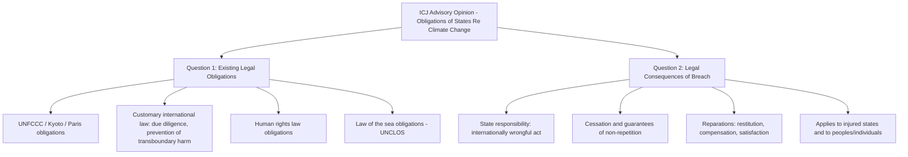

## The 2025 International Court of Justice Advisory Opinion on State Climate Obligations

### Procedural History and Origins

**Key Points**

The advisory opinion in *Obligations of States in Respect of Climate Change* originated from a six-year campaign initiated by the Pacific Islands Students Fighting Climate Change (PISFCC), a group of law students from the University of the South Pacific, who sought international legal clarity on state climate obligations in the face of existential sea-level-rise threats to their home countries.

**Path to the ICJ**:

- In September 2021, Vanuatu announced its intention to pursue an advisory opinion, citing the particular vulnerability of its territory and other small island developing states.
- A core group of 18 states — Vanuatu, Antigua and Barbuda, Costa Rica, Sierra Leone, Angola, Germany, Mozambique, Liechtenstein, Samoa, the Federated States of Micronesia, Bangladesh, Morocco, Singapore, Uganda, New Zealand, Vietnam, Romania, and Portugal — led the drafting of the questions ultimately posed to the Court.
- On March 29, 2023, the UN General Assembly adopted Resolution A/RES/77/276 by consensus (co-sponsored by 132 states) — notably the first time in history such a request for an advisory opinion was adopted without opposition — formally requesting the opinion pursuant to Article 96 of the UN Charter and Article 65 of the ICJ Statute.
- The proceeding that followed was unprecedented in scale: hearings were held in December 2024, drawing written and oral submissions from dozens of states across the full spectrum of emitter status, economic development, and climate vulnerability, reflecting the case's exceptional international profile.

**The two questions posed to the Court**:

1. What are the obligations of states under international law to protect the climate system and other parts of the environment from anthropogenic greenhouse gas emissions, for present and future generations?
2. What are the legal consequences under these obligations for states that, by their acts or omissions, have caused significant harm to the climate system, with respect to (a) states, particularly small island developing states, that are injured or specially affected by climate change; and (b) peoples and individuals of present and future generations affected by climate change?

---

### The Decision: Structure and Headline Findings

**Key Points**

The advisory opinion was rendered on **July 23, 2025**, spanning approximately 133 pages, and represented the twenty-ninth advisory opinion in the ICJ's history and only the fifth ever adopted **unanimously** by all fifteen sitting judges in the Court's eighty-year history. The Court unanimously affirmed the entirety of the position advanced by Vanuatu and the core group of requesting states — an outcome legal observers characterized as going beyond expectations in both scope and unanimity.

**Core substantive holdings**:

1. **Climate treaties do not operate in isolation from general international law**: The Court held that the UNFCCC, Kyoto Protocol, and Paris Agreement do not displace or exhaustively define states' climate obligations; rather, they operate within — not outside — the broader framework of customary international law, human rights law, and the law of the sea. This finding is significant because states resisting expansive climate liability (including the U.S., UK, and other major emitters in their submissions) had argued that the climate treaty regime constitutes a self-contained *lex specialis* that displaces broader customary-law obligations.
2. **The 1.5°C threshold as the "primary temperature goal"**: The Court found that limiting global warming to 1.5°C above pre-industrial levels — rather than the Paris Agreement's more flexible "well below 2°C, pursuing efforts toward 1.5°C" formulation — should be treated as the primary operative temperature goal informing states' obligation to make "adequate contributions" to achieving it.
3. **Fossil fuel production and subsidies can constitute an internationally wrongful act**: In direct response to a question posed by Judge Cleveland during the December 2024 hearings, the Court held: *"Failure of a State to take appropriate action to protect the climate system from GHG emissions — including through fossil fuel production, fossil fuel consumption, the granting of fossil fuel exploration licences or the provision of fossil fuel subsidies — may constitute an internationally wrongful act which is attributable to that State"* (para. 427). Given that fossil fuels account for approximately 75% of global GHG emissions, legal commentators have described this finding as potentially transformational for fossil fuel-producing states' legal exposure.
4. **Due diligence obligation to regulate private actors**: The Court held that states' compliance with domestic mitigation obligations must be assessed based on whether they exercised due diligence in deploying appropriate regulatory measures, including with respect to the activities of private actors (e.g., domestic fossil fuel companies) within their jurisdiction or control — extending state responsibility beyond direct governmental emissions to encompass a state's regulatory failures regarding private conduct. The Court explicitly endorsed the International Tribunal for the Law of the Sea's (ITLOS) prior 2024 advisory opinion on this due-diligence standard.
5. **NDC adequacy is a continuing, justiciable obligation**: The Court clarified that a state submitting an inadequate NDC (i.e., one that fails to reflect the "highest possible ambition" required under Paris Agreement Article 4) remains under a continuing obligation to bring its NDC into compliance — meaning the non-binding character of NDC substantive targets (addressed in the companion topic on NDCs) does not place NDC ambition entirely beyond legal scrutiny, since the *adequacy* of the ambition-setting process itself is subject to an evaluable legal standard.

---

### Legal Consequences: State Responsibility and Remedies

**Key Points**

The Court's treatment of remedies represents one of the opinion's most legally consequential — and most closely analyzed — components, because it applies the general international law of state responsibility (as codified in the International Law Commission's Draft Articles on State Responsibility) directly to the climate context for the first time.

**Elements of state responsibility addressed**:

- **Attribution**: The Court confirmed that states' individual contributions to global emissions, both historical and present, are scientifically traceable, rejecting arguments that the diffuse, cumulative, multi-actor nature of climate change makes individualized attribution legally or scientifically impossible (para. 429).
- **Multiple responsible and injured parties**: The Court held that international law can accommodate situations involving multiple responsible states and multiple injured parties simultaneously, and — significantly — dismissed the *Monetary Gold* principle objection (which holds that a court cannot adjudicate the rights of a state not before it), affirming that each state's responsibility can be individually invoked notwithstanding the involvement of other contributing states (para. 430–431).
- **Breach and continuing obligation**: The Court emphasized that a breach of climate obligations does not relieve a state of its underlying duty to comply — cessation remains required, potentially including revoking non-compliant domestic laws, cutting emissions, and taking other measures necessary to stop the wrongful conduct (para. 448).

**Available remedies**:

$$\text{Full Reparation} = \text{Cessation} + \text{Guarantees of Non-Repetition} + (\text{Restitution} \lor \text{Compensation} \lor \text{Satisfaction})$$

- **Cessation**: Stopping the wrongful conduct (e.g., continued excessive emissions, inadequate regulation of fossil fuel production).
- **Guarantees of non-repetition**: Assurances and structural measures preventing recurrence of the wrongful conduct.
- **Restitution, compensation, and/or satisfaction**: Where full restitution (restoring the pre-harm situation) is not possible — as is definitionally the case for many climate harms — compensation or satisfaction may be owed to states, peoples, or individuals demonstrably harmed, provided a clear and direct causal link between the harm and the state's wrongful conduct can be established.

**[Inference]** The Court's explicit endorsement of the "polluter pays" principle through this remedies framework represents a significant doctrinal bridge between the state-responsibility framework (traditionally used for discrete, clearly attributable international wrongs) and the diffuse, cumulative, long-latency harm characteristic of climate change — a bridge that had been widely doubted as legally feasible prior to this opinion, given the traditional causation and attribution objections raised by respondent states including Australia, China, Kuwait, Russia, Saudi Arabia, the UK, and the United States in their submissions.

---

### Legal Status: Non-Binding but Authoritative

**Key Points**

Advisory opinions issued under Article 65 of the ICJ Statute are, by definition, **not legally binding** on states — they represent the Court's authoritative interpretation of existing law rather than a binding judgment resolving a contentious dispute between named parties. This is a critical distinction from the ICJ's judgments in contentious cases (such as *Gabčíkovo-Nagymaros* or *Pulp Mills*), which do bind the specific parties to that dispute.

**Why the opinion nonetheless carries substantial legal weight**:

- **Authoritative interpretation of existing binding law**: Because the opinion interprets obligations that already exist under binding instruments (the UNFCCC, Kyoto Protocol, Paris Agreement, UNCLOS, and customary international law), it functions as an authoritative statement of what those pre-existing binding obligations actually require — meaning its practical effect operates through the underlying instruments' own binding force, not through any independent binding force of the opinion itself.
- **Unanimity and procedural novelty**: The opinion's unprecedented unanimity (5th unanimous opinion in ICJ history) and the unprecedented consensus adoption of the underlying UNGA referral resolution are cited by legal scholars as substantially enhancing its persuasive authority relative to a divided or narrowly-reasoned opinion.
- **Anticipated use in subsequent proceedings**: Legal scholars widely expect the opinion to be invoked in future contentious international proceedings, domestic litigation, and treaty negotiations as persuasive (though not binding) authority on the content of customary international climate law.

**[Inference]** The opinion's practical significance is likely to be realized primarily through its incorporation into domestic litigation and future contentious international proceedings — mirroring the pattern observed with NDCs and the broader MEA enforcement deficit discussed elsewhere in this course, whereby international climate law instruments with limited direct binding force or coercive enforcement gain practical effect through downstream domestic legal mechanisms rather than through the originating international instrument's own institutional machinery.

---

### Immediate Comparative Contrast: Domestic Judicial Divergence

**Key Points**

The ICJ opinion's reception has not been uniform across domestic jurisdictions, illustrating that authoritative international guidance does not automatically harmonize domestic outcomes. In July 2025 — the same month as the ICJ opinion — the Federal Court of Australia held in *Pabai v. Commonwealth* that the Australian Commonwealth Government does not owe a duty of care to take reasonable steps to protect the people of the Torres Strait Islands from climate change impacts, reaching a materially different outcome regarding governmental duty than the ICJ's broader framing of state due-diligence obligations. **[Unverified]** — practitioners should confirm the current appellate status of *Pabai*, since this represents an active area of doctrinal tension between international guidance and domestic tort/administrative law frameworks, and the case's disposition may have evolved.

**[Inference]** This contemporaneous divergence illustrates a structural point relevant throughout this course: an ICJ advisory opinion, however authoritative and unanimous, does not itself create a directly enforceable domestic cause of action — domestic courts remain bound by their own jurisdiction's standing, justiciability, and duty-of-care doctrines, meaning the opinion's practical effect on any given domestic case depends on whether domestic law provides an appropriate doctrinal vehicle for incorporating international law's persuasive authority.

---

### Downstream Effects: The Proposed UN General Assembly Resolution

**Key Points**

Building on the advisory opinion, UN member states began negotiating a draft UN General Assembly resolution intended to formally endorse the ICJ's findings and translate them into "a roadmap for concrete action and accountability." Vanuatu has continued to lead this diplomatic effort, with a core cross-regional group of states — including Barbados, Burkina Faso, Colombia, Jamaica, Kenya, the Marshall Islands, the Federated States of Micronesia, the Kingdom of the Netherlands, Palau, the Philippines, Singapore, and Sierra Leone — contributing to the initial "zero draft." A vote on the resolution text was expected toward the end of May 2026.

**[Unverified]** — the outcome of this vote should be independently confirmed against current UN documentation, as it postdates the bulk of readily available reporting at the time of this content's preparation and the resolution's final text and adoption status may have changed.

**[Inference]** A UNGA resolution formally endorsing the ICJ opinion would not alter the opinion's fundamentally non-binding legal character (UNGA resolutions are themselves generally non-binding, with limited exceptions), but could meaningfully strengthen the opinion's political and diplomatic weight, potentially accelerating its incorporation into subsequent treaty negotiations, domestic legislative reform, and litigation strategy — operating through the same soft-law-to-hard-law pathway by which non-binding instruments have historically influenced the development of binding international environmental law.

---

### Interaction With Corporate and Private Actor Accountability

**Key Points**

Although the ICJ opinion's holdings are formally directed at *state* obligations, several commentators and the opinion's due-diligence framework have direct implications for corporate accountability, given the Court's explicit finding that states must exercise due diligence in regulating private actors' emissions-related activities.

**Contemporaneous domestic corporate climate litigation cited as reinforcing this trend**:

- ***Milieudefensie v. Shell*** (Dutch Court of Appeal, November 12, 2024): Addressed corporate duty of care to prevent climate change, part of a broader European trend toward recognizing corporate climate obligations.
- ***Lliuya v. RWE AG*** (Oberlandesgericht Hamm, May 28, 2025) — the "Peruvian farmer case": A German appellate court addressed a Peruvian farmer's claim against a German utility company for contribution to glacial melt risk, testing the boundaries of corporate causal responsibility for diffuse climate harm at the private-litigant level.

**[Inference]** The convergence of the ICJ's state-focused due-diligence framework with contemporaneous domestic corporate climate litigation suggests an emerging two-track accountability structure: states face potential international-law responsibility for failing to regulate private fossil fuel actors, while those private actors simultaneously face direct domestic tort-based claims — meaning corporate climate risk exposure is likely to increase along both tracks simultaneously rather than being resolved by attribution to one level or the other.

---

### Practical Application: Illustrative Analysis

**Example**

Consider a hypothetical scenario in which a mid-sized fossil-fuel-producing state continues to issue new offshore oil exploration licenses and maintains substantial fossil fuel production subsidies, while its most recent NDC reflects only modest incremental ambition relative to its economic and technical capacity.

**Applying the ICJ opinion's framework**:

1. **Wrongful act analysis**: Under the opinion's framework, the continued issuance of exploration licenses and maintenance of subsidies could independently constitute an internationally wrongful act, separate from and in addition to any assessment of the state's NDC ambition — meaning liability exposure is not confined to the NDC/Paris Agreement framework alone but extends to direct fossil fuel promotion and production activity.
2. **NDC adequacy as continuing obligation**: Even if the state's NDC formally satisfies the Paris Agreement's procedural progression requirement (addressed in the companion NDC topic), the ICJ opinion's finding that inadequate NDCs create a continuing obligation to achieve compliance suggests the substantive ambition level itself remains subject to legal evaluation under the broader due-diligence and "adequate contributions" standard — a meaningfully more searching review than the Paris Agreement's own compliance architecture provides in isolation.
3. **Remedial exposure**: If a specially affected state (e.g., a small island state experiencing quantifiable sea-level-rise or extreme-weather harm) can establish attribution and causation linking its harm to the producing state's conduct, the ICJ framework contemplates potential reparations liability — though establishing the requisite "clear and direct link" for a specific harm remains an evidentiary hurdle the opinion acknowledges but does not fully resolve.

**[Inference]** This example illustrates why the opinion is widely regarded as strengthening — but not completing — the legal infrastructure for climate accountability litigation: it substantially narrows the range of previously available legal-ambiguity defenses (self-contained treaty regime, unattributable diffuse harm, non-justiciable NDC ambition), while leaving the harder evidentiary and causation questions to be worked out in subsequent contentious proceedings and domestic litigation.

---

### Conclusion

The 2025 ICJ Advisory Opinion on state climate obligations represents the most significant development in international climate law's judicial dimension since the adoption of the Paris Agreement itself, precisely because it addresses the accountability gap that the Paris Agreement's non-binding NDC architecture (addressed in the companion topic) deliberately left open. By holding that fossil fuel production, subsidization, and licensing can independently constitute internationally wrongful acts, confirming that climate treaties operate within rather than displacing broader customary international law, and applying the full state-responsibility remedial framework — including reparations — to climate harm, the Court has substantially strengthened the legal architecture available to climate-vulnerable states and, by extension, to domestic litigants invoking international law persuasively in national courts. Because the opinion remains formally non-binding, however, its ultimate significance will be determined by the same downstream pathways that determine the practical effect of most modern international environmental law: domestic litigation, subsequent treaty negotiation, and diplomatic pressure — with the *Pabai v. Commonwealth* divergence serving as an early illustration that authoritative international guidance does not mechanically translate into uniform domestic legal outcomes.

---

**Related Topics**

- The UNFCCC, the Kyoto Protocol, and the Paris Agreement architecture (companion topic)
- Nationally Determined Contributions and international compliance mechanisms (companion topic)
- The structure and enforcement of multilateral environmental agreements (companion topic)
- The International Law Commission's Draft Articles on State Responsibility and their climate-context application
- The 2024 ITLOS Advisory Opinion on climate change and due diligence obligations
- Corporate climate tort litigation (*Milieudefensie v. Shell*, *Lliuya v. RWE AG*)
- Domestic duty-of-care climate litigation and its divergence from international guidance (*Pabai v. Commonwealth*)
- The "polluter pays" principle in international environmental law
- Small island developing states and climate justice advocacy in international fora
- Corporate climate disclosure rules and related litigation (companion topic, domestic chapter)