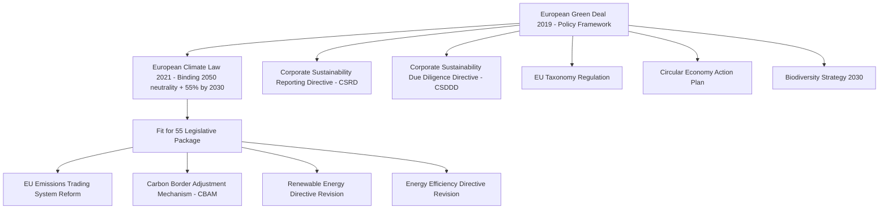
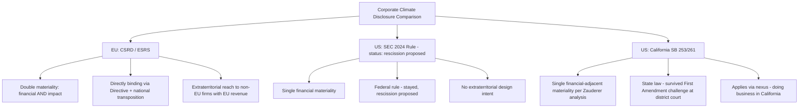

## The European Union's Environmental Law and Green Deal Framework

### Constitutional Foundations of EU Environmental Law

**Key Points**

EU environmental law operates within a distinctive supranational legal order that has no direct analogue among the domestic and international frameworks addressed elsewhere in this course — EU law is directly effective and supreme over conflicting national law within the scope of EU competence, a structural feature (established through the foundational cases *Van Gend en Loos* and *Costa v. ENEL*) that gives EU environmental directives and regulations enforcement power considerably stronger than typical multilateral environmental agreements.

**Treaty basis**: Articles 11 and 191–193 of the Treaty on the Functioning of the European Union (TFEU) establish the EU's environmental competence and core principles:

- **Environmental integration principle** (Article 11 TFEU): Environmental protection requirements must be integrated into the definition and implementation of all other EU policies and activities — a horizontal mainstreaming obligation with no direct equivalent in most domestic legal systems.
- **Precautionary principle** (Article 191(2) TFEU): EU environmental policy must be based on the precautionary principle, along with the principles of preventive action, rectification of environmental damage at source, and "polluter pays" — the same polluter-pays principle later endorsed in the international context by the 2025 ICJ climate advisory opinion.
- **Subsidiarity**: Environmental action is taken at EU level only where objectives cannot be sufficiently achieved by member states individually, and can be better achieved at Union level.

**Legislative instrument types**:

| Instrument | Direct effect on member states | Example |
| --- | --- | --- |
| Regulation | Directly applicable in all member states without national transposition | CBAM Regulation, EU ETS Regulation |
| Directive | Sets binding result but requires national transposition legislation, allowing member state flexibility in method | CSRD, CSDDD, Habitats Directive |
| Decision | Binding on specified addressees only | State aid approvals for green subsidies |

**[Inference]** The EU's ability to legislate via directly applicable Regulations (rather than relying solely on directives requiring national transposition) is a key structural advantage over the MEA enforcement model discussed elsewhere in this course — a Regulation like CBAM takes legal effect uniformly across 27 member states without the transposition-gap and inconsistent-implementation risks that weaken purely international instruments.

---

### The European Green Deal: Overarching Architecture

**Key Points**

The **European Green Deal**, launched by the European Commission in December 2019, is not itself a single binding legal instrument but rather an overarching policy framework and roadmap under which a large body of subsequent binding legislation has been enacted. Its headline goal is EU climate neutrality by 2050, subsequently made legally binding through the European Climate Law (Regulation (EU) 2021/1119), which also established an intermediate binding target of at least 55% net GHG emissions reduction by 2030 relative to 1990 levels (the "Fit for 55" target).

**Core Green Deal legislative pillars**:

1. **Climate**: European Climate Law, EU Emissions Trading System (ETS) expansion and reform, Carbon Border Adjustment Mechanism (CBAM), Effort Sharing Regulation for non-ETS sectors.
2. **Energy**: Revised Renewable Energy Directive (binding EU-level renewable share targets), revised Energy Efficiency Directive.
3. **Corporate sustainability and finance**: Corporate Sustainability Reporting Directive (CSRD), Corporate Sustainability Due Diligence Directive (CSDDD), EU Taxonomy Regulation (a classification system defining environmentally sustainable economic activities for investment purposes).
4. **Circular economy and biodiversity**: Circular Economy Action Plan, EU Biodiversity Strategy for 2030, Nature Restoration Law.
5. **Industrial and trade policy**: Clean Industry Deal, EU Competitiveness Compass — reflecting a more recent phase of Green Deal implementation explicitly framed around reconciling environmental ambition with industrial competitiveness.

---

### The EU Emissions Trading System (ETS): Cap-and-Trade Architecture

**Key Points**

The EU ETS, established in 2005, is the world's first and largest international cap-and-trade carbon market and functions as the central pricing mechanism underlying much of the Green Deal's climate architecture.

**Mechanics**:

$$\text{Total Emissions Cap} = \sum(\text{Free Allocations}) + \sum(\text{Auctioned Allowances})$$

- The EU sets a declining aggregate emissions cap across covered sectors (power generation, energy-intensive industry, aviation, and — following Fit for 55 reforms — maritime shipping and, from 2027, a separate ETS2 covering buildings and road transport fuel).
- Covered installations must surrender one allowance (EU Allowance, or EUA) per tonne of CO2-equivalent emitted.
- Allowances are allocated partly through free allocation (declining over time, particularly for sectors exposed to international competition) and partly through auction, with allowances tradeable on secondary markets, creating a market-determined carbon price.
- Revenue from auctioned allowances substantially funds EU climate programs, including the Innovation Fund and Modernisation Fund supporting lower-income member states' transition.

**[Inference]** The EU ETS's free-allocation mechanism for trade-exposed industries has historically functioned as an implicit carbon-leakage prevention tool, but its declining trajectory under Fit for 55 reforms directly necessitated the creation of CBAM as an alternative leakage-prevention mechanism — meaning CBAM's design is best understood as a structural response to the EU's own ETS reform choices rather than a freestanding trade policy instrument.

---

### The Carbon Border Adjustment Mechanism (CBAM)

**Key Points**

CBAM is designed to prevent "carbon leakage" — the risk that EU climate policy simply displaces carbon-intensive production to jurisdictions with weaker climate regulation, rather than genuinely reducing global emissions — by imposing a carbon price on imports of specified carbon-intensive goods (initially cement, iron and steel, aluminum, fertilizers, electricity, and hydrogen) equivalent to what domestic EU producers pay under the EU ETS.

**Implementation timeline and recent developments**:

- CBAM entered a transitional reporting-only phase in October 2023, requiring importers to report embedded emissions without yet paying a financial charge.
- The **definitive CBAM phase** — requiring importers to purchase and surrender CBAM certificates corresponding to embedded emissions — began **January 1, 2026**.
- On December 17, 2025, the European Commission adopted a package of eight implementing acts and one delegated act, completing the technical and procedural legal framework for the definitive phase, covering embedded-emissions calculation methodology, default values, EU ETS free-allocation adjustments, certificate pricing, emissions verification, verifier accreditation, authorized-declarant conditions, and the CBAM Registry (including data protection and customs data exchange provisions).
- Substantial CBAM simplification amendments were adopted as **Regulation (EU) 2025/2083**, published in the Official Journal on October 17, 2025 and entering into force October 20, 2025, as part of the broader "Omnibus" simplification package (discussed below). These amendments were designed to exempt approximately 90% of previously covered importers (primarily small-quantity importers) from CBAM obligations while still covering an estimated 99% of the relevant embedded CO2 emissions — reflecting a deliberate design choice to concentrate compliance burden on high-volume importers while reducing administrative burden for negligible-volume trade flows.
- A further CBAM review, followed by an anticipated legislative proposal for sectoral expansion, was planned independent of the Omnibus simplifications.

**[Inference]** CBAM's interaction with WTO law raises the same GATT Article XX compatibility questions addressed in the broader MEA enforcement discussion — as a unilateral (rather than multilaterally negotiated) trade measure tied to environmental/climate objectives, CBAM's ultimate WTO consistency remains a live and largely untested legal question, since no definitive WTO dispute settlement ruling has yet addressed a carbon border adjustment mechanism of this design.

---

### Corporate Sustainability Reporting Directive (CSRD) and the European Sustainability Reporting Standards

**Key Points**

The CSRD, which entered into force in 2023, substantially expanded the scope and rigor of mandatory corporate sustainability disclosure across the EU, applying a "double materiality" standard — requiring companies to report both (a) how sustainability matters affect the company financially, and (b) how the company's activities affect people and the environment — a broader materiality concept than the U.S. SEC's traditional single (financial) materiality approach addressed in the companion domestic-disclosure topic.

**Original phased scope** (prior to simplification, described below):

- Large EU companies and listed companies (Wave 1): reporting for FY2024.
- Other large companies not previously subject to the Non-Financial Reporting Directive (Wave 2): reporting for FY2025.
- Listed SMEs and certain third-country companies with substantial EU-connected revenue (Wave 3): reporting for FY2026.

**Reporting standard**: Companies report against the European Sustainability Reporting Standards (ESRS), developed by the technical advisory body EFRAG (European Financial Reporting Advisory Group) and covering environmental, social, and governance topics in extensive granular detail.

---

### The 2025–2026 Omnibus Simplification Package: A Significant Mid-Course Correction

**Key Points**

Beginning in 2025, the EU undertook a substantial regulatory simplification effort — the **Omnibus Simplification Package** — representing the most significant recalibration of Green Deal corporate sustainability legislation since its original enactment, driven explicitly by international competitiveness concerns.

**Origins and political drivers**:

- The push originated from the **Draghi Report** on the future of European competitiveness, which identified regulatory complexity and burden as a significant contributor to EU economic stagnation relative to global competitors.
- Germany and France voiced concerns in January 2025 calling for simplification and postponement of CSRD obligations.
- Commission President Ursula von der Leyen announced the initiative in November 2024, and the first Omnibus proposals were published February 26, 2025.
- **[Inference]** Contemporaneous U.S. federal deregulatory action — including executive orders targeting DEI programs and questioning the extraterritorial application of CSRD and CSDDD to U.S.-connected companies — appears to have contributed additional political pressure toward EU simplification, illustrating a degree of transatlantic regulatory interdependence in this area even where the EU has not formally reversed its underlying climate-neutrality commitments.

**Key Omnibus changes to CSRD**:

- **"Stop-the-clock" postponement**: Delayed CSRD reporting obligations for Wave 2 and Wave 3 companies; Wave 1 companies received streamlined ESRS relief for the 2025–2026 reporting period.
- **Revised scope and timeline**: Mandatory CSRD reporting under the simplified ESRS now begins in 2027 for large EU firms and 2028 for certain non-EU firms meeting EU-connected revenue thresholds; SME reporting remains voluntary rather than mandatory.
- **Political agreement reached December 2025**: The European Commission, Parliament, and Council reached agreement on the Omnibus simplification discussions in December 2025, with formal publication expected in early 2026, initiating member state transposition.
- **Simplified ESRS**: EFRAG formally submitted simplified ESRS recommendations to the Commission in December 2025; a public consultation on the draft simplified standards was scheduled for Spring 2026, with formal Commission adoption expected mid-2026 (adoption of the simplified ESRS, unlike the underlying CSRD directive itself, does not require separate member state transposition since it operates through delegated/implementing act mechanisms).

**Key Omnibus changes to the Corporate Sustainability Due Diligence Directive (CSDDD)**:

- **Narrowed scope**: Directive (EU) 2026/470, published in the Official Journal on February 26, 2026, amended the original CSDDD (Directive (EU) 2024/1760) to narrow due diligence obligations to companies exceeding 5,000 employees and €1.5 billion net turnover, including certain franchising arrangements and third-country companies meeting specified EU turnover thresholds.
- **Timeline**: The amending directive entered into force March 18, 2026, with member states required to transpose the CSDDD amendments by July 26, 2028.
- **Postponed implementation**: The first phase of implementation (targeting the largest companies) was postponed by one year to 2028.
- **Deleted review clause**: A review clause regarding potential future inclusion of downstream financial services within CSDDD scope was deleted from the final text — a substantive narrowing of the directive's anticipated future reach.
- **Climate transition plan alignment**: The Omnibus clarified and aligned CSDDD climate transition plan requirements with corresponding CSRD provisions, reducing duplicative compliance burden for companies subject to both instruments.

**Ongoing implementation**: The European Commission issued a public consultation (opened June 12, 2026, closing July 24, 2026) on implementation guidelines for the amended CSDDD.

**[Inference]** The scale and speed of the Omnibus rollback — moving from initial CSRD/CSDDD enactment to substantial scope-narrowing and multi-year delay within approximately three years — illustrates that even the EU's comparatively robust supranational legislative architecture is not immune to significant policy reversal under sustained industry and competitiveness pressure, though the Omnibus package has been consistently framed by the Commission as "preserving the Green Deal's essence" rather than abandoning its underlying climate-neutrality objectives — a framing distinction likely to remain contested as implementation proceeds.

---

### Comparative Structural Note: EU Framework vs. U.S. Framework

**[Inference]** This comparison illustrates a notable current divergence in corporate climate disclosure trajectories across the two jurisdictions most heavily analyzed in this course: the EU's CSRD, even after significant Omnibus narrowing, retains a broader double-materiality standard and continues moving toward mandatory implementation on a delayed timeline, while the U.S. federal framework has moved toward outright rescission — leaving California's SB 253/261 framework (addressed in the companion domestic-disclosure topic) as the most stringent surviving mandatory U.S. disclosure regime, and creating a scenario where large multinational companies face materially different disclosure obligations depending on jurisdiction of primary regulatory nexus.

---

### Enforcement Mechanisms Distinctive to the EU Legal Order

**Key Points**

Unlike the facilitative, largely non-coercive enforcement model characteristic of MEAs generally (addressed in the companion MEA structure topic), EU environmental law benefits from several enforcement mechanisms unavailable at the pure international level:

- **Infringement proceedings** (TFEU Article 258): The European Commission can bring proceedings against a member state before the Court of Justice of the European Union (CJEU) for failure to transpose or properly implement EU environmental directives, potentially resulting in binding judgments and — for continued non-compliance — financial penalties (lump sum payments and/or periodic penalty payments under Article 260 TFEU).
- **Direct effect doctrine**: Under certain conditions, individuals can invoke sufficiently clear, precise, and unconditional directive provisions directly before national courts even where a member state has failed to properly transpose the directive, providing a private enforcement pathway unavailable under most international environmental instruments.
- **Preliminary reference procedure** (TFEU Article 267): National courts facing questions of EU environmental law interpretation can (and in some circumstances must) refer questions to the CJEU for a binding interpretive ruling, ensuring consistent interpretation across all 27 member states — a centralized interpretive mechanism with no analogue in the international MEA context, where treaty interpretation disputes are resolved (if at all) through the more fragmented mechanisms discussed in the companion MEA enforcement topic.
- **State aid control**: The Commission's exclusive competence over state aid approval gives it substantial indirect leverage over member states' green subsidy programs, since national decarbonization subsidies (for renewable energy, industrial decarbonization, etc.) generally require Commission approval under evolving state aid frameworks (e.g., the Temporary Crisis and Transition Framework supporting Green Deal industrial policy objectives).

**[Inference]** These enforcement mechanisms collectively explain why EU environmental directives, despite requiring national transposition (a structural similarity to the domestic-implementation-dependent MEA model), achieve materially higher and more consistent compliance rates than most international environmental treaties — the CJEU's binding jurisdiction and the Commission's infringement authority substitute for the coercive enforcement capacity that pure international law characteristically lacks.

---

### Practical Application: Illustrative Multinational Compliance Analysis

**Example**

A U.S.-headquartered chemicals manufacturer with an EU subsidiary generating €400 million in annual EU revenue, importing steel inputs from a non-EU supplier, and employing 6,200 people globally must now evaluate, following the Omnibus revisions:

1. **CSRD applicability**: Depending on the EU subsidiary's specific size thresholds and the parent's EU-connected revenue under the revised third-country provisions, mandatory reporting could begin as early as the 2027 (large EU firms) or 2028 (qualifying non-EU parent) compliance timeline, using the simplified ESRS once formally adopted (expected mid-2026).
2. **CSDDD applicability**: Given the 6,200-employee headcount exceeds the revised 5,000-employee threshold, and assuming turnover exceeds €1.5 billion at the relevant corporate level, due diligence obligations likely apply, though the specific franchising and third-country turnover threshold provisions require case-specific analysis under the amended directive.
3. **CBAM applicability**: The imported steel inputs fall within CBAM's covered goods categories; because the company is a substantial importer (not a small-quantity importer falling within the Omnibus exemption threshold), it likely remains subject to full CBAM certificate purchase and surrender obligations under the definitive phase beginning January 1, 2026.
4. **Coordination with U.S. domestic obligations**: The company must separately evaluate its U.S. federal (currently receding), California SB 253/261 (currently advancing subject to Ninth Circuit litigation), and now EU obligations as three semi-independent compliance tracks — precisely the multi-jurisdictional fragmentation pattern identified in the companion domestic corporate climate disclosure topic.

**[Inference]** This example illustrates that the EU's Omnibus simplification, rather than eliminating multinational compliance complexity, has primarily shifted its character — narrowing the population of covered companies and extending timelines, while leaving the largest, most EU-integrated multinationals subject to a still-substantial and still-evolving compliance framework that must be analyzed in coordination with an increasingly divergent U.S. regulatory landscape.

---

### Conclusion

The EU's environmental law and Green Deal framework represents the most institutionally robust supranational environmental legal architecture currently in operation, benefiting from directly applicable regulations, binding CJEU jurisdiction, and Commission infringement enforcement authority unavailable to purely international MEA regimes. At the same time, the 2025–2026 Omnibus simplification package demonstrates that even this comparatively strong architecture remains subject to significant political recalibration under competitiveness pressure, producing substantial narrowing and delay of the CSRD and CSDDD frameworks while the EU ETS and CBAM architecture has continued toward full implementation on its original timeline. For practitioners advising multinational clients, the EU framework should be understood not as a static, fully settled body of law but as a rapidly evolving system in which the headline Green Deal climate-neutrality commitment persists as binding law under the European Climate Law, even as its implementing corporate-sustainability architecture undergoes substantial, ongoing revision.

---

**Related Topics**

- Corporate climate disclosure rules and related litigation (companion topic, domestic chapter) — comparative EU/US analysis
- The structure and enforcement of multilateral environmental agreements (companion topic) — comparative supranational vs. international enforcement models
- The UNFCCC, the Kyoto Protocol, and the Paris Agreement architecture (companion topic) — EU's role as a Paris Agreement party bloc
- WTO law and CBAM's compatibility with GATT Article XX
- The EU Taxonomy Regulation and sustainable finance classification
- The EU Nature Restoration Law and Biodiversity Strategy for 2030
- Comparative national implementation of NDC commitments (EU Fit for 55 as the EU's NDC vehicle)
- The 2025 ICJ Advisory Opinion on state climate obligations (companion topic) — EU member state due-diligence exposure
- CJEU environmental jurisprudence and the preliminary reference procedure
- The Draghi Report and the broader EU competitiveness-versus-sustainability policy debate