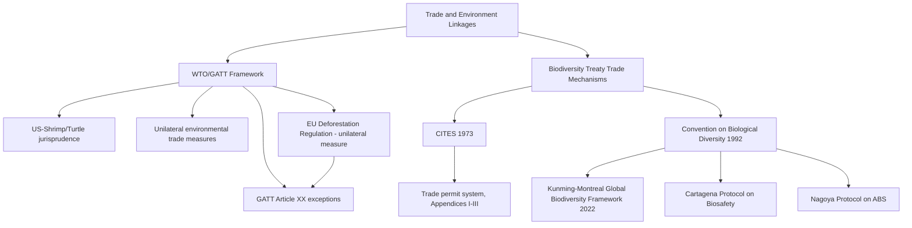

## Trade and Environment Linkages and Biodiversity Treaties

### Conceptual Overview: Two Intersecting Bodies of Law

**Key Points**

This topic addresses two distinct but deeply intertwined bodies of international law: (1) the **trade-environment linkage** — the doctrinal and institutional interface between international trade law (principally WTO law) and environmental regulation, and (2) **biodiversity treaties** — the multilateral instruments protecting species, ecosystems, and genetic resources, several of which operate substantially *through* trade-restriction mechanisms, making the two subjects structurally inseparable in practice.

---

### CITES: The Paradigm Trade-Based Biodiversity Treaty

**Key Points**

The **Convention on International Trade in Endangered Species of Wild Fauna and Flora (CITES, 1973)** is the clearest example of a biodiversity treaty whose entire enforcement architecture operates through trade regulation rather than direct habitat or species protection — a structural choice addressed briefly in the companion MEA-structure topic but warranting deeper treatment here given its centrality to trade-environment doctrine.

**Structural mechanics**:

- **Three-tiered appendix system**: Species are listed in Appendix I (threatened with extinction; commercial trade essentially prohibited), Appendix II (not currently threatened but trade must be controlled to avoid becoming so; trade permitted under a permit system), or Appendix III (species protected in at least one country that has requested other parties' assistance in controlling trade).
- **Permit-based control**: Trade in listed species requires export permits (and, for Appendix I, import permits) issued by national CITES Management Authorities, based on non-detriment findings from Scientific Authorities confirming trade will not be detrimental to the species' survival.
- **Trade suspension as enforcement**: The CITES Standing Committee can recommend that all parties suspend commercial trade with a specific non-complying party — a direct, economically consequential enforcement mechanism operationalized through the trade system itself, distinguishing CITES from the largely facilitative non-compliance procedures used by most other MEAs.

**[Inference]** CITES's trade-suspension enforcement mechanism achieves meaningfully higher compliance leverage than facilitative NCPs (addressed in the companion MEA structure topic) precisely because the regulated activity — international wildlife trade — is itself the enforcement lever, creating a self-contained incentive structure: a state gains little from evading CITES obligations if doing so results in exclusion from lawful trade in the very commodities at issue.

---

### The Convention on Biological Diversity and the Kunming-Montreal Global Biodiversity Framework

**Key Points**

The **Convention on Biological Diversity (CBD, 1992)**, one of the three "Rio Conventions" alongside the UNFCCC, established the broader framework-convention architecture for biodiversity conservation, sustainable use of biological resources, and fair and equitable sharing of benefits from genetic resources. Unlike CITES, the CBD does not operate primarily through trade mechanisms, though its protocols increasingly intersect with trade regulation.

**The Kunming-Montreal Global Biodiversity Framework (GBF)**, adopted at CBD COP15 in Montreal on December 19, 2022, following a four-year negotiation process delayed two years by the COVID-19 pandemic, replaced the prior Aichi Targets (adopted 2010, largely unmet by their 2020 deadline) with a new structure of **4 goals for 2050 and 23 targets for 2030**.

**Headline provisions**:

- **Target 3 ("30x30")**: Conserve at least 30% of terrestrial, inland water, and coastal/marine areas by 2030, up from a baseline of approximately 17% terrestrial and 10% marine protection at the time of adoption.
- **Overarching goal**: Halt and reverse nature loss by 2030 (measured from a 2020 baseline), en route to the 2050 vision of "living in harmony with nature."
- **Extinction risk reduction target**: A specific target addressing reduction of species extinction risk by 2030.
- **Indigenous Peoples and local communities recognition**: Substantial textual recognition of Indigenous Peoples' and local communities' rights, contributions, and role in decision-making, aligned with the UN Declaration on the Rights of Indigenous Peoples — though implementation observers have noted a persistent gap between textual recognition and on-the-ground legal recognition of Indigenous land rights in many party states.
- **Digital sequence information (DSI) benefit-sharing**: Parties agreed to establish a multilateral mechanism for equitable benefit-sharing related to digital sequence information on genetic resources, with details finalized at COP16 (Cali, Colombia, 2024) — extending the CBD's benefit-sharing principle (rooted in the Nagoya Protocol) into the genomic-data era.
- **Financing commitments**: Parties committed to mobilizing at least $200 billion annually by 2030 from all sources for biodiversity, including a specific target to increase international financial flows to developing countries, and the Global Environment Facility was requested to establish a dedicated **GBF Fund** to support implementation.
- **National Biodiversity Strategy and Action Plans (NBSAPs)**: Parties are expected to develop or update national action plans aligned with the GBF targets — a structural parallel to the Paris Agreement's NDC mechanism (addressed in the companion topic), though notably, delegates did not agree on a binding deadline for NBSAP submission, a gap criticized by observers at adoption.

**Monitoring and reporting architecture**: Parties monitor and report on GBF progress at intervals of five years or less, using an agreed indicator framework; the CBD Secretariat compiles national submissions into global trend and progress reports, with national information consolidated by late February 2026 and again by late June 2029 for the second global assessment cycle.

**[Inference]** The GBF's monitoring and NBSAP structure deliberately mirrors the Paris Agreement's "pledge and review" architecture (addressed in the companion NDC topic), reflecting an emerging convergence in MEA design across the climate and biodiversity regimes toward nationally-determined implementation plans subject to periodic collective stocktaking — though the GBF, like the Paris Agreement, faces the identical structural risk that non-binding national plans may prove insufficient in aggregate, a concern echoed by conservation scientists who have characterized the framework as "the floor, not a ceiling" for necessary action.

---

### Implementation Progress and the 2026 Global Review

**Key Points**

Scholarly assessment published in early 2026 characterized the Kunming-Montreal Targets as "the most ambitious and serious conservation agenda ever developed," while raising substantial questions about implementability — specifically regarding whether the framework's organizational and financial architecture is adequate to deliver stable, predictive, and adaptive monitoring of global biodiversity trends, identify key drivers of biodiversity decline, and apply effective scientific, financial, and governmental interventions at the necessary scale.

A formal **global review of collective progress** in GBF implementation was scheduled for joint consideration by the CBD's Subsidiary Body on Scientific, Technical and Technological Advice (SBSTTA, 28th meeting) and Subsidiary Body on Implementation (SBI, 7th meeting), both convening in Nairobi in late July/early August 2026 — the first comprehensive collective progress assessment under the Framework's five-year review cycle, structurally analogous to the Paris Agreement's Global Stocktake.

**National-level implementation gaps**: Reporting has documented substantial national delay in NBSAP submission; as of 2025, some parties (illustratively, Sweden) had not yet developed the national action plans anticipated by COP16, three years after the Framework's adoption — illustrating a compliance-timeline gap comparable to the NDC submission shortfalls documented in the Paris Agreement context.

**[Unverified]** — the substantive conclusions of the 2026 SBSTTA/SBI global review should be independently confirmed against the finalized report, since the review was still in a peer-review and revision process as of the most recent available documentation, and its ultimate findings regarding aggregate 30x30 progress may differ materially from preliminary indications.

---

### The EU Deforestation Regulation: Unilateral Environmental Trade Measures

**Key Points**

The **EU Deforestation Regulation (EUDR)**, Regulation (EU) 2023/1115, illustrates the contemporary frontier of unilateral trade measures addressing biodiversity and forest-related harm, operating outside any negotiated biodiversity treaty framework and instead relying on the EU's own market-access authority — directly implicating the WTO trade-environment doctrine discussed below.

**Substantive requirements**: The EUDR covers timber and seven key commodities (cattle, cocoa, coffee, oil palm, rubber, soy, and wood) plus derivative products (beef, chocolate, furniture, etc.). To be placed on or exported from the EU market, covered products must satisfy three cumulative conditions:

1. **Deforestation-free status**: The product must not be linked to deforestation or forest degradation occurring after a specified cutoff date.
2. **Legality**: Production must comply with all relevant laws of the country of origin — extending beyond environmental law to encompass land-use rights, forest management, labor, tax, and human rights laws.
3. **Due diligence statement**: Companies must submit a due diligence statement via the EUDR Information System, demonstrating that the origin of the product has been verified and EUDR requirements satisfied.

**Implementation timeline and delays**: The regulation has experienced repeated implementation postponement. The European Commission proposed delaying enforcement for a second consecutive year in September 2025, pushing the operative date to late December 2026 for medium and large enterprises (with micro/small enterprises following six months later, June 2027). Environmental organizations sharply criticized the repeated delays, noting that 2024 tropical forest loss reached 6.7 million hectares — an area nearly the size of Ireland — and arguing that the legally mandated implementation infrastructure (IT systems, guidance materials, country benchmarking) had already been in place for months prior to the delay decision. Printed products (books, newspapers) were removed from the regulation's scope in December 2025.

**WTO challenge**: Malaysia and Indonesia filed formal complaints against the EU at the WTO, alleging the EUDR constitutes discriminatory trade regulation inconsistent with WTO obligations — directly testing the GATT Article XX framework discussed below in a live, high-profile dispute. **[Unverified]** — the disposition of these WTO complaints should be confirmed against current WTO dispute settlement records, as panel proceedings in this type of dispute typically extend over multiple years and a definitive ruling may not yet have issued.

**[Inference]** The EUDR illustrates a broader pattern of unilateral environmental trade measures emerging in the apparent absence of adequate multilateral biodiversity-trade coordination — because no binding multilateral instrument comprehensively addresses deforestation-linked commodity trade with the EUDR's specificity, the EU has effectively used its market-access leverage to impose supply-chain requirements unilaterally, a strategy that generates greater environmental stringency than achievable through consensus-based multilateral negotiation, but at correspondingly higher WTO-consistency legal risk and greater diplomatic friction with commodity-producing states.

---

### The WTO-Environment Doctrinal Framework

**Key Points**

The central doctrinal question underlying all trade-environment linkage analysis is whether an environmental trade measure — whether treaty-based (like CITES) or unilateral (like the EUDR) — is consistent with core WTO/GATT non-discrimination obligations, principally:

- **GATT Article I** (most-favored-nation treatment): Prohibiting discrimination between like products from different trading partners.
- **GATT Article III** (national treatment): Prohibiting discrimination between imported and domestically produced like products.
- **GATT Article XI** (elimination of quantitative restrictions): Generally prohibiting import/export bans or quotas.

**The GATT Article XX general exceptions**: Environmental trade measures otherwise inconsistent with these obligations may nonetheless be justified under:

- **Article XX(b)**: Measures "necessary to protect human, animal or plant life or health."
- **Article XX(g)**: Measures "relating to the conservation of exhaustible natural resources," if made effective in conjunction with restrictions on domestic production or consumption.

**The chapeau requirement**: Even a measure falling within Article XX(b) or (g) must satisfy the chapeau's requirement that it not be applied in a manner constituting "arbitrary or unjustifiable discrimination between countries where the same conditions prevail," nor a "disguised restriction on international trade" — the operative standard through which most trade-environment disputes are ultimately resolved.

**Foundational jurisprudence — *US–Shrimp/Turtle*** (WTO Appellate Body, 1998 and 2001 compliance proceeding): The U.S. banned shrimp imports from countries not certified as using turtle-excluder devices to prevent sea turtle bycatch. The Appellate Body held:

1. Sea turtles (as an exhaustible natural resource, including migratory and endangered species) fall within Article XX(g)'s scope.
2. The U.S. measure could in principle satisfy Article XX(g), but the *manner of application* — insufficient flexibility, inadequate engagement with affected exporting countries, and effectively requiring other countries to adopt essentially the same regulatory program as the U.S. — violated the chapeau's non-discrimination requirement in the original 1998 ruling.
3. In the subsequent Article 21.5 compliance proceeding (2001), the U.S. had revised its implementation to allow greater flexibility and genuine engagement with affected states, and the Appellate Body found the revised measure chapeau-compliant — establishing that environmental trade measures are not per se WTO-inconsistent, but must be applied with procedural fairness, flexibility, and genuine international engagement rather than rigid unilateral imposition.

**[Inference]** The *Shrimp/Turtle* framework's emphasis on procedural flexibility and engagement — rather than substantive environmental stringency — as the decisive chapeau factor suggests that the EUDR's WTO-consistency defense will likely turn less on whether deforestation is a legitimate Article XX(g) concern (which seems relatively secure) and more on whether the EU's implementation process (benchmarking methodology, country-risk categorization, engagement with affected producer countries like Malaysia and Indonesia) provides sufficient procedural fairness and flexibility to satisfy the chapeau — precisely the kind of procedural adequacy question at the center of the pending Malaysia/Indonesia WTO complaints.

---

### Multilateral vs. Unilateral Trade-Environment Measures: Comparative Legitimacy

| Dimension | CITES (multilateral, negotiated) | EUDR (unilateral, EU-imposed) |
| --- | --- | --- |
| Legal basis | Negotiated treaty; near-universal ratification | EU internal legislation exercising market-access authority |
| WTO risk profile | Lower — multilateral consensus provides stronger Article XX(g)/chapeau defense | Higher — unilateral imposition invites chapeau discrimination challenges |
| Enforcement mechanism | Built-in trade suspension via Standing Committee | EU border enforcement; due diligence statement requirements |
| Producer-country buy-in | Built into treaty negotiation and ratification process | Contested; Malaysia/Indonesia WTO complaints reflect buy-in gap |
| Species/commodity specificity | Species-by-species listing via COP decision | Commodity-by-commodity, EU-determined |

**[Inference]** This comparison illustrates a recurring strategic trade-off in trade-environment policy design: multilateral biodiversity-trade instruments like CITES achieve greater WTO-law security and producer-country legitimacy but require the slower, consensus-constrained negotiation processes characteristic of MEAs generally (addressed in the companion MEA structure topic), while unilateral measures like the EUDR can be enacted and made more stringent more rapidly, at the cost of contested legitimacy and materially higher WTO litigation exposure.

---

### The Cartagena and Nagoya Protocols: Trade-Adjacent Biosafety and Benefit-Sharing

**Key Points**

Two CBD protocols illustrate additional trade-environment intersections within the biodiversity regime:

- **Cartagena Protocol on Biosafety (2000)**: Establishes an Advance Informed Agreement procedure governing the transboundary movement of living modified organisms (LMOs) resulting from modern biotechnology, requiring exporting parties to notify and obtain consent from importing parties before the first intentional transboundary movement of LMOs intended for release into the environment — a prior-informed-consent trade mechanism structurally similar to the Basel Convention's hazardous waste framework addressed in the companion MEA structure topic.
- **Nagoya Protocol on Access and Benefit-Sharing (2010)**: Establishes a framework for fair and equitable sharing of benefits arising from the utilization of genetic resources, requiring users to obtain prior informed consent from the resource-providing country and establish mutually agreed terms — creating a compliance-tracking obligation that increasingly intersects with international trade in biological and pharmaceutical products derived from genetic resources, and forming the doctrinal foundation for the GBF's subsequent digital sequence information benefit-sharing mechanism.

---

### Practical Application: Illustrative Multi-Instrument Compliance Analysis

**Example**

A European food and cosmetics conglomerate imports palm oil from Southeast Asian suppliers and separately sources a genetic extract used in a proprietary skincare formulation from a biodiversity-rich partner country.

- **EUDR applicability**: The palm oil import falls squarely within EUDR's covered-commodity list; the company must obtain a due diligence statement confirming deforestation-free status and country-of-origin legal compliance before the December 2026 (or subsequently further-delayed) enforcement date, and must monitor evolving WTO dispute outcomes that could affect the regulation's ultimate scope or survival.
- **Nagoya Protocol applicability**: The genetic extract sourcing requires prior informed consent and mutually agreed benefit-sharing terms with the country of origin under Nagoya Protocol-implementing national legislation, independent of any EUDR analysis.
- **CITES applicability**: If any raw material inputs involve listed flora or fauna species (e.g., certain botanical extracts), CITES permit requirements would apply as a separate, additional compliance layer.
- **Cross-cutting WTO risk monitoring**: Because the EUDR itself faces active WTO challenge, the company's long-term supply-chain compliance planning must account for the possibility of regulatory modification or invalidation, distinguishing EUDR-driven obligations (subject to potential WTO-driven change) from Nagoya/CITES obligations (grounded in longer-standing, more WTO-secure multilateral treaty frameworks).

**[Inference]** This example illustrates that multinational companies operating in biodiversity-sensitive supply chains increasingly face a layered compliance structure combining WTO-tested multilateral treaty obligations (CITES, Nagoya) with less legally secure but faster-moving unilateral market-access measures (EUDR) — requiring separate legal risk assessment tracks for each category given their materially different stability and enforcement characteristics.

---

### Conclusion

Trade and environment linkages and biodiversity treaties are best understood as a single interconnected field rather than two separate subjects: CITES demonstrates how a biodiversity treaty can achieve unusually effective enforcement precisely by operating through trade restriction, while the broader WTO Article XX/chapeau framework established in *US–Shrimp/Turtle* provides the doctrinal test through which both multilateral and unilateral environmental trade measures must be evaluated. The Kunming-Montreal Global Biodiversity Framework represents the CBD regime's most ambitious attempt yet to coordinate global conservation action through a Paris Agreement-style pledge-and-review architecture, while the EU Deforestation Regulation illustrates the growing prominence of unilateral market-access measures as an alternative — faster but more legally contested — pathway to biodiversity-protective trade regulation. For practitioners, the central analytical task in this field is consistently the same: identifying whether a given trade-restrictive environmental measure derives its legitimacy from negotiated multilateral consensus (lower WTO risk, slower to enact) or unilateral market power (higher WTO risk, faster and potentially more stringent), and assessing compliance accordingly across what is often a multi-instrument, multi-jurisdictional supply chain.

---

**Related Topics**

- The structure and enforcement of multilateral environmental agreements (companion topic) — CITES as trade-enforcement case study
- The European Union's environmental law and Green Deal framework (companion topic) — EUDR within the broader Green Deal architecture
- The UNFCCC, the Kyoto Protocol, and the Paris Agreement architecture (companion topic) — comparative pledge-and-review design
- WTO Appellate Body jurisprudence beyond *Shrimp/Turtle* (*US–Gasoline*, *EC–Asbestos*, *Brazil–Retreaded Tyres*)
- The Nagoya Protocol and digital sequence information benefit-sharing mechanisms
- Illegal, unreported, and unregulated (IUU) fishing regulation and trade-based enforcement
- Comparative national implementation of 30x30 commitments and protected area designation law
- The Basel Convention's prior-informed-consent model as a comparative trade-environment mechanism
- Indigenous Peoples' land rights and biodiversity conservation law
- The 2025 ICJ Advisory Opinion on state climate obligations (companion topic) — potential doctrinal extension to biodiversity obligations