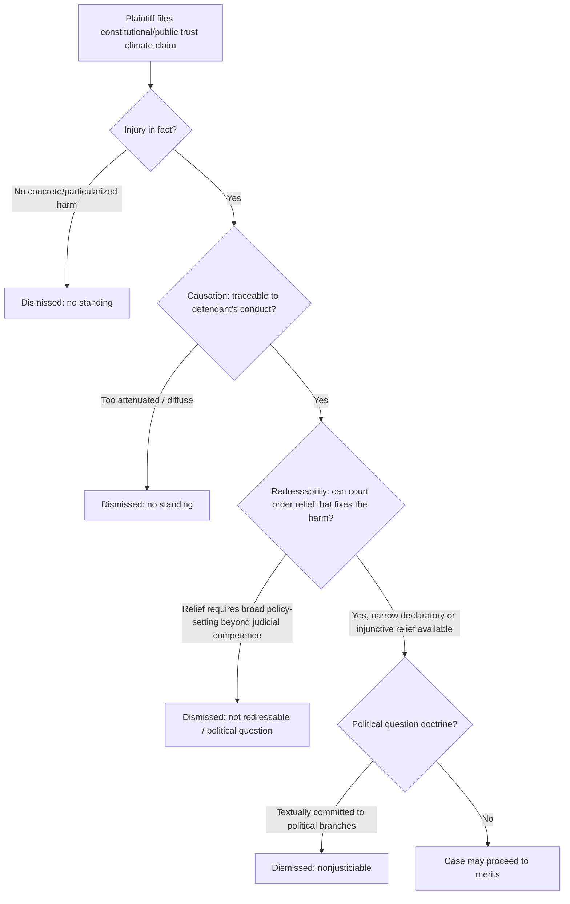

## Constitutional and Public Trust Climate Claims: *Juliana v. United States* and *Held v. Montana*

### Overview

This topic covers two landmark youth-led climate lawsuits that anchor modern U.S. constitutional climate litigation: ***Juliana v. United States*** (federal, ultimately dismissed) and ***Held v. State of Montana*** (state, plaintiffs prevailed). Both were organized by the nonprofit Our Children's Trust and relied on overlapping but doctrinally distinct theories — federal substantive due process and the public trust doctrine in *Juliana*, versus an explicit state constitutional environmental rights clause in *Held*. Their contrasting outcomes illustrate a core lesson in administrative and environmental law: the *availability of a textual constitutional hook* and the *forum's justiciability doctrines* (standing, political question, redressability) determine whether atmospheric/climate claims can proceed to merits adjudication.

---

### Doctrinal Foundations

#### The Public Trust Doctrine

- Common-law (and in some states, constitutional) principle holding that government holds certain natural resources — traditionally navigable waters, tidelands, wildlife — in trust for public use and enjoyment.
- Plaintiffs in "atmospheric trust litigation" (ATL) argue the doctrine extends to the atmosphere itself, obligating government as trustee to protect it from degradation, including from greenhouse gas (GHG) accumulation.
- Traditionally a matter of **state law**; asserting it against the **federal government** (as in *Juliana*) required arguing for a federal common-law or constitutional-level public trust obligation — a significant doctrinal stretch that courts have resisted.

#### Federal Substantive Due Process (Fifth Amendment)

- *Juliana* plaintiffs argued a fundamental, unenumerated right to "a climate system capable of sustaining human life," derived from the Fifth Amendment's liberty and property protections, subject to strict scrutiny under *Washington v. Glucksberg*-style substantive due process analysis.
- Requires showing the right is "deeply rooted in this Nation's history and tradition" — a demanding standard the government consistently attacked.

#### State Constitutional Environmental Rights Provisions

- Distinct doctrinal path: several states have express constitutional text guaranteeing environmental rights (so-called "Green Amendments"), e.g., Pennsylvania, Montana, New York, Hawaii.
- **Montana Constitution, Article II, § 3**: guarantees Montanans "the right to a clean and healthful environment."
- **Montana Constitution, Article IX, § 1**: imposes an affirmative duty on the state to "maintain and improve a clean and healthful environment ... for present and future generations."
- Because these are express, justiciable textual rights (many self-executing and treated as fundamental), state courts face far less of the "unenumerated right" hurdle that sank the federal due process theory in *Juliana*.

---

### Article III / Justiciability Framework (Federal Claims)

The three **standing** elements — **injury-in-fact, causation, and redressability** (*Lujan v. Defenders of Wildlife*, 504 U.S. 555 (1992)) — form the primary battleground in federal climate suits. Redressability proved fatal in *Juliana*.

---

### Case Profile: *Juliana v. United States*

#### Key Facts and Procedural History

| Stage | Date | Development |
| --- | --- | --- |
| Filing | Aug./Sept. 2015 | 21 youth plaintiffs (District of Oregon) sue federal government, alleging fossil-fuel energy policies violate due process and public trust rights |
| Motion to dismiss denied | Nov. 10, 2016 | Judge Ann Aiken (D. Or.) denies dismissal, famously stating the right to a stable climate system is "fundamental to a free and ordered society" |
| Interlocutory appeals | 2017–2018 | Government seeks writs of mandamus; Ninth Circuit and Supreme Court decline to short-circuit the case pre-trial |
| Trial vacated / panel reversal | Jan. 17, 2020 | Ninth Circuit panel (2-1) dismisses for **lack of standing**, holding redressability not satisfied — courts cannot order and supervise a comprehensive national climate remediation plan |
| En banc denied | 2020 | Full Ninth Circuit declines rehearing |
| Amended complaint | 2023 | Plaintiffs narrow relief request to a **declaratory judgment** only (dropping the request for an injunctive remediation plan), attempting to cure redressability defects |
| Mandamus granted | May 1, 2024 | The Ninth Circuit Court of Appeals granted the federal government's petition for writ of mandamus and directed the federal district court for the District of Oregon to dismiss Juliana v. United States for lack of Article III standing, without leave to amend |
| En banc reconsideration denied | Jul. 12, 2024 | Ninth Circuit denied en banc reconsideration; no judge requested a vote to rehear the matter |
| Cert petition | Dec. 9, 2024 | Plaintiffs petition Supreme Court for certiorari |
| Cert denied | Mar. 24, 2025 | Supreme Court denied certiorari, ending the case |

#### Core Legal Theories Advanced

1. **Fifth Amendment substantive due process** — right to a climate system capable of sustaining human life.
2. **Public trust doctrine** — atmosphere as a trust asset the federal government must protect for present and future generations.
3. **Equal protection** — discriminatory treatment against a discrete class (youth/future generations) bearing disproportionate climate burden.
4. **Ninth Amendment** — unenumerated rights retained by the people.

#### Why the Case Failed: The Redressability Problem

- The Ninth Circuit found that an intervening U.S. Supreme Court decision cited by the district court did not change the law with respect to prospective relief, and therefore did not affect the redressability of the plaintiffs' claims — meaning even the narrowed declaratory-judgment-only complaint still failed redressability. [ucc](https://www.ucc.ie/en/youthclimatejustice/caselawdatabase/juliana-v-us.html)
- Courts consistently held that ordering the political branches to overhaul national energy policy exceeds the judiciary's institutional competence and the scope of Article III relief — echoing the 2020 panel's core rationale that comprehensive climate remediation is a matter for the **elected branches**, not courts.
- **[Inference]** The persistence of the redressability objection even after plaintiffs limited their ask to a bare declaration suggests courts treated the *underlying subject matter* (national energy/climate policy) — not merely the form of relief — as beyond judicially manageable standards.

#### Final Disposition

The U.S. Supreme Court denied the plaintiffs' petition for certiorari, and the Justice Department characterized the cert denial as concluding a case it had defended across three presidential administrations, with the government's ENRD stating the plaintiffs lacked Article III standing after the Ninth Circuit twice instructed dismissal. The case closed without any merits ruling on the substantive due process or public trust theories — it died entirely on **justiciability** grounds. [justice](https://www.justice.gov/opa/pr/justice-department-statement-juliana-case)[justice](https://www.justice.gov/opa/pr/justice-department-statement-juliana-case)

---

### Case Profile: *Held v. State of Montana*

#### Key Facts and Procedural History

| Stage | Date | Development |
| --- | --- | --- |
| Filing | March 2020 | 16 youth plaintiffs sue the State of Montana (Lewis and Clark County District Court, CDV-2020-307) |
| Trial | June 2023 | First constitutional climate trial in U.S. history |
| District court ruling | Aug. 2023 | Judge Kathy Seeley rules for plaintiffs |
| State appeal | 2023 | State appeals to Montana Supreme Court |
| Oral argument | Jul. 10, 2024 | Montana Supreme Court hears arguments |
| Montana Supreme Court decision | Dec. 18, 2024 | Montana Supreme Court affirms the District Court's decision in a 6-1 ruling |

#### Statutes Challenged

Plaintiffs challenged provisions of the **Montana Environmental Policy Act (MEPA)**, specifically:

- **§ 75-1-201(2)(a), MCA** — the "MEPA Limitation," which barred state agencies from evaluating greenhouse gas emissions or climate impacts in environmental reviews.
- **§ 75-1-201(6)(a)(ii), MCA** — a related "Judicial Prohibition" provision restricting judicial review tied to GHG analysis.

#### Holdings

The Montana Supreme Court held that the right to a clean and healthful environment under the Montana Constitution includes a stable climate system. Specifically, the court affirmed three holdings: [justia](https://law.justia.com/cases/montana/supreme-court/2024/da-23-0575-0.html)

1. **Constitutional scope**: the Montana Constitution includes a stable climate system in its right to a clean and healthful environment. [escr-net](https://www.escr-net.org/caselaw/2024/held-v-state-of-montana-560-p-3d-1235-mt-2024/)
2. **Standing**: the plaintiffs possessed "case-or-controversy standing" to bring a justiciable lawsuit — Justice Rice, dissenting on other grounds, nonetheless agreed the plaintiffs had at least "minimally sufficient" standing. [escr-net](https://www.escr-net.org/caselaw/2024/held-v-state-of-montana-560-p-3d-1235-mt-2024/)[dailymontanan](https://dailymontanan.com/2024/12/18/montana-supreme-court-affirms-decision-in-held-historic-youth-climate-case/)
3. **Unconstitutionality of the MEPA Limitation**: the MEPA Limitation and Judicial Prohibition were unconstitutional because they were not narrowly [tailored] and the MEPA Limitation arbitrarily excluded GHG emissions from environmental reviews, thereby violating plaintiffs' right to a clean and healthful environment. [escr-net](https://www.escr-net.org/caselaw/2024/held-v-state-of-montana-560-p-3d-1235-mt-2024/)[justia](https://law.justia.com/cases/montana/supreme-court/2024/da-23-0575-0.html)

The court affirmed the permanent injunction against the State acting in accordance with the unconstitutional provisions, and separately denied the State's motion for psychiatric examinations of the plaintiffs, finding no good cause for such examinations. [justia](https://law.justia.com/cases/montana/supreme-court/2024/da-23-0575-0.html)[justia](https://law.justia.com/cases/montana/supreme-court/2024/da-23-0575-0.html)

#### Reasoning on Framers' Intent

The Montana Supreme Court began its analysis by discussing the intent of the Framers of Montana's Constitution — specifically, the intent behind Article II, Section 3 and Article IX, Section 1. The court's opinion rejected the argument that global emissions elsewhere excuse Montana's own contribution, reasoning that the delegates intended the strongest, all-encompassing environmental protections in the nation, both anticipatory and preventative, for present and future generations, and would not grant the State a free pass to pollute just because the rest of the world insisted on doing so. [escr-net](https://www.escr-net.org/caselaw/2024/held-v-state-of-montana-560-p-3d-1235-mt-2024/)[statecourtreport](https://statecourtreport.org/our-work/analysis-opinion/montanas-climate-change-lawsuit-may-see-sequels-across-america)

#### Vote and Dissent

The six-justice majority found the law limiting analysis of greenhouse gas emissions during environmental reviews violated the Montana Constitution's "right to a clean and healthful environment," and enjoined the state from acting on it; Justice Jim Rice dissented, though even Rice agreed on the minimal-standing point. [dailymontanan](https://dailymontanan.com/2024/12/18/montana-supreme-court-affirms-decision-in-held-historic-youth-climate-case/)

---

### Comparative Analysis: *Juliana* vs. *Held*

| Dimension | *Juliana v. United States* | *Held v. Montana* |
| --- | --- | --- |
| Forum | Federal (D. Or. → 9th Cir. → SCOTUS) | State (Mont. District Court → Mont. Supreme Court) |
| Constitutional hook | Unenumerated Fifth Amendment substantive due process + federal public trust theory | Express textual right (Mont. Const. art. II, § 3; art. IX, § 1) |
| Defendant | U.S. federal government (executive branch energy/fossil-fuel policy generally) | State of Montana (specific MEPA statutory provisions) |
| Relief sought | Broad declaratory/injunctive relief compelling a national climate remediation plan (later narrowed to declaratory only) | Narrow: strike specific unconstitutional statutory provisions; injunction against their enforcement |
| Standing outcome | Failed — redressability defect fatal at multiple stages | Succeeded — "case-or-controversy" standing found, even by the dissent |
| Political question doctrine | Central obstacle — courts held broad climate policy-setting belongs to political branches | Largely avoided — relief was a discrete statutory strike-down, not policy design |
| Final result | Dismissed; cert denied Mar. 2025 — no merits ruling | Affirmed for plaintiffs; MEPA Limitation and Judicial Prohibition held unconstitutional |
| Precedential reach | No binding precedent (dismissed on justiciability); persuasive/cautionary value only | Binding Montana state precedent; persuasive authority for other "Green Amendment" states |

**[Inference]** The determinative variable across the two cases was not merely "public trust vs. constitutional text" but the **specificity and reviewability of the requested relief**. *Juliana*'s original ask (comprehensive judicially supervised decarbonization plan) was structurally similar to demands rejected in other federal ATL cases, whereas *Held*'s ask (strike two discrete statutory provisions) fit comfortably within traditional judicial review of legislation against a constitutional right — a much narrower and more "judicially manageable" remedy.

---

### The Redressability/Relief-Scope Distinction (Visualized)

<svg xmlns="http://www.w3.org/2000/svg" viewBox="0 0 760 320">
<text x="380" y="28" text-anchor="middle" font-size="16" font-weight="bold" fill="#1a1a2e">Relief Scope Spectrum (svg_diagram)</text>
<line x1="60" y1="160" x2="700" y2="160" stroke="#333" stroke-width="2" />
<polygon points="700,160 690,154 690,166" fill="#333" />

<text x="60" y="185" font-size="12" fill="#333">Narrow, discrete</text>

<text x="60" y="200" font-size="12" fill="#333">statutory strike-down</text>

<text x="620" y="185" font-size="12" fill="#333" text-anchor="end">Broad, systemic</text>

<text x="620" y="200" font-size="12" fill="#333" text-anchor="end">policy remediation order</text>

<circle cx="150" cy="160" r="10" fill="#2e7d32" />
<text x="150" y="140" font-size="13" text-anchor="middle" fill="#2e7d32" font-weight="bold">Held v. Montana</text>
<text x="150" y="230" font-size="11" text-anchor="middle" fill="#2e7d32">Strike two MEPA</text>
<text x="150" y="244" font-size="11" text-anchor="middle" fill="#2e7d32">provisions</text>
<text x="150" y="260" font-size="11" text-anchor="middle" fill="#2e7d32" font-style="italic">Standing/redressability satisfied</text>
<circle cx="620" cy="160" r="10" fill="#c62828" />
<text x="620" y="140" font-size="13" text-anchor="middle" fill="#c62828" font-weight="bold">Juliana (orig. complaint)</text>
<text x="620" y="230" font-size="11" text-anchor="middle" fill="#c62828">Court-supervised national</text>
<text x="620" y="244" font-size="11" text-anchor="middle" fill="#c62828">decarbonization plan</text>
<text x="620" y="260" font-size="11" text-anchor="middle" fill="#c62828" font-style="italic">Redressability failed</text>
<circle cx="420" cy="160" r="10" fill="#f9a825" />
<text x="420" y="140" font-size="13" text-anchor="middle" fill="#f9a825" font-weight="bold">Juliana (amended)</text>
<text x="420" y="230" font-size="11" text-anchor="middle" fill="#f9a825">Declaratory judgment only,</text>
<text x="420" y="244" font-size="11" text-anchor="middle" fill="#f9a825">no injunctive plan</text>
<text x="420" y="260" font-size="11" text-anchor="middle" fill="#f9a825" font-style="italic">Still failed — no leave to amend</text>
<rect x="60" y="280" width="14" height="14" fill="#2e7d32" />
<text x="80" y="291" font-size="11" fill="#333">Judicially manageable</text>
<rect x="260" y="280" width="14" height="14" fill="#c62828" />
<text x="280" y="291" font-size="11" fill="#333">Institutionally unmanageable</text>
</svg>

---

### Broader Litigation Landscape and Emerging Progeny

- **[Unverified — check current docket status]** Other state "Green Amendment" ATL-style suits (e.g., in Hawaii — *Navahine F. v. Hawaii Department of Transportation*, settled 2024; and prior activity in states like Pennsylvania and New York) have drawn on *Held*'s reasoning regarding standing and the scope of constitutional environmental rights. Commentary following the Montana decision noted courts in Montana, Hawaii, and New Mexico have been receptive to youth plaintiffs' claims that environmental protection failures violate state constitutions, suggesting *Held* may catalyze further state-level constitutional climate suits. [statecourtreport](https://statecourtreport.org/our-work/analysis-opinion/montanas-climate-change-lawsuit-may-see-sequels-across-america)
- *Juliana*'s dismissal does not foreclose future federal constitutional climate claims but signals that **redressability and political question doctrines remain the dominant barriers** to federal atmospheric trust and due-process-based climate litigation absent a narrower, more judicially administrable remedy or new legislative/constitutional hooks.
- The contrast reinforces a broader administrative law principle: litigants pursuing climate accountability increasingly favor **state constitutional and statutory** vehicles (APA-style procedural challenges to specific agency actions, state Green Amendments) over sweeping federal common-law or due-process theories, because narrow relief requests are more likely to survive justiciability screening.

---

### Practical Example: Applying the Redressability Test to a Hypothetical Claim

**Example.** Suppose plaintiffs in State X (which has no express environmental rights clause) sue the state environmental agency, seeking (a) a declaration that the agency's approval of a specific pipeline permit violated due process, and (b) an order requiring the agency to deny the specific permit application on remand.

- **Likely to survive standing**: The relief is tied to one discrete agency action (the permit), not a comprehensive climate policy overhaul — closer to *Held*'s posture than *Juliana*'s.
- **Likely to fail if reframed** as a request for the court to compel the state to adopt an economy-wide emissions reduction target — this mirrors *Juliana*'s original ask and would likely be dismissed for lack of redressability/political question concerns.

This illustrates the core practitioner takeaway: **relief specificity, not merely constitutional theory, often determines justiciability** in constitutional climate litigation.

---

**Related Topics / Next Steps**

- Public trust doctrine in state law (e.g., *National Audubon Society v. Superior Court* ("Mono Lake" case))
- State "Green Amendment" jurisprudence (Pennsylvania's *Robinson Township v. Commonwealth*; New York's 2021 environmental rights amendment)
- Article III standing doctrine deep dive (*Lujan v. Defenders of Wildlife*; *Massachusetts v. EPA*)
- Political question doctrine in environmental/climate contexts
- *Massachusetts v. EPA* (2007) — federal standing for climate-related agency action review, contrasted with *Juliana*
- State Environmental Policy Acts (SEPA-type statutes) and mandatory GHG review requirements post-*Held*
- Youth-led climate litigation strategy generally (Our Children's Trust docket, including *Genesis B. v. EPA* and international analogs like *Urgenda v. Netherlands*)
- Remedies design in structural/institutional reform litigation