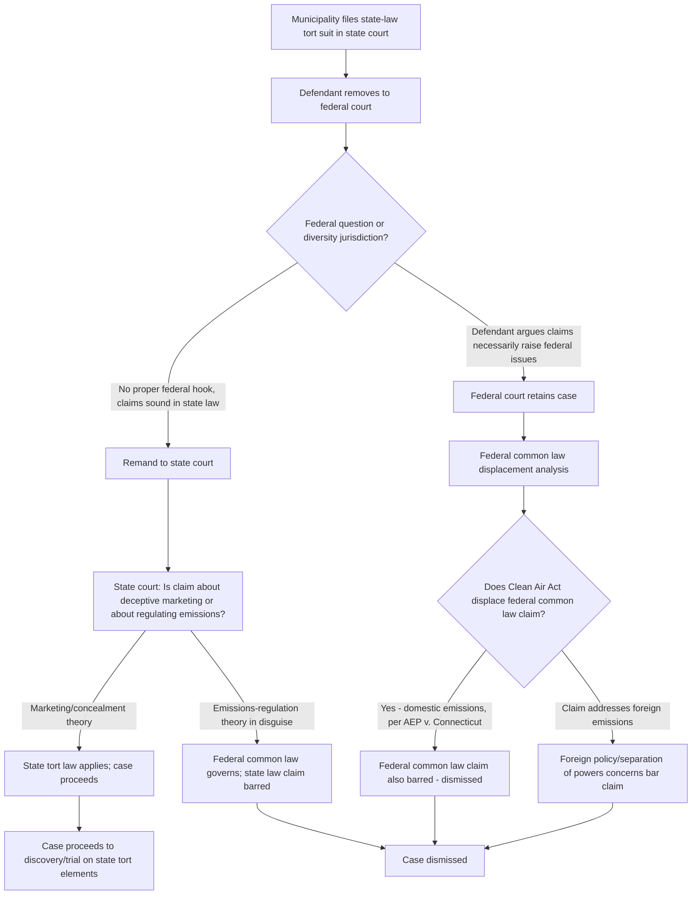

## State Law Tort Claims Against Fossil Fuel Companies in Municipal Climate Suits

### Overview

Since 2017, dozens of state and local governments have sued fossil fuel producers, and since 2017 nearly 60 state and local governments have sued energy companies for damages allegedly resulting from climate change. Unlike the constitutional/public trust claims in *Juliana* and *Held*, these "municipal climate suits" are grounded in **traditional state common-law tort doctrines** — public nuisance, private nuisance, failure to warn, trespass, and (increasingly) consumer-protection/deceptive-marketing statutes — filed against fossil fuel producers and marketers (ExxonMobil, Chevron, Shell, Sunoco, BP, ConocoPhillips, etc.) in state court. The central, recurring legal battle in this category is **not whether the tort elements are met on the merits**, but a **threshold forum/preemption fight**: whether these state-law claims can proceed in state court at all, or whether they are preempted/displaced by federal law (the Clean Air Act) or must instead be recharacterized as federal common-law claims and dismissed.

---

### Core Tort Theories Pled

State law tort claims traditionally involve four elements: duty, breach, causation, and harm or damages. Municipal climate plaintiffs typically plead some combination of:

| Theory | Core Allegation |
| --- | --- |
| **Public nuisance** | Defendants' production/marketing of fossil fuels, combined with concealment of known climate dangers, created an unreasonable interference with public rights (e.g., safe coastlines, stable infrastructure) |
| **Private nuisance** | Interference with plaintiff government's own property interests (e.g., municipal infrastructure, seawalls) |
| **Strict-liability failure to warn** | Defendants sold an inherently dangerous product without adequate warning of known climate risks |
| **Negligent failure to warn** | Defendants breached a duty of reasonable care by not disclosing known risks of climate harm from product use |
| **Trespass** | Physical intrusion (e.g., sea-level rise, flooding) onto plaintiff's property caused by defendants' conduct |
| **Deceptive trade practices / consumer protection** | Defendants engaged in a decades-long disinformation campaign about the climate risks of their products, violating state consumer protection statutes |

Nearly all of respondents' claims rely on the same basic theory of liability: that petitioners breached a duty to disclose and not be deceptive about the dangers of fossil fuel emissions, thereby increasing fossil-fuel consumption. This "deceptive marketing" framing — rather than a claim seeking to directly regulate emissions — has become the **pivotal doctrinal move** plaintiffs use to keep these suits in state court and under state tort law.

---

### The Central Battleground: Federal Common Law Displacement and Preemption

#### Key Precedent: *American Electric Power Co. v. Connecticut* (2011)

- U.S. Supreme Court held that the Clean Air Act and the EPA actions it authorizes displace any federal common-law right to seek abatement of carbon-dioxide emissions from fossil-fuel-fired power plants.
- This precedent is the foundation defendants invoke to argue that **any** climate-based tort claim — state or federal — targeting emissions is preempted, since Congress delegated emissions regulation exclusively to EPA.

#### Key Precedent: *City of New York v. Chevron Corp.*, 993 F.3d 81 (2d Cir. 2021)

- New York City sued five major oil and gas producers under state tort law (public nuisance, private nuisance, trespass) seeking funding for seawall construction and climate adaptation programs.
- The Second Circuit held that municipalities may not utilize state tort law to hold multinational oil companies liable for the damages caused by global greenhouse gas emissions, reasoning that global warming is a uniquely international concern touching on federalism and foreign policy, which calls for the application of federal common law, not state law.
- The court then held that the Clean Air Act grants the EPA — not federal courts — the authority to regulate domestic greenhouse gas emissions, so federal common-law actions concerning such emissions are displaced.
- As to foreign emissions, the court held that while the Clean Air Act has nothing to say about regulating foreign emissions, judicial caution and foreign policy concerns counsel against permitting such claims to proceed under federal common law absent congressional direction.
- **Critically**, the Second Circuit also rejected New York City's contention that the Clean Air Act's displacement of federal common law claims resuscitated its state law common law claims — closing off the argument that if federal common law is displaced, state law fills the gap.
- **Result**: Complete dismissal — a significant defense-side precedent, but binding only within the Second Circuit and only as to *that complaint's framing* (direct emissions-based nuisance, not deceptive marketing).

#### Contrasting Precedent: *City and County of Honolulu v. Sunoco LP* (Haw. 2023)

Honolulu brought suit against defendants in Hawaii state court, alleging five claims under Hawaii state common law: public nuisance, private nuisance, strict-liability failure to warn, negligent failure to warn, and trespass, all resting on the theory that defendants had known for decades that greenhouse-gas emissions from use of their fossil-fuel products would contribute to climate change and failed to warn consumers.

- **Jurisdictional holding**: The Hawaii Supreme Court allowed the Honolulu claims to proceed on the grounds that the claims arose out of and related to the companies' sale and marketing of products in Hawaii, framing the case as concerning torts committed in Hawaii that caused alleged injuries in Hawaii.
- **Preemption holding**: The Hawaii court found that the passage of the Clean Air Act permitted state tort claims to proceed because federal law did not occupy the entire field of emissions regulation, allowing Honolulu to use traditional state police powers to protect itself against deceptive marketing.
- **Key distinguishing move**: Both the district court and the Ninth Circuit (in an earlier, related removal dispute) understood Honolulu's claims to be about whether oil and gas companies misled the public about dangers from fossil fuels — not a direct challenge to emissions levels — which is what allowed the claims to escape the *AEP*/*City of New York* displacement logic.
- **U.S. Supreme Court review**: Defendants petitioned for certiorari, framing the questions presented as (1) whether claims seeking damages for the effects of interstate and international emissions on the global climate are beyond the limits of state law and preempted under the federal Constitution, and (2) whether the Clean Air Act preempts state-law claims predicated on damaging interstate emissions.
- On January 13, 2025, the Supreme Court denied certiorari in both *Sunoco LP v. Honolulu* and *Shell PLC v. Honolulu*, with Justice Alito not participating.
- The U.S. Solicitor General had filed a brief urging denial, arguing the Court lacked jurisdiction to review an interlocutory (non-final) state court decision, and that the Hawaii Supreme Court had correctly rejected reliance on federal common law and correctly determined that the underlying claims could proceed under state law.
- **Significance**: Commentators noted that unlike prior cert denials in climate tort cases, no justice indicated support for certiorari this time, and analysts observed the legal arguments for federal court intervention were exceedingly weak, since the defendants' theory amounted to a "preemption-by-penumbra" argument cutting against existing precedent.

---

### Doctrinal Distinction: Emissions-Regulation Claims vs. Deceptive-Marketing Claims

The outcome-determinative distinction across circuits/state courts turns on how a court characterizes the complaint:

| Framing | Legal Consequence | Example |
| --- | --- | --- |
| **"Defendants should be liable for the physical/global effects of GHG emissions"** | Sounds in *regulating emissions* → governed by federal common law → displaced by Clean Air Act → **dismissed** | *City of New York v. Chevron* (2d Cir. 2021) |
| **"Defendants deceived the public/concealed known risks while marketing fossil fuel products"** | Sounds in *state consumer protection/products liability/failure-to-warn law*, not emissions regulation → **Clean Air Act does not preempt** → may proceed | *Honolulu v. Sunoco* (Haw. 2023); numerous pending suits (e.g., by Massachusetts, Rhode Island, Vermont, Minnesota, various California municipalities) |

**[Inference]** Plaintiffs' litigation strategy since roughly 2017–2018 has consciously shifted toward the deceptive-marketing/failure-to-warn framing specifically because it survives the *AEP*/*City of New York* displacement analysis, while pure nuisance-for-emissions theories (as pled in earlier suits like *City of New York* and *County of San Mateo*) have fared worse on appeal.

---

### Removal and the "Well-Pleaded Complaint" Rule

A recurring procedural sub-battle: defendants routinely attempt to **remove** these state-court suits to federal court, arguing the claims necessarily arise under federal law (given the interstate/international nature of GHG emissions) or invoke other removal bases (federal officer removal, admiralty jurisdiction, outer continental shelf jurisdiction, bankruptcy jurisdiction).

- In the Honolulu litigation, the district court and the Ninth Circuit both rejected removal, characterizing the suit as targeting concealment of the dangers of fossil fuels, rather than the acts of extracting, processing, and delivering those fuels, and finding no basis for federal jurisdiction.
- This result reflects the **well-pleaded complaint rule**: because plaintiffs (as "masters of their complaint") pled only state-law causes of action on the face of their complaints, and no federal question was necessarily embedded in those elements, removal was improper and remand to state court was appropriate.
- The U.S. Supreme Court twice declined to review this removal question (denying cert in an earlier related petition in 2023 before the 2025 merits-adjacent cert denials), leaving the Ninth Circuit's remand-favorable removal precedent intact for cases within that circuit.

---

### Comparative Snapshot of Major Municipal Climate Tort Suits

| Case | Jurisdiction | Framing | Outcome (as of trial-court/appellate posture) |
| --- | --- | --- | --- |
| *City of New York v. Chevron Corp.* | 2d Cir. (federal) | Nuisance/trespass for emissions | Dismissed on displacement/preemption grounds (2021) |
| *City and County of Honolulu v. Sunoco LP* | Hawaii state courts | Deceptive marketing/failure to warn | Allowed to proceed; SCOTUS cert denied (2025) |
| *County of San Mateo v. Chevron Corp.* et al. | California (removal fight, 9th Cir.) | Nuisance/deceptive marketing | Remanded to state court after removal dispute; proceeding in state court |
| Multiple state AG/municipal suits (MA, RI, VT, MN, CT, NJ, DE, CA cities, etc.) | Various state courts | Predominantly deceptive marketing/consumer protection | Largely proceeding post-removal fights; several defendants still litigating threshold issues |

---

### Adjacent and Emerging Development: Climate Superfund / Cost-Recovery Statutes

A related but distinct front has emerged: state legislatures (New York, Vermont) enacting "climate superfund" laws imposing strict liability cost-recovery obligations directly on large emitters, rather than relying on common-law tort suits.

- A federal court recently held that New York's Climate Superfund law was preempted by the Clean Air Act, with the court expressly relying on *City of New York v. Chevron Corp.*'s holding that state tort law cannot be used to recover climate damages from energy producers, finding the statute's strict-liability cost-recovery mechanism nearly identical to the claims rejected in that earlier case regardless of where the underlying emissions occurred.
- New York argued unsuccessfully that the statute was distinguishable because it does not regulate emissions or affect future production; the court rejected this distinction as already foreclosed by the Second Circuit's reasoning.
- **[Inference]** This ruling suggests that legislative cost-recovery mechanisms functioning like strict liability for cumulative global emissions face the same *AEP*/*City of New York* displacement logic as common-law nuisance claims — meaning the "deceptive marketing" workaround developed in tort litigation may not transfer to statutory strict-liability schemes framed around emissions volume rather than concealment.

---

### Practical Example: Complaint Drafting to Survive Preemption

**Example.** A hypothetical coastal municipality wants to sue a fossil fuel producer for seawall and flood-mitigation costs.

- **Likely to be dismissed** (following *City of New York*): A complaint alleging "Defendant's extraction and sale of fossil fuels caused GHG emissions that caused sea-level rise that damaged Plaintiff's infrastructure" — this directly targets the *regulation of emissions* and risks displacement/preemption.
- **More likely to survive** (following *Honolulu*): A complaint alleging "Defendant knew for decades, through internal research, that its products' use would cause dangerous climate impacts, marketed those products without disclosing that risk, and thereby caused Plaintiff to incur reliance-based infrastructure costs" — this targets *concealment and deceptive marketing conduct within the state*, a traditional area of state police power (products liability, consumer protection) less vulnerable to Clean Air Act displacement arguments.

This illustrates the practitioner's key takeaway: **complaint framing around the defendant's knowledge-and-disclosure conduct, rather than the emissions themselves, is the primary tool plaintiffs use to keep municipal climate suits in state court under state tort law.**

---

**Related Topics / Next Steps**

- Clean Air Act preemption doctrine and *American Electric Power Co. v. Connecticut* (2011)
- Federal common law of nuisance (pre- and post-*AEP*)
- Removal jurisdiction, the well-pleaded complaint rule, and federal officer removal in climate suits
- State consumer protection/deceptive trade practices statutes as vehicles for climate liability (state "mini-FTC Act" claims)
- Personal jurisdiction and due process limits on suing multinational producers in state court
- Climate superfund/cost-recovery statutes (New York Climate Change Superfund Act; Vermont Climate Superfund Act) and their preemption exposure
- Proximate causation challenges unique to "cumulative global emissions" tort theories
- Insurance and indemnification implications for fossil fuel defendants facing multi-jurisdictional tort exposure
- Comparative note: contrast with constitutional/public trust claims (*Juliana*, *Held*) — different doctrinal vehicle, same underlying climate-harm narrative