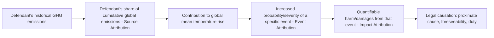

## Causation and Attribution Science in Climate Litigation

### Overview

Causation is the recurring evidentiary bottleneck across nearly every category of climate litigation — constitutional claims (*Juliana*, *Held*), municipal tort suits (*Honolulu v. Sunoco*, *City of New York v. Chevron*), and international proceedings alike. Climate attribution science can be defined broadly as the scientific study and estimation of causal responsibility for the drivers and impacts of climate change, and distinguishing the different types of attribution is essential because courts must translate probabilistic, aggregated scientific findings into legally sufficient proof of duty, breach, causation, and harm. A common factor across jurisdictions is the need to establish causation between the defendant's acts and the harm suffered by claimants, and many past claims have failed due to inadequate scientific evidence and/or poor judicial treatment of that evidence.

---

### Taxonomy of Climate Attribution Science

Climate attribution research is generally divided into four analytically distinct categories, each serving a different evidentiary function in litigation:

| Type | Question Answered | Litigation Use |
| --- | --- | --- |
| **Climate change attribution** | Is observed global/regional warming caused by anthropogenic GHG emissions? | Establishes the general scientific predicate (background causation) — largely settled and judicially accepted |
| **Source attribution** | What share of cumulative global emissions is attributable to a specific entity (state, company, sector)? | Apportions responsibility among multiple defendants; central to "carbon majors" litigation |
| **Event attribution** | Was a specific extreme weather event (heatwave, flood, hurricane) made more likely or more severe by climate change? | Links a discrete harmful event to climate change generally |
| **Impact attribution** | What quantifiable damage (economic loss, death, infrastructure destruction) resulted from a given climate-influenced event? | Establishes the "harm/damages" element and enables damages calculation |

This module's authors describe these last three types — source, impact, and event attribution — as more evidentially useful but also more scientifically and legally contested than baseline climate change attribution, since courts are increasingly asked to accept as an evidentiary matter the epistemic veracity of climate science not just for injury/standing purposes but for direct tort causation.

---

### The "Causal Chain" Framework

Analysts describe the causal arguments made in polluter-pays climate cases in terms of a "causal chain" — an evidentiary framework linking emissions to harm through several discrete, independently provable links.

Each link in this chain requires different scientific methods and faces distinct legal scrutiny:

1. **Emissions inventory link**: requires historical corporate/sovereign emissions data (e.g., the Carbon Majors database).
2. **Climate system link**: requires climate modeling connecting cumulative emissions to global/regional temperature and precipitation changes.
3. **Event link**: requires probabilistic extreme-event attribution (comparing modeled worlds with and without anthropogenic forcing).
4. **Damages link**: requires econometric/actuarial modeling translating physical climate impacts into monetized loss.
5. **Legal link**: requires the chain to satisfy the applicable jurisdiction's causation standard (proximate cause, substantial factor, but-for causation, or a market-share/several liability theory).

---

### Source Attribution: The "Carbon Majors" Approach

- The Carbon Majors database tracks historical production-based emissions of the 180 largest fossil-fuel and cement producers, enabling researchers to calculate each company's fractional contribution to cumulative global industrial emissions.
- Research published in *Nature* in September 2025 demonstrated for the first time that scientists could link the emissions of specific corporations to specific climate-related events, extending prior work that had linked events like heatwaves or floods to climate change generally without identifying individual contributors. That research analyzed carbon majors' emissions from 1854 to 2023, assessed how each contributed to global mean surface temperature, and modeled how those individual contributions affected the probability and severity of 213 historical heatwaves worldwide.
- A separate "end-to-end attribution" methodology developed by climate scientists (including Justin Mankin and collaborators) uses emissions data from major fossil fuel firms combined with peer-reviewed attribution methods and empirical climate economics to quantify firm-specific economic losses; as an illustration, the methodology estimated that Chevron — identified as the highest-emitting investor-owned firm in the dataset — caused between $479 billion and $1.8 trillion in heat-related losses over the period 1991–2020, with losses disproportionately concentrated in tropical regions that contributed the least to global warming.
- **[Inference]** The disproportionate geographic distribution of attributable harm relative to contribution to warming (tropical/low-emitting regions bearing the heaviest damages) is likely to become a recurring evidentiary theme in equity- and environmental-justice-framed climate suits, since it supports arguments that liability rules should not require proof the *defendant's own jurisdiction* suffered the harm.

---

### Event Attribution Methodology

Event attribution (sometimes called "extreme event attribution" or EEA) typically follows a comparative modeling approach:

1. Run climate models representing the **actual world** (with observed historical anthropogenic forcing).
2. Run climate models representing a **counterfactual world** (pre-industrial or naturally-forced-only conditions).
3. Compare the probability and/or intensity of the event type in question (e.g., a heatwave of a given magnitude) between the two model worlds.
4. Express the result as either a **probability ratio** (how many times more likely the event was made by climate change) or a **magnitude shift** (how much more severe/intense the event was made).

This methodology — associated with organizations like World Weather Attribution — has matured substantially since the early 2010s and is now capable of producing rapid, near-real-time attribution statements for individual extreme weather events, a capacity that did not exist when most early climate tort suits were filed.

---

### The Scientific–Legal Translation Gap

Translating scientific attribution findings into legally sufficient evidence is challenging because scientific and legal standards of proof differ, causation tests vary across jurisdictions, and the evidence needed to substantiate claims is diverse and technically complex. A 2021 study examining the scientific and legal bases for establishing causation across 73 climate-related lawsuits found that the evidence relied upon in those cases lagged considerably behind the climate science available at the time, which impeded plaintiffs' ability to establish causation — the study's authors concluded that greater appreciation of attribution science among legal scholars and practitioners could improve the prospects of success in future climate claims.

#### Key Sources of Friction

| Scientific Practice | Legal Requirement | Friction Point |
| --- | --- | --- |
| Probabilistic statements (e.g., "X% more likely") | Binary causation findings (caused / not caused) | Courts must decide what probability threshold satisfies "more likely than not" or "substantial factor" |
| Aggregated, cumulative global emissions data | Individualized proof against a specific named defendant | Multiple-defendant apportionment (market-share liability analogies) |
| Peer-reviewed but evolving methodologies | Rules of evidence (*Daubert*/*Frye* admissibility standards) | Attribution science must meet reliability and general-acceptance thresholds for expert testimony |
| Long causal chains (decades of emissions → single event) | Proximate cause / foreseeability limits | Courts often balk at causal chains this attenuated, as seen in redressability rulings like *Juliana* |

---

### Judicial Treatment: Acceptance vs. Skepticism

#### Acceptance in Standing/Injury Contexts

Courts have generally been willing to accept baseline anthropogenic climate change attribution as an evidentiary matter for purposes such as establishing injury-in-fact for standing, or evaluating whether an environmental impact statement adequately considered a project's greenhouse gas emissions — but such acceptance does not necessarily dictate results on the ultimate merits of the underlying legal action.

#### International Development: ICJ Advisory Opinion (2025)

On July 23, 2025, the International Court of Justice issued an advisory opinion recognizing that although causation in climate litigation is complex, it is not legally or scientifically impossible to establish, marking a significant international-law signal that attribution science can satisfy causation requirements even in a cumulative-global-emissions context.

#### Skepticism in Proximate Cause / Redressability Contexts

By contrast, courts adjudicating domestic tort and constitutional claims have frequently found the causal chain **too attenuated** for legal purposes even where the underlying science is not disputed:

- In *City of New York v. Chevron Corp.*, the causal theory (that five defendants' historical production caused global emissions that caused sea-level rise) was not rejected on scientific grounds but was displaced as a matter of law (federal common law/Clean Air Act preemption) — the court never had to reach a merits causation ruling.
- In *Juliana v. United States*, the Ninth Circuit's core rejection was **redressability**, not disputed science — the panel accepted the plaintiffs' scientific evidence of harm but held that the causal chain from a judicial declaration to actual climate remediation was not one the judiciary could complete or guarantee.
- **[Inference]** This pattern suggests that in the U.S., attribution science has generally cleared the *factual* causation hurdle in judicial opinions but continues to founder on *legal* causation doctrines (proximate cause, redressability, political question) that operate independently of scientific certainty — meaning further advances in attribution precision (e.g., the 2025 *Nature* study's corporate-event linkage) may not, by themselves, resolve the dominant legal obstacles.

---

### Illustrative Diagram: Why Improved Science Doesn't Always Resolve the Legal Barrier

<svg xmlns="http://www.w3.org/2000/svg" viewBox="0 0 760 300">
<text x="380" y="26" text-anchor="middle" font-size="15" font-weight="bold" fill="#1a1a2e">Two Independent Barriers in Climate Causation (svg_diagram)</text>
<rect x="40" y="60" width="320" height="180" rx="10" fill="#e8f5e9" stroke="#2e7d32" stroke-width="2" />
<text x="200" y="85" text-anchor="middle" font-size="13" font-weight="bold" fill="#2e7d32">Factual/Scientific Causation</text>
<text x="60" y="110" font-size="11" fill="#333">• Source attribution (emissions share)</text>
<text x="60" y="130" font-size="11" fill="#333">• Event attribution (probability ratio)</text>
<text x="60" y="150" font-size="11" fill="#333">• Impact attribution (damages estimate)</text>
<text x="60" y="180" font-size="11" fill="#333" font-style="italic">Advancing rapidly:</text>
<text x="60" y="198" font-size="11" fill="#333">2025 Nature corporate-event study;</text>
<text x="60" y="216" font-size="11" fill="#333">end-to-end attribution frameworks</text>
<rect x="400" y="60" width="320" height="180" rx="10" fill="#ffebee" stroke="#c62828" stroke-width="2" />
<text x="560" y="85" text-anchor="middle" font-size="13" font-weight="bold" fill="#c62828">Legal Causation Doctrine</text>
<text x="420" y="110" font-size="11" fill="#333">• Proximate cause / foreseeability</text>
<text x="420" y="130" font-size="11" fill="#333">• Redressability (Art. III standing)</text>
<text x="420" y="150" font-size="11" fill="#333">• Federal common law displacement</text>
<text x="420" y="180" font-size="11" fill="#333" font-style="italic">Largely doctrine-driven, not</text>
<text x="420" y="198" font-size="11" fill="#333">evidence-driven — e.g. Juliana's</text>
<text x="420" y="216" font-size="11" fill="#333">redressability holding</text>
<line x1="360" y1="150" x2="400" y2="150" stroke="#666" stroke-width="2" stroke-dasharray="5,5" />
<text x="380" y="140" text-anchor="middle" font-size="18" fill="#666">?</text>
</svg>

---

### Practical Example: Applying Attribution Science to a Defendant's Liability Share

**Example.** A plaintiff jurisdiction seeks damages from three named fossil fuel producers for flood-control infrastructure costs attributable to sea-level rise.

1. **Source attribution step**: Using Carbon Majors-style data, plaintiff's expert calculates that Defendant A is responsible for 3.4% of cumulative global industrial CO₂ emissions since 1965, Defendant B for 2.1%, and Defendant C for 1.8%.
2. **Event/impact attribution step**: Plaintiff's expert uses end-to-end attribution modeling to estimate that anthropogenic warming increased regional sea-level rise by a quantifiable amount over the relevant period, and that this increase caused a specific dollar amount of infrastructure damage.
3. **Apportionment step**: Plaintiff argues for a market-share or several-liability approach, assigning each defendant a percentage of total damages proportional to its emissions share (e.g., Defendant A liable for 3.4% of total proven damages).
4. **Legal causation step**: The court must still separately determine whether this scientifically derived apportionment satisfies the jurisdiction's proximate cause standard — a step attribution science alone cannot resolve, since it depends on doctrinal choices (e.g., whether the jurisdiction recognizes market-share liability for this type of harm) rather than additional data.

This example illustrates why practitioners describe attribution science as necessary but not sufficient: it can supply the factual predicate for causation, but litigants must still separately clear jurisdiction-specific legal causation thresholds that operate on doctrinal rather than evidentiary logic.

---

### Behavioral/Reliability Caveat

**[Unverified — methodology-dependent]** The reliability and admissibility of specific attribution studies (probability ratios, damages estimates, fractional emissions attributions) can vary significantly based on modeling assumptions, choice of counterfactual baseline, and the specific event or region studied; courts applying *Daubert*/*Frye*-type admissibility standards may reach different conclusions about the same underlying methodology depending on how it is presented and challenged by opposing experts. Practitioners should expect case-specific and expert-specific variation in how courts treat even well-established attribution methods.

---

**Related Topics / Next Steps**

- *Daubert* and *Frye* admissibility standards applied to climate science expert testimony
- Market-share liability and several-liability apportionment theories in multi-defendant torts
- The Carbon Majors database and its use across jurisdictions (Peru's *Lliuya v. RWE*, Philippines Commission on Human Rights inquiry)
- International Court of Justice's July 2025 advisory opinion on state climate obligations
- World Weather Attribution methodology and rapid-response event attribution
- Redressability and proximate cause doctrine as independent barriers distinct from scientific causation (cross-reference: *Juliana v. United States*)
- Insurance/reinsurance actuarial use of attribution science as a parallel non-litigation application
- Comparative causation standards: U.S. proximate cause vs. civil-law "adequate causation" doctrines in European climate suits