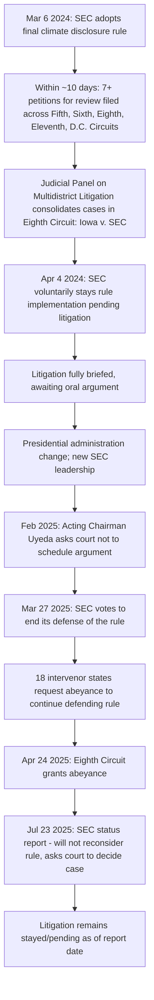

## Securities and Disclosure-Based Climate Claims

### Overview

Securities and disclosure-based climate claims form a distinct category of climate litigation that targets **what companies say (or fail to say) about climate risk to investors and regulators**, rather than targeting emissions or environmental harm directly. This category spans three overlapping fronts: (1) **regulatory rulemaking litigation** over mandatory climate-related disclosure rules (principally the SEC's 2024 climate disclosure rule and analogous state regimes), (2) **securities fraud claims** against companies alleging they misled investors about known climate risks (e.g., *People v. Exxon Mobil*), and (3) **shareholder derivative and governance litigation** concerning corporate climate risk management and shareholder proposal rights. Administrative and environmental law intersect directly here because the SEC's rulemaking authority, APA procedural requirements, and major-questions-doctrine challenges are central battlegrounds.

---

### Front One: The SEC Climate-Related Disclosure Rule

#### Regulatory Background

On March 6, 2024, the SEC adopted final rules requiring expansive new climate-related disclosures in Form 10-K and Form 20-F annual reports and most registration statements. The rules required registrants to disclose certain climate-related information, including greenhouse gas emissions and climate risks, in registration statements and annual reports, and were adopted in a materially "watered down" form relative to the SEC's original 2022 proposal after facing lobbying and criticism from business and trade groups and Republican-led states arguing the SEC had overstepped its statutory mandate.

#### Litigation Timeline

#### Key Procedural Facts

- Petitioners included the U.S. Chamber of Commerce, Republican state attorneys general, two energy companies (Liberty Energy Inc. and Nomad Proppant Services LLC), and oil industry groups, with these three groups' suits ultimately consolidated in the Fifth Circuit before the broader multi-circuit consolidation; separately, the Sierra Club and other environmental groups sued in the D.C. Circuit arguing the rule did not go far enough.
- The consolidated litigation (*Iowa v. SEC* and related cases) landed in the **Eighth Circuit** under the federal multi-circuit petition lottery process.
- The SEC voluntarily stayed the rule on April 4, 2024, in part to avoid regulatory uncertainty for companies that might have been subject to the rule while litigation proceeded, with the agency stating a stay would allow the court of appeals to focus on deciding the merits.
- Following the change in administration, Acting Chairman Mark Uyeda — who had voted against the rule and called it "deeply flawed" — directed SEC staff to ask the Eighth Circuit not to schedule oral argument, and the Commission subsequently voted on March 27, 2025 to end its defense of the rule and yield any oral argument time back to the court.
- Eighteen states that had previously intervened to defend the rules requested the court hold the litigation in abeyance, which the Eighth Circuit granted in an order dated April 24, 2025.
- In a July 23, 2025 status report responding to a court order, the SEC reiterated it does not intend to review or reconsider the rule "at this time" but asked the court to proceed with the litigation and decide the case, and separately requested the court lift the stay and exercise jurisdiction to rule on the scope of the Commission's power to adopt the disclosure obligations, while noting that any reconsideration of the rule if upheld would require a fresh Commission vote.

#### Core Legal Theories Challenging the Rule

- **Major questions doctrine**: petitioners argue climate/GHG disclosure mandates are an issue of vast economic and political significance requiring clear congressional authorization, which the Securities Exchange Act and Securities Act do not provide.
- **Exceeding statutory authority**: argument that the SEC's mandate is limited to financially material disclosures and that GHG emissions data is not inherently "material" in the traditional securities-law sense.
- **First Amendment / compelled speech**: some petitioners argue mandatory emissions disclosure compels speech not clearly tied to investor protection.
- **APA arbitrary-and-capricious review**: challenges to the adequacy of the SEC's cost-benefit analysis and reasoned decision-making in adopting the final rule.
- **Insufficiently protective (environmental petitioners)**: Sierra Club and allied groups argued the final rule — having dropped Scope 3 emissions disclosure requirements present in the original proposal — failed to satisfy the SEC's investor-protection mandate.

**[Inference]** Because the SEC itself has now abandoned defending the rule while intervenor states continue litigating, the ultimate disposition likely turns on procedural questions (can non-agency intervenors adequately defend a rule the agency itself will not defend) as much as the substantive major-questions and APA arguments — an unusual posture for administrative law practitioners to track.

---

### Front Two: State-Level Mandatory Climate Disclosure Laws

- California enacted landmark climate disclosure statutes (SB 253, the Climate Corporate Data Accountability Act, requiring Scope 1, 2, and 3 GHG emissions reporting; and SB 261, requiring climate-related financial risk disclosures) covering large companies doing business in the state regardless of incorporation location.
- On January 30, 2024, the U.S. Chamber of Commerce and five co-plaintiffs representing a coalition of business groups filed a lawsuit against the State of California seeking to block the state's new landmark climate disclosure laws, arguing (among other theories) First Amendment compelled-speech violations and dormant Commerce Clause extraterritoriality concerns given the laws' reach over out-of-state corporate conduct.
- **[Inference]** Because California's laws operate independently of SEC rulemaking and rest on state corporate/commercial regulatory authority rather than federal securities law, their fate is not directly tied to the Eighth Circuit's disposition of the SEC rule, meaning companies may face disclosure obligations under state law even if the federal rule is vacated or withdrawn.

---

### Front Three: Securities Fraud and "Greenwashing" Claims

#### Distinguishing Disclosure-Rule Litigation from Fraud Claims

Unlike the SEC rulemaking litigation (which concerns the *validity of a prospective disclosure mandate*), securities fraud claims allege that a company's **existing, voluntary statements** to investors were false or misleading — a backward-looking theory requiring proof of a material misstatement, scienter, reliance, and damages under Section 10(b)/Rule 10b-5 or analogous state securities/consumer-fraud statutes.

#### Landmark Example: *People of the State of New York v. Exxon Mobil Corp.*

- The New York Attorney General's suit was framed as a fairly straightforward shareholder fraud claim, alleging Exxon engaged in a long-standing fraudulent scheme to deceive investors, analysts, and underwriters concerning the company's management of climate-change regulatory risk.
- The core factual allegation: Exxon represented to investors that it applied a "proxy cost" of carbon reflecting anticipated future climate regulation when evaluating its oil and gas reserves, investments, and demand estimates — but internally, the company applied much lower proxy costs than represented, or no proxy costs at all, thereby understating its true exposure to climate regulatory risk.
- Prosecutors alleged the discrepancy was sanctioned at the highest levels of the company, including by former CEO Rex Tillerson, who allegedly knew for years that the company's proxy-cost representations were misleading.
- Described by commentators as the first case on alleged securities fraud about climate change ever to go to trial, the case proceeded to a bench trial in New York state court in late 2019; Exxon ultimately prevailed, with the court finding the state had not proven the specific fraud allegations to the required standard — though the underlying legal theory (misrepresentation of internally-used climate risk metrics) remains a template for subsequent state AG and shareholder actions.

#### Shareholder Derivative Litigation

- Distinct from direct securities fraud claims, shareholder derivative suits are brought by shareholders on behalf of the corporation against its own officers/directors, typically alleging breach of fiduciary duty, waste, or unjust enrichment tied to climate risk mismanagement.
- *In re Exxon Mobil Corp. Derivative Litigation* (N.D. Tex., filed 2019) alleged misconduct related to Exxon's use of and statements regarding proxy costs of carbon in its asset impairment analyses and proved reserves estimates, plus assertions that company assets would become "stranded" due to future climate policy — Exxon moved to dismiss on grounds that its independent directors had determined in good faith, after reasonable inquiry, that the derivative suit was not in the company's best interest (a business-judgment-rule defense).
- Additional shareholder derivative suits have been filed in other jurisdictions (e.g., New Jersey federal court) alleging directors and officers misled the public and investors concerning climate change impacts on the company's business.

---

### Front Four: Corporate Offensive Litigation Against Shareholder Climate Proposals

An unusual and increasingly notable development: companies affirmatively suing their own shareholders to block climate-related shareholder proposals, rather than shareholders suing companies.

- On January 21, 2024, ExxonMobil filed a complaint in the U.S. District Court for the Northern District of Texas seeking a declaratory judgment to exclude a shareholder proposal from its proxy statement under SEC Rule 14a-8, rather than presenting the proposal (sponsored by Arjuna Capital and Follow This, seeking accelerated GHG emission reductions toward net-zero by 2050) for a shareholder vote.
- Investor and governance groups characterized the suit as a threat to shareholder rights, arguing Exxon was using the threat of protracted, expensive litigation to intimidate investors and deter them from filing climate-related shareholder resolutions, and that the suit circumvented the SEC's established Rule 14a-8 no-action-letter process.
- On May 22, 2024, Judge Mark Pittman of the Northern District of Texas denied Arjuna Capital's motion to dismiss Exxon's suit (while finding no jurisdiction over co-defendant Follow This), reasoning that to dismiss the claim as moot it must be "absolutely clear" the shareholder groups would not resubmit similar proposals despite having withdrawn the specific 2024 resolution and pledged not to resubmit it.
- **[Inference]** This litigation strategy — a public company suing its own shareholder proponents rather than using the SEC's administrative no-action process — represents a structural shift in the disclosure/governance battleground, since it moves disputes about proxy-proposal eligibility from SEC Division of Corporation Finance review into federal court, a forum with different procedural dynamics and potentially chilling effects on future shareholder proposals regardless of ultimate merits outcome.

---

### Comparative Framework: The Four Fronts

| Front | Legal Vehicle | Target | Core Question |
| --- | --- | --- | --- |
| SEC rulemaking challenge | APA petition for review; major questions doctrine | Validity of mandatory disclosure regulation | Did the SEC exceed its statutory authority in mandating climate/GHG disclosures? |
| State disclosure statutes | Constitutional challenge (First Amendment, dormant Commerce Clause) | State-level mandatory disclosure laws (e.g., California SB 253/261) | Can states mandate extraterritorial climate disclosure from companies doing business there? |
| Securities/consumer fraud | Section 10(b)/Rule 10b-5; state fraud statutes | Company's past representations to investors | Did the company knowingly misrepresent material climate risk information? |
| Shareholder derivative & proxy litigation | Fiduciary duty claims; Rule 14a-8 declaratory actions | Corporate officers/directors; shareholder proponents | Did directors breach duties in climate risk oversight, or can a company block a shareholder climate proposal? |

---

### Practical Example: Assessing Disclosure Litigation Risk

**Example.** A public company's general counsel is evaluating litigation exposure from its current climate-related public statements.

1. **Rulemaking exposure**: Because the SEC's 2024 rule remains stayed and the agency has ended its defense, the company faces **no current binding federal disclosure mandate** — but should monitor the Eighth Circuit's eventual ruling on the merits, since intervenor states are still pressing the litigation.
2. **State law exposure**: If the company does business in California, it may face **independent disclosure obligations** under SB 253/261 regardless of the federal rule's fate, subject to the outcome of the Chamber of Commerce's constitutional challenge.
3. **Fraud exposure**: The company should audit whether its **internal risk models** (e.g., any internal carbon-cost or stranded-asset assumptions) are consistent with its **external public statements** — the Exxon "two sets of books" theory (representing one proxy cost publicly while using a materially different figure internally) is the paradigmatic fact pattern regulators and plaintiffs' firms will look for.
4. **Governance exposure**: The board should ensure any decision to resist shareholder climate proposals is grounded in the established Rule 14a-8 no-action process where possible, given the reputational and shareholder-relations costs illustrated by the Exxon v. Arjuna Capital litigation.

---

**Related Topics / Next Steps**

- Major questions doctrine and its application to agency climate rulemaking (cross-reference: *West Virginia v. EPA*)
- APA arbitrary-and-capricious review standards for complex rulemakings
- SEC Rule 14a-8 shareholder proposal process and no-action letter practice
- California SB 253/SB 261 compliance timelines and enforcement mechanisms
- Section 10(b)/Rule 10b-5 materiality and scienter standards applied to ESG statements
- "Greenwashing" claims under state consumer protection statutes (parallel to municipal tort theories)
- Business judgment rule defenses in climate-related derivative litigation
- International comparative disclosure regimes (EU Corporate Sustainability Reporting Directive) and their interaction with U.S. multinational compliance