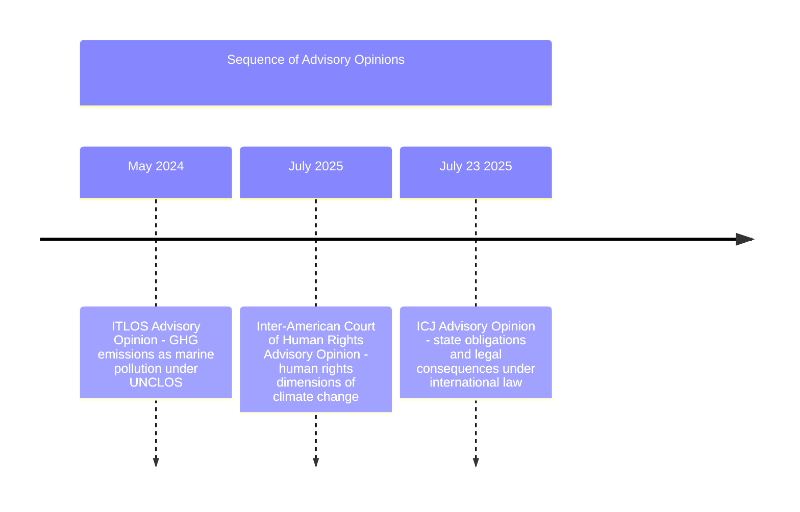
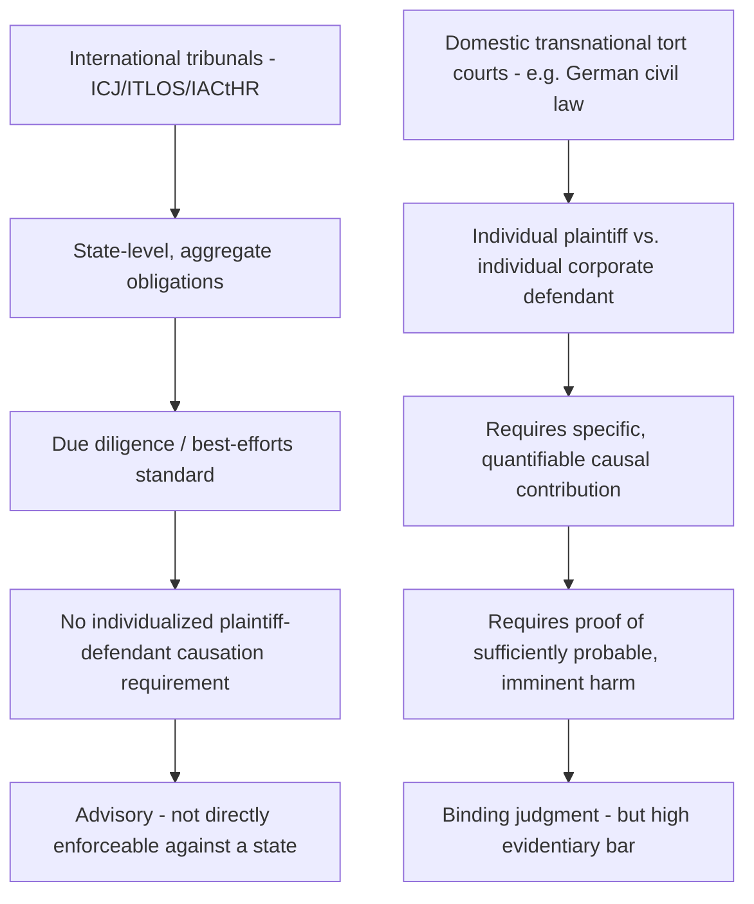

## International and Cross-Border Climate Tribunal Cases

### Overview

International and cross-border climate litigation encompasses proceedings before international courts, regional human rights tribunals, and domestic courts adjudicating transnational tort claims — a distinct layer from U.S. constitutional claims (*Juliana*, *Held*) and U.S. municipal tort suits (*Honolulu v. Sunoco*). This category has advanced rapidly since 2024, producing three major advisory opinions from international courts within roughly fourteen months and a landmark (though ultimately unsuccessful) transnational corporate tort case in Germany. These developments matter for administrative and environmental law practitioners because they establish persuasive authority on state due-diligence obligations, corporate regulatory duties, and causation standards that increasingly inform domestic litigation strategy and legislative drafting.

---

### The Three International Advisory Opinions

*(Note: rendered here as a structured list per formatting rules, since sequence/timeline diagrams are represented in prose format below for clarity.)*

| Tribunal | Date | Core Subject |
| --- | --- | --- |
| International Tribunal for the Law of the Sea (ITLOS) | May 2024 | GHG emissions as a form of marine pollution under UNCLOS |
| Inter-American Court of Human Rights (IACtHR) | July 2025 | Human rights obligations of states in the climate context |
| International Court of Justice (ICJ) | July 23, 2025 | State legal obligations and consequences under international law generally |

The ICJ opinion is described as the third advisory opinion issued by an international court in relation to climate change, following the ITLOS opinion in May 2024 and the Inter-American Court of Human Rights opinion in July 2025 — together forming a mutually reinforcing body of international jurisprudence, since the ICJ opinion is noted to complement the recent Inter-American Court opinion.

---

### The ICJ Advisory Opinion: *Obligations of States in Respect of Climate Change* (2025)

#### Procedural Background

- Proceedings arose from a request submitted by the UN General Assembly in March 2023 (General Assembly Resolution 77/276), initiated following a youth-led campaign originating with Pacific Islander law students.
- The case attracted global attention, with 96 States and 11 international organisations delivering oral submissions during the hearings, and the Court received written and oral statements from more than 90 States overall, alongside numerous international organizations and civil society representatives — described as record-breaking participation in an ICJ proceeding.
- Judge Yuji Iwasawa, President of the Court, delivered a summary of the Advisory Opinion in a public sitting attended by the President of the 79th UN General Assembly session and various state representatives, with civil society organizations livestreaming the reading outside the Peace Palace in The Hague and in cities worldwide.

#### Questions Presented

The UN General Assembly posed two questions to the Court:

(a) What are the obligations of States under international law to ensure the protection of the climate system and other parts of the environment from anthropogenic emissions of greenhouse gases, for present and future generations?

(b) What are the legal consequences under these obligations for States where they, by their acts and omissions, have caused significant harm to the climate system, with respect to: (i) specially affected or particularly vulnerable states (including small island developing states); and (ii) peoples and individuals of present and future generations affected by climate change's adverse effects?

#### Key Holdings

1. **Binding legal obligations exist**: the Court found that states have legally binding obligations under international law to combat climate change, and that inaction is not legally defensible.
2. **Due diligence and state responsibility**: states that fail to prevent significant harm to the environment — by not exercising due diligence or failing to use all means at their disposal — may be held internationally responsible for climate inaction, including failure to effectively regulate greenhouse gas emissions.
3. **Obligations independent of treaty membership**: the Court clarified that states incur climate obligations beyond the climate treaties themselves, stemming notably from human rights law and customary international law, regardless of whether a state is a party to the climate treaties — a finding explicitly significant in light of possible treaty withdrawals, as exemplified by the United States' withdrawal from the Paris Agreement.
4. **Human rights dimension**: finding that protection of the human right to a clean, healthy and sustainable environment is a precondition for the enjoyment of human rights, the Court held that states have obligations under international human rights law to combat climate change, which may include obligations to adopt standards and legislation and to regulate private companies.
5. **Fossil fuel-specific state conduct implicated**: the Advisory Opinion underscores that a state's failure to take appropriate action to protect the climate system from GHG emissions — including emissions from fossil fuel production, fossil fuel consumption, the granting of fossil fuel exploration licenses, or the provision of fossil fuel subsidies — may constitute an internationally wrongful act attributable to that state.
6. **NDC diligence obligation**: parties to the Paris Agreement have an obligation to undertake best efforts to achieve their Nationally Determined Contributions (NDCs).

#### Legal Status and Persuasive Effect

Although advisory opinions are not binding on states, they exert highly persuasive authority, and this opinion is expected to impact treaty-making and investment arbitration where climate-related regulatory measures are at stake — meaning its influence will likely be felt in both future international negotiations and domestic/international dispute resolution rather than through direct enforceability.

---

### The Attribution-Causation Problem in International Tribunals vs. Domestic Tort Courts

This structural contrast is central to understanding why international advisory opinions can find sweeping state obligations while individual domestic tort suits against specific corporate defendants continue to fail on narrower causation and probability grounds — illustrated directly by *Lliuya v. RWE AG*, below.

---

### Case Profile: *Lliuya v. RWE AG* (Germany)

#### Background and Procedural History

- Peruvian farmer and mountain guide Saúl Luciano Lliuya filed suit in November 2015 in the District Court of Essen, Germany, against RWE AG — one of Germany's largest electricity producers and coal-burning power companies — which had caused approximately 0.47% of all historic greenhouse gas emissions.
- Supported by the NGO Germanwatch, Lliuya sought a declaratory judgment and partial compensation (roughly €17,000/$18,500) for flood protection measures needed to mitigate risk from the rapidly expanding Palcacocha glacial lake above his hometown of Huaraz, which Germanwatch warned had swollen to more than 30 times its historic volume.
- Lliuya requested that RWE be held liable for 0.47% of anticipated mitigation costs — corresponding to the company's estimated share of global industrial emissions since 1751 as calculated in the Carbon Majors Study, directly applying source-attribution methodology (see companion topic: Causation and Attribution Science) to a live tort claim.
- Although RWE has never operated in Peru, Lliuya argued the company's historical emissions contributed to the melting glaciers threatening his city — a **transboundary corporate tort theory** distinct from the state-focused international advisory opinions.
- The case proceeded through nearly a decade of litigation; a decisive evidentiary hearing occurred March 17 and 19, 2025 at the Higher Regional Court of Hamm, focused on the extent to which the plaintiff's property was threatened by a possible flood wave from rockfalls or avalanches into the glacial lake.

#### Ruling (May 28, 2025)

- The Higher Regional Court of Hamm rejected Lliuya's lawsuit, ruling that the probability of the lake bursting its banks and devastating his home and the homes of some 50,000 other people in the area was too small for RWE to be held liable, and barred him from appealing the verdict.
- Court-appointed experts estimated approximately a 1% probability of catastrophic flooding occurring in the next 30 years, which the court found fell below the threshold required under German civil law to establish a sufficiently direct and imminent threat.
- RWE had argued that climate change is a global issue caused by many contributors and that the company, having never operated in Peru, should not bear individualized liability; the company separately maintained that attributing specific climate impacts to individual companies is legally complex and better addressed through comprehensive policy measures rather than litigation.

#### Doctrinal Significance Despite Dismissal

- Despite the dismissal, the court acknowledged the theoretical possibility of holding major greenhouse gas emitters accountable for climate-related damages under German civil law — legal experts and environmental advocates view this acknowledgment as a significant development potentially paving the way for future cases supported by more substantial evidence of harm and causality.
- The case was described as the first case to potentially hold fossil fuel corporations directly responsible in tort for damage knowingly caused through releasing greenhouse gases while profiting from that activity — meaning the **legal theory survived even though this particular plaintiff's factual showing did not**.
- **[Inference]** The court's core holding turned on the **probability/imminence of harm** rather than on rejecting proportional corporate liability as a matter of law; this suggests future plaintiffs with claims involving higher-probability, more imminent physical risks (rather than a low-probability catastrophic event decades out) may find a more receptive doctrinal pathway under the same German civil law framework the court left open.

---

### Comparative Analysis: International Tribunal Opinions vs. Transnational Tort Litigation

| Dimension | ICJ/ITLOS/IACtHR Advisory Opinions | *Lliuya v. RWE* (domestic transnational tort) |
| --- | --- | --- |
| Forum | International courts/tribunals | National civil court (Germany) |
| Defendant | States (collectively/individually) | A single named corporation |
| Legal question | Existence and scope of state obligations | Individualized tort liability and proportional damages |
| Standard applied | Due diligence / best efforts | Probability and imminence of specific harm under civil law |
| Bindingness | Advisory/persuasive only | Binding judgment (subject to appeal, here foreclosed) |
| Attribution science role | Supports general causal narrative (state inaction → harm) | Central and outcome-determinative (Carbon Majors 0.47% figure; flood probability modeling) |
| Outcome | Broad affirmation of obligations | Claim dismissed on facts; legal theory left open |

**[Inference]** These two tracks are complementary rather than competing: the ICJ opinion's due-diligence and state-responsibility framework may increasingly be cited by future transnational tort plaintiffs (like a hypothetical *Lliuya II*) as persuasive authority establishing that states — and by extension the corporations they regulate or fail to regulate — bear cognizable climate-related legal duties, even though the ICJ opinion itself does not resolve individualized corporate tort liability.

---

### Practical Example: Structuring a Cross-Border Climate Tort Claim Post-*Lliuya*

**Example.** A coastal community in a developing country wants to bring a claim against a multinational fossil fuel company headquartered in a different country, following the *Lliuya* model.

1. **Jurisdiction**: File in the defendant's home jurisdiction's civil courts (as Lliuya did in Germany), since the company is unlikely to have a presence in the plaintiff's home country — this raises separate personal jurisdiction/forum non conveniens analogues depending on the jurisdiction's civil procedure rules.
2. **Source attribution**: Use Carbon Majors-style data to establish the defendant's proportional share of cumulative global emissions (the *Lliuya* approach), supporting a proportional-liability damages theory rather than seeking full compensation from a single defendant.
3. **Probability/imminence showing**: Unlike *Lliuya*, prioritize claims involving **higher-probability, more clearly imminent physical risk** — the Hamm court's fatal finding was a low (~1% over 30 years) probability of the specific harm materializing, not a rejection of the underlying causal theory.
4. **Supplement with international authority**: Cite the 2025 ICJ Advisory Opinion's due-diligence framework and its express recognition that failure to regulate fossil fuel production, consumption, licensing, or subsidies may constitute an internationally wrongful act, to bolster arguments about the foreseeability and wrongfulness of the defendant's conduct, even though the opinion itself targets state (not corporate) responsibility.

This illustrates the core practitioner takeaway from this litigation wave: **international advisory opinions supply persuasive doctrinal scaffolding on obligations and wrongfulness, while domestic transnational tort litigation remains the primary — and evidentiarily demanding — vehicle for actually obtaining binding relief against individual corporate defendants.**

---

**Related Topics / Next Steps**

- ITLOS May 2024 Advisory Opinion on GHG emissions as marine pollution under UNCLOS
- Inter-American Court of Human Rights July 2025 Advisory Opinion on climate and human rights
- Carbon Majors database and source attribution methodology (cross-reference: Causation and Attribution Science in Climate Litigation)
- Investment arbitration exposure for states adopting climate regulatory measures post-ICJ opinion
- Customary international law and due diligence standards outside treaty frameworks
- Comparative civil law probability/imminence thresholds for tort liability across jurisdictions
- U.S. Paris Agreement withdrawal and its interaction with customary international law obligations
- Future transnational tort suits modeled on *Lliuya* (monitoring Germanwatch and allied NGO litigation pipelines)