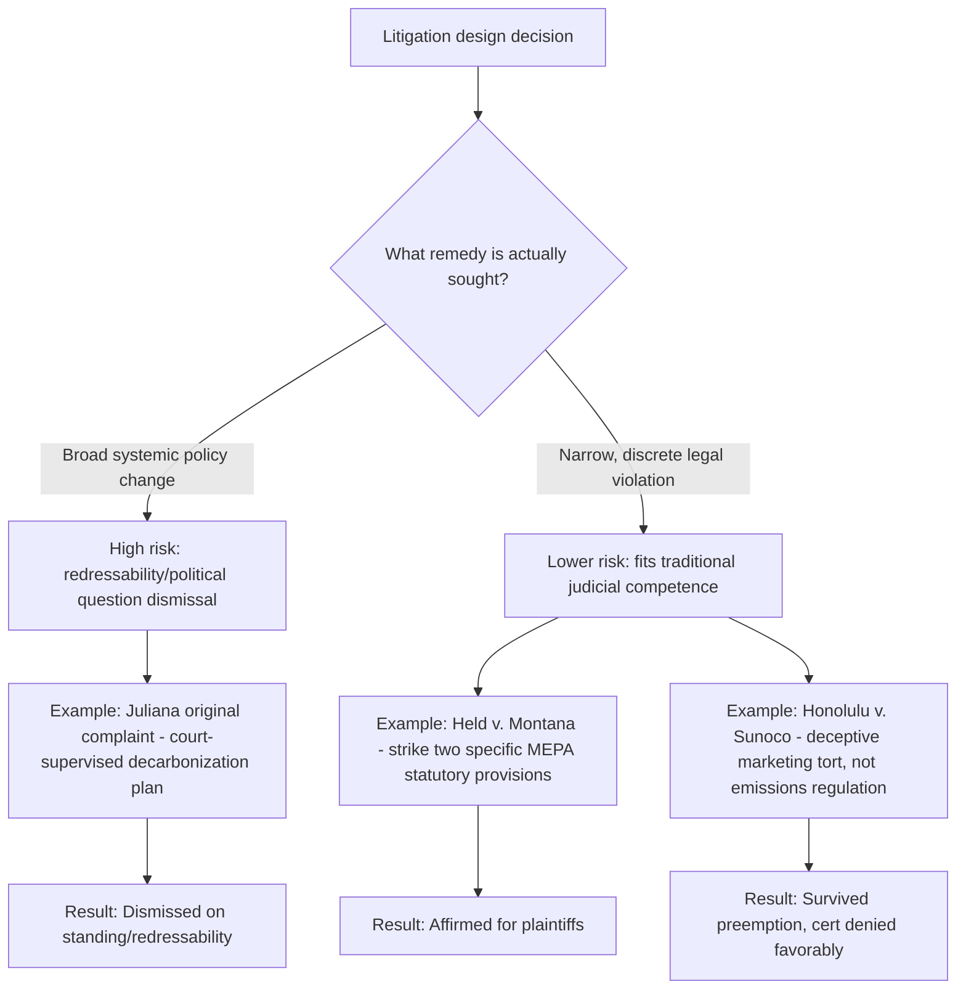
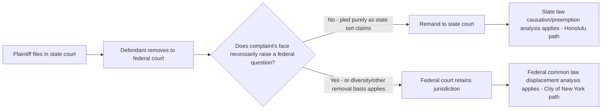

## Strategic Litigation Design, Forum Selection, and Post-Judgment Implementation Challenges

### Overview

This topic synthesizes the practitioner-level, cross-cutting lessons from the preceding case studies (*Juliana*, *Held*, municipal tort suits, securities claims, and international tribunal cases) into a unified framework for designing climate litigation strategy. Three interlocking decisions determine a climate case's trajectory: **(1) claim architecture** — which legal theory and remedy scope to plead; **(2) forum selection** — which court system, jurisdiction, and procedural posture maximizes the chance of reaching the merits; and **(3) post-judgment implementation** — how a favorable ruling translates (or fails to translate) into actual compliance, especially against a government defendant or across jurisdictional boundaries. Even a legally sound win, as seen in *Held v. Montana*, generates new administrative-law problems once enforcement begins.

---

### Claim Architecture: Matching Theory to Institutional Competence

#### The Core Design Trade-Off

The comparative record across this chapter's case studies converges on a single design principle: **the narrower and more discrete the requested relief, the more likely a court is to reach and grant it.** Litigants who ask courts to design or supervise comprehensive policy (*Juliana*'s original complaint, *City of New York v. Chevron*'s cross-border emissions nuisance theory) have consistently lost on threshold grounds regardless of the strength of the underlying science. Litigants who ask courts to strike a specific statute (*Held*), void a specific rule (SEC disclosure litigation), or assign liability for specific deceptive conduct (*Honolulu*) have fared better.

#### Theory Selection Matrix

| If the goal is... | Consider... | Because... | Key risk |
| --- | --- | --- | --- |
| Compelling comprehensive government climate policy | Federal constitutional claim | Broadest symbolic and doctrinal reach | Near-certain redressability/political question dismissal (*Juliana*) |
| Invalidating a specific statute limiting environmental review | State constitutional claim under an express environmental rights clause | Textual hook avoids "unenumerated right" problem | Only available in states with Green Amendments |
| Recovering damages from a specific emitter | State tort law (deceptive marketing/failure to warn framing) | Survives Clean Air Act preemption if framed around concealment, not emissions regulation | Framing must avoid characterization as emissions-regulation |
| Challenging investor disclosure inadequacy | Securities fraud or SEC rulemaking APA challenge | Established administrative and securities law doctrine | Major questions doctrine; political turnover in agency enforcement posture |
| Establishing state obligations broadly | International advisory opinion proceeding | No standing/redressability barrier; states can request opinions directly | Purely persuasive, not binding or self-enforcing |
| Recovering individualized damages across borders | Domestic transnational tort suit (*Lliuya* model) | Binding judgment if successful | High evidentiary bar on probability/imminence of harm |

---

### Forum Selection Analysis

#### Federal vs. State Forum (U.S. Domestic Claims)

The *Juliana*/*Held* contrast is fundamentally a forum-selection lesson as much as a doctrinal one:

- **Federal forum** requires satisfying Article III standing (injury, causation, **redressability**) and avoiding the political question doctrine — both of which are especially difficult when the requested relief implicates national energy policy spanning multiple political branches and agencies.
- **State forum** with an express constitutional environmental rights clause avoids the federal "unenumerated right" due process problem entirely, and state standing doctrines (e.g., Montana's "case-or-controversy" standard) can be more permissive than federal Article III doctrine — notably, even the *Held* dissent agreed the plaintiffs met the minimal standing threshold.
- **[Inference]** This suggests that litigants pursuing constitutional theories should prioritize identifying states with express, judicially enforceable environmental rights provisions (Montana, Pennsylvania, New York, Hawaii, and similar "Green Amendment" states) over federal constitutional litigation, reserving federal claims for situations with no viable state alternative.

#### Removal and the Well-Pleaded Complaint Rule (Tort Claims)

For municipal tort suits, forum selection is contested at the outset through defendant-initiated removal:

Plaintiffs' counsel exercise significant control here through complaint drafting: pleading only state-law causes of action on the face of the complaint (the "master of the complaint" principle) has proven decisive in keeping cases like *Honolulu* in state court, where more favorable preemption doctrine applied.

#### International Forum Selection

International advisory opinion proceedings represent a fundamentally different forum-selection calculus: rather than individual plaintiffs seeking a binding remedy, states or international bodies (here, the UN General Assembly) request non-binding but highly persuasive guidance. This forum is unavailable to private litigants and offers no direct remedy, but can reshape the doctrinal landscape that subsequent domestic and transnational litigation draws upon — as seen in the ICJ opinion's anticipated influence on treaty-making and investment arbitration.

---

### Post-Judgment Implementation Challenges

Winning a climate case is frequently only the beginning of a second, distinct legal and administrative struggle: **converting a judgment into actual government or corporate compliance.**

#### Challenge One: Injunctions Against Government Defendants

When a court invalidates a statute or enjoins government conduct (as in *Held v. Montana*), several implementation problems typically follow:

- **Legislative response risk**: the enjoined legislature retains authority to pass replacement legislation attempting to achieve similar ends through different statutory mechanisms, potentially triggering renewed litigation cycles.
- **Agency compliance monitoring**: an injunction against enforcing a specific statutory provision requires ongoing judicial or plaintiff-side monitoring to ensure the relevant administrative agency (e.g., the state environmental review agency under MEPA) actually incorporates GHG analysis into subsequent environmental reviews, rather than passively continuing prior practice.
- **Absence of an affirmative mandate**: because *Held*'s relief was declaratory and injunctive against enforcing unconstitutional provisions — not an affirmative order compelling specific agency action — plaintiffs may need **separate follow-on litigation** if the state's environmental review process, once GHG-inclusive, still reaches outcomes plaintiffs consider inadequate.

#### Challenge Two: Redressability-Driven Design Failures Repeat at Enforcement

**[Inference]** The same institutional-competence concerns that caused *Juliana*'s dismissal would likely resurface at the enforcement stage even in a hypothetical successful broad constitutional climate case: an order requiring "a national climate remediation plan" would face the same judicial-manageability problems in enforcement (how does a court assess compliance with a multi-decade decarbonization plan?) that it faced at the standing/redressability stage. This reinforces why narrow, self-executing relief (striking a specific statute) is both more likely to be granted and more capable of being meaningfully enforced.

#### Challenge Three: Cross-Border Judgment Enforcement

The *Lliuya v. RWE* case illustrates a distinct implementation problem even before reaching a judgment: **evidentiary and probability thresholds calibrated to domestic tort doctrine may be poorly suited to transboundary, cumulative-causation harms.** Even had Lliuya prevailed, enforcement would have required:

- Establishing a court-supervised funding mechanism for flood defense infrastructure located entirely outside German jurisdiction.
- Ongoing verification that funds were applied to their intended purpose in a foreign country, absent domestic regulatory infrastructure to monitor compliance.

**[Speculation]** Because no similar transnational climate tort case has yet reached a successful damages judgment against a corporate defendant, courts and practitioners currently lack a tested enforcement template for cross-border climate damages orders — meaning even a future *Lliuya*-style win would likely require novel enforcement mechanism design as part of the litigation itself (e.g., structured settlement funds, third-party monitors) rather than relying on conventional judgment-enforcement doctrine.

#### Challenge Four: Regulatory Whipsaw and Administrative Non-Enforcement

The SEC climate disclosure rule litigation demonstrates a distinct implementation failure mode: **a rule can become effectively unenforceable through agency non-defense rather than through judicial invalidation.** Even though the rule was never struck down on the merits, the SEC's decision to end its defense and the resulting stay/abeyance left the rule in **regulatory limbo** — neither vacated nor implemented — for an extended period spanning a change in presidential administration. This illustrates that:

- Favorable rulemaking outcomes remain vulnerable to a change in agency leadership choosing not to defend or enforce them, independent of the rule's substantive legal merit.
- Litigants relying on regulatory rather than judicial relief face an additional layer of political durability risk not present in court-ordered remedies.
- Intervenor parties (the 18 states defending the SEC rule) can partially mitigate this risk by stepping into an abandoning agency's defense role, but cannot compel the agency itself to resume enforcement if the litigation is ultimately resolved in the rule's favor.

---

### Comparative Implementation Risk Table

| Case Type | Judgment Mechanism | Primary Post-Judgment Risk |
| --- | --- | --- |
| *Held v. Montana* (state constitutional) | Injunction against enforcing specific statutes | Legislative replacement statutes; monitoring agency compliance |
| *Honolulu v. Sunoco* (state tort, ongoing) | Compensatory damages (if plaintiffs ultimately prevail at trial) | Standard judgment collection; less structural risk given conventional damages remedy |
| SEC disclosure rule litigation | Agency rulemaking (APA) | Agency non-enforcement/non-defense following political transition |
| ICJ Advisory Opinion | Non-binding guidance | No direct enforcement mechanism; relies on downstream adoption by states/courts |
| *Lliuya v. RWE* (hypothetical win) | Cross-border tort damages/injunction | No tested transboundary enforcement template; monitoring funds spent abroad |
| *Juliana* (hypothetical win under original theory) | Court-supervised national policy plan | Same redressability problems recur at enforcement as at standing stage |

---

### Practical Example: Designing a New Climate Case End-to-End

**Example.** Counsel for a coastal municipality is evaluating whether to bring a new climate-related claim and must sequence the strategic decisions above.

1. **Claim architecture**: Reject a broad "compel a climate plan" theory (per *Juliana*'s failure); instead frame around either (a) a state constitutional violation if the state has an express environmental rights clause, or (b) a deceptive-marketing tort theory against a specific emitter (per *Honolulu*'s survival).
2. **Forum selection**: File in state court, plead exclusively state-law causes of action on the complaint's face to resist removal, and confirm the state's judiciary has not already adopted an unfavorable displacement precedent (avoid jurisdictions following *City of New York v. Chevron*'s reasoning if pleading a nuisance-based theory).
3. **Remedy scope**: Request narrow, discrete relief — a declaration of a specific statutory or regulatory defect, or compensatory damages tied to identifiable infrastructure costs — rather than open-ended policy mandates.
4. **Post-judgment planning**: Build enforcement mechanisms into the requested relief itself where possible (e.g., request a structured damages fund with third-party monitoring for infrastructure spending, rather than an unsupervised lump-sum judgment) to preempt the implementation gaps observed in comparable cases.

This sequencing illustrates the central lesson of this chapter: **success in climate litigation increasingly depends less on the underlying science — which has matured substantially — and more on matching legal theory, forum, and remedy design to the practical limits of judicial and administrative enforcement capacity.**

---

**Related Topics / Next Steps**

- Structural injunction design and judicial monitorship in institutional reform litigation
- Comparative state constitutional environmental rights clauses ("Green Amendment" states beyond Montana)
- Agency non-enforcement discretion and its limits under the APA
- Multidistrict litigation (MDL) consolidation mechanics for parallel climate rulemaking challenges
- Settlement structuring and third-party monitor mechanisms in cross-border environmental damages cases
- Comparative enforcement of international advisory opinions in subsequent domestic litigation
- Legislative override risk assessment following favorable constitutional rulings
- Empirical tracking resources: the Climate Litigation Database (Sabin Center) and Grantham Research Institute climate litigation guides for ongoing case monitoring