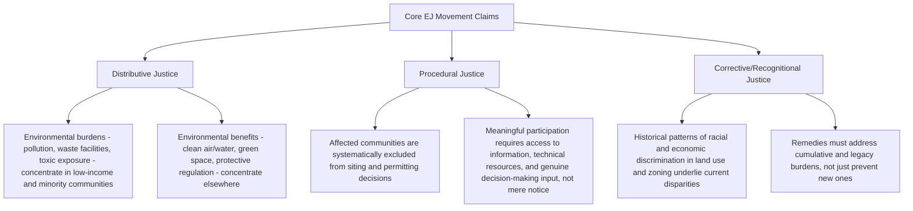

## Origins and Core Claims of the Environmental Justice Movement

### Overview

The environmental justice (EJ) movement emerged from the convergence of the civil rights movement and the environmental movement in the United States, developing a core claim that environmental burdens — pollution, hazardous waste siting, industrial facility placement — fall disproportionately on low-income communities and communities of color, while environmental benefits and decision-making power are disproportionately concentrated among wealthier, whiter communities. Unlike mainstream environmentalism's early emphasis on wilderness conservation and pollution control generally, environmental justice reframes environmental protection as fundamentally a **civil rights and distributive justice issue**, demanding not only cleaner outcomes but also meaningful participation by affected communities in the decisions that produce those outcomes.

---

### Foundational Origins

#### Warren County, North Carolina (1982)

- Widely cited as the catalytic event of the modern EJ movement: the state of North Carolina selected a mostly Black, low-income community in Warren County as the site for a landfill to dispose of soil contaminated with PCBs (polychlorinated biphenyls) that had been illegally dumped along roadways.
- Community members and civil rights leaders organized sustained nonviolent protests and mass civil disobedience against truck convoys delivering the contaminated soil, resulting in over 500 arrests — among the first instances of a specifically environmental protest employing civil-rights-era direct action tactics.
- Although the protests did not stop the landfill's construction, the Warren County demonstrations catalyzed national attention and directly prompted the U.S. General Accounting Office (GAO) to study the correlation between hazardous waste facility siting and the racial/socioeconomic composition of surrounding communities.

#### Foundational Studies

- The 1983 GAO study, prompted by Warren County, examined hazardous waste landfill siting in EPA's Region 4 (the Southeastern U.S.) and found a correlation between landfill siting and the racial and economic status of surrounding communities.
- The 1987 report *Toxic Wastes and Race in the United States*, commissioned by the United Church of Christ's Commission for Racial Justice and led by Dr. Benjamin Chavis, expanded this analysis nationally and is considered a foundational document of the movement; the report both documented the correlation between race and hazardous waste facility siting nationwide and is credited with coining the term **"environmental racism"** to describe this pattern.
- Subsequent academic work, notably sociologist Robert Bullard's research (including his 1990 book *Dumping in Dixie: Race, Class, and Environmental Quality*), extended and reinforced this empirical foundation, examining waste facility siting patterns across the U.S. South; Bullard is frequently credited as a founding scholar of the environmental justice field.

---

### Formalization of the Movement

#### The First National People of Color Environmental Leadership Summit (1991)

- Convened in Washington, D.C., bringing together delegates from across the United States (and internationally) representing grassroots, civil rights, labor, and environmental organizations.
- The Summit produced the **17 Principles of Environmental Justice**, a foundational document articulating the movement's core values, including affirmations of the sacredness of Mother Earth, the right to self-determination for all peoples, demands for the cessation of environmentally destructive production, and calls for community participation in environmental decision-making.
- These principles established environmental justice as a movement with its own articulated philosophy and political demands, distinct from — though allied with — mainstream environmental organizations.

#### Federal Recognition

- Executive Order 12898, signed by President Clinton in 1994, directed federal agencies to identify and address disproportionately high and adverse human health or environmental effects of their programs, policies, and activities on minority and low-income populations — representing the first major formal federal acknowledgment of environmental justice as an administrative law concern.
- This order established the framework requiring federal agencies (including EPA) to incorporate environmental justice analysis into their decision-making processes, laying groundwork for later administrative practices such as EJ screening tools and community impact assessments in permitting and NEPA review.

---

### Core Analytical Claims of the Movement

#### 1. Distributive Justice

The claim that the **distribution** of environmental risks and benefits is unjust — that hazardous waste sites, polluting industrial facilities, highways, and other locally undesirable land uses ("LULUs") are disproportionately sited in or near communities of color and low-income communities, producing measurably worse health, environmental, and economic outcomes for those populations.

#### 2. Procedural Justice

The claim that affected communities are systematically excluded from, or given only nominal/pro forma participation in, the administrative and political decision-making processes (permitting, zoning, siting, environmental review) that determine where environmental burdens are placed — meaning the injustice is not solely about outcomes but about **who has power in the process** that produces those outcomes.

#### 3. Corrective and Recognitional Justice

The claim that current disparities are not incidental but rooted in historical patterns of discriminatory land use, zoning, redlining, and industrial siting decisions, and that genuine remedies require acknowledging this history and addressing **cumulative** burdens (the compounded effect of multiple pollution sources and social stressors in a single community over time) rather than evaluating each new proposed facility or permit in isolation.

---

### Defining "Environmental Justice" and "Environmental Racism"

| Term | Core Meaning |
| --- | --- |
| **Environmental justice** | The fair treatment and meaningful involvement of all people, regardless of race, color, national origin, or income, with respect to the development, implementation, and enforcement of environmental laws, regulations, and policies |
| **Environmental racism** | The specific claim, coined in the 1987 UCC report, that racial discrimination — whether intentional or the product of facially neutral but discriminatory-in-effect decision-making — is a primary driver of the disproportionate siting of environmental hazards in communities of color |
| **Cumulative impacts** | The aggregate effect of multiple environmental, health, and socioeconomic stressors on a single community, considered together rather than facility-by-facility — a central EJ analytical concept because conventional environmental review often assesses each new source in isolation |
| **Fenceline community** | A community located immediately adjacent to an industrial facility or pollution source, bearing disproportionate direct exposure |

---

### Relationship to Mainstream Environmentalism

The EJ movement developed partly in **critical tension** with the mainstream (often characterized as predominantly white, middle-class) environmental movement of the 1960s–1980s:

- Mainstream environmentalism's historical focus on wilderness preservation, species conservation, and general pollution abatement was seen by EJ advocates as failing to center the lived experience of urban and rural communities of color bearing direct, disproportionate toxic exposure.
- EJ advocates argued that environmental protection could not be separated from questions of racial and economic justice — that "the environment" includes the neighborhoods, workplaces, and homes where people actually live, not only pristine natural spaces.
- Over time, many mainstream environmental organizations have incorporated environmental justice principles into their advocacy, and EJ organizations have increasingly engaged directly with climate change, energy transition, and administrative rulemaking — connecting to broader environmental law developments including the climate litigation covered elsewhere in this course.

---

### Practical Example: Applying the Distributive/Procedural Framework

**Example.** A state environmental agency is evaluating a permit application for a new chemical processing facility proposed for a low-income neighborhood that already hosts two other industrial facilities.

- **Distributive justice analysis** asks: what is the cumulative pollution burden this community would bear if the permit is granted, relative to other communities in the region, and does this pattern match the documented historical tendency (per the 1987 UCC report and subsequent research) to site such facilities in similar communities?
- **Procedural justice analysis** asks: did the agency's public comment process provide genuine, accessible opportunities for community input (translated materials, accessible meeting times/locations, technical assistance for residents to evaluate the application), or did it satisfy only the minimum formal notice-and-comment requirements?
- **Corrective justice analysis** asks: does the agency's review account for this community's historical burden (e.g., through a cumulative impacts assessment), or does it evaluate this single facility application in isolation from the neighborhood's existing exposure profile?

This three-part framework — distributive, procedural, and corrective — is the analytical lens the EJ movement developed and that subsequently informed administrative practices like EPA's EJSCREEN tool, environmental justice provisions in state permitting statutes, and NEPA cumulative impacts analysis requirements.

---

**Related Topics / Next Steps**

- Executive Order 12898 and its implementation across federal agencies
- EPA's environmental justice screening and mapping tools (EJSCREEN and successors)
- Title VI of the Civil Rights Act of 1964 as a legal vehicle for environmental justice claims
- Cumulative impacts analysis in state permitting statutes (e.g., New Jersey's Environmental Justice Law)
- NEPA environmental justice review requirements
- Environmental justice and climate change intersections (disproportionate climate vulnerability)
- Legal theories and litigation strategies for environmental justice claims (equal protection, disparate impact, state EJ statutes)
- Community-driven cumulative impact assessment methodologies