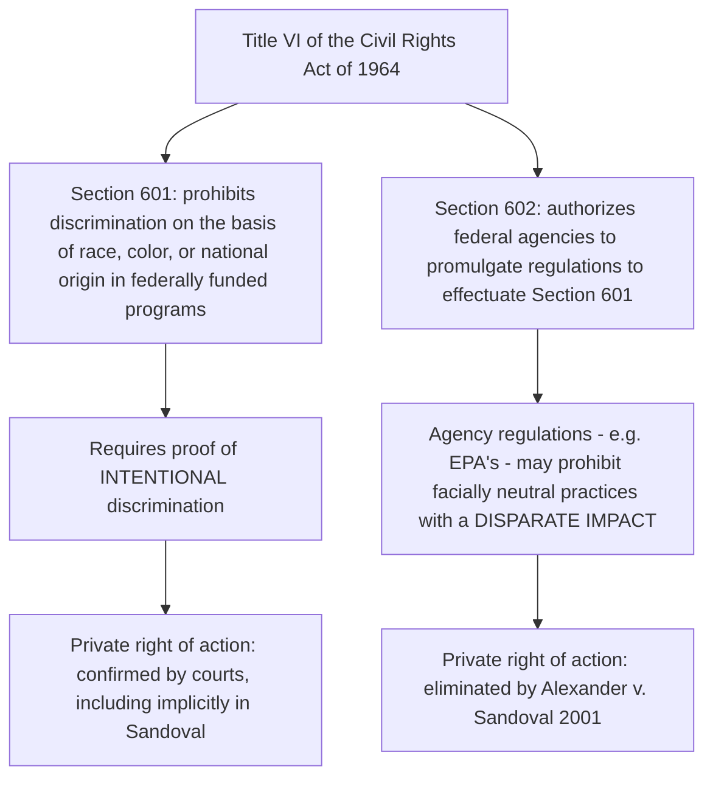

## Disparate Impact Theory and Title VI of the Civil Rights Act

### Overview

Title VI of the Civil Rights Act of 1964 is used extensively to pursue claims of discrimination for both administrative and judicial relief, and stands as the principal federal civil rights statute environmental justice advocates have relied upon to challenge the disproportionate siting of polluting and hazardous facilities in minority and low-income communities. Because proving **intentional** discrimination under the statute's core provision (§601) is extremely difficult, the environmental justice movement's legal strategy has centered heavily on **disparate impact** theory — claims that a facially neutral permitting or siting decision produces a discriminatory effect regardless of intent — brought under regulations promulgated pursuant to §602. This topic traces disparate impact theory's statutory foundation, its dramatic judicial narrowing in *Alexander v. Sandoval* (2001), its administrative afterlife, and its near-total federal retrenchment as of 2025.

---

### Statutory Framework: Section 601 vs. Section 602

- **Section 601** prohibits intentional discrimination on the basis of race, color, or national origin by recipients of federal funding — but proving intent in a facility-siting or permitting context (where decision-makers rarely leave direct evidence of discriminatory motive) is extraordinarily difficult.
- **Section 602** authorizes federal agencies (including EPA) to promulgate implementing regulations, and agencies including EPA adopted regulations prohibiting recipients of federal funds from utilizing criteria or methods of administration that have the **effect** of subjecting individuals to discrimination on the basis of race, color, or national origin — regardless of discriminatory intent. Because minority and poor communities concerned about disproportionate overburdening by hazardous and toxic facilities in their neighborhoods could rarely prove intentional discrimination under §601, disparate impact claims under §602 regulations became the primary legal vehicle for EJ litigants.

---

### The Administrative Title VI Complaint Process

Before (and alongside) any judicial claim, Title VI disparate impact allegations can be pursued through an **administrative complaint process** with the relevant federal funding agency (for environmental justice purposes, typically EPA):

- Prevailing on a disparate impact claim in the administrative Title VI process is neither guaranteed nor swift — in practice, few complaints are upheld, and the process may take many months, if not years, to conclude.
- This administrative pathway remains theoretically available even where private judicial enforcement is barred (see *Sandoval*, below), because it is the **federal agency itself** — not a private plaintiff — that enforces §602 regulations administratively.
- **[Inference]** The combination of low administrative success rates and lengthy processing times has historically limited the administrative complaint process's practical value as a primary EJ enforcement tool, pushing advocates toward litigation strategies (private judicial enforcement) even before *Sandoval* eliminated the primary judicial avenue.

---

### The Turning Point: *Alexander v. Sandoval*, 532 U.S. 275 (2001)

#### Facts and Procedural Posture

The case arose from a challenge to the State of Alabama's "English-only" policy requiring all aspects of its driver's license examination process, including the written portion, to be conducted exclusively in English; a Mexican immigrant plaintiff argued the policy violated Title VI because of its disparate impact on ethnic minorities, even absent intentional discrimination.

#### Holding

In a narrow 5-4 decision, the Supreme Court ruled that there is no private right of action to enforce disparate impact regulations promulgated under §602 of Title VI. The majority held that Congress did not intend to create a private right of action to enforce Title VI except as a remedy for intentional discrimination under §601 itself — federal regulations prohibiting facially neutral practices with discriminatory effect, regardless of intent, could not provide a basis for private lawsuits.

#### What Survived

- Although Title VI did not explicitly state a private right of action existed under §602, federal courts had consistently acknowledged this implied right prior to *Sandoval* — the decision reversed this settled lower-court consensus.
- *Sandoval* did **not** eliminate federal agency authority to enforce §602 disparate-impact regulations **administratively**; the Court's holding was specifically that private individuals cannot sue in court to enforce those regulations — the government retained enforcement authority, just not private litigants.
- Justice Stevens's dissent identified 42 U.S.C. § 1983 as a potential alternative avenue for private disparate impact relief, since §1983 provides a cause of action for deprivations of federal rights under color of state law.

#### Significance for Environmental Justice

This Supreme Court ruling eliminated a major judicial tool for private civil rights and environmental justice plaintiffs seeking to enforce disparate impact discrimination claims, fundamentally reshaping EJ litigation strategy: private plaintiffs could no longer sue directly in federal court to challenge a facially neutral permitting or siting decision on disparate impact grounds; they were left with either (a) proving the far more difficult intentional discrimination standard under §601, (b) pursuing the slow and low-success administrative complaint process, or (c) attempting the §1983 workaround.

---

### The §1983 Workaround and Its Narrowing: *South Camden Citizens in Action v. New Jersey Department of Environmental Protection*

- In this Third Circuit case, a district court had initially granted a preliminary injunction to residents challenging a facility siting decision and found that §602 and EPA's implementing regulations contained an implied private right of action — but five days later, the Supreme Court decided *Sandoval*, foreclosing that path.
- The district court then permitted residents to amend their complaint to enforce §602 **through §1983** instead, initially continuing the preliminary injunction based on this alternative theory, reasoning that *Sandoval* did not bar plaintiffs from using §1983 to enforce federal rights embedded in EPA's Title VI §602 disparate impact regulations.
- However, the court ultimately held that disparate impact regulations promulgated under §602 do **not** create a right enforceable through a §1983 action — closing off this workaround as well, and further narrowing private enforcement of disparate impact regulations by private individuals in environmental justice cases specifically.

**[Inference]** The combined effect of *Sandoval* and *South Camden* left environmental justice plaintiffs with essentially no reliable private judicial pathway to challenge facially neutral siting or permitting decisions on disparate impact grounds — a structural gap that shifted the movement's practical strategy toward administrative advocacy, state-level EJ statutes, NEPA-based challenges, and political/executive branch engagement rather than direct Title VI disparate-impact litigation.

---

### Federal Regulatory and Administrative Enforcement (Pre-2025)

| Mechanism | Status Post-*Sandoval* |
| --- | --- |
| Private judicial enforcement of §602 disparate impact regulations | Eliminated (*Sandoval*) |
| Private enforcement via §1983 | Also largely foreclosed (*South Camden*) |
| Private judicial enforcement of §601 intentional discrimination | Available, but requires proving discriminatory intent — a high bar |
| Federal agency (EPA) administrative enforcement of §602 regulations | Remained legally available; slow and rarely resulted in upheld complaints |
| Executive Order 12898 (1994) | Directed federal agencies to consider disproportionate impacts in decision-making, including under NEPA; complemented but did not replace Title VI |

---

### The 2025 Federal Retrenchment

Environmental justice's administrative and executive-branch infrastructure — built up over three decades since Executive Order 12898 — was substantially dismantled in early 2025:

- On January 20-21, 2025, President Trump signed executive orders revoking prior executive orders that had served as the foundations for federal environmental justice initiatives, including explicitly revoking President Clinton's 1994 Executive Order 12898, which had required federal agencies to identify and address disproportionately high and adverse impacts on minority and low-income populations, including in NEPA-related decision-making guided by the Council on Environmental Quality.
- As one of her first acts after being sworn in, Attorney General Pam Bondi rescinded former Attorney General Merrick Garland's directives on environmental justice and directed all U.S. Attorney's Offices to revoke any memoranda, guidance, or similar directives implementing the prior administration's "environmental justice" agenda, stating that going forward the Department would "evenhandedly enforce all federal civil and criminal laws, including environmental laws."
- In March 2025, EPA Administrator Lee Zeldin directed the reorganization and elimination of the Office of Environmental Justice and External Civil Rights, the Environmental Justice Division within all 10 EPA regional offices, and the Office of Inclusive Excellence, affecting approximately 168-170 employees who were placed on administrative leave — Zeldin attributed these closures to compliance with the administration's executive order eliminating diversity, equity, and inclusion programs across government.
- Congressional Democrats, including Senators Blunt Rochester, Duckworth, and Booker, sent a letter urging the administration to reinstate the office, noting it had ensured EPA's work centered on the experiences of Americans affected by pollution and citing as an example a February 2023 EPA-DOJ suit against Denka Performance Elastomer for emitting cancerous air pollutants 14 times the recommended level near a majority-Black elementary school — illustrating the kind of case the office's advocates argue the closure leaves unaddressed.

---

### Comparative Framework: Legal Pathways for EJ Claims Today

| Pathway | Current Viability | Key Limitation |
| --- | --- | --- |
| §601 private suit (intentional discrimination) | Available | Extremely difficult evidentiary burden |
| §602 private suit (disparate impact) | Unavailable | Foreclosed by *Sandoval* |
| §1983 enforcement of §602 regulations | Unavailable | Foreclosed by *South Camden* |
| EPA administrative Title VI complaint | Formally available | Slow, low success rate; further weakened by 2025 office closures |
| Executive Order 12898-based agency practice | Effectively eliminated | Revoked January 2025 |
| State-level environmental justice statutes | Available where enacted | Jurisdiction-dependent; not a federal remedy |
| NEPA cumulative impacts review | Available but weakened | EJ-specific NEPA guidance tied to the revoked executive order infrastructure |

---

### Practical Example: Evaluating a Facility Siting Challenge Today

**Example.** A community organization wants to challenge a state agency's decision to permit a new industrial facility in a majority-minority neighborhood that already hosts several polluting sources.

- **§601 intentional discrimination claim**: Would require evidence the agency's decision-makers acted with discriminatory purpose — rarely available absent direct evidence such as internal communications explicitly referencing race.
- **§602 disparate impact claim in federal court**: Foreclosed under *Sandoval* — the organization cannot bring this claim as a private plaintiff in court.
- **§1983 claim**: Also foreclosed under *South Camden*'s reasoning that §602 regulations do not create an enforceable right under that statute.
- **EPA administrative complaint**: Technically available, but the organization should expect a lengthy process, low likelihood of a finding in its favor, and — as of 2025 — no longer any dedicated EPA Office of Environmental Justice and External Civil Rights to receive and process the complaint.
- **Remaining viable strategies**: state environmental justice statutes (if the state has enacted one), state constitutional claims (see *Held v. Montana* model, if the state has an environmental rights clause), or NEPA-based procedural challenges to the extent federal action is involved and NEPA review requirements remain applicable.

This example illustrates the practical reality facing environmental justice litigants today: the disparate impact theory that once represented the movement's primary federal legal tool has been substantially foreclosed judicially since 2001 and administratively dismantled since 2025, pushing advocacy toward state law and alternative federal doctrines.

---

**Related Topics / Next Steps**

- 42 U.S.C. § 1983 as a general civil rights enforcement mechanism and its limits post-*South Camden*
- Executive Order 12898 history, implementation, and 2025 revocation
- State-level environmental justice statutes (e.g., New Jersey's Environmental Justice Law, California SB 1000)
- NEPA cumulative impacts and environmental justice review requirements
- Proving intentional discrimination in facility siting cases: evidentiary strategies and case law
- Comparative civil rights enforcement models: Fair Housing Act disparate impact doctrine (*Texas Dept. of Housing v. Inclusive Communities Project*) as a contrasting framework
- EPA's EJSCREEN and successor mapping tools: current status post-office closures
- Congressional and legislative efforts to codify environmental justice protections