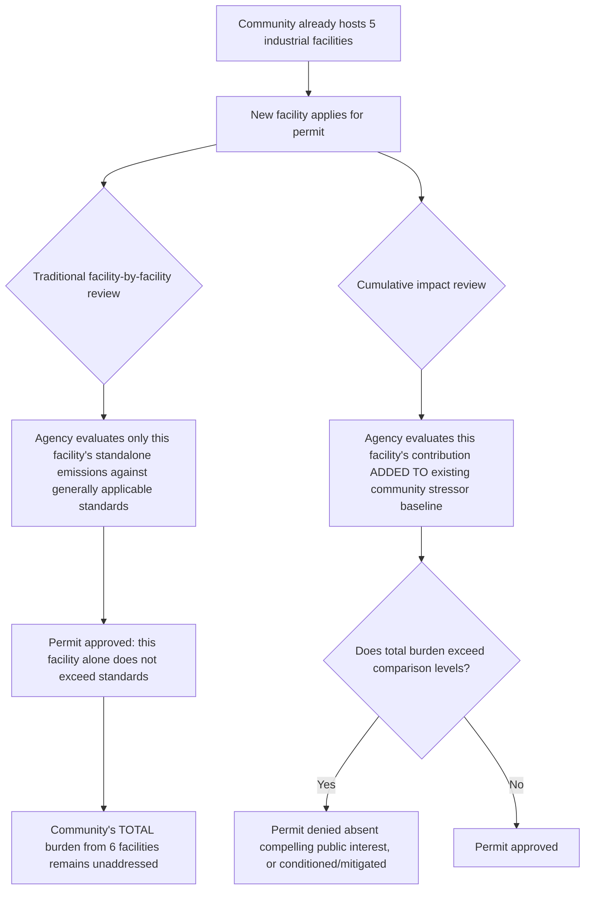

## Cumulative Impact Analysis in Permitting Decisions

### Overview

Cumulative impact analysis is the regulatory mechanism that operationalizes the environmental justice movement's core distributive and corrective justice claims (covered in the origins topic) into binding permitting law: rather than evaluating a proposed facility's environmental effects in isolation, cumulative impact analysis requires permitting authorities to assess a facility's contribution to the **total, aggregated burden** already borne by a community from multiple existing pollution sources and socioeconomic stressors. New Jersey's 2020 Environmental Justice Law and its 2023 implementing rules represent the most legally developed and judicially tested cumulative impacts framework in the United States, and — following a January 2026 appellate decision upholding those rules — now serve as the leading template for states and the stalled federal *Environmental Justice for All Act*.

---

### Conceptual Foundation: Why Facility-by-Facility Review Fails Overburdened Communities

The core critique cumulative impact analysis addresses: conventional environmental permitting historically evaluated each new facility application against generally applicable emissions or discharge standards **without reference to what else already exists in that community** — meaning a community could accumulate numerous permitted facilities, each individually "compliant," while collectively bearing a pollution burden far exceeding what any single facility's permit review considered.

---

### Case Study: New Jersey's Environmental Justice and Cumulative Impacts Law

#### Statutory and Regulatory Framework

| Milestone | Date | Development |
| --- | --- | --- |
| Environmental Justice Law enacted | September 2020 (S232/A2212) | Requires NJDEP to assess public health and environmental risks that permitted facilities create for "overburdened communities" |
| Interim administrative measure | September 21, 2021 | NJDEP issued Administrative Order 2021-25 attempting a "mini EJ analysis" as a stopgap pending formal rules |
| Proposed implementing rules published | June 2022 | NJDEP published proposed rules with public comment open until September 4, 2022 |
| Final EJ Rules effective | April 17, 2023 | Codified at N.J.A.C. 7:1C |
| Industry legal challenges filed | June 2023 | Two separate appeals filed in NJ Superior Court, Appellate Division, seeking to invalidate the EJ Rules |
| Appellate Division decision | January 5, 2026 | Consolidated decision affirming the EJ Rules in full |

The statute's structural innovation: it mandates the NJDEP take into account not just the specific impact of a particular project or facility, but also the **cumulative impact of other facilities and stressors already present in the community** — statutorily embedding the cumulative, rather than isolated, framework into the permitting standard itself.

#### Covered Facility Types

The EJ Rules apply to eight specific types of facilities: (1) major sources of air pollution; (2) resource recovery facilities or incinerators; (3) sludge processing facilities, combustors, or incinerators; (4) sewage treatment plants with capacity exceeding 50 million gallons per day; (5) transfer stations, solid waste facilities, or recycling facilities receiving at least 100 tons of recyclable material per day; (6) scrap metal facilities; (7) landfills (including those accepting ash, construction/demolition debris, or solid waste); and (8) medical waste incinerators not attendant to a hospital or university.

#### "Overburdened Communities" Definition

New Jersey's law applies to facilities located in **overburdened communities (OBCs)**, defined as any Census block group meeting specified thresholds for low-income population, minority population, or population with limited English proficiency — directly operationalizing the environmental justice movement's demographic-disparity framework into a binding legal trigger.

#### Procedural Mechanics

Covered facilities seeking new, renewal, or expansion permits in an OBC must:

1. **Prepare an Environmental Justice Impact Statement (EJIS)** — including analysis of purpose and need, alternatives considered, the affected environment, and the project's effects on public health stressors.
2. **Assess cumulative stressors** using NJDEP's EJ Mapping, Assessment and Protection Tool — a GIS-based tool aggregating existing environmental and public health stressor data by community.
3. **Conduct meaningful public engagement** with the affected community, going beyond minimum notice-and-comment requirements.
4. **Propose feasible mitigation measures** to address identified adverse cumulative impacts.

#### Regulatory Consequences

- For **new facilities**: NJDEP may deny permits that would impose adverse cumulative stressors exceeding comparison levels, **unless** a narrowly defined "compelling public interest" standard is satisfied.
- For **expansions and renewals**: NJDEP may impose site-specific conditions on the permit to protect public health and safety, even where outright denial is not warranted, if the EJIS establishes that approval would similarly contribute to adverse cumulative environmental or public health stressors.

#### Applied Example: Passaic Valley Sewerage Commission (2024)

NJDEP exercised its site-specific conditioning authority in July 2024 in its determination on the Passaic Valley Sewerage Commission's permit modification request for a standby power-generating facility in Newark — illustrating the "condition rather than outright deny" pathway available for expansion/renewal permits under the framework.

---

### Judicial Review: The January 2026 Appellate Division Decision

#### Grounds of Challenge

Industry group petitioners challenged the EJ Rules on numerous grounds, asserting the regulations were: ultra vires (exceeding NJDEP's statutory authority); arbitrary and capricious; unconstitutionally vague and overbroad; improperly excluding economic benefits from consideration under the compelling public interest standard; misinterpreting statutory terminology; improperly relying on technical guidance documents; and adopted in violation of administrative rulemaking procedures.

#### Holding

On January 5, 2026, the Appellate Division issued a consolidated decision affirming the EJ Rules in full, rejecting the broad procedural and substantive arguments raised by industry challengers and upholding NJDEP's authority to develop rules interpreting and implementing the EJ Law.

#### Significance

This decision confirms that environmental justice analysis is a baseline permitting requirement for covered facilities in New Jersey, resolving what had been over two years of legal uncertainty and — because NJDEP had already been requiring compliance from permit applicants in OBCs pursuant to agency guidance even before this ruling — retroactively validates the agency's interim enforcement practices during the pendency of the appeals. **[Inference]** As the most legally tested cumulative impacts statute in the country, this appellate affirmance likely strengthens the persuasive authority New Jersey's framework carries for other states considering similar legislation, since it demonstrates the model can survive comprehensive administrative-law challenge (ultra vires, arbitrary-and-capricious, vagueness) largely intact.

---

### Federal Legislative Parallel: The Environmental Justice for All Act

- Reintroduced in the U.S. House and Senate (S.872) by Representatives Raúl Grijalva and A. Donald McEachin and Senator Tammy Duckworth, the bill would enhance existing federal environmental statutes such as the Clean Water Act and Clean Air Act by incorporating cumulative impacts into federal permitting decisions.
- The bill defines cumulative impacts as the disproportionate exposure of a community to public health or environmental hazards from one or multiple facilities, including power plants, recycling facilities, sewage plants, incinerators, and landfills — a definitional structure closely mirroring New Jersey's approach.
- **[Unverified — legislative status subject to change]** As of the most recent search results available, this bill remains at the reintroduction stage without enactment; given the 2025 federal retrenchment from environmental justice policy generally (including the revocation of Executive Order 12898 and closure of EPA's environmental justice offices, discussed in the companion Title VI topic), near-term federal enactment prospects for a cumulative-impacts mandate appear limited, making state-level frameworks like New Jersey's the primary active site of cumulative impacts policymaking.

---

### Other States and Local Diffusion

Advocacy and research organizations tracking cumulative impacts policymaking have documented active diffusion of the New Jersey model to other jurisdictions:

- New York has undertaken phase 1 rulemaking for an EJ Siting Law, with EJ advocacy organizations submitting formal comments as of May 2025.
- The Bay Area Air District Advisory Council received a presentation on cumulative impacts policymaking and early lessons from New Jersey's implementation experience in October 2025, indicating California air quality regulators are actively studying the New Jersey framework.
- As of August 2025, New Jersey EJ advocacy organizations were engaging directly with NJDEP on the first substantive permitting decision issued under the law, and by November 2025 were submitting comments on a peaker plant permit renewal — indicating the framework has moved from rulemaking into an active, ongoing implementation and advocacy phase.
- Commentators have specifically framed continued state-level cumulative impacts policymaking as filling a gap created by the 2025 reduction in federal environmental justice engagement.

---

### Comparative Framework: Facility-by-Facility vs. Cumulative Impact Review

| Dimension | Traditional Facility-by-Facility Review | Cumulative Impact Review (NJ Model) |
| --- | --- | --- |
| Baseline | Generally applicable emissions/discharge standards | Community-specific existing stressor baseline (via mapping tool) |
| Trigger | Any facility subject to the relevant permit program | Covered facility types located specifically in overburdened communities |
| Decision standard | Compliance with facility-specific limits | Whether facility's addition pushes cumulative burden past comparison levels |
| Denial authority | Rare; typically limited to standards violations | Available absent "compelling public interest," even if facility alone would comply with generic standards |
| Public participation | Standard notice-and-comment | Enhanced "meaningful public engagement" requirement plus technical assistance |
| Judicial status (NJ) | N/A | Upheld against comprehensive challenge, January 2026 |

---

### Practical Example: Applying Cumulative Impact Analysis

**Example.** A company seeks a new permit for a scrap metal recycling facility in a New Jersey census block group already hosting three other permitted industrial sources and classified as an overburdened community.

1. **Trigger determination**: Scrap metal facilities are among the eight covered facility types, and the site is in an OBC — the EJ Rules apply.
2. **EJIS preparation**: The applicant must prepare an Environmental Justice Impact Statement analyzing purpose, alternatives, and the facility's effects on public health stressors in that specific community.
3. **Cumulative stressor mapping**: Using NJDEP's EJ Mapping, Assessment and Protection Tool, the applicant and agency assess the community's existing aggregate stressor level from the three existing facilities plus other environmental/socioeconomic factors.
4. **Public engagement**: The applicant must conduct meaningful engagement with affected residents beyond standard notice-and-comment.
5. **Decision**: If the facility's addition would push the community's cumulative stressor level past NJDEP's comparison levels, NJDEP may deny the permit unless the applicant demonstrates a narrowly defined compelling public interest justifying approval, or NJDEP may approve with site-specific mitigation conditions.

This example illustrates the operational shift cumulative impact analysis represents: the permitting question is no longer solely "does this facility comply with generic standards," but "can this community's total burden legally absorb one more source," directly implementing the environmental justice movement's distributive and corrective justice claims into enforceable permitting law.

---

**Related Topics / Next Steps**

- NJDEP's EJ Mapping, Assessment and Protection Tool: technical architecture and data sources
- The "compelling public interest" standard: scope and litigated boundaries post-2026 appellate decision
- Comparative state cumulative impacts frameworks (California SB 1000, New York's EJ Siting Law phase 1 rulemaking)
- The federal *Environmental Justice for All Act* (S.872): legislative status and Clean Air Act/Clean Water Act integration design
- Administrative law challenges to agency rulemaking authority: ultra vires and arbitrary-and-capricious standards applied to EJ rules
- Interaction between cumulative impacts permitting review and NEPA environmental justice analysis
- Environmental justice mapping and screening tool methodologies (cross-reference: EPA's EJSCREEN successor tools)
- Economic development vs. environmental justice tensions in permit denial standards