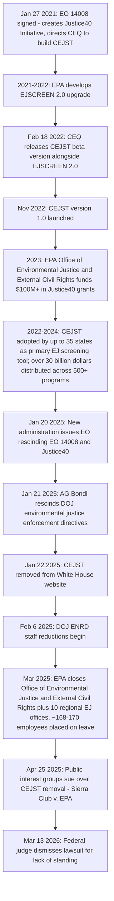
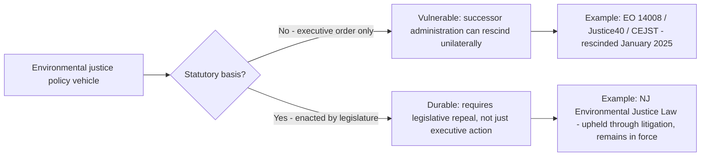

## Executive and Agency Environmental Justice Initiatives and Their Subsequent Rollback

### Overview

Between 2021 and 2024, the federal executive branch built an extensive administrative infrastructure for environmental justice — executive orders, screening and mapping tools, dedicated agency offices, and a targeted funding mandate (Justice40) — representing the most significant expansion of federal environmental justice institutional capacity since Executive Order 12898 in 1994. Nearly all of this infrastructure was dismantled within the first months of the subsequent administration in 2025, illustrating a recurring pattern in administrative law: environmental justice policy built primarily through **executive action rather than statute** is structurally vulnerable to rapid reversal by a successor administration, with limited judicial recourse for those seeking to preserve it.

---

### Timeline of Build-Up and Rollback

---

### Phase One: Build-Up (2021–2024)

#### Executive Order 14008 and the Justice40 Initiative

On January 27, 2021, President Biden issued Executive Order 14008 ("Tackling the Climate Crisis at Home and Abroad"), which created the **Justice40 Initiative** — a commitment that forty percent of the benefits of federal investments in climate change, clean energy and energy efficiency, clean transit, affordable and sustainable housing, training and workforce development, remediation of legacy pollution, and clean water/wastewater infrastructure would flow to disadvantaged communities overburdened by pollution. The order also directed the Council on Environmental Quality (CEQ) to develop a Climate and Economic Justice Screening Tool (CEJST) to help agencies identify the marginalized communities the initiative was intended to benefit.

#### Two Parallel Screening Tools

The federal government built and maintained **two distinct but complementary** geospatial tools:

| Tool | Developer | Purpose | Released |
| --- | --- | --- | --- |
| **EJSCREEN** | EPA | Broad tool combining environmental and demographic data to highlight where vulnerable populations may be disproportionately impacted by pollution; used to inform permitting, enforcement, outreach, and compliance | Pre-existing; upgraded to EJSCREEN 2.0 on Feb. 18, 2022 |
| **CEJST** | White House CEQ (built by the U.S. Digital Service) | Defines and maps "disadvantaged communities" specifically to inform how federal agencies direct the Justice40 Initiative's 40% benefit-delivery target | Beta released Feb. 18, 2022; version 1.0 launched Nov. 22, 2022 |

CEQ described the tools as complementary rather than duplicative: EJSCREEN provides a tool to screen for potential disproportionate environmental burdens at the community level, while CEJST specifically defines and maps disadvantaged communities for directing federal program benefits. CEJST incorporated data across eight burden categories — climate change, energy, health, housing, legacy pollution, transportation, water and wastewater, and workforce development — at the census-tract level, including indicators such as energy burdens, air quality, formerly redlined census tracts, and expected flood risk.

#### Scale of Adoption and Investment

- More than $30 billion in funding had gone to over 500 programs under the Justice40 Initiative as of 2022, spanning agencies including HHS (low-income energy assistance), the U.S. Forest Service (wildfire risk reduction), and DHS (disaster preparedness grants).
- The EPA's Office of Environmental Justice and External Civil Rights administered dedicated Justice40 grant programs, including $100 million made available in 2023 alone across the Environmental Justice Government-to-Government Program (for state/local/tribal governments partnering with nonprofits) and the Environmental Justice Collaborative Problem-Solving Cooperative Agreement Program (for nonprofits directly) — drawn from a broader $3 billion allocation under the office.
- Under the Justice40 clause of Biden's Bipartisan Infrastructure Law, use of CEJST was **mandatory** for all federal agencies rolling out projects tied to clean energy, affordable housing, critical water infrastructure, transportation, and pollution reduction or remediation, and the tool had been wrapped into environmental review requirements and grant processes at the state and nonprofit level as well, with as many as 35 states employing CEJST as their primary environmental justice screening tool.
- Prior to its removal, the CEJST site was the second most visited website within the Executive Office of the President's domains, recording more than 33,000 views in a single month (November, pre-removal) — indicating substantial operational reliance across government and civil society.

---

### Phase Two: Rollback (2025)

#### Executive Order Rescission

On January 20, 2025, the new administration issued an executive order titled "Initial Rescissions of Harmful Executive Orders and Actions," rescinding Executive Order 14008 in its entirety — eliminating both its legal basis for the Justice40 Initiative and its mandate for CEQ to maintain the CEJST.

#### Tool Removal

As a direct consequence of rescinding Executive Order 14008, the CEJST was removed from operation; as of January 22, 2025, CEQ's CEJST was no longer available on the White House website. The White House Council on Environmental Quality, which created and managed the tool, told journalists it was unable to comment on the removal.

#### Civil Society Response: Data Preservation

Within 48 hours of the tool going offline, a coalition of data scientists known as the Public Environmental Data Project had resurrected a functional, unofficial copy of CEJST on an independent domain — part of a broader effort flagging more than 200 federally maintained resources considered both critical to environmental justice work and at risk of disappearing under the new administration. The coalition triaged datasets for preservation priority based on three factors: the consequences of a dataset's disappearance for the public, their confidence in their ability to replicate the tool, and (implicitly) technical feasibility.

#### Department of Justice Actions

As one of her first acts after being sworn in, the Attorney General rescinded the prior administration's directives on environmental justice enforcement and directed all U.S. Attorney's Offices to revoke any memoranda, guidance, or similar directives implementing the prior administration's environmental justice agenda, stating the Department would go forward "evenhandedly" enforcing federal civil and criminal laws including environmental laws; separately, the DOJ's Environment and Natural Resources Division — the office responsible for defending federal environmental actions in court — saw staff reductions affecting approximately 20 employees.

#### EPA Office Closures

In March 2025, EPA Administrator Lee Zeldin directed the reorganization and elimination of the Office of Environmental Justice and External Civil Rights, the Environmental Justice Division within all 10 EPA regional offices, and the Office of Inclusive Excellence, affecting approximately 168-170 employees placed on administrative leave, with Zeldin attributing the closures to compliance with the administration's executive order eliminating diversity, equity, and inclusion programs across government (see companion topic on Title VI/disparate impact for full detail on this closure and its consequences for administrative enforcement).

#### Litigation Challenging the Rollback

On April 25, 2025, several public interest groups sued the federal government challenging the removal of CEJST and other federal data tools addressing environmental justice and climate change (*Sierra Club v. EPA*, D.C. Cir. Docket No. 25-1112). On March 13, 2026, a federal judge dismissed the lawsuit, holding the public interest groups lacked standing.

**[Inference]** The standing-based dismissal in *Sierra Club v. EPA* mirrors the broader justiciability pattern seen throughout this course's climate litigation content (*Juliana*'s redressability dismissal, the general difficulty of establishing Article III standing for diffuse informational or programmatic harms) — reinforcing that even well-documented, concrete administrative rollbacks face a high procedural bar before a court will reach their merits, particularly where the challenged action is the *withdrawal* of a voluntary tool or program rather than an affirmative regulatory imposition.

---

### Structural Lesson: Executive-Action Vulnerability vs. Statutory Durability

This chapter's comparative record illustrates a structural principle directly relevant to administrative law practice: **environmental justice measures grounded in statute (New Jersey's Environmental Justice Law, upheld against comprehensive challenge in January 2026 — see companion topic on cumulative impact analysis) have proven durable against both litigation and political transition, while environmental justice measures grounded solely in executive order (Executive Order 12898, Executive Order 14008, Justice40, CEJST) have proven readily reversible by a change in administration, without requiring any legislative action or judicial process.**

| Vehicle | Legal Basis | 2025 Status |
| --- | --- | --- |
| Executive Order 12898 (1994) | Presidential executive order | Revoked January 2025 |
| Executive Order 14008 / Justice40 (2021) | Presidential executive order | Revoked January 2025 |
| CEJST | Directed by EO 14008 | Removed from operation; unofficial mirror maintained by civil society |
| EPA Office of Environmental Justice and External Civil Rights | Agency-created office (Biden-era) | Closed March 2025 |
| Title VI disparate impact private enforcement | Judicial interpretation (*Sandoval*) | Already foreclosed since 2001, independent of 2025 rollback |
| New Jersey Environmental Justice Law | State statute | Upheld by Appellate Division, January 2026 |

---

### Practical Example: Advising a Client on Environmental Justice Compliance Risk in 2026

**Example.** Counsel for a company evaluating a new facility siting decision must assess which environmental justice frameworks remain legally operative.

1. **Federal executive-order-based obligations**: No longer applicable — Executive Order 12898's disproportionate-impact review requirements and Executive Order 14008's Justice40/CEJST framework have both been rescinded; federal agencies are not currently obligated to conduct the EJ-focused review these orders formerly required.
2. **Federal statutory obligations (Title VI)**: Still technically available in theory (§601 intentional discrimination claims, §602 administrative complaints) but practically weakened by the closure of EPA's Office of Environmental Justice and External Civil Rights, which previously processed such complaints.
3. **State statutory obligations**: If the facility is sited in a state with an enacted environmental justice statute (e.g., New Jersey's EJ Law, upheld January 2026), those obligations remain fully binding and enforceable **regardless of federal executive branch posture** — this is now the most legally durable layer of environmental justice compliance risk.
4. **Practical data tool availability**: EJSCREEN's federal status should be independently verified given the broader pattern of federal EJ data tool removal; where federal tools are unavailable, the unofficial CEJST mirror maintained by the Public Environmental Data Project, or state-specific tools (e.g., NJDEP's EJ Mapping, Assessment and Protection Tool), may be the only available cumulative-burden data sources.

This example illustrates the chapter's central administrative-law takeaway: **in the current environment, state statutory environmental justice frameworks — not federal executive branch policy — represent the most durable and currently enforceable layer of environmental justice law**, a direct consequence of the structural vulnerability inherent in executive-order-based policymaking demonstrated by the 2025 rollback.

---

**Related Topics / Next Steps**

- Comparative durability of executive orders vs. agency rules vs. statutes in administrative law generally
- Standing doctrine applied to challenges of agency tool/program removal (*Sierra Club v. EPA*)
- The Public Environmental Data Project and civil-society data preservation as a response to federal rollback
- State-level environmental justice statutes as the primary remaining enforcement layer (cross-reference: New Jersey EJ Law)
- Comparative analysis: executive order vulnerability across other environmental policy areas (climate, NEPA guidance)
- Potential legislative codification efforts (the federal *Environmental Justice for All Act*) as a durability response
- APA arbitrary-and-capricious challenges to agency reorganization and office closure decisions
- Long-term data infrastructure risk assessment for compliance and academic research relying on federal EJ tools