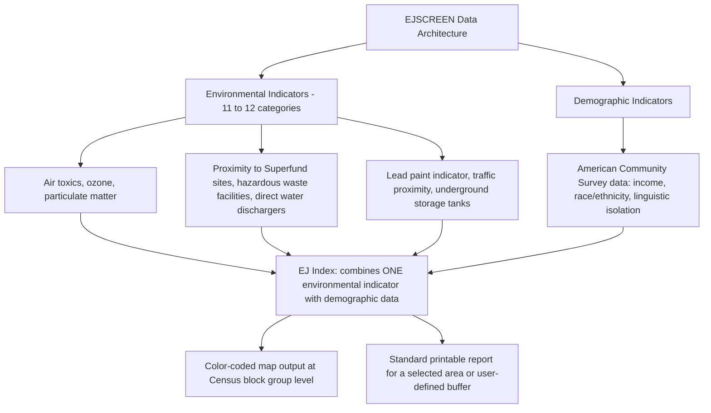

## Environmental Justice Mapping Tools and Data-Driven Advocacy

### Overview

Environmental justice mapping tools translate the movement's distributive justice claims (documented since the 1987 UCC report) into standardized, publicly accessible geospatial data — enabling regulators, advocates, researchers, and litigants to identify, quantify, and compare pollution burdens across communities at a granular geographic level. EPA's EJSCREEN, launched in 2015, was the flagship federal tool for over a decade; its shutdown in early 2025 (part of the broader executive rollback covered in the companion topic) has catalyzed a new phase of **independent, non-governmental mapping tool development**, illustrating both the durability of the underlying data-driven advocacy methodology and its continued vulnerability to federal infrastructure decisions.

---

### EJSCREEN: Technical Architecture and Methodology

#### Origins and Purpose

EPA released EJSCREEN on June 10, 2015, as an environmental justice screening and mapping tool using high-resolution maps combined with demographic and environmental data to identify places with potentially elevated environmental burdens and vulnerable populations. EJSCREEN was developed as one of several commitments EPA made under Plan EJ 2014, and EPA defined environmental justice — the standard the tool was built to operationalize — as the fair treatment and meaningful involvement of all people regardless of race, color, national origin, or income with respect to the development, implementation, and enforcement of environmental laws, regulations, and policies.

#### Data Architecture

- The tool combined **12 environmental indicators** individually with demographic information to generate distinct "EJ indexes" — each index pairing a single environmental variable (e.g., proximity to traffic) with demographic data to help identify communities facing the greatest potential for negative environmental and health effects.
- Data sources included publicly available datasets such as the American Community Survey (ACS) and the National Air Toxics Assessment.
- Geographic resolution operated at the **Census block group level** — a Census Bureau-defined area typically containing 600–3,000 residents — the finest standard geography at which reliable demographic and environmental data could be jointly displayed.
- Users could also generate **buffer reports**: a user-defined area (point, line, or polygon) with a radius of up to 10 miles, useful for analyzing the population and environmental conditions surrounding a specific facility, such as a factory seeking an emissions permit. For each indicator within a buffer, EJSCREEN calculated a population-weighted average across all residents estimated to live inside that buffer.
- The tool produced color-coded maps, bar charts, and standardized reports through an accessible web interface, and allowed users to compare a selected location against state, EPA regional, or national benchmarks.

#### Functional Uses Across Stakeholder Groups

| User Type | Primary Use |
| --- | --- |
| EPA and state regulators | Permitting decisions, enforcement targeting, rulemaking prioritization, outreach planning |
| Community advocacy organizations | Grant writing, educational programs, community awareness campaigns, litigation support |
| Academic researchers | Identifying study areas for pollution monitoring and public health research |
| Regulated industry (including waste sector) | Sustainability metric tracking and community impact assessment |
| Litigants and legal practitioners | Supporting evidentiary claims in permitting challenges and environmental justice litigation |

EPA explicitly anticipated broad, cross-sector use of the tool: engaging the public, meeting with stakeholder groups and affected people, and utilizing tools like EJSCREEN were described by the agency as critical ways to incorporate environmental justice considerations into EPA's rulemaking actions, and commentators specifically predicted EJSCREEN would serve as a powerful tool for environmental and citizen groups seeking to target advocacy toward EJ communities and the industrial operations within them.

---

### Data-Driven Advocacy: The Methodological Logic

The core advocacy logic mapping tools enable operationalizes each of the three EJ movement claims described in the origins topic:

| EJ Movement Claim | Mapping Tool Function |
| --- | --- |
| Distributive justice | Quantifies and visually displays disparities in pollution burden and demographic composition across geography, converting anecdotal community concern into standardized, comparable metrics |
| Procedural justice | Enables community members and advocates to independently generate evidence for public comment periods and permitting hearings, rather than relying solely on agency- or applicant-provided data |
| Corrective/recognitional justice | Supports historical and cumulative burden documentation (e.g., layering multiple environmental indicators over time) that can substantiate claims about compounded, legacy disparities |

**[Inference]** Because EJSCREEN's indicators and methodology were standardized and nationally consistent, the tool functioned as a kind of common evidentiary language across otherwise disparate advocacy contexts — a community group in one state and a regulator in another could reference the same indicator definitions and comparison benchmarks, which likely increased the tool's persuasive and legal utility relative to ad hoc, locally-developed pollution burden assessments.

---

### The 2025 Shutdown

EPA shut down EJSCREEN and other EJ-related programs throughout the first few months of 2025 following the change in presidential administration, as part of a broader directive to end EJ-related programs and reverse prior environmental justice investments and initiatives. When EJSCREEN went dark in early 2025, EPA ended public access to datasets that everyday people and companies — including the waste industry — had used for tracking pollution impacts on overburdened communities.

#### Documented Reliance and Impact

- The waste industry had used EJSCREEN to gather data supporting sustainability metrics, and some regulators had relied on the tool to help inform permitting decisions.
- Academic researchers, including a Johns Hopkins hazardous air pollutant mapping project led by Professor Peter DeCarlo, had used EJSCREEN to determine which neighborhoods to prioritize for monitoring and measurement — illustrating the tool's role in directing scarce research and monitoring resources toward the communities the data identified as highest-burden.

---

### Post-Shutdown Response: Independent Tool Development

Rather than the underlying data-driven advocacy methodology disappearing alongside the federal tool, former EPA officials, academics, researchers, and community activists have begun building **independent, non-governmental replacement infrastructure**:

- At a DC Climate Week discussion, speakers highlighted how independent screening tools can inform future environmental policies and help communities advocate for themselves through data, particularly as EPA now actively discourages environmental justice initiatives.
- Tai Lung, a former EPA employee and one of EJSCREEN's original developers, now co-leads the **Environmental & Health Data Analysis Trust**, a group formed specifically to create new environmental screening platforms — describing the current moment as an opportunity to take what was built under EJSCREEN as a base and "go much, much further."
- This effort connects to the broader data-preservation response documented in the companion topic on executive rollback, where the Public Environmental Data Project has separately worked to archive and mirror federal environmental justice datasets (including CEJST) at risk of permanent loss.

**[Speculation]** Because these successor tools are being built by developers with direct EJSCREEN development experience but without federal government backing, funding, or official data-access privileges, their long-term technical parity with the original federal tool, their update cadence, and their legal/evidentiary weight in future permitting and litigation contexts remain uncertain and will likely depend on sustained non-governmental funding and institutional support.

---

### Comparative Framework: Federal vs. Independent Mapping Tools

| Dimension | EJSCREEN (Federal, pre-2025) | Independent Successor Tools (2025–) |
| --- | --- | --- |
| Institutional backing | EPA (federal government) | Nonprofits, academic partnerships, former federal staff |
| Data access privileges | Direct access to federal administrative datasets | Dependent on publicly available or archived data |
| Legal/regulatory weight | Directly used in agency permitting, enforcement, rulemaking | Uncertain; may carry less formal regulatory weight absent federal adoption |
| Funding model | Federal appropriations | Grants, nonprofit funding, uncertain long-term sustainability |
| Update cadence | Regular EPA-maintained updates | To be determined based on new developer capacity |
| Geographic/methodological consistency | Nationally standardized | Being newly designed; consistency with prior EJSCREEN methodology not guaranteed |

---

### Practical Example: Using Mapping Data in an Advocacy or Legal Context

**Example.** A community organization is preparing public comments opposing a new industrial facility permit and wants to build a data-driven case.

1. **Identify available data source**: Given EJSCREEN's federal shutdown, the organization should first check whether a state-specific tool exists (e.g., NJDEP's EJ Mapping, Assessment and Protection Tool, discussed in the companion cumulative impacts topic) or whether an independent successor platform (e.g., from the Environmental & Health Data Analysis Trust) has launched and covers the relevant jurisdiction.
2. **Generate a buffer analysis**: Using the available tool, define a buffer area around the proposed facility site (historically up to 10 miles in EJSCREEN) to calculate population-weighted demographic and environmental burden indicators for residents in the affected zone.
3. **Layer cumulative context**: Where the tool supports it, layer data on existing nearby facilities and historical pollution sources to build a cumulative burden narrative — directly supporting the corrective/recognitional justice argument that this community already bears disproportionate legacy burden.
4. **Cite in formal comments/litigation**: Incorporate the generated report and maps into public comment submissions or litigation exhibits, framing the quantified disparity data alongside the applicable legal standard (e.g., a state cumulative impacts statute's "comparison levels," or a Title VI administrative complaint's disparate impact showing).

This example illustrates that data-driven environmental justice advocacy methodology has outlived the specific federal tool that pioneered it — but its continued practical effectiveness now depends on the success, credibility, and sustained funding of the independent and state-level successor tools emerging in the tool's absence.

---

**Related Topics / Next Steps**

- NJDEP's EJ Mapping, Assessment and Protection Tool (cross-reference: Cumulative Impact Analysis in Permitting Decisions)
- The Public Environmental Data Project and federal dataset preservation efforts (cross-reference: Executive and Agency EJ Initiatives Rollback)
- Environmental & Health Data Analysis Trust and other emerging independent screening platforms
- Using GIS and buffer analysis methodology in environmental permitting comment submissions
- State-level EJ mapping tool development (New York's forthcoming EJ Siting Law tools, California's CalEnviroScreen)
- Data quality and methodological transparency standards for advocacy-oriented environmental datasets
- The evidentiary weight of screening tool data in Title VI administrative complaints and state permitting litigation
- Academic research applications: using EJ mapping data to prioritize pollution monitoring site selection