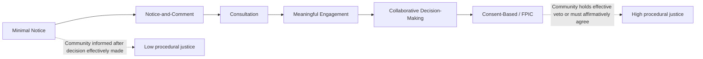

## Community Engagement, Consultation, and Consent-Based Siting Practices

### Overview

Community engagement, consultation, and consent-based siting practices operationalize the **procedural justice** claim central to the environmental justice movement (see: Origins and Core Claims) — the demand that affected communities have meaningful voice, not just formal notice, in decisions about locally undesirable land uses (LULUs) sited in or near their neighborhoods. This topic covers the spectrum of engagement models used in environmental permitting and facility siting, from minimal notice-and-comment procedures through free, prior, and informed consent (FPIC) frameworks originating in international indigenous rights law, and examines how these models have been codified into binding permitting requirements such as New Jersey's Environmental Justice Impact Statement process.

---

### The Participation Spectrum

Environmental justice scholarship and advocacy frame community engagement along a spectrum, often adapted from Sherry Arnstein's classic "ladder of citizen participation" framework, distinguishing between:

| Level | Description | Legal Status |
| --- | --- | --- |
| **Notice** | Community informed a decision is being considered, often after key parameters are already set | Minimum standard under conventional administrative law (APA notice requirements) |
| **Notice-and-comment** | Formal opportunity to submit written or oral comments within a defined period | Standard requirement for most environmental permitting and NEPA processes |
| **Consultation** | Agency or applicant actively solicits community input, potentially through meetings or hearings, but retains full decision-making authority | Increasingly required under state EJ statutes; not universally binding |
| **Meaningful engagement** | Community input is substantively considered and can alter proposed conditions, mitigation, or outcome; often includes technical assistance to the community | Codified in advanced state EJ frameworks (e.g., New Jersey) |
| **Consent-based siting** | Community's affirmative agreement is a precondition to proceeding, or community holds an effective veto | Standard in some indigenous consultation frameworks (FPIC); rare in general U.S. environmental permitting outside specific contexts |

---

### The Procedural Justice Critique of Conventional Notice-and-Comment

Conventional environmental permitting has historically relied on formal notice-and-comment procedures modeled on the federal Administrative Procedure Act: publishing a proposed action, accepting written comments during a defined window, and holding public hearings. Environmental justice advocates have identified several structural limitations in this model as applied to overburdened communities:

- **Timing**: Notice frequently arrives after significant technical and financial commitments have already been made by the applicant and agency, reducing the practical likelihood that community input will alter the outcome.
- **Accessibility barriers**: Public hearings scheduled during working hours, held only in English, or requiring in-person attendance at inconvenient locations systematically disadvantage low-income and limited-English-proficiency communities relative to better-resourced constituencies.
- **Technical asymmetry**: Understanding and meaningfully responding to complex environmental impact statements, emissions modeling, or engineering specifications typically requires technical expertise communities often lack access to, absent dedicated funding or technical assistance.
- **No obligation to alter outcome**: Agencies are typically required only to consider comments, not to demonstrate that community input meaningfully influenced the final decision — creating a risk that engagement functions as a procedural formality rather than genuine participation.

---

### Codified "Meaningful Engagement" Requirements: The New Jersey Model

New Jersey's Environmental Justice Rules (covered in depth in the companion Cumulative Impact Analysis topic) provide the most developed codification of "meaningful engagement" as a binding permitting requirement in current U.S. law, illustrating how the participation spectrum above can be translated into enforceable regulatory obligations.

#### Structural Requirements

Covered facilities in overburdened communities must, as part of their Environmental Justice Impact Statement process:

1. **Conduct meaningful public engagement** with the affected community — a standard distinct from and more demanding than standard notice-and-comment, though the specific procedural content (meeting accessibility, language access, timing relative to key decision points) is defined through NJDEP implementing guidance.
2. **Provide technical assistance** to communities, directly addressing the technical asymmetry critique by ensuring affected residents have support in understanding and responding to complex permit applications.
3. **Integrate community input into decision criteria**, since the resulting Environmental Justice Impact Statement — including its public engagement record — directly feeds into NJDEP's determination of whether to deny, condition, or approve the permit, rather than functioning as a documentation exercise collected but not substantively weighed.

#### Judicial Validation

The New Jersey Appellate Division's January 2026 decision upholding the EJ Rules against comprehensive challenge (including arguments the rules were unconstitutionally vague and overbroad) confirms these meaningful engagement requirements are a legally sustainable baseline permitting requirement — providing precedent that "meaningful engagement" can be defined with sufficient specificity to survive vagueness and administrative procedure challenges.

---

### Free, Prior, and Informed Consent (FPIC): The Indigenous Rights Model

Free, prior, and informed consent represents the strongest point on the participation spectrum, originating in international indigenous rights instruments and increasingly invoked as an aspirational or, in specific contexts, binding standard for siting decisions affecting indigenous communities and their lands.

#### Core Elements

- **Free**: consent given without coercion, intimidation, or manipulation.
- **Prior**: consent sought sufficiently in advance of any authorization or commencement of activities, allowing genuine time for internal community decision-making processes.
- **Informed**: consent based on access to complete, accurate, and accessible information about the proposed activity's nature, scope, and potential impacts.
- **Consent**: unlike consultation, which requires only that input be solicited and considered, consent requires the community's **affirmative agreement** — implying an effective ability to decline or withhold approval, not merely to comment.

#### Legal Status in the U.S. Context

- FPIC principles derive primarily from international instruments such as the UN Declaration on the Rights of Indigenous Peoples (UNDRIP) and are more fully codified as binding legal standards in some other jurisdictions (e.g., certain Canadian provincial frameworks, some international financial institution safeguard policies) than in general U.S. domestic environmental law.
- Within the U.S., FPIC-adjacent obligations arise most concretely through the **government-to-government consultation requirements** applicable to federally recognized tribes under specific statutory and executive frameworks (e.g., tribal consultation requirements under NEPA, the National Historic Preservation Act, and various executive orders governing federal-tribal relations) — though these consultation requirements, even where robust, typically fall short of a true consent/veto standard as formally codified in FPIC.
- **[Inference]** Because U.S. domestic environmental law generally has not codified a binding consent (as opposed to consultation) standard outside the tribal context, FPIC functions primarily as an aspirational benchmark and advocacy framework for evaluating the adequacy of engagement processes, rather than as directly enforceable U.S. federal or state general-population environmental law — this distinguishes it from New Jersey's "meaningful engagement" standard, which is consultation-based (weighted, technically-assisted, and outcome-relevant) rather than consent-based.

---

### Comparative Framework: Engagement Models in Practice

| Model | Community Role | Legal Enforceability (U.S.) | Example |
| --- | --- | --- | --- |
| Standard APA notice-and-comment | Passive; comments considered but not determinative | Baseline requirement for most federal/state permitting | General NEPA/permitting practice absent specific EJ statute |
| "Meaningful engagement" (NJ model) | Active; technical assistance provided; input feeds into binding decision criteria | Binding under state statute, judicially upheld | New Jersey Environmental Justice Rules |
| Tribal government-to-government consultation | Active; formal consultation channel with tribal governments specifically | Binding for federally recognized tribes under specific frameworks; scope and depth vary | NEPA tribal consultation; NHPA Section 106 |
| Free, Prior, and Informed Consent (FPIC) | Determinative; community can withhold consent | Largely aspirational in U.S. domestic law; more binding internationally | UNDRIP; some international financial institution safeguards |

---

### Practical Example: Structuring an Engagement Process for a Proposed Facility

**Example.** A developer is preparing a permit application for a facility in a low-income community and wants to design an engagement process that satisfies both legal minimums and genuine procedural justice objectives.

1. **Baseline legal compliance**: Confirm whether the site is in a jurisdiction with a codified EJ statute (e.g., New Jersey's OBC framework); if so, the meaningful engagement, technical assistance, and EJIS requirements are mandatory, not optional.
2. **Timing**: Initiate community engagement **before** finalizing key technical and siting decisions, addressing the timing critique of conventional notice-and-comment.
3. **Accessibility design**: Schedule meetings at varied times (including evenings/weekends), provide language access services proportional to the community's linguistic composition, and offer both in-person and remote participation options.
4. **Technical assistance provision**: Fund or facilitate independent technical review capacity for the community — for example, supporting a community organization's ability to retain independent technical experts to evaluate the application, consistent with the New Jersey model's technical assistance requirement.
5. **Documentation and responsiveness**: Maintain a transparent record showing how community input was substantively considered and, where feasible, incorporated into project design, mitigation commitments, or permit conditions — building the evidentiary record needed both for regulatory compliance and to withstand potential legal challenge.
6. **Indigenous community considerations**: If the project affects tribal lands, treaty rights, or resources of concern to a federally recognized tribe, initiate formal government-to-government consultation separately and in addition to general community engagement, recognizing this triggers a distinct legal framework with its own procedural requirements.

This example illustrates the core lesson of this topic: while general U.S. environmental law has not moved to a consent-based standard for the broader population, the trajectory from minimal notice toward codified "meaningful engagement" — as demonstrated and judicially validated in New Jersey — represents the practical frontier of procedural justice currently enforceable in U.S. permitting law, with FPIC remaining the aspirational reference point advocates continue to invoke.

---

**Related Topics / Next Steps**

- Sherry Arnstein's "Ladder of Citizen Participation" and its application to environmental permitting
- NJDEP's technical assistance program structure and funding mechanisms under the EJ Rules
- Tribal government-to-government consultation requirements under NEPA and the National Historic Preservation Act
- UN Declaration on the Rights of Indigenous Peoples (UNDRIP) and FPIC in comparative international law
- Language access and limited-English-proficiency accommodation requirements in environmental permitting
- Comparative state approaches to codifying "meaningful engagement" beyond New Jersey
- Community benefit agreements as a complementary, negotiated alternative to formal regulatory engagement requirements
- Cross-reference: Cumulative Impact Analysis in Permitting Decisions (New Jersey EJIS procedural mechanics)