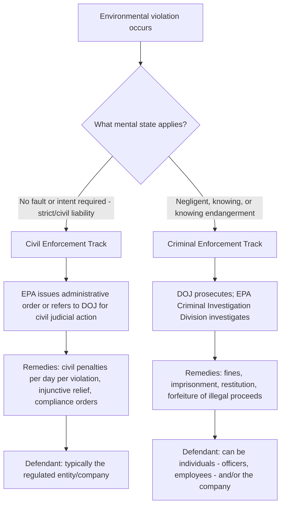
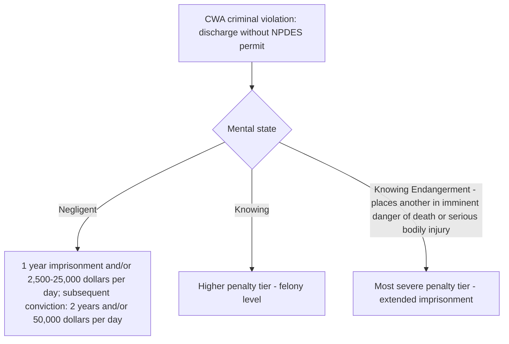

## Civil and Criminal Enforcement Authority Across the Major Environmental Statutes

### Overview

Most major federal environmental statutes contain **both civil and criminal enforcement provisions**, giving EPA and the Department of Justice dual tracks of authority to compel compliance and punish violations. Understanding when conduct triggers civil versus criminal liability — and the distinct mental-state, procedural, and penalty structures each track carries — is foundational to environmental compliance practice. This topic surveys the enforcement architecture across the Clean Air Act (CAA), Clean Water Act (CWA), Resource Conservation and Recovery Act (RCRA), CERCLA/Superfund, the Safe Drinking Water Act (SDWA), and TSCA, and presents current (FY2025) penalty figures and enforcement statistics.

---

### The Civil/Criminal Divide: Core Distinctions

| Dimension | Civil Enforcement | Criminal Enforcement |
| --- | --- | --- |
| Required mental state | None — civil liability does not take into consideration what the responsible party knew about the law or regulation violated; the fact that noncompliance occurred is sufficient | Requires the violator to have acted negligently or "knowingly" — aware that their actions violated the law before the violation was committed |
| Who can be liable | Primarily companies/regulated entities | Both individuals (officers, employees) and companies |
| Possible consequences | Monetary civil penalties, injunctive relief, compliance orders | Fines, imprisonment, restitution, forfeiture of illegal proceeds |
| Burden of proof | Preponderance of the evidence (standard civil standard) | Beyond a reasonable doubt |
| Typical initiator | EPA administrative process or DOJ civil referral | DOJ prosecution, supported by EPA's Criminal Investigation Division |

---

### Statutes EPA Enforces with Dual Civil/Criminal Authority

Most of these laws contain both civil and criminal provisions which give EPA the authority to take action against violators. The core statutes include:

| Statute | Subject Matter |
| --- | --- |
| Clean Air Act (CAA) | Air emissions, mobile source standards, hazardous air pollutants |
| Clean Water Act (CWA) | Discharges to waters of the United States, NPDES permitting |
| Resource Conservation and Recovery Act (RCRA) | Hazardous and solid waste generation, transport, treatment, storage, disposal |
| Comprehensive Environmental Response, Compensation, and Liability Act (CERCLA) | Hazardous substance release response and cleanup liability ("Superfund") |
| Emergency Planning and Community Right-to-Know Act (EPCRA) | Chemical release reporting and community right-to-know |
| Safe Drinking Water Act (SDWA) | Public water system contamination standards |
| Toxic Substances Control Act (TSCA) | Chemical substance manufacture, processing, and use |
| Federal Insecticide, Fungicide, and Rodenticide Act (FIFRA) | Pesticide registration and use |
| American Innovation and Manufacturing (AIM) Act | Hydrofluorocarbon (HFC) production and consumption |
| Oil Pollution Act (OPA) | Oil spill response and liability |
| Asbestos Hazard Emergency Response Act (AHERA) | Asbestos in schools |
| Residential Lead-Based Paint Hazard Reduction Act | Lead paint disclosure and abatement |

The civil enforcement program is responsible for ensuring that regulated parties — businesses, federal entities, and individuals — follow the laws and regulations for air and water pollution, hazardous and solid waste, drinking water contamination, and exposure to lead, asbestos, pesticides, and other toxic chemicals; breaking the law on purpose may separately bring criminal enforcement actions, which can result in jail time, fines, and/or restitution.

---

### Current Civil Penalty Maximums (Effective January 8, 2025)

EPA is required by the Federal Civil Penalties Inflation Adjustment Act Improvements Act of 2015 to publish annual inflation-adjusted updates to its civil penalty maximums by January 15 each year; the 2025 adjustment raised minimum and maximum fines by approximately 1.02% over 2024 levels, applying to violations occurring on or after January 8, 2025.

| Statute | 2024 Maximum (per day) | 2025 Maximum (per day) |
| --- | --- | --- |
| Clean Air Act (CAA) | $121,275 (up to $460,926 daily maximum for certain violations) | $124,426 (up to $472,901 daily maximum for certain violations) |
| Clean Water Act (CWA) | $66,712 (up to $333,552 daily maximum) | $68,445 (up to $342,218 daily maximum) |
| RCRA | $90,702 | $93,058 |
| CERCLA/EPCRA (initial violation) | $69,733 | $71,545 |
| CERCLA (subsequent violation, maximum) | $209,202 | $214,637 |
| Safe Drinking Water Act (SDWA) | $69,733 | $71,545 |
| TSCA | $48,512 | $49,772 |
| FIFRA | $24,255 | $24,885 |

Statutory violations do not automatically result in the agency pursuing maximum fines; personnel involved in enforcement cases assess the appropriate penalty on a case-by-case basis, though these maximums guide EPA's enforcement decisions throughout the year. Some statutes additionally permit civil judicial enforcement **without a maximum penalty**, depending on the specific violation and enforcement pathway.

---

### FY2025 Civil Enforcement Program Results

In Fiscal Year 2025 (October 1, 2024 – September 30, 2025), EPA completed 2,127 civil enforcement cases — the highest number in nine years and approximately 13% more than FY2024 — resulting in:

- Reducing, treating, or eliminating nearly 116 million pounds of pollution across air, land, and water.
- Assessing over $650 million in civil penalties.
- Obtaining commitments of over $6.4 billion to return facilities to compliance (injunctive relief) — approximately 25% more than FY2024.
- Conducting nearly 8,300 inspections, the second highest in the last eight years.
- Receiving 538 voluntary disclosures or new-owner audit agreements covering violations at 957 facilities under EPA's self-disclosure policies.

#### Illustrative FY2025 Civil Cases

- A $9.5 million penalty announced January 17, 2025, described as one of the largest civil penalties ever paid for RCRA hazardous waste management violations.
- In March 2025, EPA reached a settlement with Manitowoc Company, Inc. — a Wisconsin-based manufacturer of mobile cranes — and two subsidiaries for violating the Clean Air Act's mobile source regulations related to the sale of cranes with falsely certified diesel engines; the company agreed to pay a $42.6 million civil penalty and take corrective action.
- In July 2025, EPA settled with CEMEX Construction Materials Pacific, LLC for Clean Water Act violations involving unpermitted wastewater and industrial stormwater discharges from a sand and gravel mine on the Pyramid Lake Paiute Tribe Reservation in Nevada; the company paid a $310,000 penalty and agreed to restore floodplain and riparian habitat within the Truckee River Watershed.

---

### Criminal Enforcement: Mental State Requirements and Penalty Structure

#### Tiered Mental State Standards (Clean Water Act Example)

Criminal provisions typically distinguish between negligent and knowing conduct, with escalating penalties, and reserve the most severe penalties for "knowing endangerment":

Under the Clean Water Act, a person who negligently or knowingly discharges a pollutant from a point source into a water of the United States without an NPDES or Section 404 permit (or in violation of a permit) faces, for **negligent** violations, up to 1 year imprisonment and/or $2,500–$25,000 per day, with subsequent convictions rising to 2 years and/or $50,000 per day; separate, more severe provisions address knowing violations, knowing endangerment, false statements, and tampering with monitoring equipment or methods.

#### FY2025 Criminal Enforcement Program Results

EPA's FY2025 criminal enforcement program results included 187 new cases opened, 156 defendants charged (the most since 2016), over $600 million in fines, restitution, and court-ordered relief, 65 years of incarceration, and forfeiture exceeding $1 billion in illegal proceeds.

#### Interagency Coordination

EPA's criminal program strengthens cooperative federalism by working collaboratively with state environmental crimes task forces, and works in cross-agency partnerships with the Department of Justice, FBI, DEA, Homeland Security Investigations, and Customs and Border Protection to investigate and prosecute criminal organizations whose conduct extends beyond environmental crimes; in FY2025, the program trained over 1,000 law enforcement officers at partner agencies on environmental crimes topics.

#### FY2025 Strategic Enforcement Priorities

- **Combating foreign-affiliated criminal networks**: EPA's Criminal Investigation Division focused on detecting, deterring, and dismantling foreign-affiliated criminal networks profiting from pollution, resulting in 13 defendants charged, two sentenced, and over $4.1 million in restitution.
- **Securing the southern border**: partnering with DOJ, HSI, and CBP to combat smuggling activities of transnational criminal organizations, resulting in 13 criminal defendants sentenced in FY2025.
- **Operation: Disrupt HFCs**: targeted enforcement against illegal hydrofluorocarbon trafficking under the AIM Act framework.

#### Historical Conviction Rate Context

**[Inference — illustrative of program rigor, not FY2025-specific]** EPA's criminal enforcement program achieved a 100% conviction rate of defendants in FY2023, following 96% in FY2021 and 94% in FY2022 — indicating that cases DOJ elects to prosecute criminally under environmental statutes historically carry a very high probability of conviction once charged, reflecting the deliberate case-selection process applied before pursuing the higher knowing/negligent mental-state burden required for criminal liability.

---

### Superfund/CERCLA Cleanup Enforcement (Distinct Track)

Beyond civil penalties and criminal prosecution, CERCLA carries a **third enforcement mechanism** specific to hazardous substance release cleanup: in FY2025, EPA finalized 65 Superfund enforcement instruments valued at more than $888 million, with $714.3 million directed to addressing nearly 59.4 million cubic yards of contaminated land and water, and $174.1 million to reimburse the agency for past cleanup costs — illustrating CERCLA's distinctive cost-recovery and cleanup-compulsion enforcement model layered atop its civil penalty provisions.

---

### Comparative Summary Table: Enforcement Architecture by Track

| Track | Mental State | Typical Defendant | Core Remedy | FY2025 Volume |
| --- | --- | --- | --- | --- |
| Civil | None required | Regulated entity/company | Monetary penalty + injunctive relief | 2,127 cases concluded; $650M+ penalties; $6.4B+ compliance commitments |
| Criminal | Negligent, knowing, or knowing endangerment | Individuals and/or companies | Fines, imprisonment, restitution, forfeiture | 187 new cases; 156 defendants charged; 65 years incarceration; $1B+ forfeiture |
| CERCLA cleanup enforcement | N/A (liability-based, largely strict) | Potentially responsible parties (PRPs) | Cleanup performance or cost reimbursement | 65 instruments finalized; $888M+ value |

---

### Practical Example: Assessing Enforcement Exposure

**Example.** A manufacturing facility discovers it has been discharging wastewater without a current NPDES permit for several months due to an administrative lapse in permit renewal.

1. **Civil exposure assessment**: Because civil liability requires no showing of fault or intent, the facility faces civil penalty exposure calculated on a per-day, per-violation basis at up to the current CWA maximum ($68,445 per day, or up to $342,218 daily maximum depending on violation type) for the entire period of unpermitted discharge, regardless of whether the lapse was inadvertent.
2. **Criminal exposure assessment**: If the lapse was genuinely inadvertent (the facility did not know the permit had expired and was not deliberately avoiding renewal), criminal liability is unlikely to attach absent a showing of negligence or knowing conduct — though a negligent discharge finding could still support criminal charges at the lower penalty tier (1 year and/or $2,500–$25,000 per day).
3. **Mitigation strategy**: Prompt self-disclosure to EPA under the agency's self-disclosure policies (which received 538 voluntary disclosures covering 957 facilities in FY2025 alone) may reduce civil penalty exposure and signal the absence of the "knowing" mental state that would support criminal referral.
4. **Escalation risk factors**: If investigation reveals the facility's management was aware of the permit lapse and continued discharging regardless, or if the discharge created a risk of harm to human health, this shifts the case from a civil compliance matter toward criminal referral, potentially exposing individual officers or employees — not just the company — to prosecution.

This example illustrates the practical stakes of the civil/criminal distinction: the same underlying conduct (unpermitted discharge) can result in either a civil penalty against the company or individual criminal liability for responsible employees, turning entirely on the mental-state evidence developed during investigation.

---

**Related Topics / Next Steps**

- EPA's self-disclosure and audit policies as civil/criminal risk mitigation tools
- Corporate criminal liability theories: responsible corporate officer doctrine in environmental prosecutions
- CERCLA potentially responsible party (PRP) liability framework and joint-and-several liability
- Cooperative federalism in environmental enforcement: state environmental crimes task force coordination
- Comparative penalty escalation: negligent vs. knowing vs. knowing endangerment standards across statutes
- The Federal Civil Penalties Inflation Adjustment Act and its annual recalculation mechanics
- Whistleblower and citizen suit provisions as supplementary enforcement mechanisms
- Corporate compliance program design to mitigate both civil and criminal enforcement exposure