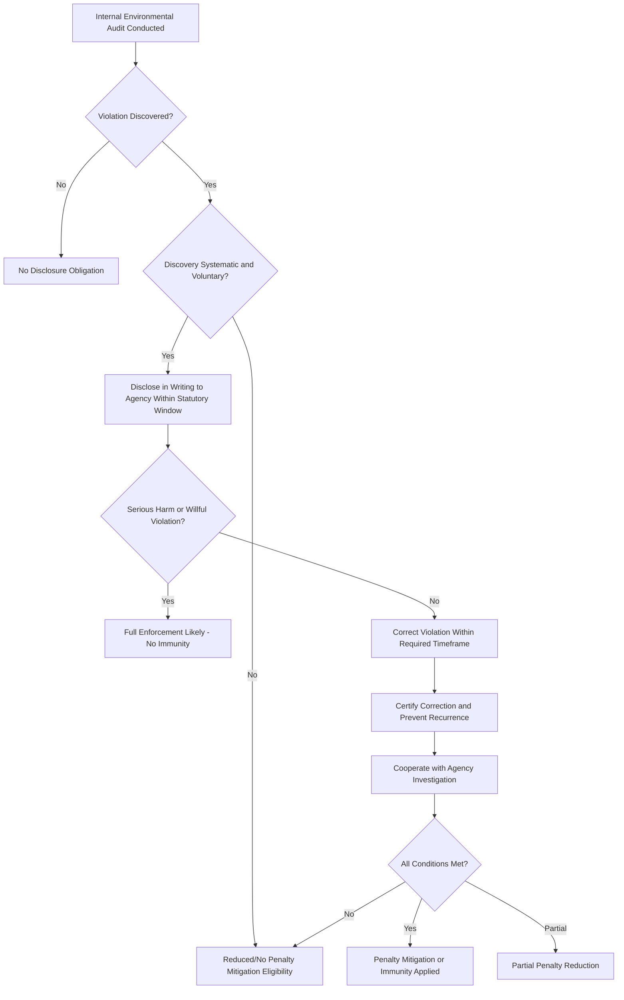

## Self-Disclosure Policies and the Audit Privilege

### Overview and Legal Rationale

Self-disclosure policies and audit privilege frameworks are regulatory mechanisms designed to incentivize voluntary environmental compliance by reducing the deterrent effect of strict, punitive enforcement. The underlying policy problem is that environmental laws often impose strict liability for violations, which can discourage regulated entities from conducting internal audits: a company that actively investigates its own compliance status risks uncovering violations it would otherwise not have detected, creating documentary evidence usable against it in enforcement actions. Self-disclosure and audit privilege regimes attempt to resolve this disincentive by offering reduced penalties, and in some jurisdictions evidentiary protections, in exchange for voluntary compliance monitoring and prompt correction of discovered violations.

These frameworks operate at the intersection of environmental law, administrative law, and evidence law, since they modify how administrative agencies exercise prosecutorial discretion and, in audit privilege statutes, how courts treat certain categories of internal documents.

### The U.S. EPA Audit Policy

**Key Points**

The U.S. Environmental Protection Agency's "Incentives for Self-Policing: Discovery, Disclosure, Correction and Prevention of Violations" (commonly the "Audit Policy," originally issued 1995, revised 2000) is the most widely referenced administrative model. It is not a statute or regulation but an enforcement discretion policy, meaning EPA retains authority to pursue enforcement notwithstanding the policy's terms, though it commits to specific penalty mitigation practices when conditions are met.

Nine conditions must generally be satisfied for full penalty mitigation under the policy:

1. **Systematic discovery** — the violation was found through an environmental audit or a documented compliance management system, not through happenstance.
2. **Voluntary discovery** — discovery was not required by a legal duty such as a permit condition, consent order, or judicial order.
3. **Prompt disclosure** — the violation is disclosed in writing to the regulatory agency within 21 days of discovery (a shorter window than many state analogs).
4. **Independent discovery** — disclosure occurs before the agency or a third party would likely have discovered the violation independently.
5. **Correction and remediation** — the violator corrects the violation within 60 days (or documents why more time is needed) and certifies correction.
6. **Prevent recurrence** — the entity agrees to take steps to prevent future recurrence of the violation.
7. **No repeat violations** — the same or a closely related violation has not occurred at the same facility within the past three years (or five years for multi-facility/corporate-wide patterns).
8. **No serious harm** — the violation did not cause serious actual harm to human health or the environment, or an imminent and substantial endangerment.
9. **Cooperation** — the entity cooperates with the agency as requested and does not obstruct the investigation.

**Penalty Effects**

- Full satisfaction of all nine conditions: EPA will not seek gravity-based civil penalties (the punitive component reflecting seriousness of the violation), though it retains discretion to seek recovery of the economic benefit gained from noncompliance, since allowing an entity to profit from delayed compliance would undermine deterrence for compliant competitors.
- Partial satisfaction (all except systematic discovery): EPA will reduce gravity-based penalties by up to 75%.
- The policy does not provide immunity from criminal prosecution, though disclosure and cooperation are treated as significant mitigating factors under the U.S. Department of Justice's own charging guidance for environmental crimes.

**[Inference]** In practice, EPA's exercise of discretion under the Audit Policy varies by region and program office, and outcomes for borderline cases (e.g., ambiguous "systematic discovery" determinations) are not fully predictable from the policy text alone.

### State Audit Privilege and Immunity Statutes

Roughly half of U.S. states have enacted environmental audit privilege and/or immunity statutes, which differ from the EPA Audit Policy in a legally significant way: they can create an evidentiary privilege enforceable in court, not merely a prosecutorial discretion commitment.

**Two Distinct Protections**

- **Audit privilege**: Shields the contents of a qualifying environmental audit report from discovery or admission as evidence in civil or administrative proceedings. This is analogous to attorney-client privilege in that it protects a category of communication, but it protects the audit document itself rather than legal advice.
- **Audit immunity**: Shields the discloser from civil or administrative penalties (and sometimes criminal penalties) for violations voluntarily disclosed and corrected, distinct from and often broader than the privilege protection.

**Typical Statutory Conditions**

State statutes generally require:

- The audit be conducted pursuant to a defined "environmental audit" (a systematic, documented, periodic, and objective review).
- Voluntary disclosure to the appropriate agency within a specified period (commonly 30 days, longer than EPA's 21-day standard).
- Diligent correction within a defined timeframe.
- The privilege/immunity does not apply where the violation involved knowing or willful conduct, resulted in serious harm, or where the disclosure was compelled by preexisting legal obligation.

**Limits on the Privilege**

Courts and statutes commonly carve out exceptions:

- Underlying factual data (e.g., raw monitoring or emissions data) is generally not privileged, even if it appears in an audit report, since a party cannot cloak otherwise discoverable facts in privilege merely by placing them in an audit document.
- Documents may lose privilege if used offensively by the audited party (e.g., cited to demonstrate good faith), or if the privilege is waived by voluntary disclosure to third parties.
- Federal environmental statutes and federal courts are not bound by state audit privilege statutes in federal enforcement actions or citizen suits, creating a significant limitation where state-privileged audit materials may still be discoverable in federal litigation.

**[Unverified]** The precise scope of "underlying data" exceptions and waiver doctrines varies considerably by state statute and case law; practitioners should consult the specific state statute and controlling case law rather than assume uniform treatment.

### Federal-State Tension and Preemption Concerns

EPA has historically expressed concern that state audit privilege statutes offering broad immunity could interfere with the federal-state cooperative enforcement structure under statutes like the Clean Air Act and Clean Water Act, which require states to maintain enforcement programs "no less stringent" than federal minimums. EPA's position (articulated in interim guidance during the 1990s) has been that it will evaluate state programs case by case and may decline to delegate or may withdraw authorization from state programs whose audit privilege/immunity laws are found to impair adequate enforcement, particularly where:

- Immunity extends to knowing or willful violations.
- Immunity extends to violations causing serious harm.
- The privilege would shield information EPA needs to determine compliance (e.g., under CWA NPDES self-monitoring reporting requirements).

Most state statutes were subsequently drafted or amended with exclusions tracking these EPA concerns, in order to preserve federal program authorization.

### Corporate Compliance Program Design Implications

**Key Points**

Legal and compliance departments must weigh audit privilege/self-disclosure incentives against several structural considerations when designing environmental management systems (EMS):

- **Documentation practices**: To qualify for privilege, audits typically must be conducted under conditions establishing they are a genuine, systematic audit (not an ad hoc investigation), often requiring a written audit plan, defined scope, and qualified personnel — considerations that shape how compliance counsel structures internal audit protocols from the outset.
- **Privilege log and segregation**: Entities relying on audit privilege commonly segregate privileged audit findings from routine operational records and factual monitoring data, since commingling privileged analysis with non-privileged factual data increases litigation risk around waiver and scope disputes.
- **Timing discipline**: Both the EPA Audit Policy (21 days) and most state statutes impose short disclosure windows running from "discovery," which requires compliance programs to have internal escalation procedures capable of moving audit findings to a disclosure decision quickly.
- **Interaction with attorney-client privilege**: Many corporate environmental audits are conducted under the direction of legal counsel specifically to layer attorney-client privilege and work-product protection atop any statutory audit privilege, since statutory audit privileges are often narrower or more easily defeated than these common-law protections.

### Comparative Note: Beyond the U.S.

**[Inference]** Similar self-disclosure incentive structures exist in other jurisdictions' environmental regulatory frameworks (e.g., aspects of the EU's Environmental Liability Directive framework and various national environmental compliance assurance schemes), though the doctrinal structure (privilege vs. prosecutorial discretion vs. statutory defense) differs by legal system, and detailed comparative treatment is outside the scope of the U.S.-centered administrative law framework addressed here unless the relevant jurisdiction is specified.

### Process Flow Diagram

### Illustration: Protection Scope Comparison

<svg xmlns="http://www.w3.org/2000/svg" viewBox="0 0 760 320">
<text x="380" y="30" text-anchor="middle" font-size="18" font-weight="bold" fill="#1a1a1a">Audit Privilege vs. Audit Immunity (svg_diagram)</text>
<rect x="40" y="60" width="320" height="220" rx="10" fill="#eaf2fb" stroke="#2b6cb0" stroke-width="2" />
<text x="200" y="90" text-anchor="middle" font-size="15" font-weight="bold" fill="#2b6cb0">Audit Privilege</text>
<text x="60" y="120" font-size="12" fill="#1a1a1a">Protects:</text>
<text x="70" y="140" font-size="12" fill="#1a1a1a">- Audit report contents</text>
<text x="70" y="158" font-size="12" fill="#1a1a1a">- Internal analysis/opinions</text>
<text x="60" y="185" font-size="12" fill="#1a1a1a">Does NOT protect:</text>
<text x="70" y="205" font-size="12" fill="#1a1a1a">- Underlying raw data</text>
<text x="70" y="223" font-size="12" fill="#1a1a1a">- Preexisting monitoring records</text>
<text x="60" y="250" font-size="12" fill="#1a1a1a">Effect: Evidentiary</text>
<text x="70" y="268" font-size="12" fill="#1a1a1a">(discovery/admissibility bar)</text>
<rect x="400" y="60" width="320" height="220" rx="10" fill="#eafaf0" stroke="#2f855a" stroke-width="2" />
<text x="560" y="90" text-anchor="middle" font-size="15" font-weight="bold" fill="#2f855a">Audit Immunity</text>
<text x="420" y="120" font-size="12" fill="#1a1a1a">Protects:</text>
<text x="430" y="140" font-size="12" fill="#1a1a1a">- Discloser from penalties</text>
<text x="430" y="158" font-size="12" fill="#1a1a1a">- For disclosed/corrected violations</text>
<text x="420" y="185" font-size="12" fill="#1a1a1a">Does NOT protect:</text>
<text x="430" y="205" font-size="12" fill="#1a1a1a">- Willful/knowing violations</text>
<text x="430" y="223" font-size="12" fill="#1a1a1a">- Violations causing serious harm</text>
<text x="420" y="250" font-size="12" fill="#1a1a1a">Effect: Substantive</text>
<text x="430" y="268" font-size="12" fill="#1a1a1a">(penalty/liability bar)</text>
</svg>

### Practical Example

A manufacturing facility's environmental compliance team conducts a scheduled internal audit under a written EMS protocol. The audit reveals that a wastewater outfall has intermittently exceeded permitted total suspended solids (TSS) limits over the prior four months due to a filtration system malfunction, a fact not previously known to the facility (systematic and voluntary discovery). Counsel confirms the exceedance did not cause documented environmental harm and is not a repeat violation. The facility:

1. Discloses the exceedance in writing to the state environmental agency within the statutory window (e.g., 21 or 30 days from discovery, depending on jurisdiction).
2. Repairs the filtration system and implements enhanced monitoring within the required correction period.
3. Certifies correction and documents preventive measures (e.g., revised maintenance schedule, automated alarm thresholds).
4. Cooperates fully with any agency inquiry regarding the audit findings.

**Output**: Assuming full satisfaction of applicable conditions, gravity-based penalties are waived or substantially reduced; economic benefit (avoided treatment costs during the exceedance period) may still be assessed. The underlying discharge monitoring reports (DMRs) remain independently discoverable as factual compliance data regardless of audit privilege, since self-monitoring data required under the permit is not eligible for privilege protection.

### Conclusion

Self-disclosure policies and audit privilege regimes represent a negotiated compromise between deterrence-based enforcement and voluntary compliance incentives. The EPA Audit Policy operates as a discretionary penalty-mitigation framework rather than a binding legal privilege, while state audit privilege/immunity statutes can create enforceable evidentiary and liability protections, subject to significant statutory exceptions for willful conduct, serious harm, and underlying factual data. Effective corporate environmental compliance programs are structured with these distinctions in mind, particularly regarding audit documentation practices, disclosure timing, and the interplay with attorney-client privilege.

**Related Topics**

- Attorney-client privilege and work-product doctrine in environmental compliance audits
- EPA's "Next Generation Compliance" and self-monitoring/reporting enforcement tools
- Corporate criminal liability under environmental statutes (CWA, CAA, RCRA criminal provisions)
- Environmental Management Systems (EMS) and ISO 14001 as compliance program frameworks
- Citizen suit provisions and their interaction with self-disclosed violations
- Supplemental Environmental Projects (SEPs) as penalty mitigation tools
- Whistleblower protections and their intersection with internal audit disclosure