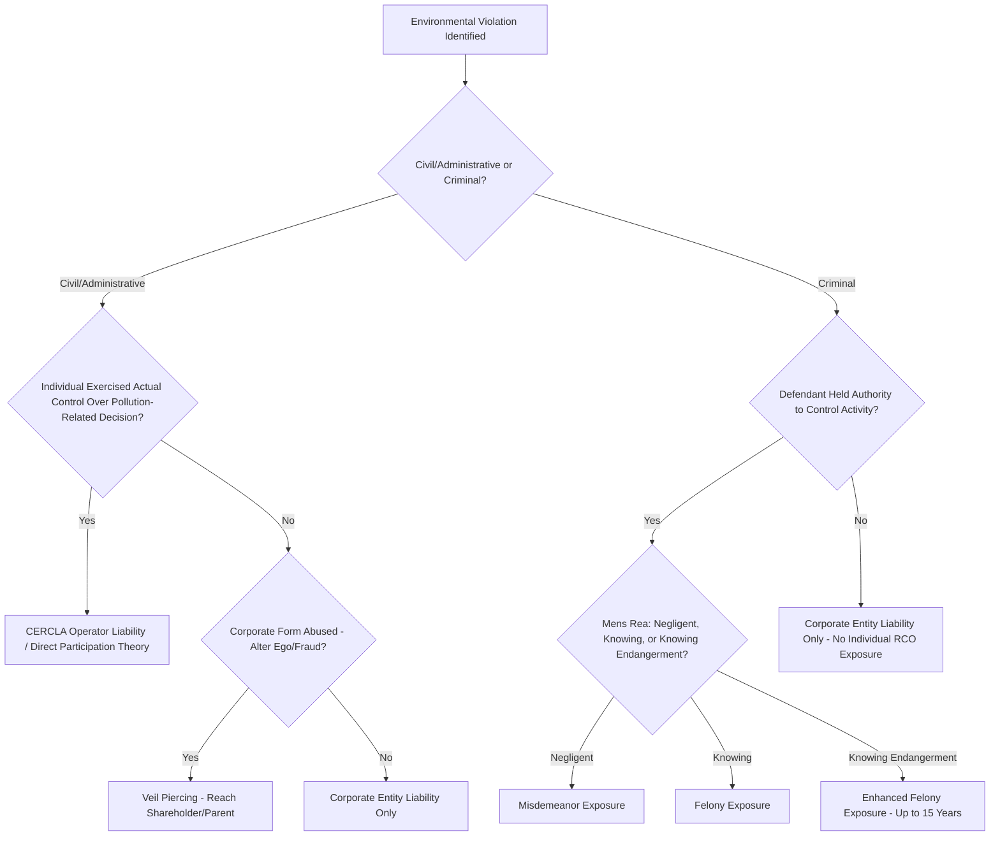

## Corporate and Individual Officer Liability for Environmental Violations

### Overview and Doctrinal Foundations

Environmental statutes in the United States impose liability not only on the corporate entity that owns or operates a regulated facility but, in defined circumstances, on individual officers, directors, and employees personally. This departs from the general common-law presumption that a corporation's separate legal personality shields its human agents from liability for corporate acts. Personal liability for environmental violations rests on several overlapping doctrinal bases: statutory "responsible corporate officer" (RCO) provisions, common-law piercing of the corporate veil, direct participation theory, and, in the criminal context, the "responsible corporate officer" doctrine as elaborated in federal case law.

**Key Points**

- Liability exposure differs sharply between civil/administrative and criminal contexts; criminal liability standards for individuals are generally more developed and more frequently litigated.
- Corporate liability and individual liability are not mutually exclusive — both the entity and responsible individuals may be charged for the same underlying conduct.
- The rationale for individual liability is deterrence-based: environmental statutes assume that holding decision-makers personally accountable produces stronger compliance incentives than entity-only liability, since fines against a corporation may be treated as a cost of doing business, whereas personal criminal exposure (including imprisonment) is not.

### Corporate Liability: General Principles

**Strict Liability Elements**

Many federal environmental statutes (e.g., the Clean Water Act, Clean Air Act, RCRA) impose strict liability for the civil violation itself — meaning the government need not prove intent or negligence to establish a discharge or emissions violation occurred. Corporate civil liability typically attaches automatically to the entity holding the permit or owning/operating the facility, without regard to which individual employee caused the violation.

**Successor Liability**

Corporate liability can extend to successor entities through:

- **Merger or consolidation**: the surviving corporation generally assumes the predecessor's environmental liabilities.
- **Asset purchase with continuity of enterprise**: courts in some jurisdictions apply a "substantial continuity" test, examining factors such as continuity of management, personnel, physical location, and business operations, to determine whether an asset purchaser inherits environmental liability despite the general rule that asset purchasers do not assume seller liabilities.
- **CERCLA-specific successor rules**: Under the Comprehensive Environmental Response, Compensation, and Liability Act (CERCLA), liability for cleanup costs attaches to current owners/operators, owners/operators at the time of disposal, arrangers, and transporters — a framework broad enough that corporate reorganizations rarely extinguish liability entirely.

**[Inference]** The precise successor-liability test applied (e.g., "substantial continuity," "mere continuation," or strict privity) varies by circuit and by statute, so outcomes in specific transactions require jurisdiction-specific analysis.

### Individual Civil and Administrative Liability

**Statutory "Person" Definitions**

Most major federal environmental statutes define "person" broadly enough to include individuals, not just corporate entities. For example, CERCLA §101(21) defines "person" to include individuals, and courts have held that corporate officers who exercise control over a facility's hazardous substance handling can be personally liable as "operators" under CERCLA §107(a).

**The CERCLA "Operator" Test**

Under *United States v. Bestfoods* (1998), the U.S. Supreme Court held that a parent corporation (and by extension, an individual officer) may be held directly liable as an "operator" under CERCLA only where that party exercised actual control over, or actively participated in, the operations specifically related to pollution — that is, control over decisions involving compliance with environmental regulations, not merely general corporate oversight or ordinary incidents of ownership. Key doctrinal points:

- Mere status as a corporate officer or shareholder is insufficient; the government or private plaintiff must show the individual's own actions or decisions caused or contributed to the environmental harm.
- Courts examine factors such as: did the individual have decision-making authority over waste disposal, environmental compliance, or the specific activity giving rise to liability; did the individual actually direct or participate in that activity.
- This is a direct liability theory distinct from veil-piercing, since it does not require disregarding the corporate form — it holds the individual liable for their own conduct as an "operator" under the statutory definition.

### Individual Criminal Liability: The Responsible Corporate Officer Doctrine

**Key Points**

Criminal provisions of the Clean Water Act, Clean Air Act, and RCRA extend liability to "any responsible corporate officer" who negligently or knowingly violates statutory requirements. This RCO doctrine draws on the older public welfare offense line of cases (*United States v. Dotterweich*, 1943; *United States v. Park*, 1975, both decided under the Food, Drug, and Cosmetic Act) and has been adapted by federal courts to environmental statutes.

**Doctrinal Elements**

Under the RCO doctrine as applied in environmental prosecutions, the government generally must show:

1. The defendant held a position of authority within the corporate structure — not necessarily a formal title, but actual authority to control the activity causing the violation.
2. The defendant had the power or capacity to prevent or correct the violation (i.e., could have acted to ensure compliance).
3. The defendant failed to exercise that authority, and the violation occurred.

Some circuits require the government to prove the officer had actual knowledge of the violation (for "knowing" violation provisions) or that the officer's negligence in failing to prevent the violation satisfies a "negligent" violation standard, since RCA/CWA/CAA criminal provisions include both knowing and negligent violation tiers with different mens rea requirements and different penalty ranges.

**[Unverified]** The exact contours of the "authority to control" requirement, and whether constructive knowledge suffices for "knowing" violations, differ somewhat across the circuits that have addressed the issue; the doctrine has not been definitively unified by the Supreme Court in the environmental context specifically.

### Mens Rea Tiers in Federal Environmental Criminal Statutes

| Statute | Negligent Violation | Knowing Violation | Knowing Endangerment |
| --- | --- | --- | --- |
| Clean Water Act §309(c) | Misdemeanor; fines and/or up to 1 year imprisonment | Felony; fines and/or up to 3 years imprisonment (up to 6 for subsequent) | Felony; up to 15 years imprisonment |
| Clean Air Act §113(c) | Misdemeanor (negligent release causing death/serious injury) | Felony; up to 5 years imprisonment (various provisions) | Felony; up to 15 years imprisonment, higher fines for organizations |
| RCRA §3008(d)-(e) | N/A (primarily knowing standard) | Felony; up to 5 years imprisonment | Felony; up to 15 years imprisonment |

**[Inference]** Specific fine amounts under these provisions are subject to periodic inflation adjustments under the Federal Civil Penalties Inflation Adjustment Act and DOJ sentencing guideline calculations; practitioners should verify current statutory maxima rather than rely on historical figures.

### Piercing the Corporate Veil

Distinct from statutory RCO and CERCLA operator liability, plaintiffs (including government enforcers) may seek to pierce the corporate veil to reach shareholders or parent corporations under general common-law principles, typically requiring a showing that:

- The corporation was used as a mere instrumentality or alter ego of the individual/parent (unity of interest such that separate personalities no longer exist).
- Adherence to the corporate fiction would sanction fraud, promote injustice, or work an inequitable result.

Veil-piercing analysis in environmental cases often considers factors such as undercapitalization relative to foreseeable environmental liabilities, commingling of funds, disregard of corporate formalities, and whether the corporate structure was used specifically to evade known or anticipated environmental obligations.

**[Inference]** Courts are generally more reluctant to pierce the corporate veil than to apply direct "operator" liability theories under CERCLA, since veil-piercing requires disregarding the corporate form entirely rather than simply attributing an individual's own conduct to them.

### Corporate Compliance Program Relevance

Compliance program design should account for the following liability-shaping considerations for individual officers and managers:

- **Documented delegation and authority**: Because RCO and CERCLA operator liability turn substantially on actual authority and control, clear documentation of who holds decision-making authority over environmental compliance functions affects both liability exposure and defense strategy.
- **Environmental compliance officer (ECO) role design**: Designating a specific ECO with defined authority can centralize accountability, but this designation itself creates a documented "responsible corporate officer" profile, so counsel must weigh centralization benefits against concentrated personal liability exposure for the designated individual.
- **D&O insurance limitations**: Directors and officers liability insurance policies frequently contain exclusions for criminal acts, knowing violations, or civil penalties (as distinct from compensatory damages), meaning individual officers may face liability exposure not covered by standard D&O policies, particularly for knowing environmental violations.
- **Indemnification limits**: Corporate indemnification of officers for civil penalties or criminal fines may be limited or void as against public policy in some jurisdictions, since permitting indemnification could undermine the deterrent purpose of individual liability.

### Illustration: Liability Theory Decision Framework

### Illustration: Liability Attribution Layers

<svg xmlns="http://www.w3.org/2000/svg" viewBox="0 0 760 300">
<text x="380" y="28" text-anchor="middle" font-size="17" font-weight="bold" fill="#1a1a1a">Layers of Environmental Liability Attribution (svg_diagram)</text>
<rect x="60" y="55" width="640" height="55" rx="8" fill="#f7f0e3" stroke="#b7791f" stroke-width="2" />
<text x="380" y="88" text-anchor="middle" font-size="13" fill="#1a1a1a">Corporate Entity (Strict Liability - Permit Holder / Owner-Operator)</text>
<rect x="60" y="125" width="640" height="55" rx="8" fill="#eaf2fb" stroke="#2b6cb0" stroke-width="2" />
<text x="380" y="158" text-anchor="middle" font-size="13" fill="#1a1a1a">Individual "Operator" (CERCLA - Actual Control Over Pollution Decisions)</text>
<rect x="60" y="195" width="640" height="55" rx="8" fill="#fdecec" stroke="#c53030" stroke-width="2" />
<text x="380" y="228" text-anchor="middle" font-size="13" fill="#1a1a1a">Responsible Corporate Officer (Criminal - Authority + Failure to Prevent)</text>
<rect x="60" y="265" width="640" height="30" rx="8" fill="#eafaf0" stroke="#2f855a" stroke-width="2" />
<text x="380" y="285" text-anchor="middle" font-size="12" fill="#1a1a1a">Veil Piercing (Alter Ego / Fraud - Reaches Shareholders, Parent Corp)</text>
</svg>

### Practical Example

A regional plant manager at a chemical processing facility is aware that a subordinate has been bypassing a required wastewater pretreatment step to meet production targets, resulting in repeated illegal discharges of a listed pollutant into a tributary of a navigable water. The plant manager has authority to halt the noncompliant process and allocate resources for repair but does not act for several months.

- **Corporate liability**: The corporate permit holder is strictly liable for the CWA discharge violations regardless of which employee caused them.
- **Individual liability**: The plant manager may be prosecuted as a "responsible corporate officer" under CWA §309(c) if the government can establish the manager held authority to control the pretreatment process and had actual knowledge of the ongoing violation (knowing violation) — exposing the manager to felony liability independent of any corporate penalty.
- **CERCLA operator exposure**: If the discharge also triggers CERCLA response costs (e.g., contaminated sediment remediation), the plant manager's direct, documented control over the specific noncompliant activity supports individual "operator" liability under *Bestfoods*, separate from any criminal exposure.

**Output**: Both the corporation and the plant manager face parallel liability tracks — the corporation via strict civil/administrative liability and potential organizational criminal liability, and the manager via responsible-corporate-officer criminal exposure and/or CERCLA operator liability — illustrating why compliance programs cannot rely on corporate-level fixes alone to protect individual decision-makers.

### Conclusion

Corporate and individual liability for environmental violations operate as parallel, overlapping accountability tracks rather than a single unified doctrine. Corporate liability is generally strict and attaches to the regulated entity regardless of fault; individual liability requires additional showings — actual control over the pollution-related activity for civil "operator" liability, or authority plus failure to prevent for criminal RCO liability — while veil-piercing remains a narrower, fault-based avenue for reaching shareholders or parent entities. Because these liability theories turn heavily on documented authority and actual conduct, corporate governance and compliance program design directly shape both entity-level and individual-level exposure.

**Related Topics**

- CERCLA liability framework: owners, operators, arrangers, and transporters (§107(a))
- *United States v. Bestfoods* and parent-subsidiary environmental liability
- Organizational sentencing guidelines for environmental crimes (U.S.S.G. Chapter 8)
- D&O insurance structuring for environmental risk exposure
- Self-disclosure policies and the audit privilege (interaction with individual criminal exposure)
- Environmental crimes investigative process (EPA CID referral to DOJ ECS)
- Corporate successor liability in asset acquisitions and brownfield transactions