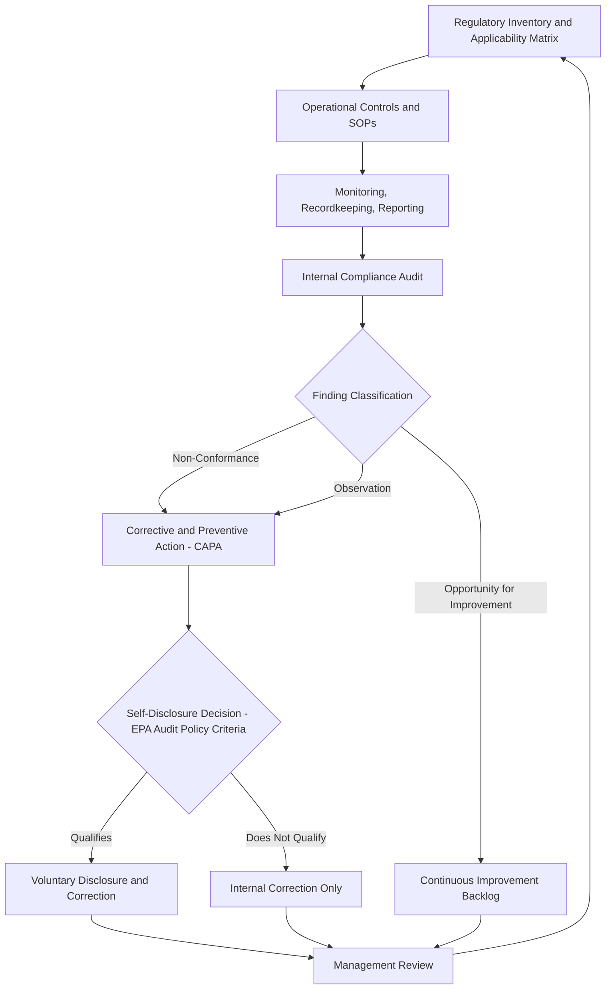

## Environmental Compliance Management Systems and Auditing Practice

### Overview and Regulatory Context

Environmental compliance management systems (ECMS) are the organizational structures, procedures, and controls a regulated entity implements to ensure ongoing conformance with applicable environmental laws, permits, and regulations. Auditing practice is the assessment discipline that verifies whether an ECMS is functioning as designed and whether actual facility operations conform to legal requirements. The two are complementary: an ECMS establishes the operational controls, while auditing provides independent verification and continuous improvement feedback.

**Key Points**

- ECMS design draws heavily on general management systems methodology (notably the Plan-Do-Check-Act cycle) adapted to environmental regulatory compliance rather than pure environmental performance improvement, distinguishing it from broader Environmental Management Systems (EMS) frameworks like ISO 14001, which address environmental impact more holistically.
- Regulatory agencies (EPA, state environmental agencies) increasingly treat the existence and quality of a documented ECMS as a factor in enforcement discretion, penalty mitigation (see the EPA Audit Policy), and in some sectors as a conditional element of permit issuance or consent decree compliance.
- Auditing practice spans several distinct types serving different purposes: compliance audits, management system audits, due diligence audits, and third-party certification audits.

### Regulatory Drivers for ECMS Adoption

**Voluntary Drivers**

- EPA's Audit Policy incentives (see prior chapter item on self-disclosure and audit privilege), which reward systematic discovery and correction of violations.
- Corporate sustainability and ESG reporting commitments, which increasingly require documented environmental governance structures.
- Insurance underwriting requirements, particularly for environmental liability and pollution legal liability (PLL) policies, which may require documented compliance management as a condition of coverage or favorable premiums.

**Mandatory Drivers**

- Consent decrees and settlement agreements in environmental enforcement actions frequently mandate formal ECMS implementation, often with independent third-party auditor verification, as an injunctive relief component distinct from monetary penalties.
- Sector-specific regulatory requirements: for example, RCRA generator requirements effectively mandate certain compliance management functions (waste determination, manifesting, recordkeeping), and Title V Clean Air Act operating permits require periodic compliance certification by a responsible official.
- Federal Sentencing Guidelines for organizations (U.S.S.G. Chapter 8) treat the existence of an "effective compliance and ethics program" as a mitigating factor in sentencing for corporate environmental crimes, creating an indirect mandate for ECMS investment.

### Core Components of an Environmental Compliance Management System

**1. Applicability and Regulatory Inventory**

A foundational ECMS function is maintaining a current inventory of all applicable federal, state, and local environmental requirements (permits, statutory obligations, consent decree terms) tied to specific facility operations. This is often implemented as a compliance calendar or regulatory applicability matrix cross-referencing:

- Permit conditions and expiration/renewal dates.
- Recurring reporting obligations (e.g., Discharge Monitoring Reports under NPDES, Title V semiannual monitoring reports, Toxics Release Inventory (TRI) annual reports).
- Recordkeeping retention requirements.

**2. Roles, Responsibilities, and Accountability Structure**

- Designation of an Environmental Compliance Officer (ECO) or equivalent role with documented authority — this documentation directly affects "responsible corporate officer" liability analysis discussed in the preceding chapter item.
- Clear escalation pathways from facility-level operational staff to compliance/legal functions for suspected violations.
- Board or senior management oversight mechanisms, increasingly expected under corporate governance best practices and, in some sectors, under specific regulatory guidance (e.g., EPA's expectations for environmental management oversight in consent decrees).

**3. Training and Competency**

- Role-specific compliance training (e.g., hazardous waste handler training under RCRA's 40 CFR 262.17, which has specific frequency and documentation requirements).
- Documented training records, since inadequate or undocumented training is a common audit finding and enforcement aggravating factor.

**4. Operational Controls**

- Standard operating procedures (SOPs) for permit-governed activities (e.g., wastewater pretreatment operation, air pollution control equipment operation and maintenance).
- Preventive maintenance programs for pollution control equipment, since equipment malfunction is a frequent root cause of permit exceedances.
- Change management procedures to evaluate the environmental compliance implications of process, equipment, or production changes before implementation (paralleling process safety management's Management of Change element, though scoped to environmental rather than safety hazards).

**5. Monitoring, Recordkeeping, and Reporting**

- Systems for continuous emissions monitoring (CEMS), periodic sampling, and recordkeeping sufficient to demonstrate compliance, since inadequate recordkeeping is itself frequently an independent violation (distinct from the underlying substantive exceedance).
- Data management systems (increasingly software-based Environmental, Health, and Safety (EHS) information systems) to track permit limits against real-time or periodic monitoring data and flag approaching exceedances.

**6. Internal Audit and Self-Assessment**

- Scheduled internal audits (addressed in detail below) as a systematic verification mechanism distinct from day-to-day operational monitoring.

**7. Corrective and Preventive Action (CAPA)**

- Formal processes to investigate audit findings and violations, determine root cause, implement corrective action, and verify effectiveness — structurally similar to CAPA systems in quality management (ISO 9001) and process safety management incident investigation.

**8. Management Review**

- Periodic senior management review of ECMS performance metrics, audit findings, and enforcement trends to drive continuous improvement and resource allocation decisions.

### Environmental Auditing Practice: Types of Audits

| Audit Type | Purpose | Typical Trigger |
| --- | --- | --- |
| Compliance audit | Verify conformance with specific regulatory requirements | Scheduled internal program; pre-inspection preparation |
| Management systems audit | Verify the ECMS/EMS itself functions as designed (process-focused, not just outcome-focused) | ISO 14001 certification/surveillance audits; internal governance review |
| Due diligence audit | Identify environmental liabilities before a transaction | Mergers, acquisitions, real estate transactions (often paired with Phase I/II Environmental Site Assessments under ASTM E1527) |
| Compliance certification audit | Support a required regulatory certification (e.g., Title V responsible official certification) | Recurring statutory/permit deadline |
| Third-party/independent audit | Provide independent verification, often court- or consent-decree-mandated | Settlement agreements, consent decrees, insurance requirements |

### Audit Process Methodology

**Key Points**

Environmental audits generally follow a structured methodology adapted from general auditing standards (e.g., ISO 19011, Guidelines for Auditing Management Systems) and EPA's own audit protocols:

1. **Audit planning and scoping**: Define audit objectives, scope (facilities, media — air/water/waste — and regulatory programs covered), and criteria (applicable regulations, permits, internal policies).
2. **Pre-audit document review**: Review permits, prior inspection reports, prior audit findings, monitoring data, and applicable regulatory text before the site visit.
3. **Opening meeting**: Establish audit scope and logistics with facility management.
4. **Fieldwork**: Physical facility inspection, interviews with operational staff, records review, sampling verification (where applicable), and testing of operational controls against documented procedures.
5. **Findings documentation and classification**: Findings are typically classified by severity — for example, "non-conformance" (clear regulatory violation), "observation" (a gap not yet rising to a violation but presenting risk), and "opportunity for improvement" (best-practice recommendations).
6. **Closing meeting**: Present preliminary findings to facility management.
7. **Audit report**: Formal written report documenting findings, often structured to support (or, depending on jurisdiction, qualify for) audit privilege protection under applicable state statutes.
8. **Corrective action tracking**: Findings are tracked to closure through the CAPA process, with defined timelines and responsible parties.

**[Inference]** The degree of formality and documentation applied at each stage typically scales with audit purpose — a due diligence audit under transactional time pressure will generally be less exhaustive at the fieldwork stage than a consent-decree-mandated independent audit with court-ordered scope requirements.

### Audit Findings Classification and Risk Prioritization

Audit programs commonly apply a risk-based prioritization matrix to findings, considering:

- **Regulatory significance**: Is the finding a clear violation of an enforceable permit limit or statutory requirement, versus a procedural or documentation gap?
- **Environmental/health risk**: Does the finding correspond to actual or potential release, exposure, or harm?
- **Recurrence risk**: Is this a systemic issue likely to recur across multiple facilities or a one-off circumstance?
- **Enforcement exposure**: Could the finding, if undisclosed, expose the organization to penalties disproportionate to voluntary correction costs — a consideration directly informing the self-disclosure decision under the EPA Audit Policy and analogous state programs.

### Relationship to ISO 14001 and Formal EMS Certification

While an ECMS can exist independently as an internal compliance function, many organizations formalize environmental management under ISO 14001, which:

- Requires a documented environmental policy, identification of environmental aspects and impacts, legal and other requirements register, objectives and targets, and a management review cycle.
- Requires internal audits as an explicit clause (Clause 9.2, Internal Audit) and periodic external surveillance/recertification audits by accredited third-party certification bodies.
- Does not itself guarantee legal compliance — ISO 14001 certification demonstrates the existence of a conforming management system, not that the organization has zero regulatory violations, a common misconception that compliance and legal teams must actively manage in communications with stakeholders and regulators.

**[Inference]** Some jurisdictions and consent decrees explicitly reference ISO 14001 conformance (or equivalent) as a benchmark for injunctive-relief ECMS requirements, though this is not universal, and courts/agencies more commonly specify bespoke ECMS requirements tailored to the specific violation history.

### Illustration: ECMS-Auditing Feedback Loop

### Illustration: Audit Finding Severity Matrix

<svg xmlns="http://www.w3.org/2000/svg" viewBox="0 0 700 320">
<text x="350" y="28" text-anchor="middle" font-size="17" font-weight="bold" fill="#1a1a1a">Audit Finding Risk Prioritization Matrix (svg_diagram)</text>
<line x1="100" y1="270" x2="100" y2="60" stroke="#333" stroke-width="1.5" />
<line x1="100" y1="270" x2="640" y2="270" stroke="#333" stroke-width="1.5" />
<text x="60" y="70" font-size="11" fill="#1a1a1a" transform="rotate(-90 60 70)">Regulatory / Health Risk →</text>
<text x="370" y="295" text-anchor="middle" font-size="11" fill="#1a1a1a">Recurrence Likelihood →</text>
<rect x="110" y="65" width="255" height="100" fill="#fdecec" opacity="0.7" />
<rect x="365" y="65" width="255" height="100" fill="#fdecec" opacity="0.95" />
<rect x="110" y="165" width="255" height="95" fill="#fff8e1" opacity="0.7" />
<rect x="365" y="165" width="255" height="95" fill="#fff8e1" opacity="0.95" />

<text x="237" y="115" text-anchor="middle" font-size="12" fill="`#7b341e`">High Risk /</text>

<text x="237" y="132" text-anchor="middle" font-size="12" fill="`#7b341e`">Low Recurrence</text>

<text x="492" y="115" text-anchor="middle" font-size="12" fill="`#7b341e`" font-weight="bold">High Risk /</text>

<text x="492" y="132" text-anchor="middle" font-size="12" fill="`#7b341e`" font-weight="bold">High Recurrence</text>

<text x="492" y="149" text-anchor="middle" font-size="10" fill="`#7b341e`">(Priority CAPA)</text>

<text x="237" y="210" text-anchor="middle" font-size="12" fill="`#744210`">Low Risk /</text>

<text x="237" y="227" text-anchor="middle" font-size="12" fill="`#744210`">Low Recurrence</text>

<text x="492" y="210" text-anchor="middle" font-size="12" fill="`#744210`">Low Risk /</text>

<text x="492" y="227" text-anchor="middle" font-size="12" fill="`#744210`">High Recurrence</text>

<text x="492" y="244" text-anchor="middle" font-size="10" fill="`#744210`">(Systemic Fix Needed)</text>

</svg>

### Practical Example

A multi-facility manufacturer implements an ECMS following a consent decree resolving prior Clean Air Act violations. The consent decree requires:

1. Appointment of a corporate Environmental Compliance Officer with documented board-level reporting authority.
2. Implementation of a compliance calendar tracking all Title V permit conditions across 12 facilities.
3. Annual independent third-party audits for five years, with audit reports submitted to EPA and a court-appointed monitor.

During Year 2's independent audit, the auditor identifies that three facilities have overlapping preventive maintenance gaps on volatile organic compound (VOC) control equipment, all traceable to an outdated maintenance scheduling template inherited from before the consent decree. This is classified as a "high risk / high recurrence" finding.

**Output**: The finding triggers a CAPA requiring: (1) immediate root-cause corrective action at the three affected facilities, (2) a systemic fix — replacing the maintenance scheduling template company-wide rather than only at the three facilities — and (3) a self-disclosure evaluation under the EPA Audit Policy for any exceedances that occurred during the maintenance gap period, since the audit qualifies as systematic discovery, potentially supporting penalty mitigation if disclosed within the required window.

### Conclusion

Environmental compliance management systems and environmental auditing practice function as an integrated feedback loop: the ECMS establishes the operational infrastructure for compliance, while auditing provides the independent verification mechanism that detects gaps, drives corrective action, and — where paired with the EPA Audit Policy or state audit privilege statutes — can materially reduce enforcement exposure. Regulatory expectations increasingly treat ECMS maturity and audit rigor as evidence bearing on both enforcement discretion and, in the criminal context, an organization's "effective compliance program" mitigation under federal sentencing guidelines, making ECMS design a core element of corporate environmental risk management rather than a purely voluntary best practice.

**Related Topics**

- ISO 14001 Environmental Management Systems — implementation and certification process
- Environmental due diligence and Phase I/II Environmental Site Assessments (ASTM E1527/E1903)
- Consent decrees and injunctive relief structuring in environmental enforcement settlements
- Federal Sentencing Guidelines Chapter 8 — effective compliance and ethics programs
- Title V Clean Air Act operating permit compliance certification requirements
- EHS information systems and digital compliance tracking platforms
- Root cause analysis methodologies (5-Whys, fishbone/Ishikawa) applied to environmental CAPA