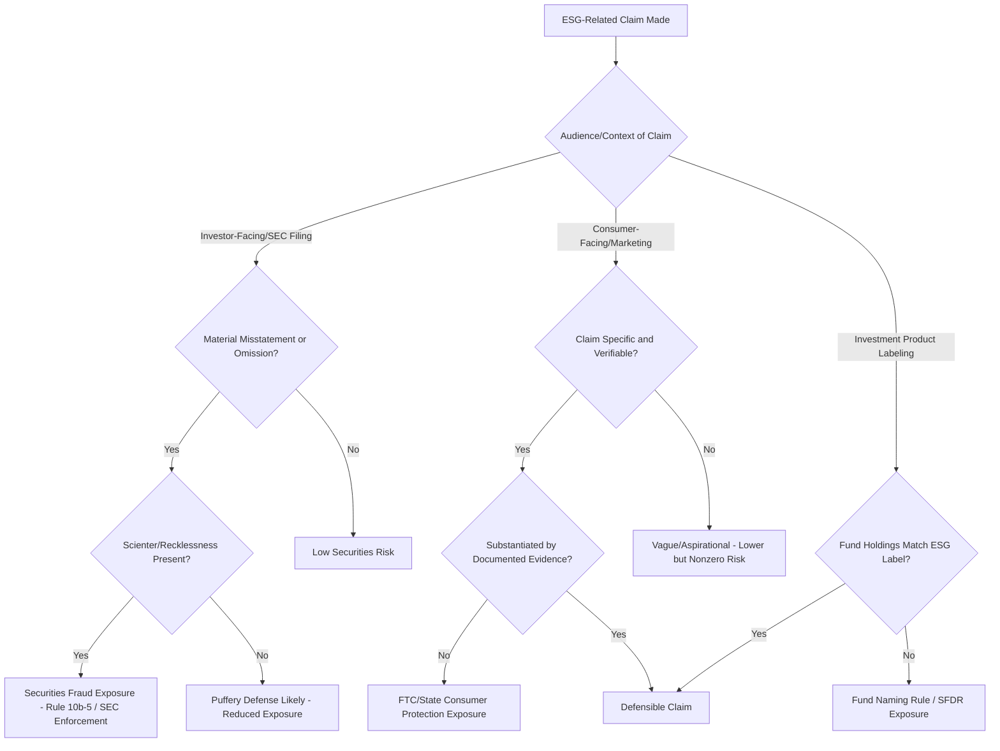

## ESG Disclosure Frameworks and Greenwashing Liability

### Overview and Doctrinal Convergence

ESG (Environmental, Social, and Governance) disclosure sits at the intersection of securities regulation, environmental law, and consumer protection law. Unlike traditional media-specific environmental compliance (air, water, waste), ESG disclosure liability arises from representations an entity makes about its environmental performance, targets, or products — to investors, regulators, or consumers — and the legal exposure that follows when those representations are false, unsubstantiated, or misleading. "Greenwashing" liability is the enforcement and litigation response to this exposure, drawing on securities fraud, false advertising, and consumer protection statutes rather than pollution-control statutes directly.

**Key Points**

- ESG disclosure liability is fundamentally a truth-in-representation problem, not a pollution-control problem: the underlying environmental performance may be entirely lawful, but the liability arises from how it is described.
- Multiple overlapping and still-evolving disclosure frameworks (voluntary and mandatory) create a fragmented compliance landscape, with jurisdiction-specific mandatory rules increasingly layering atop previously voluntary reporting standards.
- Greenwashing enforcement now proceeds through at least four distinct legal channels: securities regulators, environmental/consumer protection regulators, private securities litigation, and consumer class actions.

### Major ESG Disclosure Frameworks

**Voluntary/Standard-Setting Frameworks**

- **GRI (Global Reporting Initiative) Standards**: The most widely adopted voluntary sustainability reporting framework globally, using a stakeholder-inclusive materiality approach (reporting on impacts material to a broad range of stakeholders, not solely investors).
- **SASB (Sustainability Accounting Standards Board) Standards**: Industry-specific standards focused on financially material ESG factors from an investor perspective; now consolidated under the IFRS Foundation's ISSB.
- **TCFD (Task Force on Climate-related Financial Disclosures)**: A framework organized around four pillars — governance, strategy, risk management, and metrics/targets — for climate-related financial risk disclosure; substantially incorporated into subsequent mandatory regimes.
- **CDP (formerly Carbon Disclosure Project)**: A voluntary environmental disclosure platform primarily for greenhouse gas emissions, water, and forests data, widely used by institutional investors for benchmarking.

**Emerging Mandatory Frameworks**

- **ISSB Standards (IFRS S1 and S2)**: Issued by the International Sustainability Standards Board, S1 covers general sustainability-related financial disclosures and S2 covers climate-specific disclosures, built substantially on the TCFD architecture; increasingly being adopted or referenced by national regulators as a mandatory baseline.
- **EU Corporate Sustainability Reporting Directive (CSRD)**: Requires detailed sustainability reporting under the European Sustainability Reporting Standards (ESRS) for a large population of EU and non-EU companies meeting defined thresholds, applying a "double materiality" standard — requiring disclosure of both how sustainability issues affect the company financially and how the company's activities impact people and the environment.
- **EU Taxonomy Regulation**: A classification system defining which economic activities qualify as "environmentally sustainable," used to substantiate (or challenge) sustainable investment product claims.
- **SEC Climate-Related Disclosure Rule**: A U.S. rule requiring climate-related risk and, in certain circumstances, greenhouse gas emissions disclosure in SEC filings.

**[Unverified]** The SEC's climate disclosure rule has been the subject of significant litigation and stay proceedings since its adoption, and its scope, effective dates, and ultimate survival have been contested; current status should be verified against the SEC's own current guidance rather than assumed static, since this is an area of active regulatory and judicial change.

### Comparison of Materiality Approaches

| Framework | Materiality Standard | Primary Audience |
| --- | --- | --- |
| SASB / ISSB | Single (financial) materiality — impact on enterprise value | Investors |
| GRI | Impact materiality — effect of company on economy, environment, people | Broad stakeholders |
| EU CSRD/ESRS | Double materiality — both financial and impact materiality | Investors and broad stakeholders |
| TCFD | Financial materiality (climate risk to the business) | Investors |

**[Inference]** The trend across major jurisdictions appears to be convergence toward broader materiality concepts and greater assurance requirements, though the pace and final form of convergence (e.g., whether U.S. rules will adopt double materiality) remains unsettled and jurisdiction-dependent.

### Greenwashing: Definitions and Typology

"Greenwashing" is not a single defined legal term but a family of related misrepresentation types addressed under different bodies of law:

- **Product-level greenwashing**: False or unsubstantiated environmental claims about a specific product (e.g., "recyclable," "biodegradable," "carbon neutral") — typically addressed under consumer protection and advertising law.
- **Corporate-level/entity greenwashing**: Overstated corporate sustainability commitments, targets, or governance claims (e.g., a "net zero by 2030" pledge without a credible implementation plan) — increasingly addressed under securities disclosure and anti-fraud provisions when made to investors.
- **Investment product greenwashing**: Mischaracterizing a fund or investment product as "ESG," "sustainable," or "green" when its underlying holdings do not meet a reasonable investor's understanding of that label — addressed under securities regulation (fund naming/labeling rules) and, in the EU, the Sustainable Finance Disclosure Regulation (SFDR).
- **Selective disclosure/greenhushing**: Understating or omitting negative environmental information while emphasizing favorable metrics, which can independently constitute a materially misleading omission even without an affirmative false statement.

### Legal Bases for Greenwashing Liability

**1. Securities Fraud (U.S.)**

Material misstatements or omissions in SEC filings, earnings calls, or investor communications regarding ESG performance can trigger liability under:

- **Securities Act §11/§12** (registration statement misstatements) and **Exchange Act §10(b)/Rule 10b-5** (general anti-fraud provision), requiring a showing of a material misstatement or omission, scienter (for Rule 10b-5), reliance, and damages in private litigation, or simply a material misstatement for SEC enforcement purposes.
- SEC enforcement actions against investment advisers and funds for ESG-related misrepresentations, including cases addressing inadequate policies and procedures to ensure ESG investment claims matched actual portfolio construction and screening practices.

**2. Consumer Protection and False Advertising**

- **FTC Act §5** (unfair or deceptive acts or practices) and the **FTC "Green Guides"** — non-binding but influential guidance interpreting how environmental marketing claims (e.g., "recyclable," "compostable," "carbon offset," "renewable energy") should be substantiated to avoid being deceptive.
- State consumer protection statutes (e.g., "Little FTC Acts") and state false advertising laws, frequently the basis for private consumer class actions alleging greenwashing in product marketing.
- **EU Unfair Commercial Practices Directive** and the newer **EU Green Claims Directive** framework, which impose substantiation and verification requirements on environmental claims made in commercial marketing.

**3. Common-Law and Statutory Fraud/Misrepresentation**

Shareholder derivative suits and common-law fraud claims may arise where corporate officers made specific, verifiable representations about environmental performance or compliance that proved false, particularly where those representations were tied to stock price or investment decisions.

**4. Environmental Regulatory Enforcement Overlap**

In some cases, greenwashing claims overlap with substantive environmental law where a "green" claim implies regulatory compliance that does not exist (e.g., a "clean energy" claim resting on undisclosed permit violations), creating potential overlap with the enforcement mechanisms discussed elsewhere in this chapter.

### Elements of a Securities-Based Greenwashing Claim (Illustrative Framework)

For a Rule 10b-5 based claim, a plaintiff (or the SEC in enforcement) must generally establish:

$$\text{Liability} = f(\text{Material Misstatement/Omission}, \text{Scienter}, \text{Reliance}, \text{Loss Causation})$$

- **Materiality**: Would a reasonable investor have considered the ESG claim important to an investment decision? Aspirational or vague statements ("committed to sustainability") are less likely to be actionable than specific, verifiable claims ("100% of our energy portfolio is renewable as of FY2024").
- **Scienter**: For private Rule 10b-5 claims, plaintiffs must plead facts giving rise to a strong inference of intent to deceive or severe recklessness — a significant pleading hurdle that has led to dismissal of a substantial share of greenwashing securities suits at the motion-to-dismiss stage.
- **Puffery defense**: Courts frequently distinguish actionable factual misrepresentations from non-actionable "corporate puffery" — vague, aspirational, or obviously promotional statements no reasonable investor would rely on as factual.

**[Inference]** Given the significant scienter pleading hurdle and puffery defense, private securities litigation appears to succeed more often against specific, quantifiable claims (e.g., specific emissions reduction percentages, specific product composition claims) than against general corporate sustainability rhetoric, though case outcomes are fact-specific and evolving.

### Regulatory Enforcement Trends

- SEC's Climate and ESG Task Force (established within the Division of Enforcement) has pursued enforcement actions against investment advisers for ESG policy and procedure failures and against issuers for misleading ESG-related disclosures.
- State attorneys general have pursued greenwashing actions under state consumer protection statutes, particularly targeting fossil fuel companies' climate-related public statements and plastics/recyclability marketing claims.
- EU enforcement under national consumer protection authorities coordinated through the Consumer Protection Cooperation network has targeted airline, apparel, and fast-moving consumer goods sectors for unsubstantiated "carbon neutral" and "sustainable" claims.

### Compliance Program Design for ESG Disclosure Risk

**Key Points**

- **Disclosure controls and procedures**: ESG claims destined for investor-facing disclosures should pass through the same disclosure controls and procedures (and, where applicable, internal control over financial reporting-adjacent rigor) as traditional financial disclosures, given the SEC's increasing treatment of material ESG claims as subject to standard securities disclosure obligations.
- **Claim substantiation files**: Marketing and investor relations claims regarding specific environmental attributes (recyclability, carbon neutrality, renewable energy percentage) should be supported by documented, verifiable substantiation files maintained contemporaneously, not reconstructed after a claim is challenged.
- **Cross-functional review**: Legal, sustainability, marketing, and investor relations functions should coordinate ESG claim review, since greenwashing liability commonly arises from claims originating in marketing or sustainability functions without legal or securities compliance review.
- **Target-setting rigor**: Corporate net-zero or emissions-reduction targets should be accompanied by documented, credible implementation pathways; aspirational targets announced without an operational plan are a recurring pattern in greenwashing enforcement actions and litigation.
- **Third-party assurance**: Independent assurance or verification of sustainability data (increasingly required under frameworks like CSRD) provides both compliance-quality improvement and litigation risk mitigation by demonstrating a good-faith substantiation process.

### Illustration: Greenwashing Liability Pathways

### Illustration: Disclosure Framework Landscape

<svg xmlns="http://www.w3.org/2000/svg" viewBox="0 0 760 300">
<text x="380" y="28" text-anchor="middle" font-size="17" font-weight="bold" fill="#1a1a1a">ESG Disclosure Framework Landscape (svg_diagram)</text>
<circle cx="260" cy="170" r="110" fill="#eaf2fb" stroke="#2b6cb0" stroke-width="2" opacity="0.6" />
<text x="260" y="90" text-anchor="middle" font-size="13" font-weight="bold" fill="#2b6cb0">Voluntary</text>
<text x="220" y="150" font-size="11" fill="#1a1a1a">GRI</text>
<text x="220" y="170" font-size="11" fill="#1a1a1a">SASB (legacy)</text>
<text x="220" y="190" font-size="11" fill="#1a1a1a">CDP</text>
<text x="220" y="210" font-size="11" fill="#1a1a1a">TCFD</text>
<circle cx="500" cy="170" r="110" fill="#eafaf0" stroke="#2f855a" stroke-width="2" opacity="0.6" />
<text x="500" y="90" text-anchor="middle" font-size="13" font-weight="bold" fill="#2f855a">Mandatory</text>
<text x="460" y="150" font-size="11" fill="#1a1a1a">EU CSRD / ESRS</text>
<text x="460" y="170" font-size="11" fill="#1a1a1a">SEC Climate Rule</text>
<text x="460" y="190" font-size="11" fill="#1a1a1a">EU Taxonomy</text>
<text x="460" y="210" font-size="11" fill="#1a1a1a">SFDR</text>

<text x="380" y="175" text-anchor="middle" font-size="10" fill="`#1a1a1a`" font-weight="bold">ISSB</text>

<text x="380" y="190" text-anchor="middle" font-size="10" fill="`#1a1a1a`">(S1/S2 -</text>

<text x="380" y="203" text-anchor="middle" font-size="10" fill="`#1a1a1a`">convergence</text>

<text x="380" y="216" text-anchor="middle" font-size="10" fill="`#1a1a1a`">point)</text>

</svg>

### Practical Example

A consumer packaged goods company launches a product line labeled "Carbon Neutral" based on the purchase of carbon offset credits, without disclosing that the underlying offset projects have not yet been independently verified and that the company's own operational emissions have increased year-over-year. Simultaneously, the company's annual sustainability report tells investors the company is "on track" to meet a 2030 net-zero target, without disclosing an internal analysis showing the target is not achievable under current operational plans.

- **Consumer protection exposure**: The "Carbon Neutral" label constitutes a specific, verifiable environmental claim under FTC Green Guides principles; absent adequate substantiation (independently verified offsets, methodology disclosure), the company faces FTC Act §5 and state consumer protection exposure, and potential consumer class action litigation.
- **Securities exposure**: The "on track" statement to investors, if made with knowledge of the internal analysis showing otherwise, presents a materiality and scienter profile sufficient to support a Rule 10b-5 claim or SEC enforcement action, since it is a specific representation contradicted by the company's own internal information (distinguishing it from non-actionable aspirational puffery).

**Output**: Both exposures arise from the same underlying gap between actual environmental performance and public representation, illustrating why ESG claim substantiation and cross-functional legal review must cover marketing, sustainability reporting, and investor disclosure functions collectively rather than treating them as separate compliance silos.

### Conclusion

ESG disclosure frameworks and greenwashing liability represent a fast-evolving compliance domain where enforcement risk arises primarily from the gap between representation and substantiated fact, rather than from underlying environmental performance itself. The regulatory landscape is characterized by a shift from voluntary, investor-driven frameworks toward mandatory disclosure regimes with more rigorous materiality standards and assurance requirements, while greenwashing liability draws on securities fraud, consumer protection, and false advertising doctrines that predate ESG-specific regulation but have been actively adapted to it. Effective compliance requires substantiation discipline and cross-functional coordination between legal, sustainability, marketing, and investor relations functions.

**Related Topics**

- SEC Climate and ESG Task Force enforcement case studies
- EU Corporate Sustainability Reporting Directive (CSRD) implementation and scoping thresholds
- FTC Green Guides — specific claim categories (recyclable, compostable, carbon offsets)
- Carbon offset market integrity and verification standards (Verra, Gold Standard)
- Shareholder derivative litigation arising from ESG target-setting failures
- Sustainable Finance Disclosure Regulation (SFDR) Article 8/9 fund classification
- Self-disclosure policies and the audit privilege (interaction with ESG-related environmental disclosures)