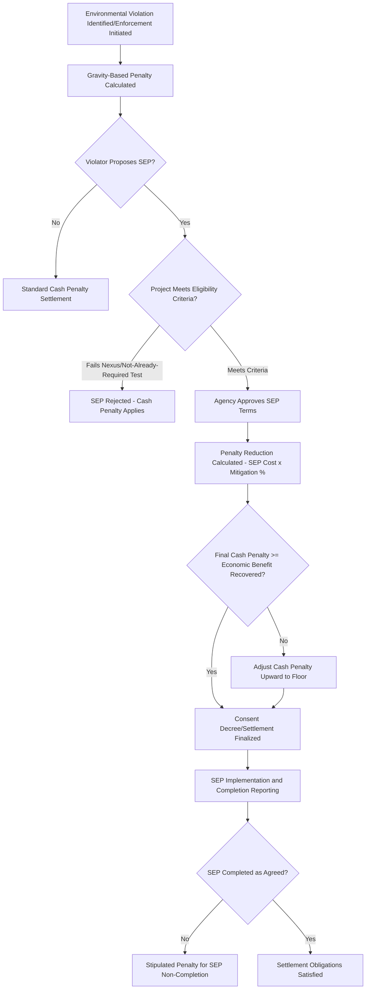

## Supplemental Environmental Projects and Penalty Mitigation Policy

### Overview and Policy Rationale

Supplemental Environmental Projects (SEPs) are environmentally beneficial projects that a violator agrees to undertake as part of the settlement of an environmental enforcement action, in exchange for a reduction in the monetary penalty otherwise assessed. SEPs are not a substitute for the penalty required to satisfy statutory deterrence objectives; rather, they redirect a defined portion of the settlement value from the general treasury toward a project with direct environmental or public health benefit, typically connected to the violation or the affected community. SEPs sit within the broader category of penalty mitigation tools alongside the self-disclosure/audit policy framework addressed earlier in this chapter, but operate at the settlement-negotiation stage rather than the pre-enforcement voluntary-disclosure stage.

**Key Points**

- SEPs are a settlement tool, not a matter of right — a violator cannot compel an agency to accept a SEP in lieu of penalty, and agencies retain discretion whether to negotiate one at all.
- SEP policy has evolved significantly over time, including a period of federal-level discontinuation and subsequent reinstatement, making current status verification important since this area has been especially subject to changes in administration policy.
- The defining conceptual constraint is that a SEP must provide environmental or public health benefits beyond what is already legally required — a project the violator was already obligated to perform cannot serve as a SEP.

### Historical Development of EPA SEP Policy

EPA's SEP policy has been formalized and revised multiple times, with the most detailed and long-standing articulation found in the 1998 EPA SEP Policy (updated periodically). Key historical developments:

- The 1998 policy established formal SEP categories, eligibility criteria, and penalty mitigation calculation methodology, and remained the primary reference document for roughly two decades.
- In 2020, EPA (under a Department of Justice memorandum applicable across civil enforcement generally, not solely environmental cases) restricted the use of SEPs in federal civil settlements, based on concerns that SEPs functioned as a mechanism for redirecting government settlement funds to third parties outside of properly appropriated channels, raising Miscellaneous Receipts Act concerns.
- In 2021-2022, EPA rescinded the 2020 restrictions and reinstated SEP availability in federal enforcement settlements, reflecting a policy reversal tied to changed enforcement priorities.

**[Unverified]** Given documented cycles of restriction and reinstatement, the precise current federal policy status and any subsequent revisions should be verified against EPA's current enforcement guidance at the time of use, since this specific policy area has shown a demonstrated pattern of change across different administrations.

### Categories of Supplemental Environmental Projects

EPA's historical SEP policy framework recognizes several project categories:

1. **Public health**: Projects addressing exposure or risk to human health resulting from or related to the violation (e.g., blood lead testing programs in a community affected by lead emissions violations).
2. **Pollution prevention**: Projects that reduce the generation of pollution through source reduction, rather than end-of-pipe treatment.
3. **Pollution reduction**: Projects reducing the amount or toxicity of pollutants released, where prevention is not feasible.
4. **Environmental restoration and protection**: Projects restoring or protecting natural resources, ecosystems, or habitats.
5. **Assessment and audits**: Environmental audits or assessments beyond what is already required, to identify additional compliance improvements.
6. **Environmental compliance promotion**: Training, technical assistance, or outreach to improve compliance among a broader regulated community, not solely the violator.
7. **Emergency planning and preparedness**: Projects supporting local emergency response capacity for chemical or environmental incidents.
8. **Air quality projects**: Often a distinct sub-category given the high frequency of air-related SEPs (e.g., alternative fuel vehicle programs, idle-reduction technology).

**[Inference]** The relative frequency of each category in actual settlements shifts over time based on enforcement priorities (e.g., increased emphasis on environmental justice-related public health projects in recent years), though comprehensive category-by-category settlement statistics require reference to EPA's enforcement database rather than general policy text.

### Eligibility Criteria

For a project to qualify as a SEP under EPA's framework, it must generally satisfy:

- **Nexus requirement**: A sufficient connection between the SEP and the underlying violation — historically requiring that the SEP relate to the specific environmental media, pollutant, or affected community involved in the violation, though the strictness of nexus requirements has varied across policy iterations.
- **No legal obligation**: The project must not be something the violator is already required to do under existing law, permit, or a prior enforcement action, since crediting an already-mandatory action would create a double benefit.
- **Not otherwise planned**: The project generally must not be one the violator had already budgeted or committed to undertake independent of the settlement (the "but for" test — the project would not occur but for the enforcement settlement's penalty mitigation incentive).
- **No prohibited recipient**: The violator (or its principals) cannot receive the SEP funds; SEPs must be implemented by the violator itself or through a genuinely independent, non-affiliated third party where applicable.
- **Government oversight limits**: The government agency generally does not select, direct, or manage the SEP's implementation in detail (to avoid the appearance of directing settlement funds to a hand-picked beneficiary), instead approving violator-proposed projects against the eligibility criteria.

### Penalty Mitigation Calculation

**Key Points**

SEPs reduce the penalty amount by a defined percentage of the SEP's cost, not dollar-for-dollar against the full statutory maximum. Historical EPA SEP policy applies a mitigation percentage based on project category and public benefit, commonly in the range of an 80% penalty offset against SEP cost for standard categories, with different percentages potentially applying to specific categories (e.g., higher mitigation credit for certain public health or environmental justice-related projects in some iterations of the policy).

A simplified illustrative relationship:

$$\text{Penalty Reduction} = \text{SEP Cost} \times \text{Mitigation Percentage}$$

Subject to:

$$\text{Final Cash Penalty} = \text{Gravity-Based Penalty} - \text{Penalty Reduction} \geq \text{Economic Benefit Recovered}$$

The floor requirement — that the final cash penalty generally must not fall below the economic benefit the violator gained from noncompliance — is a consistent structural feature across SEP policy iterations, ensuring the violator does not profit from delayed compliance even after SEP credit is applied. This mirrors the same economic-benefit-recovery principle found in the EPA Audit Policy discussed earlier in this chapter.

**[Inference]** Exact mitigation percentages and floor calculation mechanics have varied across specific policy versions and are also subject to negotiation within individual settlements, so the figures above should be treated as illustrative of the general structure rather than a fixed current rate.

### State-Level SEP Analogs

Many state environmental agencies maintain parallel SEP policies (sometimes termed "Environmentally Beneficial Expenditures" or similar terminology), often modeled on the federal framework but with jurisdiction-specific eligibility rules, mitigation percentages, and nexus requirements. State programs are relevant because:

- State enforcement actions (particularly under delegated federal programs like NPDES or Title V) may proceed independently of or in parallel with federal actions, each potentially offering separate SEP negotiation opportunities.
- Some states have more flexible nexus or "but for" requirements than the federal framework, creating some variation in negotiating strategy depending on which enforcement authority (federal or state) is pursuing the action.

### Interaction with Citizen Suits and Consent Decrees

Under citizen suit provisions of statutes like the Clean Water Act and Clean Air Act, private plaintiffs (rather than government agencies) may also negotiate settlements involving SEP-like provisions, sometimes termed "mitigation projects" in that context, though citizen suit settlements are structurally distinct because:

- Civil penalties in citizen suit judgments are generally payable to the U.S. Treasury, not to the citizen plaintiff, which historically motivated the use of SEP-like provisions to direct settlement value toward environmental benefit rather than purely punitive payment.
- Courts have scrutinized citizen suit settlements involving payments to third-party environmental organizations (sometimes chosen by the plaintiff) for potential conflicts of interest, particularly where the recipient organization has a relationship with the plaintiff's counsel — a concern distinct from, but analogous to, the federal SEP policy's prohibited-recipient safeguards.

### Illustration: SEP Negotiation and Compliance Flow

### Illustration: SEP Value Allocation

<svg xmlns="http://www.w3.org/2000/svg" viewBox="0 0 700 300">
<text x="350" y="28" text-anchor="middle" font-size="16" font-weight="bold" fill="#1a1a1a">SEP Penalty Mitigation Structure (svg_diagram)</text>
<rect x="80" y="60" width="540" height="50" fill="#fdecec" stroke="#c53030" stroke-width="2" />
<text x="350" y="90" text-anchor="middle" font-size="12" fill="#1a1a1a">Total Gravity-Based Penalty (Pre-Mitigation)</text>
<rect x="80" y="130" width="230" height="50" fill="#eafaf0" stroke="#2f855a" stroke-width="2" />
<text x="195" y="160" text-anchor="middle" font-size="11" fill="#1a1a1a">Cash Penalty Paid</text>
<text x="195" y="175" text-anchor="middle" font-size="10" fill="#1a1a1a">(to Treasury)</text>
<rect x="330" y="130" width="290" height="50" fill="#eaf2fb" stroke="#2b6cb0" stroke-width="2" />
<text x="475" y="160" text-anchor="middle" font-size="11" fill="#1a1a1a">SEP Cost Credited</text>
<text x="475" y="175" text-anchor="middle" font-size="10" fill="#1a1a1a">(~80% mitigation typical)</text>
<rect x="80" y="200" width="230" height="45" fill="#f0ecfa" stroke="#553c9a" stroke-width="2" />
<text x="195" y="227" text-anchor="middle" font-size="10" fill="#1a1a1a">Floor: Must ≥ Economic</text>
<text x="195" y="241" text-anchor="middle" font-size="10" fill="#1a1a1a">Benefit of Noncompliance</text>
</svg>

### Practical Example

A regional trucking and logistics company settles a Clean Air Act enforcement action involving diesel engine tampering (defeat device) violations across its fleet, resulting in a calculated gravity-based penalty of $2,000,000 and an economic benefit component (avoided emissions control costs) of $400,000.

The company proposes a SEP: replacing 15 older diesel yard trucks at a nearby distribution facility with electric or near-zero-emission equivalents, at a documented cost of $1,200,000, in a community already affected by elevated diesel particulate exposure (supporting the nexus requirement) and not otherwise budgeted in the company's capital plan (satisfying the "but for" test).

Applying an illustrative 80% mitigation rate:

$$\text{Penalty Reduction} = \$1{,}200{,}000 \times 0.80 = \$960{,}000$$

$$\text{Adjusted Cash Penalty} = \$2{,}000{,}000 - \$960{,}000 = \$1{,}040{,}000$$

Since $1,040,000 exceeds the $400,000 economic benefit floor, no further adjustment is required.

**Output**: The company pays a $1,040,000 cash penalty to the Treasury and implements the $1,200,000 truck replacement SEP, subject to a consent decree completion schedule and stipulated penalties for non-completion, while the emissions-affected community receives a direct, quantifiable environmental benefit connected to the underlying violation.

### Conclusion

Supplemental Environmental Projects function as a structured, discretionary mechanism for redirecting a portion of enforcement settlement value toward environmentally beneficial projects, subject to eligibility constraints — nexus to the violation, absence of a pre-existing legal obligation, and a floor ensuring recovery of at least the economic benefit of noncompliance — designed to preserve deterrence while generating tangible environmental or public health benefit. Because SEP policy has been subject to significant reversal at the federal level, compliance counsel and enforcement negotiators must track current agency policy closely rather than relying on a single historical policy version, and should evaluate parallel state-level SEP frameworks where state enforcement authority is independently in play.

**Related Topics**

- Self-disclosure policies and the audit privilege (comparative penalty mitigation mechanisms)
- Environmental justice considerations in SEP site selection and community benefit analysis
- Consent decree negotiation and stipulated penalty provisions for non-compliance
- Citizen suit litigation under the Clean Water Act and Clean Air Act
- Miscellaneous Receipts Act constraints on settlement fund allocation
- Corporate and individual officer liability for environmental violations (interaction with settlement negotiation strategy)
- Economic benefit calculation methodology (EPA's BEN model) in penalty assessment