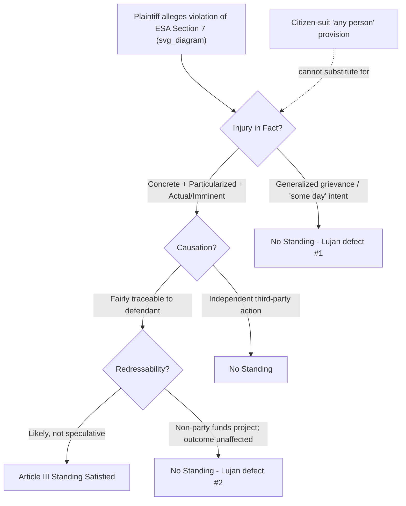

## Lujan v Defenders of Wildlife and Injury in Fact for Environmental Plaintiffs

### Case Citation and Procedural Posture

- **Citation**: *Lujan v. Defenders of Wildlife*, 504 U.S. 555 (1992)
- **Court**: U.S. Supreme Court
- **Author**: Justice Scalia (majority); concurrences by Kennedy and Stevens; dissents by Blackmun and Stevens (partial)
- **Vote**: 7-2 (with fractured reasoning on the "procedural injury" question)
- **Procedural History**: Respondents (Defenders of Wildlife and related organizations) challenged a 1986 joint regulation by the Secretary of the Interior reinterpreting Section 7 of the Endangered Species Act (ESA) to apply only to actions within the United States or on the high seas, not to actions in foreign nations. The district court dismissed for lack of standing; the Eighth Circuit reversed; the Supreme Court reversed the Eighth Circuit, holding respondents lacked standing.

### Statutory Background

Section 7(a)(2) of the ESA, 16 U.S.C. § 1536(a)(2), requires federal agencies to consult with the Secretary of the Interior or Commerce to ensure that any agency action is "not likely to jeopardize the continued existence" of an endangered or threatened species. The dispute centered on a 1986 regulation limiting this consultation requirement to actions occurring within the U.S. or on the high seas. Respondents argued this reinterpretation would reduce protection for endangered species affected by U.S.-funded projects abroad (e.g., the Aswan High Dam in Egypt and a project in Sri Lanka).

The ESA also contains a **citizen-suit provision**, 16 U.S.C. § 1540(g), which authorizes "any person" to sue to enjoin violations of the Act. This provision became central to the standing dispute.

### The Constitutional Standing Framework Articulated

Justice Scalia's opinion crystallized the modern three-part test for Article III standing, derived from the "Cases" and "Controversies" requirement of Article III, Section 2:

$$\text{Standing} = \text{Injury-in-Fact} \land \text{Causation} \land \text{Redressability}$$

**1. Injury in Fact**

An invasion of a legally protected interest that is:

- (a) Concrete and particularized, and
- (b) Actual or imminent, not conjectural or hypothetical

**2. Causation (Traceability)**

A causal connection between the injury and the challenged conduct — the injury must be "fairly traceable" to the defendant's action, not the result of independent action by a third party not before the court.

**3. Redressability**

It must be "likely," as opposed to merely "speculative," that a favorable decision will redress the injury.

The Court also distinguished these irreducible constitutional minima from **prudential standing** limitations (e.g., the zone-of-interests test, prohibition on generalized grievances), which Congress can override by statute, unlike the Article III minimum, which Congress cannot.

### Why Respondents Failed the Injury-in-Fact Prong

**Key Points**

- Respondents' members submitted affidavits (Joyce Kelly and Amy Skilbred) stating they had traveled to Egypt and Sri Lanka in the past and intended to return "someday" to observe endangered species (Nile crocodile, Asian elephant, leopard) potentially affected by U.S.-funded projects.
- The Court held that a plaintiff's **past visits** combined with a bare **intent to return "some day"** — without any specific, concrete plans (dates, tickets, itinerary) — do not establish that the injury (harm to the species and the plaintiff's ability to observe them) is "actual or imminent."
- Scalia's opinion famously rejected the "**ecosystem nexus**," "**animal nexus**," and "**vocational nexus**" theories that respondents' amici proposed, under which anyone with a professional or generalized interest in an ecosystem, or in studying/using a species anywhere on the globe, would have standing to challenge activity affecting that species anywhere.
- The Court characterized "**some day**" intentions, without a description of concrete plans or specification of when the some-day will be, as insufficient to constitute the "actual or imminent" injury required by prior standing cases (citing *Los Angeles v. Lyons*, 461 U.S. 95 (1983)).

**Rejected Standing Theories**

| Theory | Description | Court's Treatment |
| --- | --- | --- |
| Ecosystem nexus | Anyone using any part of a contiguous ecosystem adversely affected by a funded activity has standing | Rejected — too expansive, would eliminate the particularization requirement |
| Animal nexus | Anyone with an interest in studying or seeing an endangered animal, anywhere, has standing to challenge activity affecting that species anywhere in the world | Rejected — same defect |
| Vocational nexus | Professionals whose vocation is intertwined with a species (e.g., wildlife researchers) have standing regardless of geographic proximity | Rejected — same defect |

### The "Procedural Injury" and Redressability Problem

A second, independently fatal defect concerned **redressability**. Respondents sought a declaration that the Secretary of the Interior's regulation limiting Section 7 consultation to domestic/high-seas actions was invalid, and an injunction requiring consultation for foreign projects. The plurality (Scalia, joined by Rehnquist, White, and Thomas on this portion) reasoned:

- The agencies actually **funding** the foreign projects (AID, and others) were **not parties** to the suit.
- Those funding agencies were not necessarily bound by, or required to alter their conduct because of, a declaratory judgment against the Secretary of the Interior regarding the consulting requirement.
- Because those agencies provided only a fraction of the total funding for the projects (e.g., the Aswan Dam project), even a full favorable ruling on consultation might not actually alter the foreign government's or funding agency's ultimate decision to proceed, making redress speculative.

This portion of the reasoning — addressing whether Congress can create a purely "procedural right" (the right to consultation) that satisfies redressability even absent a substantive guarantee of a different outcome — did **not command a majority**. Justices Kennedy and Souter concurred in part, signaling openness to procedural-injury standing in a future case with a better factual record; this became significant in later procedural-standing cases.

**[Inference]** Because the procedural-injury discussion was not joined by a majority, its precedential weight on that specific point is narrower than the injury-in-fact holding, which did command a majority.

### The Citizen-Suit / "Any Person" Provision and Article III Limits

Respondents argued that the ESA's citizen-suit provision, granting a right of action to "any person," itself conferred standing by creating a procedural right that any citizen could enforce — effectively a **statutory injury** independent of concrete harm.

The Court rejected this "citizen-suit standing" theory:

- Congress cannot, through statute, **eliminate the Article III injury-in-fact requirement** by simply authorizing "any person" to sue over a violation of a legal duty owed to the public at large.
- Allowing such suits would convert the judiciary into an overseer of **generalized grievances** about executive branch compliance with the law — a role the Court held belongs to the political branches, not Article III courts, per the separation-of-powers rationale rooted in Article II's Take Care Clause.
- Scalia: the citizen-suit provision purports to grant the public a right of action to protest a violation of "an important individual right" but really seeks to grant a right to have the Executive Branch act in accordance with law — this vindicates the "undifferentiated public interest," which is a role for the President under Article II, not for the courts.
- Congress **can** create new legal rights that support standing (e.g., procedural rights, informational rights) when a plaintiff has a concrete stake, but it cannot abrogate the *concrete-and-particularized* / *actual-or-imminent* injury requirement itself.

### Doctrinal Diagram: The Lujan Standing Analysis (svg_diagram)

### Post-Lujan Doctrinal Developments

**Key Points**

- ***Friends of the Earth v. Laidlaw Environmental Services***, 528 U.S. 167 (2000): Relaxed the rigor of *Lujan*'s aesthetic/recreational injury analysis in the Clean Water Act context. Plaintiffs who lived near a polluted river and altered their recreational habits (not swimming, fishing) due to reasonable concerns about pollution had standing, even without proof of actual environmental harm to the waterway — reaffirming that the relevant injury is to the **plaintiff's use and enjoyment**, not to the environment itself.
- ***Massachusetts v. EPA***, 549 U.S. 497 (2007): Applied **relaxed standing analysis for states** (citing special solicitude due to sovereign/quasi-sovereign interests) in a climate change context, finding Massachusetts had standing to challenge EPA's refusal to regulate greenhouse gases based on loss of coastal land — an application often read as in tension with *Lujan*'s rigor. **[Inference]** Commentators disagree on how much *Massachusetts v. EPA*'s "special solicitude" doctrine narrows *Lujan* outside the state-plaintiff context.
- ***Summers v. Earth Island Institute***, 555 U.S. 488 (2009): Reaffirmed *Lujan*'s rejection of generalized "probabilistic" or "statistical" standing theories in the Forest Service regulation context — an affidavit describing a member's "past visits" and a vague intent to visit "damaged" sites again was insufficient, closely tracking the *Lujan* affidavit problem.
- ***TransUnion LLC v. Ramirez***, 594 U.S. 413 (2021): Extended *Lujan*'s "concrete injury" requirement to require a close historical or common-law analogue for injuries defined by statute, reinforcing that Congress's identification of a legal interest does not automatically satisfy the injury-in-fact requirement.
- ***Spokeo, Inc. v. Robins***, 578 U.S. 330 (2016): Applied *Lujan* to hold that a "bare procedural violation" of a federal statute (Fair Credit Reporting Act), divorced from any concrete harm, does not satisfy injury in fact — directly extending *Lujan*'s anti-generalized-grievance logic to statutory rights of action generally, not just environmental citizen suits.

### Application to Environmental Plaintiffs: Practical Framework

**Example**

An environmental organization wants to challenge an EPA permit allowing increased discharge into a river under the Clean Water Act. To satisfy *Lujan*-derived injury in fact, the organization's standing declarations should include:

- A **specific member** (named, with a signed declaration) who **regularly uses** the affected waterway (e.g., "I fish at River Mile 12 every summer, most recently three weeks ago").
- A description of **how the discharge will diminish that specific use or enjoyment** (aesthetic, recreational, economic, or health-based), not merely a general interest in clean water or the ecosystem broadly.
- **Concrete future plans** to continue use (e.g., "I have already scheduled my annual fishing trip for next month"), avoiding the *Lujan* "some day" defect.
- A traceable link between the challenged permit and the anticipated diminishment (causation).
- A remedy (e.g., vacatur of the permit, remand for stricter effluent limits) that would **likely** — not speculatively — redress the harm (redressability).

**Common Pitfalls Litigators Must Avoid (Post-Lujan)**

| Pitfall | Lujan/Progeny Basis | Curative Approach |
| --- | --- | --- |
| Vague "some day" intent to visit | *Lujan* affidavit rejection | Provide dated, concrete plans (tickets, reservations, recurring habitual use) |
| Reliance on ecosystem/animal/vocational nexus | *Lujan* rejection of nexus theories | Tie injury to plaintiff's own personal use of the specific site/species |
| Suing solely under "any person" citizen-suit language without personal stake | *Lujan* rejection of citizen-suit-as-standing | Show independent concrete injury; citizen-suit provision only removes prudential zone-of-interest barriers, not Article III injury |
| Naming a defendant who lacks power to grant relief | *Lujan* redressability holding | Join or name the actual decision-making/funding agency whose conduct would change |
| Generalized "interest in law being followed" | *Lujan*'s separation-of-powers rationale | Show particularized effect distinguishable from the public at large |

### Associational Standing Overlay

Because *Defenders of Wildlife* sued as an organization on behalf of its members, *Lujan* also implicates **associational standing**, governed by *Hunt v. Washington State Apple Advertising Commission*, 432 U.S. 333 (1977), requiring:

1. At least one member would independently have standing to sue;
2. The interests at stake are germane to the organization's purpose; and
3. Neither the claim nor relief requested requires participation of individual members.

*Lujan* operates primarily on prong (1) — since no individual member could show the requisite injury in fact, the association itself could not derive standing.

### Relationship to Redressability in Multi-Actor Regulatory Chains

**[Inference]** *Lujan*'s redressability holding has had outsized influence on environmental cases involving **third-party intermediaries** (e.g., permits issued to a state that then licenses a private polluter, or federal funding that is only a fraction of a foreign project's budget), because courts frequently cite *Lujan* to dismiss suits where the causal chain to the plaintiff's injury runs through an independent actor not bound by the requested judgment.

$$P(\text{redress} \mid \text{judgment against named defendant}) \geq \text{"likely,"} \; \text{not merely} \; \text{"speculative"}$$

### Institutional / Separation-of-Powers Rationale

Scalia's opinion is grounded in the view that broad citizen standing to enforce compliance with law by the Executive Branch would effect a transfer of power historically committed to the President's Take Care Clause obligation (Article II, § 3) into the courts, and would undermine the courts' role as adjudicators of concrete disputes between parties rather than general overseers of governmental lawfulness. This is often cited as the doctrinal high-water mark of the "**standing as separation of powers**" theory of Article III.

### Criticism and Scholarly Debate

**Key Points**

- Justice Blackmun's dissent (joined by Justice O'Connor) argued the majority applied an unduly rigid, formalistic standard inconsistent with the ESA's broad remedial purpose and Congress's clear intent to allow citizen enforcement.
- Justice Stevens concurred in the judgment but rejected the majority's extraterritoriality-driven skepticism about injury, instead concluding the ESA simply did not apply extraterritorially as a matter of statutory interpretation — a narrower path to the same result.
- **[Speculation]** Some scholars argue *Lujan* reflects a broader ideological project to limit citizen-suit enforcement of environmental and administrative law by narrowing Article III access, though others defend it as a necessary constraint preventing courts from becoming general-purpose forums for policy disagreement.

**Related Topics**

- *Friends of the Earth v. Laidlaw Environmental Services* and relaxed environmental injury standards
- *Massachusetts v. EPA* and special solicitude for state plaintiffs
- *Summers v. Earth Island Institute* and probabilistic/statistical standing theories
- Associational standing doctrine (*Hunt v. Washington State Apple Advertising Commission*)
- Procedural injury and the Kennedy/Souter concurrence's influence on later cases
- *Spokeo v. Robins* and *TransUnion v. Ramirez*: extending injury-in-fact to statutory/informational rights
- Citizen-suit provisions across federal environmental statutes (Clean Air Act, Clean Water Act, RCRA)
- Prudential standing doctrines: zone-of-interests test and third-party standing limitations
- Organizational vs. associational standing distinctions
- Redressability challenges in multi-agency and foreign-funding contexts
- The Take Care Clause and separation-of-powers limits on citizen enforcement of federal law