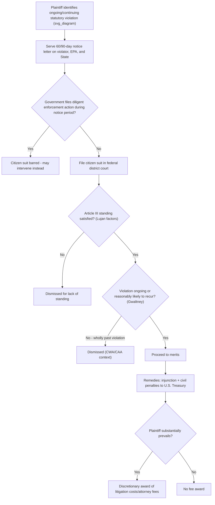

## Citizen Suit Provisions Across the Major Environmental Statutes

### Statutory Overview and Common Architecture

**Key Points**

- Most major federal environmental statutes contain a **citizen-suit provision** authorizing "any person" to bring civil actions in federal district court, generally against (1) any person alleged to be in violation of the statute or an issued permit/order, and (2) the relevant federal agency administrator for failure to perform a nondiscretionary duty.
- These provisions share a common structural template, first codified in the Clean Air Act (1970) and replicated with variations across subsequent statutes.
- Citizen suits function as a **gap-filling enforcement mechanism**, supplementing (not displacing) government enforcement, subject to specific procedural preconditions.

### Common Elements Across Citizen-Suit Provisions

| Element | Typical Requirement |
| --- | --- |
| Plaintiff | "Any person" (individuals, organizations having members with standing) |
| Defendant type 1 | Any person (including governmental entities) alleged to violate an emission/effluent standard, permit, order, or regulation |
| Defendant type 2 | The Administrator (EPA) or other federal official, for failure to perform a nondiscretionary ("mandatory") duty |
| Notice requirement | Typically 60 days' prior written notice to the alleged violator, EPA, and the state (varies by statute) |
| Diligent prosecution bar | Suit barred if EPA or state is already diligently prosecuting a comparable enforcement action in court |
| Venue | Federal district court where the violation occurred (statute-specific) |
| Remedies | Injunctive relief, civil penalties payable to the U.S. Treasury (not the plaintiff) |
| Fees | Discretionary award of costs of litigation, including attorney and expert witness fees, to "any party" (interpreted to mean prevailing or substantially prevailing party) |
| Standing overlay | Must independently satisfy Article III (*Lujan v. Defenders of Wildlife*, 504 U.S. 555 (1992)) |

### Clean Air Act (CAA) Citizen Suit Provision

- **Citation**: 42 U.S.C. § 7604
- Authorizes suits against: (1) any person (including the U.S. and any governmental entity) alleged to be in violation of an emission standard or limitation, or an order issued with respect to such standard; and (2) the Administrator for failure to perform a nondiscretionary duty (e.g., failing to promulgate a required regulation by a statutory deadline).
- **Notice**: 60 days prior to filing (for violations); 60 days for suits against the Administrator based on a nondiscretionary duty, except where the violation concerns certain hazardous air pollutant standards, which may permit immediate suit.
- **Diligent prosecution bar**: No citizen suit may proceed if EPA or the state has commenced and is diligently prosecuting a civil or criminal action in a court to require compliance.
- **Venue**: District court in which the source is located.
- **Penalties**: Payable to the U.S. Treasury; courts may order that penalties instead fund beneficial mitigation projects (SEPs) in some contexts, though this practice has evolved and been curtailed by DOJ policy in recent years. **[Unverified]** Current DOJ policy on SEP-funded citizen-suit settlements should be checked against the most recent Justice Manual guidance, as this policy has shifted across administrations.

### Clean Water Act (CWA) Citizen Suit Provision

- **Citation**: 33 U.S.C. § 1365
- Authorizes suits against: (1) any person alleged to be in violation of an effluent standard or limitation (including NPDES permit conditions) or an EPA/state administrative order; and (2) the Administrator for failure to perform a nondiscretionary duty.
- **Notice**: 60 days prior notice to EPA, the state, and the alleged violator.
- **Key interpretive case**: *Gwaltney of Smithfield, Ltd. v. Chesapeake Bay Foundation*, 484 U.S. 49 (1987) — held that CWA citizen suits require an allegation of **ongoing or continuous violations** (or the reasonable likelihood of continued future violation), not wholly past violations, based on the statute's language requiring a defendant "to be in violation."
- **Standing/redress case**: *Friends of the Earth v. Laidlaw Environmental Services*, 528 U.S. 167 (2000) — clarified that civil penalties payable to the Treasury (not the plaintiff) still redress the plaintiff's injury because penalties deter future violations, satisfying redressability even though the plaintiff receives no direct monetary benefit.
- **Diligent prosecution bar**: Applies where EPA or the state is diligently prosecuting a comparable action under the CWA or comparable state law.

### Resource Conservation and Recovery Act (RCRA) Citizen Suit Provision

- **Citation**: 42 U.S.C. § 6972
- Two distinct causes of action:
  - **§ 6972(a)(1)(A)**: Against any person (including governmental entities) alleged to be in violation of any permit, standard, regulation, condition, requirement, prohibition, or order under RCRA.
  - **§ 6972(a)(1)(B)**: The "**imminent and substantial endangerment**" provision — against any person, including past or present generators/transporters/owners/operators of a facility, who has contributed or is contributing to handling, storage, treatment, transportation, or disposal of solid or hazardous waste that **may present an imminent and substantial endangerment** to health or the environment.
- **Notice**: 90 days for (a)(1)(A) claims; 90 days for (a)(1)(B) claims as well (unless the claim is under RCRA Subtitle C for hazardous waste violations, or involves a hazardous waste management facility permit, where shorter notice periods may apply for certain claims).
- **Key interpretive case**: *Meghrig v. KFC Western, Inc.*, 516 U.S. 479 (1996) — held that RCRA's citizen-suit endangerment provision does **not** authorize recovery of past cleanup costs already incurred; only injunctive relief for present or future endangerment is available (distinguishing RCRA from CERCLA's cost-recovery scheme).
- **"May present" standard**: Courts interpret "may present an imminent and substantial endangerment" as a lower threshold than "will present," requiring a showing of potential/threatened harm, not certainty.

### Endangered Species Act (ESA) Citizen Suit Provision

- **Citation**: 16 U.S.C. § 1540(g)
- Authorizes any person to enjoin: (1) any person (including the U.S. and any governmental instrumentality) alleged to be in violation of the Act or any regulation issued under it, including unlawful "take" of a listed species under Section 9; and (2) the Secretary for failure to perform a nondiscretionary duty (e.g., a mandatory listing decision deadline).
- **Notice**: 60 days.
- **Central standing case**: *Lujan v. Defenders of Wildlife*, 504 U.S. 555 (1992) — held that the "any person" citizen-suit language cannot substitute for the Article III injury-in-fact requirement; plaintiffs must independently show concrete, particularized, actual or imminent injury.
- **No diligent prosecution bar** in the same form as CAA/CWA, but courts still consider related doctrines (e.g., preclusion, mootness) where enforcement is already underway.

### Comprehensive Environmental Response, Compensation, and Liability Act (CERCLA)

- **Citation**: 42 U.S.C. § 9659
- Authorizes suits against: (1) any person (including the U.S. and other governmental entities) alleged to be in violation of any standard, regulation, condition, requirement, or order under CERCLA; and (2) the President (delegated to EPA) or a state for failure to perform a nondiscretionary duty.
- **Notice**: 60 days for violation-based claims; 60 days for claims against the President/EPA for nondiscretionary duty failures.
- **Important limitation**: § 9659 citizen suits **cannot be used to challenge or delay an ongoing CERCLA removal or remedial action** at a site — this is enforced through CERCLA § 113(h), 42 U.S.C. § 9613(h), which strips federal courts of jurisdiction to review challenges to ongoing response actions except in specifically enumerated circumstances (e.g., cost recovery actions, citizen suits alleging the removal/remedial action itself violates CERCLA after it is complete).
- Distinguished from the primary CERCLA enforcement mechanisms (cost recovery under § 107 and contribution under § 113), which are not "citizen suits" in the traditional sense but private rights of action for cost allocation.

### Safe Drinking Water Act (SDWA) Citizen Suit Provision

- **Citation**: 42 U.S.C. § 300j-8
- Authorizes suits against any person (including governmental entities) alleged to be in violation of any requirement under the Act, and against the Administrator for failure to perform nondiscretionary duties.
- **Notice**: 60 days, with an exception permitting immediate suit for violations of certain maximum contaminant level or treatment technique requirements presenting an imminent and substantial endangerment.

### Toxic Substances Control Act (TSCA) Citizen Suit Provision

- **Citation**: 15 U.S.C. § 2619
- Authorizes suits against any person (including governmental entities) alleged to be in violation of TSCA or an implementing rule/order, and against the Administrator for failure to perform a nondiscretionary duty.
- **Notice**: 60 days.

### National Environmental Policy Act (NEPA) — No Citizen Suit Provision

**Key Points**

- NEPA, 42 U.S.C. § 4321 et seq., contains **no citizen-suit provision**.
- NEPA claims proceed instead under the **Administrative Procedure Act (APA)**, 5 U.S.C. § 706, as challenges to "final agency action," reviewed under the "arbitrary and capricious" standard.
- This distinction matters procedurally: no 60-day notice requirement, no diligent-prosecution bar, and standing analysis draws on APA "zone of interests" prudential standing doctrine in addition to Article III (*Lujan*), rather than the "any person" citizen-suit template.
- **[Inference]** This structural difference is frequently tested because students conflate the broad "any person" citizen-suit access of the CAA/CWA/RCRA/ESA with NEPA litigation, which is procedurally distinct (APA review) despite substantively overlapping subject matter.

### Comparative Table: Notice Periods and Key Distinguishing Features

| Statute | Citation | Standard Notice | Distinguishing Feature |
| --- | --- | --- | --- |
| Clean Air Act | 42 U.S.C. § 7604 | 60 days | Origin template for modern citizen-suit provisions |
| Clean Water Act | 33 U.S.C. § 1365 | 60 days | Requires ongoing/continuous violation (*Gwaltney*) |
| RCRA | 42 U.S.C. § 6972 | 90 days | "Imminent and substantial endangerment" prong; no past cost recovery (*Meghrig*) |
| ESA | 16 U.S.C. § 1540(g) | 60 days | Origin of modern Article III injury-in-fact test (*Lujan*) |
| CERCLA | 42 U.S.C. § 9659 | 60 days | Barred from challenging ongoing removal/remedial actions (§ 9613(h)) |
| SDWA | 42 U.S.C. § 300j-8 | 60 days (immediate for imminent endangerment) | Imminent-endangerment exception to notice |
| TSCA | 15 U.S.C. § 2619 | 60 days | Narrower substantive scope (chemical regulation) |
| NEPA | 42 U.S.C. § 4321 et seq. | N/A | No citizen-suit provision; APA review only |

### Procedural Flow of a Typical Citizen Suit (svg_diagram)

### The Diligent Prosecution Bar in Detail

**Example**

An environmental group sends a 60-day notice letter to a manufacturing facility alleging ongoing NPDES permit exceedances under the CWA. During the notice period, the state environmental agency files its own enforcement action in state court seeking penalties and injunctive relief for the same violations.

- If the state action is genuinely "**diligent**" (not a sham settlement designed to preempt citizen enforcement), the citizen suit is barred under 33 U.S.C. § 1365(b)(1)(B).
- The citizen group's remedy is to seek to **intervene** as of right in the state's action (a right expressly preserved in most citizen-suit statutes) rather than pursue a parallel federal suit.
- Courts scrutinize "sweetheart settlements" — state enforcement actions with minimal penalties, no injunctive relief, and timed suspiciously close to the citizen notice letter — for lack of genuine diligence.

### Attorney's Fees and the "Substantially Prevailing" Standard

- Most citizen-suit provisions permit courts to award "costs of litigation (including reasonable attorney and expert witness fees) to any prevailing or substantially prevailing party, whenever the court determines such an award is appropriate."
- The "**catalyst theory**" (fees available if the suit was a catalyst for voluntary compliance, even without a judgment) was rejected in the analogous context of fee-shifting statutes generally by *Buckhannon Board & Care Home, Inc. v. West Virginia Department of Health and Human Resources*, 532 U.S. 598 (2001), though its application specifically to environmental citizen-suit fee provisions with distinct "whenever...appropriate" language has been the subject of continued litigation. **[Inference]** Practitioners should verify current circuit-specific treatment of catalyst-theory fee claims under individual environmental citizen-suit provisions, as courts have not uniformly extended *Buckhannon*'s reasoning to every environmental fee-shifting clause.

### Standing Requirements Layered on Top of Statutory Text

Regardless of how broadly a statute defines "any person," a citizen-suit plaintiff must independently satisfy:

1. **Article III standing** (*Lujan*): injury in fact (concrete, particularized, actual/imminent), causation, redressability.
2. **Prudential/statutory standing** where relevant (zone-of-interests, though most environmental citizen-suit provisions are drafted broadly enough to eliminate meaningful zone-of-interest limits).
3. **Associational standing** requirements (*Hunt v. Washington State Apple Advertising Commission*, 432 U.S. 333 (1977)) if suing on behalf of members.
4. **Mootness avoidance**: *Friends of the Earth v. Laidlaw* clarified that a defendant's voluntary post-suit cessation of the challenged conduct does not automatically moot a citizen suit unless it is "absolutely clear" the conduct could not reasonably be expected to recur.

### Common Exam/Practice Distinctions

| Distinction | Statute A | Statute B |
| --- | --- | --- |
| Cost recovery for past cleanup available via citizen suit? | RCRA — No (*Meghrig*) | CERCLA — Yes, via § 107, but that is not the § 9659 citizen-suit provision |
| Requires ongoing violation? | CWA — Yes (*Gwaltney*) | RCRA (a)(1)(A) — generally requires ongoing violation of permit/standard; (a)(1)(B) endangerment prong reaches past conduct causing present/future endangerment |
| Citizen suit available at all? | CAA/CWA/RCRA/ESA/CERCLA/SDWA/TSCA — Yes | NEPA — No; must proceed under APA § 706 |
| Bar on suits challenging active remedial action? | CERCLA — Yes (§ 9613(h)) | CWA/CAA — No comparable jurisdictional bar |

**Related Topics**

- *Lujan v. Defenders of Wildlife* and the constitutional floor for environmental standing
- *Gwaltney of Smithfield v. Chesapeake Bay Foundation* and the "ongoing violation" requirement
- *Friends of the Earth v. Laidlaw* and civil penalty redressability
- *Meghrig v. KFC Western* and RCRA's endangerment-only remedy
- NEPA litigation under the Administrative Procedure Act (5 U.S.C. § 706)
- CERCLA § 113(h) jurisdictional bar on challenges to ongoing response actions
- Diligent prosecution and "sweetheart settlement" doctrine
- Attorney's fee-shifting and the catalyst theory post-*Buckhannon*
- Associational standing under *Hunt v. Washington State Apple Advertising Commission*
- Mootness doctrine in environmental citizen-suit litigation
- State-law analogs and "little citizen-suit" provisions in state environmental statutes