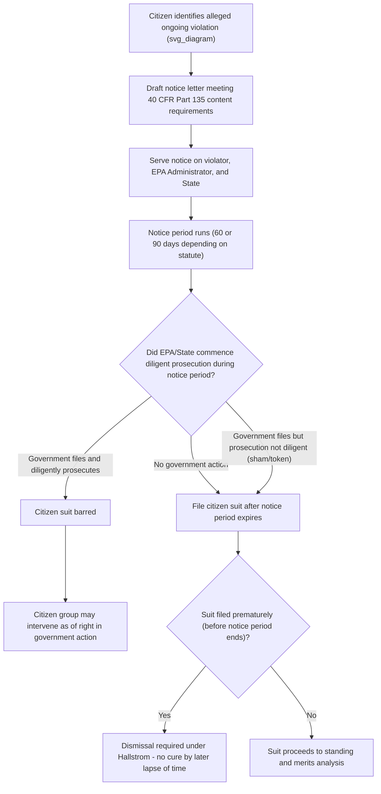

## Diligent Prosecution Bars and Statutory Notice Requirements

### Overview and Purpose

**Key Points**

- Citizen-suit provisions in federal environmental statutes impose two related but distinct procedural preconditions before a private plaintiff may sue: (1) a **pre-suit notice requirement**, and (2) a **diligent prosecution bar**.
- Both mechanisms serve the same underlying policy goal: preserving the primacy of government enforcement while allowing citizens to act as a "backstop" when the government is unwilling or unable to enforce.
- Notice requirements give the alleged violator an opportunity to achieve voluntary compliance and give EPA/the state an opportunity to initiate its own enforcement action before private litigation proceeds.
- The diligent prosecution bar prevents duplicative litigation and preserves prosecutorial discretion where the government has already acted in good faith.
- These requirements are treated as **mandatory claims-processing rules**, and in most circuits as **jurisdictional prerequisites** (or close to it) — failure to comply results in dismissal, though courts differ on whether the defect is jurisdictional (non-waivable, raisable at any time) or a mandatory but waivable claims-processing rule.

### Statutory Notice Requirements: Structure and Rationale

**Standard Notice Periods by Statute**

| Statute | Citation | Standard Notice Period | Recipients |
| --- | --- | --- | --- |
| Clean Air Act | 42 U.S.C. § 7604(b) | 60 days | Administrator, State, alleged violator |
| Clean Water Act | 33 U.S.C. § 1365(b) | 60 days | Administrator, State, alleged violator |
| RCRA (permit/standard violations) | 42 U.S.C. § 6972(b)(1)(A) | 90 days | Administrator, State, alleged violator |
| RCRA (imminent endangerment) | 42 U.S.C. § 6972(b)(2)(A) | 90 days | Administrator, State, alleged violator |
| ESA | 16 U.S.C. § 1540(g)(2)(A) | 60 days | Secretary, alleged violator |
| CERCLA | 42 U.S.C. § 9659(d) | 60 days | President (EPA), State, alleged violator |
| SDWA | 42 U.S.C. § 300j-8(b) | 60 days (with imminent-endangerment exception) | Administrator, State, alleged violator |
| TSCA | 15 U.S.C. § 2619(b) | 60 days | Administrator, State, alleged violator |

**Required Content of a Notice Letter**

EPA regulations (see, e.g., 40 C.F.R. Part 135 for CWA notice) specify that a valid notice letter must include:

1. **Sufficient information to identify** the specific standard, limitation, or order alleged to have been violated.
2. The **activity alleged to constitute a violation**.
3. The **person or persons responsible** for the alleged violation.
4. The **location** of the alleged violation.
5. The **date(s)** of the violation, or a reasonable description of when it occurred/is occurring.
6. The **full name, address, and telephone number** of the person giving notice.

### The "Sufficient Specificity" Standard

**Key Points**

- Courts strictly construe notice adequacy: the letter must give the recipient enough information to identify and correct the alleged violation without further investigation, so as to genuinely enable voluntary compliance or informed government intervention.
- General or conclusory allegations (e.g., "you are violating the Clean Water Act") are insufficient.
- However, courts do not require the notice to match the eventual complaint's legal theories with exact precision — the notice need only be specific enough that a reasonable recipient could identify and understand the alleged violations.
- **Hallstrom v. Tillamook County**, 493 U.S. 20 (1989) — the leading Supreme Court case on RCRA's notice/delay requirement, holding that the 60-day (now 90-day, following later amendment) notice-and-delay provision is a **mandatory condition precedent** to suit, and that a district court has no discretion to permit a case to proceed if suit is filed before the notice period expires — even if the notice period expires *while the litigation is pending*. Dismissal (or refiling) is required.
- **[Inference]** Because *Hallstrom* was decided under RCRA's specific text, its "strict mandatory compliance, no cure by later lapse of time" holding is generally treated as controlling for materially identical statutory language in other citizen-suit provisions (CAA, CWA, ESA), though courts occasionally distinguish based on subtle textual differences among the statutes.

### Consequences of Defective or Premature Notice

**Example**

An environmental group files a Clean Water Act citizen suit against a facility for NPDES permit violations, sending its 60-day notice letter and filing the complaint 45 days later, before the notice period expired.

- Under *Hallstrom*, the district court must dismiss the action, even though more than 60 days may have elapsed by the time the court rules on a motion to dismiss.
- The proper cure is to voluntarily dismiss and refile the complaint after the full notice period has run, rather than to seek a stay or attempt to "cure" the defect through the passage of time during litigation.
- This strict approach reflects the statutory text's condition-precedent structure: "No action may be commenced...prior to sixty days after the plaintiff has given notice..."

### Jurisdictional vs. Claims-Processing Characterization

**Key Points**

- Historically, courts often described the notice-and-delay requirement as "jurisdictional," meaning it could be raised at any time (even sua sponte by the court) and could not be waived or forfeited by the defendant.
- Following the Supreme Court's general trend narrowing what counts as truly "jurisdictional" (e.g., *Arbaugh v. Y&H Corp.*, 546 U.S. 500 (2006); *Fort Bend County v. Davis*, 587 U.S. 541 (2019)), some courts have reclassified citizen-suit notice requirements as **mandatory, non-jurisdictional claims-processing rules** — still requiring strict compliance if timely raised by the defendant, but potentially forfeitable if the defendant fails to raise the defect.
- **[Unverified]** The precise jurisdictional/claims-processing characterization can vary by circuit and by statute; practitioners should confirm current circuit precedent before relying on either characterization, since the doctrinal trend has continued to evolve since *Hallstrom*.

### The Diligent Prosecution Bar: Statutory Text and Structure

**Representative Statutory Language (Clean Water Act, 33 U.S.C. § 1365(b)(1)(B))**

> "No action may be commenced...if the Administrator or State has commenced and is diligently prosecuting a civil or criminal action in a court of the United States, or a State, to require compliance with the standard, limitation, or order..."

This structure recurs, with variations, across the CAA, CWA, and RCRA. Key requirements embedded in the text:

1. The government action must have been **"commenced"** — typically interpreted as the filing of a formal enforcement action in a judicial (not purely administrative) forum, though some statutes and regulations extend this to certain administrative penalty proceedings with adequate procedural safeguards.
2. The government must be **"diligently prosecuting"** — an ongoing, good-faith standard, not a one-time filing followed by inaction.
3. The action must seek **"compliance"** with the same standard, limitation, or order at issue in the citizen suit — a comparable-scope requirement.

### Determining "Diligence": Factors Courts Examine

| Factor | Indicates Diligent Prosecution | Indicates Lack of Diligence ("Sham" Enforcement) |
| --- | --- | --- |
| Scope of relief sought | Comparable injunctive relief and penalties to what citizen suit would seek | Minimal or no injunctive relief; token penalty |
| Timing | Filed independently, before or promptly upon notice | Filed suspiciously close to citizen notice letter, apparently to preempt suit |
| Ongoing activity | Active litigation, discovery, substantive motions | Filed and then dormant; no meaningful prosecution |
| Consent decree terms | Compliance schedule with enforceable deadlines and penalties | Vague compliance language, no enforceable timeline |
| Public/citizen participation | Opportunity for public comment (where statute requires, e.g., CWA consent decree provisions) | No opportunity for public input |

**Example**

A citizen group sends a CWA notice letter alleging ongoing permit violations. Nine days before the 60-day period expires, the state files an enforcement action seeking a nominal $500 penalty and no injunctive relief, then takes no further action for months.

- A court is likely to find this **not diligent** — the minimal penalty, lack of injunctive relief, timing immediately before the citizen suit deadline, and subsequent inaction are hallmarks of a "sham" or "sweetheart" settlement designed to preempt citizen enforcement rather than achieve genuine compliance.
- The citizen suit would likely be permitted to proceed despite the technically "commenced" state action.

### Intervention as the Preferred Remedy When Diligent Prosecution Exists

**Key Points**

- Most citizen-suit provisions expressly preserve a right for the citizen plaintiff to **intervene as a matter of right** in the government's diligently prosecuted action (e.g., CWA § 1365(b)(1)(B); CAA § 7604(b)(1)(B)).
- This reflects the structural policy: citizens are not shut out of the process entirely when the government acts diligently; they are redirected from an independent suit into a participatory role in the government's case.
- Intervention allows the citizen group to monitor settlement terms, advocate for stronger relief, and potentially object to inadequate consent decree terms (some statutes require DOJ/EPA to allow public comment periods on proposed consent decrees precisely for this reason, e.g., 33 U.S.C. § 1365(c)(3)).

### Diligent Prosecution and Res Judicata / Claim Preclusion

**[Inference]** Even where a diligent prosecution bar does not formally apply (e.g., because the government action was not "commenced" before the citizen suit), a final judgment or consent decree in the government's enforcement action may still preclude a later citizen suit on preclusion/res judicata grounds if the citizen group was in privity with the government or had adequate notice and opportunity to participate — though courts apply this doctrine cautiously given citizen suits' distinct statutory purpose and the general rule that non-parties are not bound by judgments in actions to which they were strangers.

### Interaction Between Notice and Diligent Prosecution: Sequential Analysis

### Notice and Diligent Prosecution Under RCRA's Two Causes of Action

**Key Points**

- RCRA's § 6972(a)(1)(A) claims (permit/standard violations) and § 6972(a)(1)(B) claims (imminent and substantial endangerment) have **different notice periods** for certain sub-categories, and the diligent prosecution bar text differs slightly between the two prongs.
- For the endangerment prong, the diligent prosecution bar is keyed to whether EPA has commenced and is diligently prosecuting an action **under RCRA or CERCLA** to require the responsible party to take action — meaning a diligently prosecuted CERCLA cleanup action can bar a RCRA endangerment citizen suit addressing the same contamination, reflecting Congress's intent to avoid duplicative cleanup litigation across the two statutes.
- **[Inference]** This cross-statutory diligent-prosecution bar (RCRA citizen suit barred by diligent CERCLA prosecution) is a frequently tested nuance because it requires recognizing that the bar is not limited to prosecution under the *same* statute as the citizen suit.

### CERCLA's Distinct Structural Bar: Section 113(h)

**Key Points**

- Separate from the ordinary diligent-prosecution bar, CERCLA contains an additional, more far-reaching jurisdictional restriction: 42 U.S.C. § 9613(h) strips federal courts of jurisdiction to review challenges to an ongoing removal or remedial action, regardless of whether the government is "diligently prosecuting" anything, except in five enumerated circumstances (e.g., a cost-recovery action under § 107, a citizen suit alleging the removal/remedial action violates CERCLA **after it is completed**, or an action to compel a required response action once the President/EPA has finished implementing an initial response).
- This means a CERCLA citizen suit under § 9659 attacking an in-progress cleanup is generally barred by § 9613(h) even absent any competing enforcement action — a distinct and broader restriction than the standard diligent-prosecution bar found in the CAA/CWA/RCRA.

### Practical Litigation Checklist for Counsel

**Next Steps**

1. **Confirm the applicable statute's exact notice period** (60 vs. 90 days) and any exceptions (e.g., imminent-endangerment carve-outs under SDWA).
2. **Draft the notice letter to satisfy the applicable content regulations** (generally modeled on 40 C.F.R. Part 135 for CWA; parallel regulations exist for CAA, RCRA, etc.), including specific standards violated, activity, responsible parties, location, and dates.
3. **Serve notice on all required recipients** — typically the alleged violator, EPA Administrator, and the relevant state agency — via the method specified in the implementing regulations (often certified mail).
4. **Calendar the full notice period precisely** and do not file suit even one day early — under *Hallstrom*, premature filing requires dismissal regardless of subsequent developments.
5. **Monitor for government enforcement action** during the notice period; if filed, assess diligence factors (scope of relief, timing, ongoing activity) before deciding whether to proceed or seek intervention instead.
6. **For RCRA endangerment claims**, check for pending CERCLA response actions addressing the same site, which may trigger the cross-statutory diligent-prosecution bar.
7. **For CERCLA-related claims**, separately analyze § 9613(h) timing-of-review restrictions independent of the diligent-prosecution analysis.

### Comparative Summary Table

| Doctrine | Function | Leading Case | Cure if Violated |
| --- | --- | --- | --- |
| Notice requirement | Gives violator/government chance to act before suit | *Hallstrom v. Tillamook County* | Dismiss and refile after full notice period |
| Diligent prosecution bar | Prevents duplicative suits where government already diligently enforcing | (Statutory text; various circuit applications) | Intervene in government's action instead of independent suit |
| CERCLA § 113(h) timing-of-review bar | Prevents interference with ongoing response actions | (Statutory; distinct from diligent prosecution) | Wait until removal/remedial action is complete, or fit within an enumerated exception |

**Related Topics**

- *Hallstrom v. Tillamook County* and mandatory pre-suit notice
- *Gwaltney of Smithfield v. Chesapeake Bay Foundation* and the "ongoing violation" requirement
- Consent decree public comment procedures and citizen participation rights
- CERCLA § 113(h) timing-of-review restrictions on challenges to response actions
- Jurisdictional vs. claims-processing rule characterization post-*Arbaugh* and *Fort Bend County v. Davis*
- Intervention as of right under Federal Rule of Civil Procedure 24 in environmental enforcement actions
- Cross-statutory diligent prosecution bars (RCRA endangerment claims barred by CERCLA enforcement)
- Sham/sweetheart settlement doctrine in citizen-suit litigation
- *Lujan v. Defenders of Wildlife* and Article III standing overlay on citizen suits
- EPA notice regulations under 40 C.F.R. Part 135 and analogous provisions