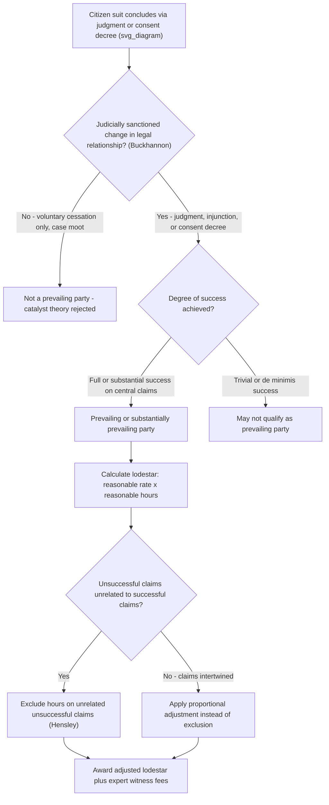

## Fee Shifting and Attorney's Fees Under Environmental Citizen Suit Provisions

### Statutory Framework and Common Language

**Key Points**

- Most federal environmental citizen-suit provisions include a discretionary fee-shifting clause authorizing courts to award "costs of litigation (including reasonable attorney and expert witness fees) to any party, whenever the court determines such award is appropriate."
- This is a departure from the traditional "**American Rule**," under which each party bears its own attorney's fees absent a statutory or contractual exception.
- Unlike many federal fee-shifting statutes (e.g., civil rights fee statutes under 42 U.S.C. § 1988, which award fees to a "prevailing party"), several environmental citizen-suit provisions use the broader "**to any party**" and "**whenever appropriate**" language — a textual distinction that has generated significant litigation over whether these clauses permit fee awards on a broader basis than the traditional prevailing-party standard.

### Representative Statutory Fee-Shifting Provisions

| Statute | Citation | Statutory Language |
| --- | --- | --- |
| Clean Air Act | 42 U.S.C. § 7604(d) | "Court, in issuing any final order...may award costs of litigation (including reasonable attorney and expert witness fees) to any party, whenever the court determines such award is appropriate" |
| Clean Water Act | 33 U.S.C. § 1365(d) | "Court, in issuing any final order...may award costs of litigation (including reasonable attorney and expert witness fees) to any prevailing or substantially prevailing party, whenever the court determines such award is appropriate" |
| RCRA | 42 U.S.C. § 6972(e) | "Court, in issuing any final order...may award costs of litigation (including reasonable attorney and expert witness fees) to the prevailing or substantially prevailing party, whenever the court determines such an award is appropriate" |
| ESA | 16 U.S.C. § 1540(g)(4) | "Court, in issuing any final order...may award costs of litigation (including reasonable attorney and expert witness fees) to any party, whenever the court determines such award is appropriate" |
| CERCLA | 42 U.S.C. § 9659(f) | "Court, in issuing any final order...may award costs of litigation (including reasonable attorney and expert witness fees) to the prevailing or substantially prevailing party, whenever the court determines such an award is appropriate" |

**[Inference]** The recurring textual variation — "any party" (CAA, ESA) versus "prevailing or substantially prevailing party" (CWA, RCRA, CERCLA) — is a frequently tested distinction, since it raises the question of whether Congress intended broader fee eligibility under the CAA/ESA formulation than under statutes expressly requiring prevailing-party status.

### The "Substantially Prevailing" Standard

**Key Points**

- A plaintiff need not win outright on every claim to be a "prevailing or substantially prevailing party" — partial success, especially on the central issue(s) that motivated the suit, can suffice.
- Courts generally apply a two-part framework, drawn from general federal fee-shifting jurisprudence (e.g., *Hensley v. Eckerhart*, 461 U.S. 424 (1983), decided under 42 U.S.C. § 1988 but broadly influential):
  1. Did the plaintiff achieve some degree of success on the merits, resulting in a **material alteration of the legal relationship** between the parties (e.g., an enforceable judgment, consent decree, or court-ordered injunction)?
  2. If so, what is a **reasonable fee** given the degree of success achieved (calculated via the lodestar method, described below)?

### The Buckhannon Decision and the Rejection of the "Catalyst Theory"

- **Citation**: *Buckhannon Board & Care Home, Inc. v. West Virginia Department of Health and Human Resources*, 532 U.S. 598 (2001)
- Decided under the Fair Housing Amendments Act and Americans with Disabilities Act fee provisions (both using "prevailing party" language), the Court held that a plaintiff is not a "prevailing party" merely because the lawsuit acted as a **catalyst** for the defendant's voluntary change in conduct.
- To be a "prevailing party," there must be a **judicially sanctioned change** in the legal relationship of the parties — such as an enforceable judgment on the merits or a court-ordered consent decree — not merely a voluntary cessation of the challenged conduct that moots the case without any judicial imprimatur.
- **Impact on environmental citizen suits**: Because CWA, RCRA, and CERCLA fee provisions use "prevailing or substantially prevailing party" language similar to the statutes at issue in *Buckhannon*, courts have generally extended *Buckhannon*'s rejection of the catalyst theory to these environmental fee-shifting clauses.
- **[Inference]** Whether *Buckhannon* applies with equal force to the CAA's and ESA's broader "**to any party**" language (rather than "prevailing party") remains a point of continued litigation and circuit variation; the textual distinction gives some courts and commentators grounds to argue for a surviving catalyst-type theory under those specific statutes, but this is not uniformly resolved. **[Unverified]** Practitioners should verify current circuit-specific treatment before relying on a catalyst theory under the CAA or ESA fee provisions.

### The Lodestar Method for Calculating Reasonable Fees

$$\text{Lodestar} = \text{Reasonable Hourly Rate} \times \text{Reasonable Hours Expended}$$

- The lodestar figure is calculated by multiplying a reasonable hourly rate (typically the prevailing market rate in the relevant community for attorneys of comparable skill and experience) by the number of hours reasonably expended on the litigation.
- Courts may **adjust the lodestar** upward or downward based on factors such as:
  - The degree of success obtained relative to the relief sought
  - The complexity and novelty of the issues
  - Time and labor reasonably required
  - Whether hours were duplicative, excessive, or unrelated to the successful claims
- **Hensley v. Eckerhart** instructs that where a plaintiff succeeds on some claims but not others, and the unsuccessful claims are unrelated to the successful ones, hours spent solely on the unsuccessful claims should generally be excluded from the lodestar calculation.
- Expert witness fees are separately authorized by the express statutory text ("including reasonable attorney **and expert witness fees**"), which is broader than many general federal fee statutes that do not automatically include expert fees.

### Fee Awards Against Plaintiffs (Fees to Prevailing Defendants)

**Key Points**

- Because most provisions authorize fees to "any party" or use bidirectional prevailing-party language, a **prevailing defendant** can, in principle, recover fees from an unsuccessful citizen-suit plaintiff.
- However, courts generally apply a **heightened standard** for awarding fees against plaintiffs (echoing the Title VII framework from *Christiansburg Garment Co. v. EEOC*, 434 U.S. 412 (1978)), requiring a showing that the plaintiff's suit was **frivolous, unreasonable, or without foundation**, even if not brought in subjective bad faith.
- This asymmetric application protects the citizen-suit mechanism's core purpose — encouraging good-faith private enforcement — by not chilling meritorious-but-unsuccessful suits with the threat of fee liability, while still deterring genuinely frivolous litigation.
- **[Inference]** Whether the *Christiansburg* frivolousness standard formally applies to environmental citizen-suit fee-shifting provisions (as opposed to Title VII) has been assumed or adopted by analogy in many circuits, but the textual hook is less direct than in Title VII, since most environmental provisions do not distinguish explicitly between plaintiff and defendant fee awards the way Title VII case law has developed.

### Example: Fee Award Calculation Walkthrough

**Example**

A citizen group sues a facility under the CWA for NPDES permit violations, seeking injunctive relief and penalties. The court finds ongoing violations on three of five alleged discharge points, orders injunctive relief and a $150,000 penalty to the Treasury, but rejects the claims regarding the other two discharge points as unsupported by the evidence.

1. **Prevailing/substantially prevailing party determination**: The plaintiff obtained an enforceable judgment materially altering the parties' legal relationship (injunction + penalty) — satisfies *Buckhannon*'s judicial-imprimatur requirement.
2. **Degree of success**: Success on 3 of 5 claims is a significant, non-trivial result on the central theory of the case (ongoing permit violations), likely supporting a "substantially prevailing" finding even though not a complete win.
3. **Lodestar calculation**: Court multiplies reasonable hours (e.g., 400 hours) by a reasonable local market rate for environmental litigation counsel (e.g., $450/hour) = $180,000 base lodestar.
4. **Adjustment**: Court may reduce the lodestar by a percentage to reflect the two unsuccessful discharge-point claims if time can be segregated, or apply a smaller across-the-board reduction if the claims were factually intertwined and not separable.
5. **Expert witness fees**: Separately awarded for the water-quality expert's time, as expressly authorized by the statutory text.

### Fee Shifting and Settlement Dynamics

**Key Points**

- Because fee-shifting provisions apply not just to litigated judgments but also to **consent decrees** (a "judicially sanctioned change" satisfying *Buckhannon*), fee negotiations are frequently embedded within settlement discussions.
- Defendants often negotiate a **capped or agreed-upon fee amount** as part of a global settlement to avoid separate fee litigation, which can itself be expensive and protracted.
- Some consent decrees include **fee-shifting waivers** or negotiated lump-sum fee payments in exchange for the plaintiff's agreement not to seek a separately litigated fee award.
- **[Inference]** The availability of fee-shifting is frequently cited as a critical practical enabler of environmental citizen enforcement, since without it, resource-constrained public interest organizations would face a significant disincentive to bring complex, expert-intensive environmental litigation.

### Fee-Shifting Analysis Flow (svg_diagram)

### Comparative Note: Environmental Fee Provisions vs. General Federal Fee-Shifting Statutes

| Feature | Environmental Citizen-Suit Fee Provisions | 42 U.S.C. § 1988 (Civil Rights) |
| --- | --- | --- |
| Standard language | "prevailing or substantially prevailing party" or "any party" | "prevailing party" |
| Expert witness fees | Expressly included in statutory text | Not automatically included; separate statutory authorization needed in most contexts |
| Catalyst theory | Generally rejected post-*Buckhannon* for "prevailing party" formulations | Rejected by *Buckhannon* itself |
| Fees to prevailing defendants | Available but under heightened frivolousness-type standard by analogy | Governed directly by *Christiansburg Garment Co. v. EEOC* |
| "Substantially prevailing" nuance | Explicit statutory text in CWA/RCRA/CERCLA allows partial-success fee awards | Achieved through case law (*Hensley*), not explicit "substantially prevailing" text |

### Practical Considerations for Fee Petitions

**Next Steps**

1. **Document contemporaneous time records** in detail, categorized by claim/issue, to facilitate lodestar calculation and to support segregation arguments if some claims are unsuccessful.
2. **Establish the reasonable hourly rate** with affidavits from comparable practitioners or fee surveys for the relevant legal market and specialty (environmental litigation rates often differ from general civil litigation rates).
3. **Frame the "degree of success" narrative** around the core objectives of the litigation (e.g., securing injunctive relief and future compliance), not merely a claim-by-claim scorecard, since partial statutory/factual success on central issues can still support a strong fee award.
4. **Anticipate defendant arguments** distinguishing unrelated unsuccessful claims under *Hensley* and be prepared to show factual/legal interrelation among all claims to resist proportional reductions.
5. **Consider negotiated fee resolution** as part of any consent decree to avoid protracted, costly satellite fee litigation.
6. **For defendants**, evaluate whether a plaintiff's suit meets the frivolous/unreasonable/without-foundation threshold before pursuing a fee award, given the asymmetric standard favoring plaintiffs in most circuits.

**Related Topics**

- *Buckhannon Board & Care Home v. West Virginia DHHR* and the rejection of the catalyst theory
- *Hensley v. Eckerhart* and the lodestar method for fee calculation
- *Christiansburg Garment Co. v. EEOC* and heightened standards for defendant fee awards
- *Friends of the Earth v. Laidlaw* and mootness/voluntary cessation doctrine
- Consent decree negotiation and public comment requirements in environmental enforcement
- Diligent prosecution bars and statutory notice requirements (procedural preconditions to citizen suits)
- Expert witness fee recovery distinctions between environmental statutes and general civil fee-shifting law
- Comparative fee-shifting frameworks across federal civil rights and environmental statutes