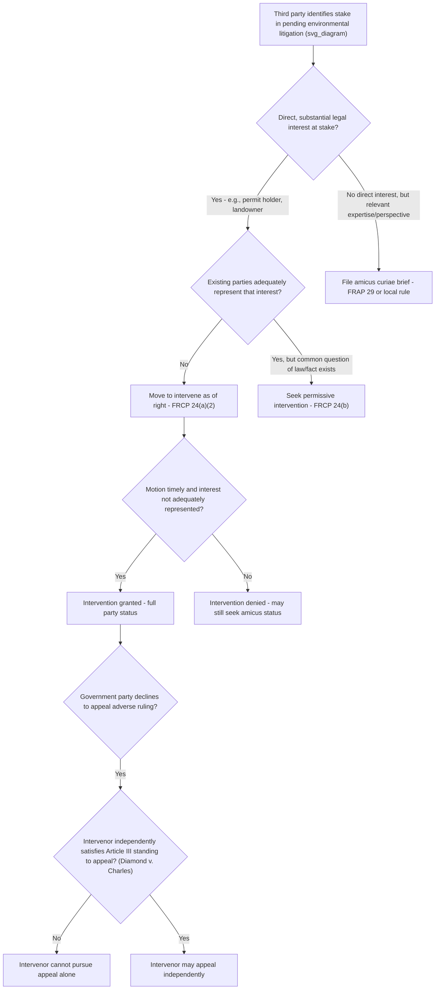

## Intervention and Amicus Practice in Environmental Litigation

### Overview and Doctrinal Context

**Key Points**

- Environmental litigation frequently involves parties beyond the original plaintiff and defendant whose interests are directly affected — regulated industry, competing environmental groups, states, and tribes.
- Two primary procedural vehicles allow third parties to participate: **intervention** (becoming a full party with rights to litigate, appeal, and be bound by the judgment) and **amicus curiae** ("friend of the court") participation (submitting briefs without becoming a party).
- Intervention is governed principally by **Federal Rule of Civil Procedure 24**; amicus practice is governed by **Federal Rule of Appellate Procedure 29** at the appellate level and by local district court rules (and judicial discretion) at the trial level.
- Environmental citizen-suit statutes often contain **statute-specific intervention provisions** that interact with, and sometimes supplement, Rule 24.

### Intervention as of Right — FRCP 24(a)

**Rule Text Structure (24(a)(2))**

A court **must** permit intervention by anyone who, on timely motion:

1. Claims an **interest relating to the property or transaction** that is the subject of the action; and
2. Is **so situated that disposing of the action** may as a practical matter **impair or impede** the movant's ability to protect that interest; **unless**
3. Existing parties **adequately represent** that interest.

**Application in Environmental Cases**

| Element | Typical Environmental Application |
| --- | --- |
| Interest | A permit holder's economic interest in a challenged discharge permit; a landowner's property interest in land subject to a critical habitat designation; an industry group's interest in a challenged regulation |
| Impairment | Vacatur of the permit/rule would directly eliminate or restrict the movant's authorized activity |
| Inadequate representation | The government defendant may prioritize broader public/regulatory interests over the movant's specific commercial interest, or may settle in a way adverse to the movant |

**Example**

In a citizen suit challenging an NPDES permit issued to a manufacturing facility, the facility itself (the permittee) has a clear right to intervene: it has a direct economic interest in the permit's validity, invalidation would impair its ability to operate, and EPA (the nominal defendant government agency, if named) may not adequately represent the facility's private economic interest, since EPA's institutional interest is defending its regulatory process generally rather than the permittee's specific business.

### Permissive Intervention — FRCP 24(b)

- Allows a court, in its **discretion**, to permit intervention by anyone who:
  1. Is given a **conditional right to intervene by federal statute**, or
  2. Has a **claim or defense that shares a common question of law or fact** with the main action.
- The court must consider whether intervention will **unduly delay or prejudice** the adjudication of the original parties' rights.
- Environmental citizen-suit statutes frequently supply the statutory hook for permissive intervention under 24(b)(1)(A): e.g., CWA § 1365(b)(1)(B) expressly preserves a right to intervene in a government's diligently prosecuted enforcement action, which courts treat as the kind of statutory intervention right contemplated by Rule 24(b).

### Statute-Specific Intervention Provisions

**Key Points**

- Several citizen-suit statutes explicitly authorize intervention as a substitute remedy when the **diligent prosecution bar** prevents an independent citizen suit (see, e.g., CWA § 1365(b)(1)(B); CAA § 7604(b)(1)(B); RCRA § 6972(b)(1)(B)).
- These provisions function as a **statutory safety valve**: a citizen group barred from suing independently because the government is diligently prosecuting is guaranteed a seat at the table via intervention, preserving meaningful citizen participation even where direct suit is foreclosed.
- Consent decree provisions in several statutes (e.g., CWA § 1365(c)(3)) require a **public comment period** before judicial entry of a consent decree in a government enforcement action, giving non-party citizens (including those who did not formally intervene) a mechanism to object to inadequate settlement terms.

### Intervention by States, Tribes, and Local Governments

- States frequently intervene in environmental litigation involving federal regulations that affect state-administered permitting programs (e.g., State Implementation Plans under the CAA, NPDES-delegated state permitting programs under the CWA).
- States may intervene either in **support of** federal regulatory action (to protect delegated program authority) or **against** it (to protect state sovereignty or economic interests, particularly in politically salient rulemakings such as greenhouse gas regulations or WOTUS/"waters of the United States" definitional rules).
- Tribal governments may seek intervention where treaty rights, reserved water rights, or reservation land use are implicated by the litigation's outcome, invoking both Rule 24(a) interest-impairment analysis and, in some cases, specific tribal trust-relationship considerations.

### Intervention and Standing: Must Intervenors Independently Satisfy Article III?

**Key Points**

- Circuits have split on whether an intervenor must independently satisfy Article III standing, particularly where the intervenor seeks to pursue relief or an appeal that the original party is unwilling to pursue.
- The Supreme Court has held that at least one party with Article III standing must be present at each stage of litigation, but has not definitively resolved in all contexts whether intervenors themselves must independently demonstrate standing when they merely defend a judgment already secured by a party with standing, versus when they seek to expand or independently pursue relief (e.g., an appeal that the original party has declined to take).
- **Diamond v. Charles**, 476 U.S. 54 (1986) — held that an intervenor-defendant lacked standing to appeal a judgment invalidating an Illinois abortion statute after the state itself declined to appeal, because the intervenor could not independently satisfy Article III injury in fact; this case is frequently cited by analogy in environmental intervention disputes where an intervenor seeks to appeal after the government defendant declines.
- **[Inference]** This standing-of-intervenors question recurs frequently in environmental rulemaking litigation, where an industry or environmental intervenor may wish to appeal an adverse ruling after the federal government (as the named defendant) elects not to appeal, and courts scrutinize whether the intervenor has its own independent, particularized injury sufficient to proceed.

### Amicus Curiae Practice: Purpose and Mechanics

**Key Points**

- Amicus participation allows a non-party to submit a brief providing the court with additional legal argument, empirical/scientific information, or a perspective not otherwise represented by the parties, without assuming the burdens (or rights) of full party status.
- At the appellate level, **FRAP 29** governs: a brief may be filed with consent of all parties, leave of court, or (in many circuits, at the U.S. Courts of Appeals and Supreme Court) as of right when filed by certain governmental entities.
- The Supreme Court's rules similarly allow amicus filings with consent of the parties or leave of the Court; **Supreme Court Rule 37** requires disclosure of whether any party's counsel authored the brief in whole or part and whether any person other than the amicus funded its preparation.
- District courts have **broad discretion** to accept or reject amicus briefs; there is no uniform rule, and practice varies significantly by judge and district, though many courts consider factors such as whether the brief offers a unique perspective, relevant expertise, or information not otherwise before the court.

### Distinguishing Intervention from Amicus Participation

| Feature | Intervention | Amicus Curiae |
| --- | --- | --- |
| Party status | Becomes a full party | Remains a non-party |
| Bound by judgment | Yes | No |
| Right to appeal | Yes (subject to standing analysis) | Generally no independent right to appeal |
| Discovery rights | Yes, as a party | No |
| Standard for participation | Rule 24(a) (as of right) or 24(b) (permissive) | Court discretion; FRAP 29 at appellate level |
| Typical use case | Direct, substantial stake in outcome (e.g., permittee, regulated entity) | Providing expertise, broader context, or policy perspective (e.g., scientific organizations, academic groups, other affected industries) |
| Standing requirement | Frequently required to independently satisfy Article III, particularly for appeal | Not required — amici need not have Article III standing |

### Amicus Practice in Environmental Rulemaking Challenges

**Example**

In a challenge to an EPA rule regulating power plant emissions under the Clean Air Act, typical amicus participants might include:

- **Scientific and public health organizations** submitting technical briefs on health effects of the regulated pollutant.
- **State attorneys general coalitions** (often filing jointly across multiple states) addressing federalism and cooperative-federalism structure concerns.
- **Industry trade associations** representing regulated sectors not directly party to the suit but affected by the precedent.
- **Academic environmental law clinics** addressing statutory interpretation questions (e.g., Chevron/major questions doctrine issues).

Such briefs are common in high-profile environmental cases and can meaningfully shape appellate and Supreme Court decision-making by supplying technical or empirical context the parties' briefs may not fully develop.

### Intervention/Amicus Decision Flow (svg_diagram)

### Timeliness Requirements for Intervention

**Key Points**

- Rule 24 requires that a motion to intervene be **timely**, assessed under a flexible, multi-factor test that typically considers:
  1. The stage of the proceeding at which the movant seeks to intervene.
  2. The purpose for which intervention is sought.
  3. The length of time the movant knew or reasonably should have known of its interest before moving to intervene.
  4. Prejudice to existing parties from any delay.
  5. Any unusual circumstances militating for or against timeliness.
- In environmental cases, motions to intervene filed **early**, shortly after a complaint is filed or a rule is challenged, are routinely granted; late-stage intervention motions (e.g., after summary judgment briefing has concluded, or on appeal for the first time) face substantially higher scrutiny and are more frequently denied absent compelling justification.

### Practical Considerations for Environmental Practitioners

**Next Steps**

1. **Assess whether a client's interest is direct and substantial enough to warrant intervention** (full party status, with attendant discovery obligations and litigation costs) versus amicus participation (lower cost, narrower scope, no binding effect).
2. **File intervention motions promptly** upon learning of the litigation to avoid timeliness objections; do not wait for a dispositive motion stage.
3. **Articulate a concrete, particularized interest** distinct from the general public interest to strengthen both the Rule 24(a)(2) interest analysis and any later Article III standing analysis (especially important if independent appellate rights may later be needed).
4. **Consider permissive intervention** under 24(b) as a fallback where the "adequate representation" element of intervention as of right is contestable.
5. **For amicus briefs**, focus on providing information, expertise, or context genuinely not covered by the parties' own briefs — courts are more receptive to amicus participation that adds value rather than duplicating party arguments.
6. **Coordinate multi-amicus filings** (e.g., joint state coalition briefs, joint scientific-organization briefs) to present a unified, efficient presentation to the court and avoid duplicative or repetitive submissions that risk being disregarded.
7. **Anticipate standing challenges** if intervention is sought specifically to preserve independent appellate rights, and build a factual record supporting the intervenor's own concrete injury in fact from the outset.

**Related Topics**

- Federal Rule of Civil Procedure 24 — intervention as of right and permissive intervention
- *Diamond v. Charles* and the standing of intervenors seeking independent appeal
- Diligent prosecution bars and the statutory right to intervene in government enforcement actions
- Consent decree public comment requirements in environmental enforcement settlements
- *Lujan v. Defenders of Wildlife* and Article III standing principles applicable to intervenors
- FRAP 29 and Supreme Court Rule 37 amicus curiae procedures
- State attorneys general coalition litigation in environmental rulemaking challenges
- Tribal intervention and treaty-rights-based participation in environmental litigation
- Timeliness analysis under Rule 24 in complex multi-party environmental cases
- Adequacy of representation disputes between government defendants and private intervenors