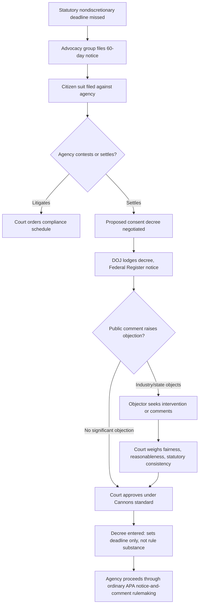

## Consent Decrees, Settlement Practice, and Sue and Settle Controversies

### Definitional Framework

A **consent decree** is a court-entered judgment that embodies a settlement agreement between litigants, combining features of a contract and a judicial order. Unlike an ordinary settlement agreement (a private contract enforceable through ordinary breach-of-contract remedies), a consent decree is entered by a court, which retains continuing jurisdiction to enforce its terms through the court's contempt power.

Three related instruments are often conflated:

- **Consent decree** — judicially entered, retains court jurisdiction, enforceable by contempt.
- **Settlement agreement** — privately negotiated, dismissed via Federal Rule of Civil Procedure 41(a), enforced (if at all) as an ordinary contract or through a separate breach action.
- **Consent order / administrative order on consent (AOC)** — issued by an agency (e.g., under CERCLA § 122 or RCRA § 3008(h)) without an Article III court's direct involvement, though it may later be incorporated into judicial proceedings.

The consent decree derives its enforceability from Federal Rule of Civil Procedure 60(b) (relief from judgment) and the court's inherent equitable power to supervise compliance with its own orders. Because it is simultaneously a negotiated bargain and a judicial act, courts apply a hybrid interpretive approach — reading the decree "within its four corners" as a contract (*United States v. Armour & Co.*, 1971) while retaining equitable discretion to enforce, modify, or terminate it.

### Statutory Origins in Environmental Citizen Suits

Consent decrees are the dominant resolution mechanism for environmental citizen suits because nearly every major federal environmental statute authorizes private enforcement:

- Clean Air Act § 304(a)
- Clean Water Act § 505(a)
- RCRA § 7002(a)
- CERCLA § 310
- Endangered Species Act § 11(g)

These provisions permit "any person" to sue (1) a regulated entity for ongoing violations of an effluent or emission standard, or (2) the relevant federal agency for failure to perform a **nondiscretionary duty** — most commonly, missing a statutory deadline to issue a regulation. Suits of the second type are the origin of the settlement practices later branded "sue and settle."

Procedural prerequisites include a mandatory 60-day pre-suit notice period (75 days for some CAA claims) and a diligent-prosecution bar, which precludes citizen suits where the government is already diligently prosecuting a comparable enforcement action in court.

### The Consent Decree Approval Process

Environmental consent decrees involving the United States follow a distinct public-participation track layered on top of ordinary litigation:

1. **Negotiation** between DOJ (representing the agency) and the plaintiff(s) or defendant(s).
2. **Lodging** of the proposed decree with the court — filed but not yet entered as a final judgment.
3. **Federal Register publication** and a public comment period, typically 30 days, required by Department of Justice regulation (28 C.F.R. § 50.7) and, for many statutes, by the enabling act itself (e.g., CERCLA § 122(d)(2), CWA § 122).
4. **Comment review** — DOJ and the agency must respond to comments and may withdraw consent before entry.
5. **Judicial fairness review** — the court independently assesses the decree before entering it as a final judgment.
6. **Entry and compliance monitoring**, often with periodic reporting, an independent monitor, or a special master.
7. **Termination**, triggered by a sunset date, certified compliance, or motion to terminate.

### Judicial Standard for Approving Consent Decrees

Courts do not act as a rubber stamp. The prevailing standard, articulated in *United States v. Cannons Engineering Corp.* (1st Cir. 1990) and echoed across circuits, requires the decree to be:

- **Fair** — procedurally (arm's-length, good-faith negotiation) and substantively (reasonable relationship between liability and remedy);
- **Reasonable** — considering the decree's technical adequacy, the strength of the plaintiff's case, and the public interest; and
- **Consistent with the statute** — the decree may not exceed the court's authority to grant relief under the underlying cause of action, nor contravene the statute's purposes.

*Local No. 93, International Association of Firefighters v. City of Cleveland* (1986) established that a consent decree may bind the settling parties to relief broader than a court could impose after trial, since the parties are also exercising their independent contractual authority to settle — but it may not impose obligations on non-consenting third parties or violate applicable law.

**[Inference]** In environmental cases, courts applying *Cannons* often give substantial deference to the technical judgments of the expert agency (EPA) reflected in a proposed decree's remedial provisions, similar to *Chevron*-era deference to agency expertise, though this deference is not doctrinally identical to statutory interpretation deference.

### Standing Doctrine Intersections

Standing operates at three separate points in the consent-decree lifecycle:

- **Plaintiff standing to sue.** Article III requires injury-in-fact, causation, and redressability. *Lujan v. Defenders of Wildlife* (1992) tightened injury-in-fact for procedural and aesthetic environmental injuries; *Friends of the Earth, Inc. v. Laidlaw Environmental Services* (2000) clarified that a plaintiff's reasonable concerns about pollution's effects on their recreational or aesthetic use of an affected area suffice, even without provable environmental harm, and that a defendant's post-suit compliance does not moot the case if civil penalties remain available as deterrence.
- **Third-party standing to object or intervene.** Regulated entities, states, or competing interest groups may seek to intervene under Federal Rule of Civil Procedure 24 (as of right or permissively) or may submit comments during the Federal Register comment period without formal intervention. Courts generally hold that objectors lack a right to relitigate the underlying merits of the government's claims but may challenge the decree's fairness, scope, or legality.
- **Standing to appeal.** A non-settling party generally lacks standing to appeal a consent decree it was never a party to, unless it successfully intervened below and can show the decree causes it a cognizable injury (e.g., a competitor disadvantaged by decree-imposed obligations, or a state whose regulatory authority is displaced).

### Content and Structure of Environmental Consent Decrees

A typical environmental consent decree contains:

- **Findings/jurisdictional recitals** — often including a disclaimer that the defendant does not admit liability.
- **Injunctive relief** — a compliance schedule with interim and final deadlines (e.g., installation of pollution controls, remedial investigation milestones under CERCLA).
- **Civil penalty** — a fixed monetary payment to the U.S. Treasury or state fund.
- **Supplemental Environmental Projects (SEPs)** — environmentally beneficial projects a defendant undertakes in exchange for a reduced cash penalty, subject to EPA's SEP policy limiting the practice to a defined nexus with the violation.
- **Stipulated penalties** — pre-agreed monetary consequences for future noncompliance with the decree's own terms, avoiding the need to relitigate liability for each subsequent violation.
- **Force majeure and dispute resolution clauses.**
- **Termination/sunset provisions** — increasingly required by DOJ policy to include a defined end date rather than indefinite oversight.
- **Retained jurisdiction clause** — the mechanism enabling contempt enforcement.

A simple stipulated-penalty accrual structure might be expressed as a tiered daily rate:

$$P = \sum_{i=1}^{n} r_i \cdot d_i$$

where $r_i$ is the per-day penalty rate applicable to violation-severity tier $i$, and $d_i$ is the number of days the violation persisted within that tier — with $r_i$ typically increasing for repeated or prolonged noncompliance.

### Modification and Termination Standards

Consent decrees are not immutable. *Rufo v. Inmates of Suffolk County Jail* (1992), though decided in an institutional-reform (prison conditions) context, established the modern flexible-modification standard: a party seeking modification must show a **significant change in factual conditions or law** that makes compliance substantially more onerous, unworkable, or detrimental to the public interest, and any proposed modification must be **suitably tailored** to the changed circumstances. This standard has migrated into environmental consent-decree practice, particularly for long-duration decrees (e.g., multi-decade Clean Water Act sewer-overflow decrees) where technology, cost conditions, or population growth may shift substantially after entry.

**[Unverified]** The precise degree to which *Rufo*'s "public interest" prong applies with full force outside institutional-reform litigation remains contested among circuits, and practitioners should confirm circuit-specific treatment before relying on it in a negotiated environmental decree.

### The "Sue and Settle" Controversy

"Sue and settle" is an industry- and congressionally-coined, pejorative label for a specific pattern: an environmental advocacy group sues EPA for missing a statutory deadline to issue a rule, and EPA — rather than litigating — settles by agreeing to a new deadline (and sometimes attorney's fees) without the participation of regulated industry or affected states in the settlement negotiations.

**Core elements of the critique** (as advanced by regulated industry, some state attorneys general, and congressional critics):

- The Administrative Procedure Act's notice-and-comment framework is designed to give all stakeholders a voice before a rule issues; if the *rulemaking's timing and, critics allege, sometimes its substantive contours* are effectively locked in through a two-party settlement, regulated parties are excluded from a decision that materially affects them.
- Settlements sometimes included EPA's payment of the plaintiff organization's attorney's fees, which critics characterized as a subsidy for repeat litigation.
- The practice was alleged to let an agency use litigation as a vehicle to accomplish policy priorities it favored anyway, agreeing quickly to demands it would have pursued regardless ("collusive" settlement).

**Core elements of the defense** (as advanced by environmental groups and some administrative law scholars):

- Longstanding DOJ policy already prohibits agencies from committing, in a settlement or consent decree, to a *specific substantive rulemaking outcome* — a decree may bind the agency to a **deadline** for action, not to what the rule must say. The subsequent rule must still go through ordinary APA notice-and-comment rulemaking, where industry retains full participation rights.
- Nondiscretionary deadline suits enforce clear statutory commands that Congress itself wrote; settling a suit where the agency has, in fact, missed a hard statutory deadline is not "collusion" but an efficient resolution of a case the agency would very likely lose.
- A GAO review of DOJ and EPA settlement practices found that agencies generally followed applicable rules and did not identify systematic evidence of improper collusion. **[Unverified]** — exact GAO findings and methodology should be confirmed against the original report (GAO-14-397, 2014) before being cited as authoritative in written work, as summaries of this report vary by source.

### The 2017 Pruitt Directive and Subsequent Policy Shifts

In October 2017, EPA Administrator Scott Pruitt issued the "Directive Promoting Transparency and Public Participation in Consent Decrees and Settlement Agreements," which:

- Required EPA to publish notices of intent to sue, complaints, and petitions for review within 15 days of receipt;
- Required notice to potentially affected states and regulated entities within 15 days;
- Sought concurrence from affected states/regulated entities before entering settlements where practicable;
- Prohibited paying plaintiffs' attorney's fees in most such settlements; and
- Required publication of a searchable public list of existing consent decrees and settlement agreements governing agency action.

Related, though separately sourced, congressional efforts included the recurring but never-enacted **Sunshine for Regulatory Decrees and Settlements Act**, which would have codified similar public-notice and state-participation requirements into statute.

**[Inference]** Because this directive was issued as sub-regulatory agency guidance rather than a notice-and-comment rule, its binding force and durability across administrations is inherently more fragile than a codified statute — later administrations can revise or rescind it without APA rulemaking.

**[Unverified]** The specific posture of "sue and settle" policy inside EPA as of 2026 — including whether the Pruitt-era directive remains formally in effect, has been superseded, or has been reissued in a similar form — should be verified against current EPA and DOJ guidance rather than assumed, since sub-regulatory settlement policy is a recurring target for revision at each change in administration and this document's underlying knowledge may not reflect the most recent posture.

### Judicial Treatment of the Controversy

Courts asked to police "sue and settle" arrangements have generally distinguished between:

- **Deadline suits**, which merely enforce a statutory timetable Congress already set — courts routinely approve these consent decrees under the *Cannons* fairness standard; and
- **Alleged substance-dictating settlements**, which would improperly bind the agency's discretionary rulemaking judgment — courts have been notably reluctant to approve decree language that purports to lock in a rule's substantive content, consistent with the longstanding DOJ policy noted above.

No major appellate decision has held that the mere existence of settlement negotiations between an agency and an advocacy group, standing alone, violates due process or the APA, provided the resulting rule itself proceeds through ordinary notice-and-comment.

### Enforcement and Contempt

Post-entry, a consent decree is enforced like any judicial order:

- A party alleging noncompliance files a **motion to enforce** or seeks a **civil contempt** finding.
- Courts may impose coercive sanctions (compliance-forcing fines), compensatory sanctions (make the injured party whole), or order specific performance.
- Stipulated-penalty provisions typically allow the government to collect pre-agreed sums administratively, reserving contempt for more serious or contested noncompliance.
- Independent monitors or special masters, common in large municipal CWA decrees, report periodically to the court and can trigger enforcement motions.

### Illustration — Settlement and Approval Pathway (svg_diagram)

<svg xmlns="http://www.w3.org/2000/svg" viewBox="0 0 900 320" font-family="Helvetica, Arial, sans-serif">
<text x="450" y="25" text-anchor="middle" font-size="16" font-weight="bold" fill="#1a1a1a">Environmental Consent Decree Pathway (svg_diagram)</text>
<g font-size="12" fill="#1a1a1a">
<rect x="10" y="60" width="130" height="50" rx="6" fill="#dbeafe" stroke="#1e40af" />
<text x="75" y="80" text-anchor="middle">60-Day</text>
<text x="75" y="95" text-anchor="middle">Notice Letter</text>



```
<rect x="170" y="60" width="130" height="50" rx="6" fill="#dbeafe" stroke="#1e40af" />
<text x="235" y="80" text-anchor="middle">Complaint</text>
<text x="235" y="95" text-anchor="middle">Filed</text>

<rect x="330" y="60" width="130" height="50" rx="6" fill="#fef3c7" stroke="#b45309" />
<text x="395" y="80" text-anchor="middle">Settlement</text>
<text x="395" y="95" text-anchor="middle">Negotiation</text>

<rect x="490" y="60" width="130" height="50" rx="6" fill="#fef3c7" stroke="#b45309" />
<text x="555" y="80" text-anchor="middle">Decree</text>
<text x="555" y="95" text-anchor="middle">Lodged</text>

<rect x="650" y="60" width="130" height="50" rx="6" fill="#fce7f3" stroke="#9d174d" />
<text x="715" y="80" text-anchor="middle">Fed. Register</text>
<text x="715" y="95" text-anchor="middle">Comment (30d)</text>

<rect x="330" y="180" width="130" height="50" rx="6" fill="#dcfce7" stroke="#166534" />
<text x="395" y="200" text-anchor="middle">Court Fairness</text>
<text x="395" y="215" text-anchor="middle">Review</text>

<rect x="490" y="180" width="130" height="50" rx="6" fill="#dcfce7" stroke="#166534" />
<text x="555" y="200" text-anchor="middle">Entry as</text>
<text x="555" y="215" text-anchor="middle">Final Judgment</text>

<rect x="650" y="180" width="130" height="50" rx="6" fill="#e0e7ff" stroke="#3730a3" />
<text x="715" y="200" text-anchor="middle">Compliance</text>
<text x="715" y="215" text-anchor="middle">Monitoring</text>

<rect x="650" y="260" width="130" height="50" rx="6" fill="#f3f4f6" stroke="#374151" />
<text x="715" y="280" text-anchor="middle">Termination /</text>
<text x="715" y="295" text-anchor="middle">Sunset</text>
```

</g>
<g stroke="#4b5563" stroke-width="2" fill="none" marker-end="url(#arrow)">
<line x1="140" y1="85" x2="168" y2="85" />
<line x1="300" y1="85" x2="328" y2="85" />
<line x1="460" y1="85" x2="488" y2="85" />
<line x1="620" y1="85" x2="648" y2="85" />
<line x1="715" y1="110" x2="715" y2="150" />
<line x1="715" y1="150" x2="395" y2="150" />
<line x1="395" y1="150" x2="395" y2="178" />
<line x1="460" y1="205" x2="488" y2="205" />
<line x1="620" y1="205" x2="648" y2="205" />
<line x1="715" y1="230" x2="715" y2="258" />
</g>
</svg>

### Illustration — Sue-and-Settle Dispute Logic



### Example

A hypothetical: An environmental group sues EPA alleging the agency missed a five-year statutory deadline under CAA § 111 to update a source-category emission guideline. Rather than litigate the undisputed fact of the missed deadline, EPA and the plaintiff jointly propose a consent decree setting an 18-month deadline for EPA to sign a proposed rule and a further 12 months for a final rule — with no language specifying what the rule must require. DOJ lodges the decree, publishes it in the Federal Register, and an industry trade association submits comments arguing the timeline is unrealistically short given the required technical analysis. The court, applying *Cannons*, may adjust the timeline for reasonableness but will not evaluate the never-yet-drafted rule's substance, since only the *timing* commitment is legally at issue; the rulemaking itself remains fully subject to APA notice-and-comment once EPA proposes it.

### Key Points

- A consent decree is a judicially entered, contempt-enforceable settlement — distinct from a private settlement agreement or an administrative consent order.
- Environmental consent decrees involving the federal government undergo a distinctive layered process: negotiation, lodging, Federal Register publication and public comment, judicial fairness review, entry, and eventual termination.
- The *Cannons Engineering* standard (fair, reasonable, consistent with the statute) governs judicial approval; *Local No. 93* confirms decrees may exceed post-trial relief since parties act partly under their own settlement authority.
- *Rufo v. Inmates of Suffolk County Jail* supplies the modern flexible standard for later modification based on changed circumstances.
- Standing analysis operates at multiple stages: plaintiff standing to sue (*Lujan*, *Laidlaw*), third-party standing to object or intervene (Rule 24), and standing to appeal an entered decree.
- "Sue and settle" describes deadline-suit settlements between agencies and advocacy groups; the central legal safeguard against abuse is the longstanding rule that such settlements may fix *timing* but not the *substance* of a not-yet-issued rule, which must still clear ordinary APA rulemaking.
- Policy responses (the 2017 Pruitt Directive, proposed Sunshine Act legislation) address process — advance notice, state/industry participation, fee limits — rather than altering the underlying citizen-suit cause of action, which remains statutory.

**Related Topics**

- Citizen suit standing requirements: injury-in-fact and redressability in environmental litigation
- The Administrative Procedure Act notice-and-comment rulemaking process
- Supplemental Environmental Projects (SEP) policy and limits
- Contempt enforcement and stipulated penalty litigation
- State attorney general intervention in federal environmental consent decrees
- Institutional reform litigation and the *Rufo* modification standard beyond the prison-conditions context
- CERCLA § 122 settlement and de minimis party resolution practice