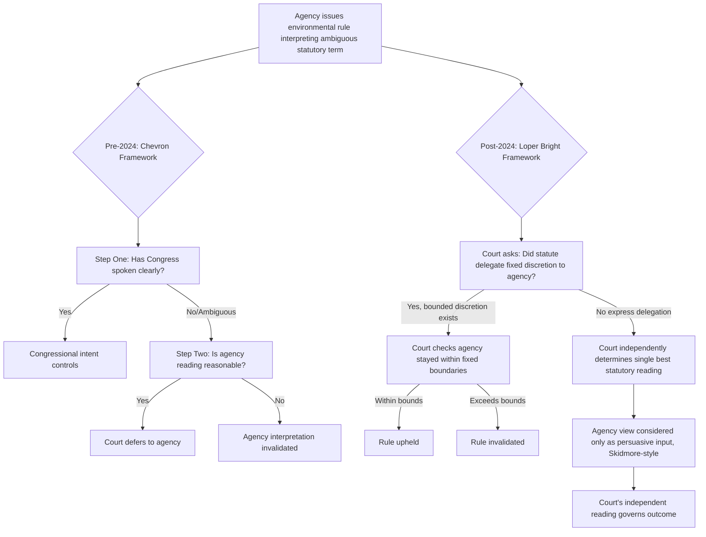

## Deference Debates in Environmental Rulemaking After Loper Bright Enterprises v Raimondo

### Doctrinal Background: The Chevron Framework Being Displaced

#### Chevron Two-Step (1984–2024)

Chevron U.S.A. Inc. v. Natural Resources Defense Council arose from a dispute over whether an EPA regulation defining "stationary source" under the Clean Air Act was permissible. The resulting two-step framework asked: [Supreme Court of the United States](https://www.supremecourt.gov/opinions/23pdf/22-451_7m58.pdf)

1. **Step One**: Has Congress directly spoken to the precise question at issue? If congressional intent is clear, that intent governs.
2. **Step Two**: If the statute is silent or ambiguous, is the agency's interpretation "reasonable"? If so, courts deferred to the agency even if the court might have read the statute differently.

For four decades, Chevron structured judicial review of virtually every major EPA, Army Corps of Engineers, Fish and Wildlife Service, and NOAA/NMFS rulemaking. Agencies gained a wide "interpretive buffer zone" around statutory ambiguity — a matter often outcome-determinative in Clean Air Act, Clean Water Act, Endangered Species Act, and CERCLA litigation.

#### Erosion Before the Formal Overruling

Chevron's practical force had already been narrowing for years via:

- **Major Questions Doctrine (MQD)** — courts presuming Congress does not delegate decisions of vast economic or political significance through ambiguous language (e.g., *West Virginia v. EPA*, 2022, striking the Clean Power Plan's generation-shifting approach).
- **Step Zero doctrine** — Chevron only applying where Congress delegated interpretive authority via a procedure with the "force of law" (*United States v. Mead Corp.*).
- Agencies themselves de-emphasizing Chevron citations in rule preambles. EPA had shifted years earlier toward arguing its statutory interpretation was the best reading regardless of Chevron, an approach mirrored government-wide; the Biden administration reportedly invoked Chevron in only five of fifty-one major rules. [Sidley](https://environmentalhealthsafetybrief.sidley.com/2024/07/02/environmental-law-implications-of-loper-bright-and-the-end-of-chevron-deference/)

---

### The Loper Bright Holding

#### Case Origin

Loper Bright arose from commercial herring fishing regulation: the Magnuson-Stevens Act authorized the National Marine Fisheries Service to require vessels to carry federal observers, and the dispute was whether the statute also let the agency make vessels pay the observers' costs. The Supreme Court heard the case alongside a companion case, Relentless, Inc. v. Department of Commerce, raising the same question from a different circuit. [Sacramento Attorneys](https://www.kassounilaw.com/2026/06/loper-bright-v-raimondo-chevron-doctrine/)[Sacramento Attorneys](https://www.kassounilaw.com/2026/06/loper-bright-v-raimondo-chevron-doctrine/)

#### The Rule Announced

The Court overruled Chevron deference — the rule that courts defer to federal agencies' reasonable interpretations of ambiguous statutes the agencies administer. Chief Justice Roberts, writing for a six-Justice majority, held that the APA requires courts to exercise independent judgment in deciding whether an agency acted within its statutory authority, and that courts may not defer to an agency's legal interpretation merely because a statute is ambiguous. The majority grounded this in Article III, reasoning that the judicial power to adjudicate cases and controversies inherently includes the power to say what the law means. [What Loper Bright Enterprises v. Raimondo Means for the Future of Chevron Deference - Yale Journal on Regulation +2](https://www.yalejreg.com/nc/what-loper-bright-enterprises-v-raimondo-means-for-the-future-of-chevron-deference/)

Agency interpretations are not irrelevant, however: the Court stated that careful attention to the Executive Branch's judgment may help inform a court's independent inquiry — sometimes described post-decision as a *Skidmore*-style persuasive-weight approach rather than binding deference. [Yale Journal on Regulation](https://www.yalejreg.com/nc/what-loper-bright-enterprises-v-raimondo-means-for-the-future-of-chevron-deference/)

#### Preserved Precedent (Statutory Stare Decisis)

The Court clarified that prior holdings that specific agency actions were lawful — including the Clean Air Act holding in Chevron itself — remain subject to ordinary statutory stare decisis; mere reliance on Chevron is not, by itself, a special justification for overruling those specific outcomes. [Yale Journal on Regulation](https://www.yalejreg.com/nc/what-loper-bright-enterprises-v-raimondo-means-for-the-future-of-chevron-deference/)

#### The Dissent

Justices Kagan, Sotomayor, and Jackson dissented, arguing Chevron was correct, workable, and appropriate, and that the majority's reasoning displayed a lack of humility; the dissent emphasized that Chevron's background premise was that Congress wanted agencies — not courts — resolving statutory ambiguity through their subject-matter expertise. [Hogan Lovells](https://www.hoganlovells.com/en/publications/loper-bright-enterprises-v-raimondo-decision-summary)

---

### Immediate Doctrinal Consequences for Environmental Agencies

| Pre-Loper Bright | Post-Loper Bright |
| --- | --- |
| Agency interpretation controls if statute ambiguous + reading reasonable | Court determines the single "best" reading of the statute independently |
| Ambiguity favored the agency | Ambiguity no longer automatically favors the agency; court must still resolve it |
| Agency expertise entitled to structural deference | Agency expertise is persuasive input only, weighted like *Skidmore* factors (thoroughness, consistency, reasoning quality) |
| Chevron Step Zero gated when deference applied | Question now is simply whether Congress *did* delegate interpretive discretion to the agency, and if so, courts must still identify the boundaries of that discretion |

#### Delegated Discretion Still Possible — But Must Be "Fixed"

Loper Bright did not eliminate agency discretion altogether. Where a statute genuinely delegates discretionary authority to an agency, the Court held that the delegation must have "fixed boundaries," and an agency's interpretation of a statutory term must respect those boundaries — this has become a central battleground in post-Loper Bright environmental litigation, since agencies now argue Congress *authorized* an area of judgment (which a court should respect) while challengers argue the agency's reading exceeds any fixed boundary. [Hollingsworth LLP](https://hollingsworthllp.com/blog/what-were-watching-in-2026-the-impact-of-loper-bright-on-claims-involving-environmental-contamination/)

---

### Environmental Statutes Most Affected

#### Clean Air Act (CAA)

- NAAQS-setting, New Source Performance Standards, endangerment findings, and State Implementation Plan approvals all historically leaned on Chevron-style deference for terms like "adequately demonstrated," "best available control technology," and "stationary source."
- **[Inference]** Litigants are now more aggressively contesting EPA's technical judgment calls as questions of law rather than accepting them as within a zone of reasonable interpretation.
- Notably, a significant scholarly argument (Heinzerling) contends Loper Bright does not even formally apply to most Clean Air Act rulemaking, because the CAA's own judicial-review provision does not incorporate the APA provision the Loper Bright Court treated as central — meaning the doctrinal reach of Loper Bright into CAA review is itself contested and unresolved across circuits. [Yale Journal on Regulation](https://www.yalejreg.com/wp-content/uploads/Heinzerling-Bulletin.-Does-Loper-Bright-Apply-to-the-Clean-Air-Act.pdf)
- Despite this unsettled premise, courts have routinely granted government requests to hold CAA-related litigation in abeyance during the presidential transition, including matters involving Clean Air Act regulation of synthetic organic chemicals. [Yale Journal on Regulation](https://www.yalejreg.com/bulletin/does-loper-bright-apply-to-the-clean-air-act/)

#### CERCLA / TSCA (Toxic Substances, PFAS Designations)

In litigation over EPA's PFAS "may present substantial danger" standard under Section 102 of CERCLA, petitioners argue EPA's narrow reading — that mere "possibility" of danger satisfies the standard — violates Loper Bright's requirement that delegated discretion have fixed boundaries, while EPA counters that Loper Bright itself recognizes that a statute's best reading may authorize the agency to exercise a degree of discretion. This case illustrates the core new fight: **is discretion-language in the statute itself, or is it merely unresolved ambiguity a court must independently close?** [Hollingsworth LLP](https://hollingsworthllp.com/blog/what-were-watching-in-2026-the-impact-of-loper-bright-on-claims-involving-environmental-contamination/)

#### NEPA (National Environmental Policy Act)

The Supreme Court's Seven County Infrastructure Coalition decision engaged with Loper Bright in the NEPA context, and coincided with agencies revising NEPA-implementing regulations under Executive Order 14154 ("Unleashing American Energy"). The ruling's limits on considering geographically or temporally separate "indirect" and "cumulative" effects will likely narrow how those concepts are defined in future NEPA rulemaking and review. This area remains in significant flux following rescission of CEQ's NEPA regulations after several courts held CEQ lacked rulemaking authority in the first place. [U.S. Supreme Court Grapples with Loper Bright in the Context of NEPA Reviews | Insights | Holland & Knight +2](https://www.hklaw.com/en/insights/publications/2025/06/us-supreme-court-grapples-with-loper-bright-in-the-context-of-nepa)

#### Endangered Species Act, Clean Water Act

- **[Inference]** Terms such as "waters of the United States," "harm," "take," and "significant nexus" — already contested pre-Loper Bright (e.g., *Sackett v. EPA*, 2023) — are now litigated with courts owing no formal deference to agency line-drawing, increasing pressure on agencies to root regulatory definitions explicitly in statutory text and legislative history rather than policy judgment.

---

### Agency and Litigant Behavioral Shifts

#### Agencies (Rulemaking Posture)

Agencies are increasingly drafting rules with an eye toward whether their statutory interpretation can survive independent judicial review as the single best reading of the law, rather than relying on deference as a backstop — a shift affecting both litigation risk calculus and how proposed regulations are evaluated pre-finalization. [RealClearPolicy](https://www.realclearpolicy.com/articles/2026/06/26/loper_bright_is_already_reshaping_rulemaking_1191126.html)

- Rule preambles now build extensive textual, structural, and historical statutory arguments rather than resting on "reasonable interpretation of ambiguity."
- Agencies increasingly frame contested terms as areas of *express delegated discretion* (which Loper Bright still respects) rather than as *ambiguity* (which now favors independent judicial resolution).

#### Deregulatory Acceleration

The Trump administration has used the post-Loper Bright landscape aggressively; by one account it finalized 646 deregulatory actions in 2025, with a broader count including guidance documents and proposed rules reaching approximately 1,500. A prominent example is EPA's move to rescind the 2009 greenhouse gas endangerment finding, which the administration argues yields substantial economic benefit while critics contend it undermines federal climate policy. **[Inference]** Because rescissions and new interpretations no longer benefit from Chevron deference either, they are equally exposed to independent-judgment review — cutting both ways for deregulatory and regulatory agency action alike. [RealClearPolicy](https://www.realclearpolicy.com/articles/2026/06/26/loper_bright_is_already_reshaping_rulemaking_1191126.html)[RealClearPolicy](https://www.realclearpolicy.com/articles/2026/06/26/loper_bright_is_already_reshaping_rulemaking_1191126.html)

#### Litigation Volume and Abeyance Practice

Because agency interpretations are no longer automatically deferred to, stakeholders are more likely to challenge agency actions in court, anticipating more favorable independent judicial review, while courts bear a heavier interpretive burden previously moderated by agency expertise. Courts have nonetheless continued a practice of pausing litigation during the change in administration: despite Loper Bright's unsettling of the premises for such abeyance, courts have granted government abeyance motions in cases spanning TSCA dioxane regulation, Clean Air Act synthetic organic chemical rules, and NHTSA fuel-efficiency standards, sometimes even after judges expressly considered Loper Bright's implications for that very practice. [Omnus Law](https://omnuslaw.com/insights/chevron-deference/)[Yale Journal on Regulation](https://www.yalejreg.com/bulletin/does-loper-bright-apply-to-the-clean-air-act/)

#### Chenery Doctrine Interaction

Courts are also grappling with whether Loper Bright affects the Chenery doctrine (which normally limits judicial review to the agency's own stated rationale); at least one court concluded post-Loper Bright that Chenery does not restrict which interpretive arguments a reviewing court may itself consider once the court is independently construing the statutory text. **[Inference]** This could expand the range of legal arguments courts entertain on review, beyond what the agency actually argued in the rulemaking record — a doctrinally significant and still-developing question. [AFPF](https://americansforprosperityfoundation.org/loper-bright/environmental-defense-fund-v-epa-does-loper-bright-impact-the-chenery-doctrine/)

---

### The Major Questions Doctrine: A Parallel, Possibly More Consequential Constraint

Commentators have suggested the Major Questions Doctrine may affect future EPA rulemakings even more significantly than Loper Bright itself; under MQD, courts presume Congress did not delegate authority over issues of major political or economic significance absent clear statutory language. This is partly because Chevron's practical footprint in EPA rulemaking had already shrunk sharply before Loper Bright — a 2022 study found only four EPA rules issued or proposed during the Biden administration that cited Chevron as a rulemaking basis. [Quarles](https://www.quarles.com/newsroom/publications/the-future-of-environmental-regulation-after-the-supreme-court-decisions-in-loper-bright-and-corner-post)[Quarles](https://www.quarles.com/newsroom/publications/the-future-of-environmental-regulation-after-the-supreme-court-decisions-in-loper-bright-and-corner-post)

**Practical implication**: Litigants challenging major environmental rules (greenhouse gas regulation, broad water/wetlands jurisdiction, sweeping toxic-substance designations) increasingly plead *both* a Loper Bright "best reading" argument *and* an MQD "clear congressional authorization" argument, since either can defeat the rule independently.

---

### Litigation Strategy Implications

#### For Petitioners Challenging Agency Rules

- Lead with plain-text, structural, and canons-based statutory arguments rather than merely attacking "reasonableness."
- Invoke MQD where the rule carries substantial economic or political stakes.
- Argue any claimed discretionary delegation lacks "fixed boundaries," per the *[Inference]* CERCLA PFAS litigation pattern.

#### For Agencies Defending Rules

- Characterize the statutory term as an express, bounded delegation of discretion (not ambiguity) whenever the statutory text supports it.
- Build a robust record of *Skidmore*-style persuasive factors: interpretive consistency over time, thoroughness of reasoning, formality of process (notice-and-comment rulemaking rather than mere guidance).
- Anticipate that courts will independently examine legislative history, structure, and purpose rather than stopping at "is this reasonable."

#### For State and Local Governments Relying on Federal Interpretations

Where local ordinances or regulations were built on federal agency interpretations (e.g., EPA or HUD readings of ambiguous statutory terms), those interpretations are now more exposed to challenge, creating risk that local rules will need amendment if the underlying federal interpretation is overturned or revised. [Awattorneys](https://www.awattorneys.com/client-updates/us-supreme-court-overturns-chevron-deference-doctrine-in-loper-bright-enterprises-inc-v-raimondo/)

---

### Illustrative Diagram: Pre- and Post-Loper Bright Review Pathways

---

### Illustration: Shifting Locus of Interpretive Authority (SVG)

<svg xmlns="http://www.w3.org/2000/svg" viewBox="0 0 760 340">
<title>Shift in Interpretive Authority: Chevron to Loper Bright (svg_diagram)</title>
<rect x="0" y="0" width="760" height="340" fill="#ffffff" />
<text x="380" y="28" text-anchor="middle" font-size="18" font-weight="bold" fill="#1a1a1a">Locus of Interpretive Authority (svg_diagram)</text>

<text x="150" y="60" text-anchor="middle" font-size="14" font-weight="bold" fill="#333">Chevron Era (1984-2024)</text>

<rect x="40" y="75" width="220" height="40" fill="`#4a7ba6`" rx="4" />

<text x="150" y="100" text-anchor="middle" font-size="13" fill="#fff">Agency: ~65% weight</text>

<rect x="40" y="120" width="118" height="30" fill="`#a6c8e0`" rx="4" />

<text x="99" y="140" text-anchor="middle" font-size="11" fill="`#1a1a1a`">Court: ~35%</text>

<text x="610" y="60" text-anchor="middle" font-size="14" font-weight="bold" fill="#333">Loper Bright Era (2024-present)</text>

<rect x="500" y="75" width="70" height="40" fill="`#4a7ba6`" rx="4" />

<text x="535" y="100" text-anchor="middle" font-size="11" fill="#fff">Agency</text>

<rect x="570" y="75" width="190" height="40" fill="`#1a1a1a`" rx="4" />

<text x="665" y="100" text-anchor="middle" font-size="13" fill="#fff">Court: independent judgment</text>

<text x="150" y="175" text-anchor="middle" font-size="11" fill="#555">Agency reading controls if</text>

<text x="150" y="190" text-anchor="middle" font-size="11" fill="#555">statute ambiguous + reasonable</text>

<text x="610" y="175" text-anchor="middle" font-size="11" fill="#555">Agency view is persuasive input;</text>

<text x="610" y="190" text-anchor="middle" font-size="11" fill="#555">court finds the "best reading"</text>

<line x1="300" y1="95" x2="480" y2="95" stroke="#888" stroke-width="2" stroke-dasharray="6,4" marker-end="url(#arrow)" />
<text x="390" y="80" text-anchor="middle" font-size="12" font-style="italic" fill="#666">Overruled June 28, 2024</text>
<rect x="40" y="230" width="680" height="90" fill="#f4f4f4" stroke="#ccc" rx="6" />
<text x="60" y="255" font-size="12" font-weight="bold" fill="#1a1a1a">Exception preserved under statutory stare decisis:</text>
<text x="60" y="275" font-size="11" fill="#333">Prior case-specific holdings upholding agency actions (e.g., the original</text>
<text x="60" y="292" font-size="11" fill="#333">Chevron Clean Air Act holding) remain valid; mere reliance on Chevron's</text>
<text x="60" y="309" font-size="11" fill="#333">method is not itself grounds to unwind those specific past outcomes.</text>
</svg>

---

### Practical Example: Applying the Post-Loper Bright Test

**Scenario**: EPA issues a rule interpreting "hazardous air pollutant" thresholds in a way not explicitly defined by the Clean Air Act.

**Old analysis (Chevron)**: Court asks only "is EPA's threshold a reasonable reading of an ambiguous term?" If yes, rule survives regardless of whether the court would have chosen a different threshold.

**New analysis (Loper Bright)**:

1. Court first asks whether the CAA text, structure, history, and purpose yield a single best reading of "hazardous air pollutant" as applied to the disputed threshold.
2. If the statute clearly delegates a discretionary judgment call to EPA (e.g., "the Administrator shall set such standards as are appropriate"), the court asks whether EPA's chosen number stays within the *fixed boundaries* of that delegation — not whether it is merely "reasonable" in the abstract.
3. If the statute does **not** clearly delegate discretion, the court substitutes its own reading for EPA's, considering EPA's technical rationale only as persuasive (not binding) input.
4. EPA's rulemaking record, scientific rationale, and consistency with prior interpretations become evidentiary support for its "best reading" argument rather than automatic deference triggers.

---

### Open and Unresolved Questions

- **Does Loper Bright even formally apply to Clean Air Act rulemaking review?** Serious scholarly argument holds it may not, because the CAA's judicial-review provisions do not incorporate the specific APA provision central to the Loper Bright holding — a question circuits have not uniformly resolved. [Unverified — circuit split status is evolving] [Yale Journal on Regulation](https://www.yalejreg.com/wp-content/uploads/Heinzerling-Bulletin.-Does-Loper-Bright-Apply-to-the-Clean-Air-Act.pdf)
- **How will courts distinguish "ambiguity" from "delegated discretion with fixed boundaries"?** This line is the primary emerging battleground, illustrated by ongoing CERCLA/PFAS litigation.
- **Retroactive effect on already-decided cases**: Statutory stare decisis shields old outcomes, but litigants are testing how far that shield extends when a new case merely applies a previously-blessed interpretation to new facts.
- **Interaction with Major Questions Doctrine**: Whether MQD analysis now happens *before* or *alongside* the Loper Bright "best reading" inquiry remains doctrinally unsettled. [Inference]
- **Behavior may vary by circuit and by statute** — the D.C. Circuit's historical role as the primary venue for CAA and cross-cutting environmental rule challenges makes its post-Loper Bright approach especially consequential, but application is not yet fully uniform nationally.

---

**Related Topics**

- Major Questions Doctrine and its interaction with environmental statutes (*West Virginia v. EPA*)
- *Skidmore v. Swift & Co.* persuasive-deference factors and their revived importance
- *Corner Post, Inc. v. Board of Governors* and its effect on APA statute-of-limitations for challenging old rules
- *Sackett v. EPA* and "waters of the United States" jurisdictional line-drawing
- NEPA regulatory rescission and *Seven County Infrastructure Coalition v. Eagle County*
- Nondelegation doctrine as a parallel constraint on broad congressional grants to environmental agencies
- Arbitrary-and-capricious review under APA §706(2)(A) as a substitute check on agency reasoning post-Chevron
- CERCLA Section 102 hazardous substance designation litigation and PFAS regulatory strategy
- Statutory stare decisis and its limits following doctrinal overrulings