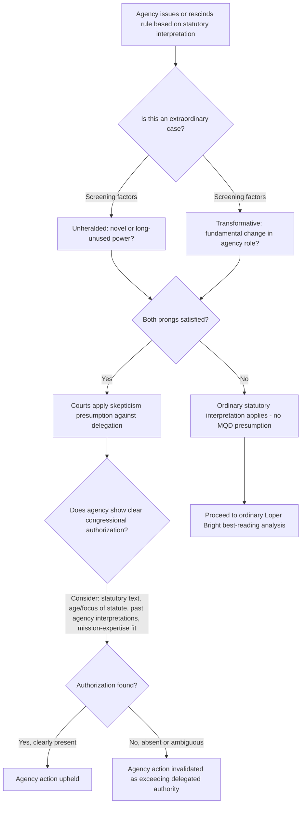

## Major Questions Doctrine Challenges to EPA and Sister Agency Rules

### Doctrinal Origins

#### Pre-2022 Foundations

The major questions doctrine (MQD) existed in embryonic form for years before being named as such, rooted in a handful of cases sharing overlapping features rather than a unified test — most notably *FDA v. Brown & Williamson Tobacco Corp.* (2000) and *Utility Air Regulatory Group v. EPA* (2014). The Supreme Court in *West Virginia v. EPA* (2022) explained that the doctrine "developed over a series of significant cases" involving agencies asserting highly consequential power beyond what Congress could reasonably be understood to have granted, but the Court had not previously applied a consistent analytical framework across those precedents.

#### Formal Recognition: West Virginia v. EPA (2022)

West Virginia v. EPA marked the first time the Supreme Court expressly relied on a majority-opinion-labeled "major questions doctrine" to invalidate a federal rule. The case concerned the Clean Power Plan (CPP), a 2015 EPA regulation interpreting the "best system of emission reduction" language in Clean Air Act §111(d) to require existing coal plants to reduce production or subsidize cleaner generation sources — a "generation-shifting" approach. The Court held that EPA lacked authority to impose emissions limits premised on shifting electricity production from higher-emitting to lower-emitting sources, characterizing this as a "major question" of vast economic and political significance requiring clear congressional authorization that EPA lacked.

---

### The Analytical Framework

#### Two-Prong Structure (Scholarly Synthesis)

Although the Court did not announce a rigid checklist, subsequent analysis of the West Virginia opinion identifies a two-prong framework for determining when heightened MQD scrutiny applies, asking whether the agency action is:

1. **"Unheralded"** — the agency is deploying a newly discovered or long-unused power, especially one not previously exercised in the statute's history.
2. **"Transformative"** — the assertion of authority would fundamentally change the agency's regulatory role or scope beyond its traditional lane.

If both prongs are satisfied, courts approach the agency's assertion of authority with skepticism, which the agency can overcome only by identifying **clear congressional authorization** for the specific action.

#### Chief Justice Roberts's Formulation

The majority opinion articulated the trigger as cases where "the history and the breadth of the authority that [the agency] has asserted" combined with "the economic and political significance of that assertion" provide reason to hesitate before concluding Congress meant to confer such authority.

#### Justice Gorsuch's Concurrence — A More Operational Test

Justice Gorsuch's concurrence attempted to give lower courts clearer signals for identifying a "major question," including:

- The agency claims authority to resolve a matter of great **political significance**, evidenced in part by Congress having considered and failed to pass similar legislative proposals.
- The agency seeks to regulate **"a significant portion of the American economy"** or require **"billions of dollars in spending."**
- The agency's assertion intrudes into an area that is the **"particular domain of state law."**

For assessing whether **"clear congressional authorization"** exists to overcome MQD skepticism, Gorsuch recommended examining:

1. The specific legislative provisions relied upon.
2. The **age and focus** of the statute (older, general-purpose statutes are less likely to authorize novel modern regulatory programs).
3. The **agency's own past interpretations** of the statute (a sudden reversal cuts against authorization).
4. Any **mismatch** between the claimed authority and the agency's congressionally assigned mission and subject-matter expertise.

#### Indeterminacy Critique

Commentators widely describe the "economic and political significance" standard as capacious and indeterminate, functioning in practice as an "I-know-it-when-I-see-it" test that leaves substantial discretion to the reviewing judge. Litigants can often argue that a given rule is politically divisive, affects a large share of the national economy, breaks from agency past practice, or strays from the agency's traditional regulatory lane — but the doctrine is nonetheless reserved for "extraordinary" cases, meaning most ordinary rulemakings will not trigger it even though the argument will be raised frequently.

---

### Relationship to Loper Bright and Chevron's Overruling

MQD and the post-*Loper Bright* "best reading" inquiry are analytically distinct but frequently invoked together:

| Doctrine | Core Question | Effect |
| --- | --- | --- |
| Chevron (overruled 2024) | Is the ambiguous statutory term interpretation "reasonable"? | Deference to agency if reasonable |
| Loper Bright (2024) | What is the single best reading of the statute? | Court decides independently; agency view is persuasive input only |
| Major Questions Doctrine | Is this an "extraordinary case" of vast economic/political significance? | If yes, presumption *against* delegation absent clear congressional statement |

**[Inference]** Litigants increasingly plead MQD and Loper Bright as independent, mutually reinforcing grounds: MQD operates as a clear-statement canon that raises the bar for finding delegation in the first place, while Loper Bright determines how a court resolves any remaining textual ambiguity once MQD's threshold question is answered. A rule can fail on either ground alone.

---

### Application to EPA and Sister Agencies

#### Clean Air Act — Climate Regulation

West Virginia v. EPA itself is the paradigm case, foreclosing generation-shifting approaches to greenhouse gas regulation absent explicit congressional authorization.

**Current flashpoint — 2009 Endangerment Finding Rescission (2026)**: On February 12, 2026, EPA finalized a rule repealing the 2009 Endangerment Finding — the agency's determination, mandated by *Massachusetts v. EPA* (2007), that greenhouse gas emissions from motor vehicles endanger public health and welfare — along with all associated GHG vehicle emission standards. EPA's rescission rule advanced a primarily legal rationale, arguing the Clean Air Act does not authorize regulating motor vehicle emissions "for the purpose of addressing global climate change concerns," and relied in part on both the 2022 West Virginia MQD holding and the 2024 Loper Bright decision. EPA's MQD argument specifically contends that regulating pollutants that cause harm through *global* rather than *local or regional* exposure pathways exceeds what Congress could have intended to delegate under CAA §202(a)(1) without express authorization.

**Litigation posture**: Two tracks of litigation are proceeding in the D.C. Circuit — one track led by a coalition of health and environmental organizations. Congressional allies of the administration have filed amicus support arguing the major questions doctrine independently bars EPA from regulating vehicle GHG emissions to address global climate change absent express permission from Congress.

**Critique of EPA's MQD theory**: Prominent environmental-law scholarship contends the argument is flawed on several grounds:

- The West Virginia reasoning did not create new doctrine so much as apply the pre-existing *Brown & Williamson* framework to a specific unheralded/transformative fact pattern; rescinding a 15-year-old endangerment finding does not present the same "unheralded and transformative" profile as the CPP did.
- Rescission would require overruling settled precedent and disregarding substantial reliance interests built up over three successive presidential administrations of GHG vehicle regulation.
- Some commentary published shortly after the February 2026 rule concluded flatly that MQD "can't save" the repeal, arguing the doctrine was designed to police *novel* assertions of sweeping new authority, not the *withdrawal* of a well-established, court-mandated scientific finding.

**[Inference]** This dispute illustrates an emerging asymmetry question: whether MQD applies with equal force to agency *deregulation* as it does to agency *regulation* — i.e., whether rescinding an existing rule constitutes an "assertion of authority" of comparable magnitude to promulgating one, given that EPA argues it is simply declining to exercise power it never validly held under a "best reading" analysis, while challengers argue the repeal itself is the novel, transformative move.

#### Clean Water Act — WOTUS Jurisdiction

**[Inference]** Post-*Sackett v. EPA* (2023) "significant nexus" and wetlands-jurisdiction disputes present recurring MQD arguments: challengers contend that expansive assertions of federal permitting jurisdiction over large swaths of private land constitute major economic and political questions requiring clearer congressional text than the "navigable waters" language in the CWA provides.

#### TSCA — Chemical Risk Evaluation

Rules imposing sweeping restrictions on widely used chemicals (e.g., broad-based PFAS designations) invite MQD arguments where compliance costs are alleged to run into the billions of dollars across an entire economic sector, echoing Gorsuch's "significant portion of the American economy" marker.

#### NEPA and Land-Use / Permitting Agencies

**[Inference]** Agencies reshaping the scope of environmental review (e.g., CEQ's now-rescinded NEPA regulations, or agency redefinition of "indirect" and "cumulative" effects) face MQD-adjacent arguments where the redefinition is characterized as a transformative reallocation of permitting authority affecting large infrastructure investment decisions nationally.

#### Endangered Species Act

**[Inference]** Broad habitat-designation rules or novel applications of "take" liability covering large geographic areas or economic sectors are argued by industry challengers to implicate MQD where compliance costs are asserted to be nationally significant.

---

### Litigation Strategy Considerations

#### For Challengers Invoking MQD

- Frame the challenged action as both **unheralded** (a power not previously exercised under this statutory provision) and **transformative** (a fundamental change in the agency's regulatory reach).
- Marshal evidence of **congressional inaction** on similar proposals as evidence Congress did not intend to delegate the power via ambiguous statutory text.
- Quantify **economic scope** — nationwide compliance costs, affected industry share, number of regulated entities — to satisfy the "significant portion of the economy" marker.
- Highlight any **mismatch** between the agency's technical expertise/mission and the novel authority claimed.
- Pair MQD arguments with a Loper Bright "best reading" argument as an independent, alternative basis for invalidation.

#### For Agencies Defending Rules

- Emphasize **continuity** with prior agency practice and statutory history to rebut the "unheralded" prong.
- Characterize the rule as an **incremental application** of long-recognized authority rather than a transformative expansion.
- Identify specific **textual hooks** in the statute that constitute "clear congressional authorization," addressing Gorsuch's four authorization factors directly in the rulemaking record.
- Where defending a *rescission*, argue the MQD framework is asymmetric and does not constrain an agency's decision to *decline* to exercise previously claimed authority, since no new "assertion of power" is being made. **[Inference]** — this argument's reception is actively contested and unsettled.

#### For Litigants Opposing Deregulatory Rescissions

- Argue that reliance interests built over multiple administrations and years of dependent regulation (vehicle emissions standards, industry compliance investments) weigh against permitting the agency to simply reverse course via reinterpretation.
- Contend that the "extraordinary case" designation historically applied to sweeping *new* claims of power, not to the withdrawal of a scientific or factual finding compelled by earlier precedent (i.e., *Massachusetts v. EPA*'s mandate).

---

### Illustrative Diagram: MQD Analytical Flow

---

### Illustration: MQD Trigger Factors (SVG)

<svg xmlns="http://www.w3.org/2000/svg" viewBox="0 0 760 380">
<title>Major Questions Doctrine Trigger Factors (svg_diagram)</title>
<rect x="0" y="0" width="760" height="380" fill="#ffffff" />
<text x="380" y="28" text-anchor="middle" font-size="18" font-weight="bold" fill="#1a1a1a">Major Questions Doctrine: Trigger Factors (svg_diagram)</text>
<circle cx="380" cy="180" r="70" fill="#1a1a1a" />
<text x="380" y="175" text-anchor="middle" font-size="13" fill="#fff" font-weight="bold">Extraordinary</text>
<text x="380" y="192" text-anchor="middle" font-size="13" fill="#fff" font-weight="bold">Case?</text>

<rect x="40" y="70" width="190" height="60" fill="#4a7ba6" rx="6" />
<text x="135" y="95" text-anchor="middle" font-size="12" fill="#fff">Unheralded power</text>
<text x="135" y="113" text-anchor="middle" font-size="11" fill="#dce8f3">Newly claimed authority</text>
<line x1="230" y1="100" x2="320" y2="150" stroke="#4a7ba6" stroke-width="2" />
<rect x="530" y="70" width="190" height="60" fill="#4a7ba6" rx="6" />
<text x="625" y="95" text-anchor="middle" font-size="12" fill="#fff">Transformative</text>
<text x="625" y="113" text-anchor="middle" font-size="11" fill="#dce8f3">Role fundamentally changed</text>
<line x1="530" y1="100" x2="440" y2="150" stroke="#4a7ba6" stroke-width="2" />
<rect x="40" y="250" width="190" height="60" fill="#7a9a5a" rx="6" />
<text x="135" y="275" text-anchor="middle" font-size="12" fill="#fff">Billions in spending</text>
<text x="135" y="293" text-anchor="middle" font-size="11" fill="#e2ecd8">Vast economic reach</text>
<line x1="230" y1="260" x2="320" y2="210" stroke="#7a9a5a" stroke-width="2" />
<rect x="530" y="250" width="190" height="60" fill="#7a9a5a" rx="6" />
<text x="625" y="275" text-anchor="middle" font-size="12" fill="#fff">State law domain</text>
<text x="625" y="293" text-anchor="middle" font-size="11" fill="#e2ecd8">Intrudes on state authority</text>
<line x1="530" y1="260" x2="440" y2="210" stroke="#7a9a5a" stroke-width="2" />
<rect x="280" y="330" width="200" height="40" fill="#a04040" rx="6" />
<text x="380" y="355" text-anchor="middle" font-size="12" fill="#fff">Congress rejected similar bills</text>
<line x1="380" y1="330" x2="380" y2="250" stroke="#a04040" stroke-width="2" />
</svg>

---

### Practical Example: Applying MQD to a Hypothetical EPA Rule

**Scenario**: EPA issues a rule interpreting "waters of the United States" under the Clean Water Act to encompass all groundwater with any hydrological connection to surface water nationwide, creating federal permitting jurisdiction over millions of previously unregulated private wells and irrigation systems.

**MQD Analysis**:

1. **Unheralded?** — Yes, if EPA has never previously asserted CWA jurisdiction over groundwater at this scale; a sudden expansion after decades of narrower interpretation strengthens this prong.
2. **Transformative?** — Yes, if the rule would subject an unprecedented number of landowners and businesses to federal permitting requirements, fundamentally altering the agency's traditional regulatory footprint.
3. **Economic/political significance** — Compliance costs across millions of affected properties and the intrusion into an area (groundwater regulation) traditionally left to states would likely satisfy Gorsuch's economic-scope and state-law-domain factors.
4. **Clear congressional authorization?** — Court examines whether "waters of the United States" as used in the 1972 CWA, read in light of *Sackett*'s "significant nexus"/"continuous surface connection" test, was ever intended to reach groundwater — an outcome courts have historically resisted.

**Likely outcome** **[Inference]**: A reviewing court applying West Virginia's framework would likely find MQD triggered and require EPA to identify explicit statutory text authorizing groundwater jurisdiction at this scale — a showing EPA would probably struggle to make given the CWA's historical focus on surface waters.

---

### Open and Unresolved Questions

- **Does MQD apply symmetrically to deregulation and rescission, or only to new assertions of power?** This is the central live dispute in the 2026 endangerment-finding rescission litigation, with significant scholarly disagreement. [Unverified — pending D.C. Circuit resolution]
- **How does MQD interact procedurally with Loper Bright's "best reading" inquiry** — does a court apply MQD's clear-statement presumption before or after determining the statute's best reading? [Inference — sequencing not definitively established]
- **Scope beyond environmental law**: MQD's ramifications are understood to extend into international trade, tax, securities, immigration, and health regulation — meaning environmental-agency precedents shape, and are shaped by, cross-agency doctrine development.
- **Reliance interests as a countervailing factor**: Whether long-standing reliance on an existing rule (built over multiple administrations) can itself defeat an MQD-based rescission argument remains contested, with commentators noting this cuts against, not for, the deregulatory rescission's own MQD theory.
- Behavior may vary significantly by circuit, and the D.C. Circuit's eventual rulings in the endangerment-finding litigation will likely be the primary near-term test of how courts resolve MQD-versus-rescission questions.

---

**Related Topics**

- *West Virginia v. EPA* (2022) full case analysis and the Clean Power Plan's "generation-shifting" theory
- *Massachusetts v. EPA* (2007) and the statutory duty to make endangerment findings
- Loper Bright Enterprises v. Raimondo and the interaction between MQD and independent statutory interpretation
- *Sackett v. EPA* and "waters of the United States" jurisdictional tests
- Nondelegation doctrine as a constitutional analog/complement to MQD
- Clear-statement canons in statutory interpretation generally (federalism canon, constitutional-avoidance canon)
- Reliance interests and arbitrary-and-capricious review of agency rule rescissions (*FCC v. Fox Television Stations*; *Encino Motorcars v. Navarro*)
- Comparative MQD applications outside environmental law (health, immigration, securities regulation)
- D.C. Circuit procedural practices: abeyance motions and remand-without-vacatur in agency-change-of-position cases