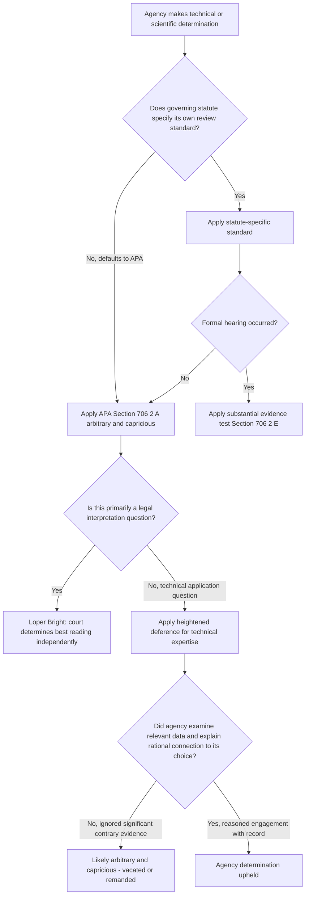

## Judicial Review of Technical and Scientific Agency Judgments

### Statutory Foundation

#### The APA's §706 Framework

The Administrative Procedure Act (APA) governs judicial review of agency action absent a statute-specific standard. The reviewing court is directed to decide all relevant questions of law and to hold unlawful and set aside agency action found to be:

- **§706(2)(A)** — arbitrary, capricious, an abuse of discretion, or otherwise not in accordance with law (default standard for informal rulemaking and adjudication).
- **§706(2)(E)** — unsupported by substantial evidence, in cases subject to formal APA hearing procedures or where a statute expressly requires this standard.

#### Which Standard Applies to Scientific/Technical Findings

Most environmental-agency scientific determinations — risk assessments, exposure modeling, best-available-science findings, endangerment findings — arise from **informal, notice-and-comment rulemaking**, so they are reviewed under the arbitrary-and-capricious standard rather than substantial evidence. The two tests are analytically distinct (substantial evidence applies where a formal on-the-record hearing occurred), but courts have often found little practical difference in how they operate.

---

### The Arbitrary-and-Capricious Standard, Applied to Science

#### Core Legal Test

The Supreme Court has held that arbitrary-and-capricious review is "highly deferential," while still requiring the inquiry to be searching and careful. A reviewing court:

- May **not substitute its own judgment** for that of the agency.
- Must confirm the agency articulated a **satisfactory explanation** for its action, including a "rational connection between the facts found and the choice made."
- Extends a **presumption of regularity** to the agency's decision-making process.

#### Heightened Deference for Technical Expertise

Courts apply their *greatest* deference within the arbitrary-and-capricious framework specifically where an agency action required a high level of technical or scientific expertise. This deference is grounded in an institutional-competence rationale: agencies are presumed to possess specialized domain knowledge enabling reasoned decision-making on technical questions, while courts ordinarily lack that specialized expertise and are reluctant to second-guess scientific methodology, modeling choices, or risk-assessment judgment calls.

**Important distinction post-Loper Bright**: Arbitrary-and-capricious review of *how an agency applies* a statute (e.g., implementing a regulatory scheme through technical judgment) is analytically separate from Chevron-style deference to an agency's *legal interpretation* of ambiguous statutory text. Chevron's elimination by Loper Bright did not disturb arbitrary-and-capricious review of technical/scientific agency determinations — an agency's interpretation of a statute now receives no deference, but the agency's technical execution of a properly interpreted statutory scheme may still receive substantial deference under §706(2)(A).

---

### "Best Available Science" Mandates

#### Statutory Pattern

Many environmental statutes — most prominently the Endangered Species Act (ESA) — direct agencies to base determinations on the "best scientific and commercial data available." This directive appears across a range of environmental statutes but is drafted with varying specificity.

#### How Specificity Shapes Judicial Scrutiny

The degree of agency latitude, and correspondingly the plaintiff's odds of a successful arbitrary-and-capricious challenge, tracks statutory specificity directly:

- **Narrow, specific congressional mandates** → less agency discretion → more room for a court to find the agency's chosen approach inconsistent with the statutory command.
- **Broad, general statutory language** → greater agency "breathing space" → harder for challengers to prevail, since the agency's own judgment about what constitutes "best available science" is itself entitled to deference.

#### Practical Effect: A Low Bar for Agencies

Empirical review of circuit-level case law (particularly the Ninth Circuit, which handles a large share of ESA litigation) has found the "best available science" mandate to function, in practice, as a low threshold that agencies rarely fail. Courts extend heightened deference specifically because best-available-science determinations sit at the intersection of technical expertise and statutory discretion — the agency decides *what counts* as the best available science, not just how to apply it, and that meta-level judgment itself receives deference.

**[Inference]** This produces a structural asymmetry: challengers attacking an agency's *ultimate scientific conclusion* face the steepest odds, whereas challenges alleging the agency **failed to consider or engage with** specific contrary data in the record, or failed to explain a departure from prior scientific positions, tend to have comparatively better prospects, since these are procedural/explanatory failures rather than direct assaults on scientific judgment.

---

### Doctrinal Building Blocks for Technical Review

#### State Farm "Hard Look" Review

The foundational case for arbitrary-and-capricious review of agency reasoning (*Motor Vehicle Mfrs. Ass'n v. State Farm Mutual Automobile Insurance Co.*, 1983) requires that an agency:

1. Examine the relevant data.
2. Articulate a satisfactory explanation connecting facts found to the choice made.
3. Not rely on factors Congress did not intend it to consider.
4. Not offer an explanation that runs counter to the evidence or is so implausible it cannot be ascribed to a difference in view or agency expertise.
5. Address significant and relevant public comments raising substantial technical objections.

Courts apply this "hard look" test with particular sensitivity to technical subject matter — searching for a reasoned decision-making *process*, not re-litigating the underlying science itself.

#### Presumption of Regularity

Agency technical determinations carry a presumption that the process followed was regular and considered, shifting practical burden onto challengers to identify specific, documented failures in the agency's reasoning or record rather than simply arguing an alternative scientific conclusion was more persuasive.

#### Record-Bound Review

Judicial review of technical/scientific agency judgments is confined to the **administrative record** compiled during rulemaking — the notices, public comments, underlying studies, and data the agency considered. Courts generally do not permit new scientific evidence to be introduced for the first time on judicial review, reinforcing the norm that courts are reviewing the *reasonableness of the agency's process* rather than conducting a de novo scientific inquiry.

---

### Interaction with Loper Bright and the Major Questions Doctrine

#### What Loper Bright Changed and What It Did Not

- **Changed**: Legal interpretation of ambiguous statutory terms — courts now determine the "best reading" independently rather than deferring to a "reasonable" agency reading.
- **Unchanged**: Courts continue to apply arbitrary-and-capricious review to agency application of statutes, including scientific and technical determinations, and remain particularly deferential where technical expertise is central to the challenged judgment.

**[Inference]** This bifurcation is becoming a critical strategic fault line in post-Loper Bright environmental litigation: litigants increasingly argue that a disputed agency action is really a *legal interpretation* question (subject to independent judicial review) rather than a *technical application* question (subject to deferential arbitrary-and-capricious review), because the choice of framing can be outcome-determinative. Agencies, conversely, have incentive to characterize contested judgment calls as falling within their technical/scientific expertise to preserve the more deferential standard.

#### Major Questions Doctrine Overlay

Where a technical or scientific determination underlies a rule of vast economic or political significance (e.g., a greenhouse gas endangerment finding triggering broad regulatory consequences), MQD analysis may operate as a threshold gate before arbitrary-and-capricious review is even reached — asking first whether Congress clearly authorized the agency to make that determination at all, independent of whether the scientific methodology itself was reasonable.

---

### Practical Example: Structuring a Challenge to a Technical Agency Finding

**Scenario**: An environmental group challenges EPA's risk assessment supporting a chemical exposure limit, arguing EPA relied on an outdated toxicological study and ignored newer peer-reviewed data submitted during the comment period.

**Analytical path a reviewing court follows**:

1. **Identify the standard**: Confirm whether the underlying statute specifies its own review standard or defaults to APA §706(2)(A).
2. **Locate the record**: Review the rulemaking docket for what studies, comments, and data EPA actually considered.
3. **Assess "hard look" compliance**: Did EPA acknowledge and respond to the newer peer-reviewed data, or ignore it entirely? Silence on a significant comment is more likely to support a finding of arbitrariness than a reasoned rejection of that data, even if a court might have weighed the evidence differently.
4. **Apply heightened technical deference**: If EPA offers a reasoned, expertise-based explanation for preferring one dataset or methodology over another, courts generally will not substitute their own scientific judgment, even where reasonable scientists might disagree.
5. **Check for statutory-specificity effects**: If the governing statute (e.g., a "best available science" provision) is broadly worded, EPA's latitude is at its widest; if narrowly worded, the court scrutinizes fit between the specific statutory command and EPA's chosen methodology more closely.

**Likely outcome under current doctrine**: A pure disagreement over which study is more scientifically persuasive is unlikely to succeed; a documented failure to *engage* with materially different contrary evidence in the record has materially better prospects.

---

### Illustrative Diagram: Review Pathway for Technical/Scientific Agency Determinations

---

### Illustration: Deference Spectrum Across Agency Determination Types (SVG)

<svg xmlns="http://www.w3.org/2000/svg" viewBox="0 0 760 320">
<title>Deference Spectrum for Agency Determination Types (svg_diagram)</title>
<rect x="0" y="0" width="760" height="320" fill="#ffffff" />
<text x="380" y="28" text-anchor="middle" font-size="18" font-weight="bold" fill="#1a1a1a">Judicial Deference Spectrum by Determination Type (svg_diagram)</text>
<line x1="60" y1="170" x2="700" y2="170" stroke="#333" stroke-width="3" />
<polygon points="700,170 690,164 690,176" fill="#333" />
<text x="60" y="195" font-size="12" fill="#555">Low deference</text>
<text x="640" y="195" font-size="12" fill="#555">High deference</text>
<circle cx="150" cy="170" r="10" fill="#a04040" />
<text x="150" y="140" text-anchor="middle" font-size="12" font-weight="bold" fill="#1a1a1a">Statutory legal</text>
<text x="150" y="155" text-anchor="middle" font-size="12" font-weight="bold" fill="#1a1a1a">interpretation</text>
<text x="150" y="220" text-anchor="middle" font-size="11" fill="#666">Loper Bright: court's</text>
<text x="150" y="235" text-anchor="middle" font-size="11" fill="#666">independent best reading</text>
<circle cx="380" cy="170" r="10" fill="#c99a3a" />
<text x="380" y="140" text-anchor="middle" font-size="12" font-weight="bold" fill="#1a1a1a">Policy judgment /</text>
<text x="380" y="155" text-anchor="middle" font-size="12" font-weight="bold" fill="#1a1a1a">discretionary choice</text>
<text x="380" y="220" text-anchor="middle" font-size="11" fill="#666">Arbitrary and capricious,</text>
<text x="380" y="235" text-anchor="middle" font-size="11" fill="#666">hard-look review</text>
<circle cx="610" cy="170" r="10" fill="#4a7ba6" />
<text x="610" y="140" text-anchor="middle" font-size="12" font-weight="bold" fill="#1a1a1a">Technical / scientific</text>
<text x="610" y="155" text-anchor="middle" font-size="12" font-weight="bold" fill="#1a1a1a">expert determination</text>
<text x="610" y="220" text-anchor="middle" font-size="11" fill="#666">Highest deference within</text>
<text x="610" y="235" text-anchor="middle" font-size="11" fill="#666">arbitrary and capricious review</text>
</svg>

---

### Cross-Statute Comparison

| Statute | Technical Determination Type | Review Standard | Notes |
| --- | --- | --- | --- |
| Endangered Species Act | "Best available science" species listing/critical habitat | APA §706(2)(A), heightened technical deference | Ninth Circuit case law shows agencies rarely lose on the substance of the science |
| Clean Air Act | NAAQS-setting, endangerment findings | APA §706(2)(A); some CAA-specific provisions | Endangerment findings involve significant scientific-judgment deference; current 2026 rescission litigation tests legal-vs-technical framing |
| Clean Water Act | Water quality criteria, permit technical limits | APA §706(2)(A) | Often intertwined with jurisdictional (WOTUS) legal questions post-*Sackett* |
| TSCA | Chemical risk evaluations | APA §706(2)(A) | Risk-assessment methodology receives high deference; procedural completeness of record more contestable |
| NEPA | Environmental impact analysis adequacy | APA §706(2)(A) | Courts review whether agency took the requisite "hard look," not whether its conclusions were correct |

---

### Open and Unresolved Questions

- **Legal-versus-technical characterization disputes**: Post-Loper Bright, an increasing share of environmental litigation centers on whether a disputed agency judgment is a legal interpretation (independently reviewed) or a technical application (deferentially reviewed) — the boundary is not always clean, and outcomes can turn heavily on how litigants and courts frame the question. [Inference]
- **Durability of "best available science" deference**: Whether the historically low success rate for science-based ESA challenges will persist as courts, post-Loper Bright, may generally become more willing to scrutinize agency reasoning across the board. [Unverified — no clear trend confirmed yet]
- **Endangerment finding rescission litigation (2026)**: Ongoing D.C. Circuit litigation over EPA's repeal of the 2009 GHG endangerment finding will likely test how courts distinguish a scientific/factual "endangerment" judgment from EPA's legal argument about the scope of its Clean Air Act authority — a case study directly implicating this legal/technical line.
- **Interaction with the Major Questions Doctrine**: Whether and when MQD analysis should precede or override ordinary arbitrary-and-capricious deference to technical findings remains doctrinally unsettled. [Inference]
- Behavior may vary meaningfully by circuit; the Ninth Circuit's ESA case law may not generalize to other circuits or other environmental statutes with more specific scientific mandates.

---

**Related Topics**

- Motor Vehicle Mfrs. Ass'n v. State Farm and the "hard look" doctrine
- Endangered Species Act "best available science" listing and critical-habitat litigation
- Loper Bright Enterprises v. Raimondo and the legal/technical determination boundary
- Major questions doctrine challenges to EPA and sister agency rules
- Administrative record compilation and record-review limitations in rulemaking challenges
- Substantial evidence review versus arbitrary-and-capricious review distinctions
- NEPA "hard look" review of environmental impact statement adequacy
- Agency reliance interests and reasoned explanation requirements for policy reversals (*FCC v. Fox Television Stations*, *Encino Motorcars v. Navarro*)
- Scientific peer review and Data Quality Act implications for agency rulemaking records