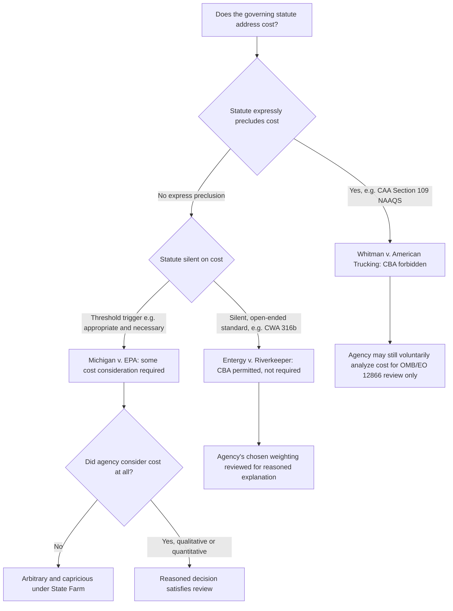

## Cost Benefit Analysis Controversies in Environmental Rulemaking

### Legal and Historical Framework

Cost-benefit analysis (CBA) is not required by the Administrative Procedure Act itself. It entered federal rulemaking through a lineage of executive orders directed at the executive branch's own rulemaking process:

- **Executive Order 12291** (Reagan, 1981) — first required agencies to regulate only where benefits exceed costs, subject to OMB review.
- **Executive Order 12866** (Clinton, 1993) — replaced EO 12291 while preserving its core principle that "the benefits of the intended regulation justify its costs," and created the Office of Information and Regulatory Affairs (OIRA) within OMB as the centralized reviewer of "significant regulatory actions" (historically, those with annual economic effects of $100 million or more). This order required agencies to analyze costs and benefits for major rules meeting that threshold. [legis1](https://legis1.com/news/trump-federal-rulemaking-rules-trumps)
- **OMB Circular A-4** (2003) — the technical guidance document instructing agencies how to conduct the analysis: which costs and benefits to monetize, how to handle uncertainty, and — centrally — what discount rate to apply to future effects.

This basic framework persisted largely unchanged for over three decades across both parties, making CBA one of the more durable features of the modern administrative state even though it rests on executive order rather than statute — meaning any President can revise or supersede it without notice-and-comment rulemaking or congressional action. [legis1](https://legis1.com/news/trump-federal-rulemaking-rules-trumps)

### Statutory Silence, Permission, and Prohibition

The central doctrinal controversy is not whether OMB *wants* agencies to conduct CBA, but whether the **underlying environmental statute allows it**. Congress wrote environmental statutes with widely varying degrees of tolerance for cost consideration, and the Supreme Court has resolved several conflicts inconsistently across different provisions:

- **Whitman v. American Trucking Ass'ns, Inc.** (2001) — held that Clean Air Act § 109, which directs EPA to set National Ambient Air Quality Standards "requisite to protect the public health" with "an adequate margin of safety," **forecloses** cost consideration. The Court found the statutory text unambiguous and refused to read an implicit cost-benefit requirement into a health-based standard, even though EPA's own economists had produced cost estimates.
- **Entergy Corp. v. Riverkeeper, Inc.** (2009) — by contrast, upheld EPA's use of a cost-benefit comparison in setting "best technology available" standards for cooling water intake structures under CWA § 316(b), holding that where a statute is silent or ambiguous about whether cost may factor into a "best technology" determination, the agency may **permissibly** — though need not — weigh costs against benefits.
- **Michigan v. EPA** (2015) — addressed CAA § 112(n)(1)(A), which authorized EPA to regulate power-plant hazardous air pollutants if "appropriate and necessary." The Court held that EPA acted unreasonably by refusing to consider cost at all when making that threshold determination, reasoning that "reasonable regulation ordinarily requires paying attention to the advantages and disadvantages of agency decisions" — but notably did **not** require a formal, quantified cost-benefit test; a qualitative consideration of cost could suffice on remand.

**Key Points**

- No single doctrinal rule governs cost consideration across environmental law; the answer turns on the specific statutory text at issue.
- *Whitman* establishes that cost-blind statutory language precludes CBA even where the agency wants to use it.
- *Entergy* establishes that statutory silence generally permits, but does not compel, cost-benefit balancing.
- *Michigan* establishes that some cost consideration may be constitutionally/administratively *required* as a matter of reasoned decision-making once a statute conditions action on an "appropriate and necessary" or similarly open-ended threshold, even without mandating a specific methodology.

### Substantive Controversies Within CBA Methodology

Even where CBA is legally permitted, its internal methodological choices are independently contested:

**Value of a Statistical Life (VSL).** Agencies monetize mortality-risk reductions using a per-statistical-life value derived from wage-risk and stated-preference studies. **[Unverified]** The specific dollar figure agencies use is periodically updated for inflation and methodology and should be confirmed against the current EPA/DOT guidance rather than assumed current in any given year. The methodology itself is contested: critics on the left argue that any single dollar figure understates the value of preventing death and can be manipulated by adjusting study inputs; critics on the right sometimes argue VSL estimates are inflated relative to what individuals actually reveal through market behavior. EPA's 2003 proposal to apply a lower VSL for older populations (the so-called "senior death discount") was withdrawn after significant public and congressional backlash, illustrating how distributionally sensitive VSL choices can become politically untenable regardless of their econometric basis.

**Discount rate selection.** Because many environmental harms (climate change, cumulative toxic exposure) manifest decades after the regulated activity, the discount rate chosen to convert future benefits into present value can determine whether a rule "passes" cost-benefit analysis at all. The 2003 Circular A-4 specified discount rates of 3% and 7%, while a 2023 revision substantially reduced the primary discount rate to 2%, an assumption change that significantly increased the calculated value of distant and speculative regulatory benefits. Lower discount rates favor rules with long-deferred payoffs (climate rules); higher discount rates favor rules with front-loaded costs and back-loaded benefits looking comparatively worse. This makes the discount rate one of the most consequential — and most politically contested — technical parameters in the entire CBA apparatus. [sidley](https://sidley.com/en/insights/newsupdates/2025/02/president-trumps-executive-order-seeks-to-reduce-federal-regulation)[sidley](https://sidley.com/en/insights/newsupdates/2025/02/president-trumps-executive-order-seeks-to-reduce-federal-regulation)

**The co-benefits controversy.** Regulations aimed at one pollutant frequently produce measurable reductions in other, co-emitted pollutants. The paradigm example is EPA's Mercury and Air Toxics Standards (MATS) rule, where the directly targeted mercury benefits were estimated in the range of a few million dollars annually, while ancillary reductions in fine particulate matter (PM2.5) — a co-benefit of the same pollution-control equipment — were estimated in the tens of billions of dollars. Critics argue this pattern lets agencies justify rules whose *stated statutory target* would never independently satisfy a cost-benefit test, effectively using CBA as a vehicle to backfill unrelated policy goals. Defenders respond that co-benefits are real, scientifically measurable reductions in harm, and that excluding them would be arbitrary and would itself understate a rule's true net effect — precisely the concern that drove *Michigan v. EPA*'s remand.

**Distributional and environmental justice critique.** CBA in its classical form is an aggregate efficiency test: it asks whether total benefits exceed total costs, not who bears each. A rule can clear aggregate CBA while concentrating compliance costs, job effects, or residual pollution burdens on specific — often lower-income or minority — communities near regulated facilities, and concentrating the counted benefits elsewhere. **[Inference]** This mismatch between aggregate efficiency and distributional equity is a primary reason environmental justice advocates argue that CBA, standing alone, is an incomplete decision framework for environmental rulemaking, though methodologies for formally incorporating distributional weighting into CBA remain unsettled and are not uniformly adopted by agencies.

**Quantification bias.** Compliance costs (equipment, monitoring, administrative burden) are generally easier to monetize than diffuse ecological benefits (biodiversity preservation, existence value, non-use value of undisturbed ecosystems). Critics argue this asymmetry produces a systematic bias in aggregate CBA outputs even when each individual estimate is made in good faith, because what resists quantification tends to be undercounted rather than excluded from the ledger with an explicit caveat.

**Retrospective accuracy.** A recurring empirical critique — supported by several retrospective agency and academic studies — is that prospective compliance-cost estimates in rulemaking preambles often overstate actual ex post costs, because regulated industries innovate compliance technology faster than pre-rule estimates assume. **[Unverified]** The magnitude and consistency of this overestimation effect vary significantly by study and by rule category, and should not be treated as a uniform rule.

### Administrative Law Review Standard

Judicial review of an agency's cost-benefit reasoning proceeds under ordinary APA § 706(2)(A) arbitrary-and-capricious review, as elaborated in *Motor Vehicle Manufacturers Ass'n v. State Farm* (1983): the agency must consider the relevant factors and provide a reasoned explanation connecting the facts found to the choice made, and a court will vacate a rule that "entirely failed to consider an important aspect of the problem." Cost, where the statute permits its consideration, has increasingly been treated as such an "important aspect" — a lesson *Michigan v. EPA* draws directly from *State Farm*.

**[Inference]** The Supreme Court's 2024 decision in *Loper Bright Enterprises v. Raimondo*, overruling *Chevron* deference to agency statutory interpretations, is likely to sharpen future disputes over whether a given environmental statute permits, requires, or forbids cost consideration: courts will now determine the statute's best reading independently rather than deferring to an agency's own view that its authorizing statute allows (or disallows) a cost-benefit approach, potentially reopening interpretive questions that agencies previously resolved through their own reasonable-interpretation latitude.

### Recent Executive Order Developments

The executive-order layer governing CBA has shifted substantially since 2025. EO 12866 has remained formally in effect and has been endorsed by the current administration, but subsequent orders have altered its practical application: [cato](https://www.cato.org/regulation/spring-2026/another-trump-turn-reaganism)[cato](https://www.cato.org/node/119302.md)

- EO 14192, signed in January 2025, requires agencies to repeal ten existing rules for each new rule and ensure that cost savings from the repealed rules more than offset the estimated costs of the new rule — effectively substituting a stripped-down cost/cost-savings comparison for the traditional benefit-cost test on new rules. [cato](https://www.cato.org/node/119302.md)[cato](https://www.cato.org/regulation/spring-2026/another-trump-turn-reaganism)
- EO 14219, signed in February 2025, requires agencies to identify and repeal rules they determine exceed their statutory authority, without regard to the standard procedures — including cost-benefit analysis — ordinarily used to withdraw a rule. [cato](https://www.cato.org/node/119302.md)
- A 2025 executive order revoked the 2023 update to OMB Circular A-4 and directed reinstatement of the 2003 version, reverting the discount rate from 2% back to the traditional 3%/7% rates and removing the 2023 update's directive that agencies consider regulatory effects outside the United States — a change with particular significance for greenhouse-gas rules, which had relied on the broader international-effects framework. [sidley](https://sidley.com/en/insights/newsupdates/2025/02/president-trumps-executive-order-seeks-to-reduce-federal-regulation)[sidley](https://sidley.com/en/insights/newsupdates/2025/02/president-trumps-executive-order-seeks-to-reduce-federal-regulation)
- A further order, EO 14215, extended cost-benefit review requirements to independent regulatory agencies historically exempt from OIRA review because Congress designed them to operate independently of direct presidential control (e.g., the Federal Reserve, FCC) — though the legal status of extending this requirement to constitutionally independent agencies remains unsettled. [legis1](https://legis1.com/news/trump-federal-rulemaking-rules-trumps)[legis1](https://legis1.com/news/trump-federal-rulemaking-rules-trumps)
- An October 2025 OMB memorandum has been reported as further curtailing standard regulatory review procedures for a core set of EPA rules where the agency's own benefit-cost analysis has historically shown regulatory benefits substantially exceeding costs. [cato](https://www.cato.org/node/119302.md)

**[Unverified]** This area is unusually fast-moving even by administrative-law standards, since it rests on executive orders and OMB guidance rather than statute or notice-and-comment rule; any application to a live rulemaking should be checked against the current text of the relevant executive order and Circular A-4 version rather than relied upon from a fixed summary, given the pace of revision across 2025–2026.

### Illustration — Statutory Cost-Consideration Decision Tree



### Illustration — Executive Order and Guidance Timeline (svg_diagram)

<svg xmlns="http://www.w3.org/2000/svg" viewBox="0 0 900 260" font-family="Helvetica, Arial, sans-serif">
<text x="450" y="22" text-anchor="middle" font-size="16" font-weight="bold" fill="#1a1a1a">CBA Executive Order and Circular A-4 Timeline (svg_diagram)</text>
<line x1="40" y1="130" x2="860" y2="130" stroke="#9ca3af" stroke-width="3" />
<g font-size="11" fill="#1a1a1a">
<circle cx="80" cy="130" r="6" fill="#1e40af" />
<text x="80" y="110" text-anchor="middle">1981</text>
<text x="80" y="155" text-anchor="middle">EO 12291</text>
<text x="80" y="168" text-anchor="middle">(Reagan)</text>



```
<circle cx="220" cy="130" r="6" fill="#1e40af" />
<text x="220" y="110" text-anchor="middle">1993</text>
<text x="220" y="155" text-anchor="middle">EO 12866</text>
<text x="220" y="168" text-anchor="middle">(Clinton, OIRA)</text>

<circle cx="360" cy="130" r="6" fill="#1e40af" />
<text x="360" y="110" text-anchor="middle">2003</text>
<text x="360" y="155" text-anchor="middle">Circular A-4</text>
<text x="360" y="168" text-anchor="middle">3% / 7% rates</text>

<circle cx="500" cy="130" r="6" fill="#b45309" />
<text x="500" y="110" text-anchor="middle">2023</text>
<text x="500" y="155" text-anchor="middle">A-4 Revision</text>
<text x="500" y="168" text-anchor="middle">2% rate, global effects</text>

<circle cx="640" cy="130" r="6" fill="#9d174d" />
<text x="640" y="110" text-anchor="middle">Jan-Feb 2025</text>
<text x="640" y="155" text-anchor="middle">EO 14192 / 14219</text>
<text x="640" y="168" text-anchor="middle">10-for-1 / unlawful-rule repeal</text>

<circle cx="780" cy="130" r="6" fill="#9d174d" />
<text x="780" y="110" text-anchor="middle">2025</text>
<text x="780" y="155" text-anchor="middle">A-4 Reverted</text>
<text x="780" y="168" text-anchor="middle">EO 14215 to indep. agencies</text>
```

</g>
</svg>

### Example

A hypothetical PM2.5 ambient air quality standard revision: EPA cannot, under *Whitman*, refuse to strengthen a NAAQS on the ground that compliance costs outweigh health benefits, since CAA § 109 forecloses cost consideration for that specific decision. But once EPA has set the health-based standard, the *implementation* rules requiring specific power plants to install control technology to meet it may permissibly weigh cost against pollution-reduction benefit under provisions like CWA-style "best technology" language — and if the same rule generates large PM2.5 co-benefits alongside its primary pollutant target, the agency may count those co-benefits under *Michigan*'s reasoned-decision-making logic, subject to *State Farm* review for whether it explained its methodology adequately.

**Related Topics**

- Executive Order 12866, OIRA review, and the "significant regulatory action" threshold
- *Chevron* deference's demise and *Loper Bright*'s effect on environmental statutory interpretation
- Value of a Statistical Life methodology and interagency VSL guidance
- Environmental justice analysis under Executive Order 12898 and its interaction with CBA
- The arbitrary-and-capricious standard under *State Farm* in environmental rule challenges
- Social cost of carbon methodology and its litigation history
- Retrospective regulatory review and ex post cost-estimate accuracy studies