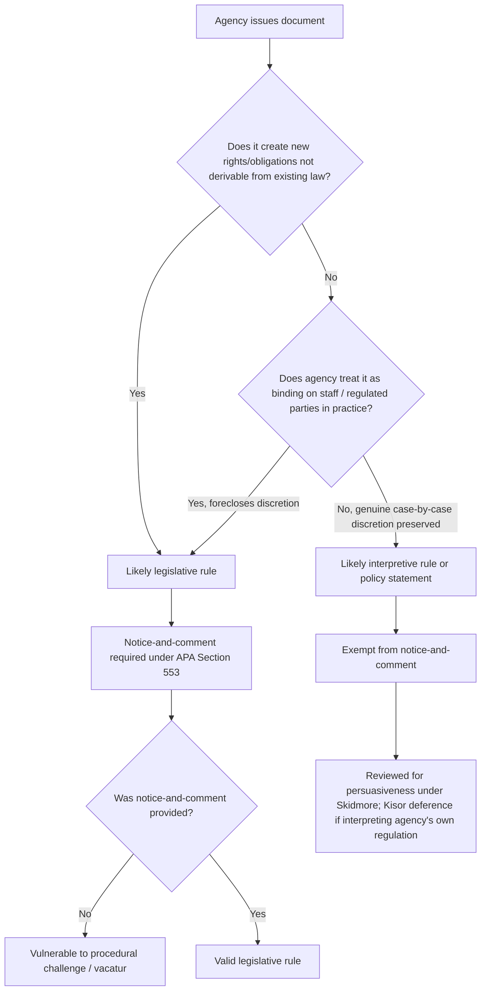

## Guidance Documents and Enforcement Discretion in Environmental Agency Practice

### Overview

Environmental agencies — principally the U.S. Environmental Protection Agency (EPA), but also state environmental departments, the Army Corps of Engineers, and analogous bodies — rely heavily on sub-regulatory guidance documents (memoranda, policy statements, interpretive letters, enforcement manuals) to communicate how they will interpret statutes and regulations and how they will exercise enforcement discretion. This topic sits at the intersection of administrative law doctrine (notice-and-comment rulemaking, the APA's exemptions for interpretive rules and policy statements, judicial review of agency action) and environmental law practice (permitting, compliance, and enforcement under statutes like the Clean Air Act, Clean Water Act, RCRA, and CERCLA).

### Legal Framework: APA Categories of Agency Pronouncements

Under the Administrative Procedure Act (APA), 5 U.S.C. § 553, agencies generally must use notice-and-comment procedures for "legislative rules" — rules that have the force and effect of law. Three categories are exempted from notice-and-comment under § 553(b)(A):

- **Interpretive rules** — statements clarifying or explaining existing statutory or regulatory duties, without creating new rights or obligations
- **General statements of policy** — statements announcing how an agency intends to exercise discretionary authority, without binding the agency or regulated parties
- **Rules of agency organization, procedure, or practice**

Guidance documents are typically defended by agencies as falling into the interpretive-rule or policy-statement categories. The practical stakes are high: guidance issued without notice-and-comment is faster and more flexible for agencies, but it is also more vulnerable to challenge if a court finds it actually functions as a binding legislative rule in disguise.

### The Legislative Rule vs. Guidance Distinction

**Key Points**

- Courts look past the label an agency assigns and examine substance and effect (functional test), not merely the document's caption or the agency's own characterization.
- Core inquiry: does the document merely explain existing law, or does it establish a new binding norm that agency staff, regulated entities, or courts must treat as controlling?

Courts and commentators use several overlapping tests to distinguish legislative rules from genuine guidance:

1. **Binding effect test** — Does the agency treat the document as binding on itself and its staff, foreclosing case-by-case discretion? If agency enforcement personnel are instructed to apply a numeric standard automatically, that looks legislative regardless of the "guidance" label.
2. **Legal basis test** — Does the document merely restate a statutory or regulatory command already binding by force of law, or does it impose a new obligation not derivable from the existing text?
3. **Practical binding effect / "field precedent" test** — Even absent formal legal bindingness, if the agency's actual practice treats the guidance as dispositive (e.g., automatic denial of permits that deviate from the guidance), courts have found it functions as a legislative rule requiring notice-and-comment.
4. **Discretion-preserving language** — Guidance documents typically include boilerplate reserving case-by-case discretion ("this document does not create binding requirements," "alternative approaches may be acceptable"). Courts weigh whether that language is genuine or pretextual, i.e., whether discretion is exercised in practice.

**Example**

An EPA memorandum interpreting "waters of the United States" that instructs regional offices they "must" deny jurisdictional determinations departing from a specified methodology is likely to be treated by a reviewing court as a de facto legislative rule, notwithstanding a disclaimer that it is "non-binding guidance," because the operative language forecloses discretion.

### Enforcement Discretion Doctrine

Enforcement discretion refers to an agency's authority to decide whether, when, and how to pursue an enforcement action against a regulated entity for a violation. This discretion is rooted in:

- **Heckler v. Chaney**, 470 U.S. 821 (1985) — Establishes a strong presumption that an agency's decision *not* to institute enforcement proceedings is committed to agency discretion by law and therefore unreviewable under APA § 701(a)(2), analogous to prosecutorial discretion. The presumption can be rebutted where a statute provides meaningful standards to guide (and cabin) enforcement decisions, or where the agency has adopted a policy of general non-enforcement it purports to have no jurisdiction to enforce.
- Environmental statutes often contain both mandatory ("shall") and discretionary ("may") enforcement language, which affects whether the *Chaney* presumption applies to a given statutory enforcement scheme.

**Key Points**

- Affirmative enforcement decisions (bringing an action) are generally reviewable through the ordinary channels (e.g., defenses in the enforcement proceeding itself).
- Decisions *not* to enforce are presumptively unreviewable, but this is a rebuttable presumption, not an absolute bar.
- Guidance documents that structure enforcement discretion (e.g., enforcement response policies, penalty matrices) can themselves become the subject of litigation if they are alleged to function as binding rules that improperly narrow statutorily-granted discretion, or conversely, if regulated parties claim reasonable reliance on published enforcement policies.

### Enforcement Guidance Instruments in Environmental Practice

| Instrument Type | Function | Typical Legal Character |
| --- | --- | --- |
| Enforcement Response Policy (ERP) | Establishes tiered responses (e.g., Notice of Violation → Compliance Order → Civil Penalty) based on violation severity | Policy statement; non-binding but structures agency discretion |
| Penalty Policy / Penalty Matrix | Provides formulas or matrices for calculating civil penalties based on gravity, economic benefit, and culpability | Guidance; often incorporated into settlement negotiations |
| Compliance Advisories / Alerts | Inform regulated community of compliance obligations or emerging issues | Interpretive; informational |
| No Action Assurance (NAA) letters | Agency commitment not to pursue enforcement for specified conduct | Case-specific exercise of discretion; generally not precedential |
| Interpretive Memoranda | Clarify statutory/regulatory terms (e.g., "solid waste," "point source") | Interpretive rule; subject to *Skidmore* or *Kisor* deference analysis, not *Chevron* force-of-law deference |
| Enforcement Discretion Policies (e.g., temporary non-enforcement during emergencies) | Announce agency will not pursue enforcement for specified violations under specified conditions | Policy statement; controversial when broad (see COVID-19 example below) |

### Deference Doctrines Applicable to Guidance Documents

Because guidance documents are not adopted through notice-and-comment, they generally do not receive *Chevron*-style deference (and *Chevron* itself was overruled by **Loper Bright Enterprises v. Raimondo**, 603 U.S. 369 (2024), which eliminated deference to agency statutory interpretations altogether and directed courts to exercise independent judgment under *Skidmore*-style persuasiveness review). Post-*Loper Bright*, courts:

- Independently interpret the statute, according an agency's interpretation only the weight its **thoroughness, consistency, and persuasiveness** warrant (*Skidmore v. Swift & Co.*, 323 U.S. 134 (1944))
- For an agency's interpretation of its *own* ambiguous regulation (not the statute), continue to apply **Auer/Kisor deference** (*Kisor v. Wilkie*, 588 U.S. 558 (2019)), but only after exhausting ordinary interpretive tools, confirming genuine ambiguity, and finding the interpretation reflects the agency's authoritative, expertise-based, fair-warning-respecting judgment.

**Key Points**

- *Loper Bright* increases litigation risk for guidance-heavy enforcement programs because courts no longer defer to an agency's statutory reading merely because it is embodied in a guidance document.
- Guidance interpreting an agency's own regulations may still receive *Kisor* deference, making the legislative-rule/interpretive-rule distinction doctrinally important: mislabeling a legislative rule as "interpretive guidance" avoids notice-and-comment costs but also forfeits any claim to binding legal effect if challenged.

### Judicial Review Pathways for Challenging Guidance

**Key Points**

1. **Pre-enforcement facial challenge** — A regulated party challenges the guidance document itself as procedurally defective (should have gone through notice-and-comment) or substantively ultra vires. Ripeness and finality are threshold hurdles.
   - **Finality** (*Bennett v. Spear*, 520 U.S. 154 (1997)): the action must mark the "consummation" of the agency's decision-making process and determine rights or obligations, or occasion legal consequences.
   - **U.S. Army Corps of Engineers v. Hawkes Co.**, 578 U.S. 590 (2016): a jurisdictional determination under the Clean Water Act was held to be final agency action reviewable under the APA, because of its concrete legal consequences (safe harbor from enforcement, evidentiary effect).
   - Ripeness doctrine (*Abbott Laboratories v. Gardner*, 387 U.S. 136 (1967)) asks whether the issues are fit for judicial decision and whether withholding review causes hardship to the parties.
2. **As-applied challenge in an enforcement proceeding** — A defendant in an enforcement action argues the agency improperly relied on guidance as if it were binding law, or that the guidance was adopted without required procedure and should not be given legal effect.
3. **Citizen suit provisions** — Many environmental statutes (Clean Water Act § 505, Clean Air Act § 304, RCRA § 7002) allow citizen suits, including in limited circumstances suits to compel non-discretionary ("mandatory") duties; this interacts with enforcement discretion doctrine because citizen suits generally cannot compel discretionary enforcement decisions but can compel non-discretionary duties.

### Mermaid Diagram: Decision Pathway — Is a Guidance Document a Legislative Rule?

### SVG Diagram: Spectrum of Agency Pronouncements (svg_diagram)

<svg xmlns="http://www.w3.org/2000/svg" viewBox="0 0 720 260">
<text x="360" y="24" text-anchor="middle" font-size="16" font-weight="bold" fill="#1a1a1a">Spectrum of Environmental Agency Pronouncements (svg_diagram)</text>
<line x1="60" y1="140" x2="660" y2="140" stroke="#333" stroke-width="3" />
<polygon points="660,140 648,133 648,147" fill="#333" />
<text x="360" y="170" text-anchor="middle" font-size="12" fill="#555">Increasing binding legal force / procedural formality</text>
<circle cx="100" cy="140" r="8" fill="#4a90d9" />
<text x="100" y="100" text-anchor="middle" font-size="12" font-weight="bold">No Action Letter</text>
<text x="100" y="115" text-anchor="middle" font-size="10" fill="#555">Case-specific</text>
<text x="100" y="185" text-anchor="middle" font-size="10" fill="#555">Non-precedential</text>
<circle cx="230" cy="140" r="8" fill="#4a90d9" />
<text x="230" y="100" text-anchor="middle" font-size="12" font-weight="bold">Compliance Alert</text>
<text x="230" y="115" text-anchor="middle" font-size="10" fill="#555">Informational</text>
<circle cx="380" cy="140" r="8" fill="#e0a030" />
<text x="380" y="100" text-anchor="middle" font-size="12" font-weight="bold">Enforcement Response Policy</text>
<text x="380" y="115" text-anchor="middle" font-size="10" fill="#555">Structures discretion</text>
<text x="380" y="185" text-anchor="middle" font-size="10" fill="#555">Skidmore weight only</text>
<circle cx="520" cy="140" r="8" fill="#e0a030" />
<text x="520" y="100" text-anchor="middle" font-size="12" font-weight="bold">Interpretive Memo</text>
<text x="520" y="115" text-anchor="middle" font-size="10" fill="#555">Clarifies existing duty</text>
<circle cx="640" cy="140" r="9" fill="#c0392b" />
<text x="640" y="100" text-anchor="middle" font-size="12" font-weight="bold">Legislative Rule</text>
<text x="640" y="115" text-anchor="middle" font-size="10" fill="#555">Notice-and-comment</text>
<text x="640" y="185" text-anchor="middle" font-size="10" fill="#555">Force of law</text>
</svg>

### Illustrative Example: COVID-19 Temporary Enforcement Discretion Policy

In March 2020, EPA issued a temporary enforcement discretion policy stating it would not pursue penalties for certain routine monitoring and reporting violations caused by COVID-19 disruptions, provided facilities documented the basis for noncompliance and returned to compliance as soon as possible.

**Key Points**

- The policy was framed as an exercise of *Chaney*-style enforcement discretion, not a suspension of underlying legal obligations — the underlying permit/regulatory duties remained legally in force.
- It drew criticism and litigation threats from environmental groups arguing it functioned as a de facto suspension of enforceable standards without notice-and-comment, and that it improperly signaled non-enforcement of statutorily mandatory duties.
- It illustrates the tension between legitimate case-by-case discretion (permissible) and a blanket, prospective non-enforcement policy applied categorically to a class of regulated entities (more susceptible to challenge as functioning like a rule).

### State-Level Variation

**Key Points**

- Many states have adopted "little APAs" with materially different treatment of guidance documents; some states require guidance documents to be publicly logged, subject to periodic review, or even subject to a modified notice-and-comment process for "policy statements" that a rigid federal APA analysis would not require.
- Some states impose statutory constraints specifically barring agencies from enforcing an unpromulgated "rule" (i.e., guidance not adopted through rulemaking) against a regulated party — effectively codifying a strict version of the legislative-rule doctrine.
- Practitioners must check the specific state APA and any environmental-agency-specific procedural statutes; assume no uniformity across jurisdictions. [Inference: exact scope of state guidance-document constraints varies significantly by state and is not safely generalized without jurisdiction-specific research.]

### Practical Compliance and Litigation Strategy Considerations

**Key Points**

- **For regulated entities:** Reliance on guidance carries risk — an agency may depart from its own guidance without notice, and reasonable reliance defenses (e.g., estoppel against the government) are difficult to establish, since equitable estoppel against the federal government generally requires a showing of affirmative misconduct beyond mere reliance on published guidance.
- **For agencies:** Excessive reliance on guidance to accomplish what should be legislative rulemaking risks vacatur on procedural grounds, disrupting enforcement programs built around the guidance.
- **For litigators:** A challenge to enforcement action can proceed on two independent tracks — (1) a substantive challenge to the agency's interpretation of the statute (now subject to independent judicial interpretation post-*Loper Bright*), and (2) a procedural challenge to the guidance document's issuance without notice-and-comment.
- Settlement negotiations in environmental enforcement actions (e.g., consent decrees) routinely reference penalty policies and enforcement response policies as benchmarks, even though they are not binding — this "soft law" effect is a recurring feature of environmental enforcement practice regardless of formal legal status. [Inference: characterization of guidance's practical influence in settlement negotiations reflects common practitioner experience rather than a codified legal rule.]

### Relevant Statutory and Regulatory Anchors

- Administrative Procedure Act, 5 U.S.C. §§ 551–559, 701–706 (definitions, rulemaking exemptions, scope of judicial review)
- Clean Air Act enforcement provisions, 42 U.S.C. § 7413
- Clean Water Act enforcement provisions, 33 U.S.C. § 1319
- RCRA enforcement provisions, 42 U.S.C. § 6928
- CERCLA enforcement and administrative order authority, 42 U.S.C. § 9606

### Conclusion

Guidance documents are indispensable tools for environmental agencies to communicate interpretive positions and structure enforcement priorities efficiently, but their legal force is inherently constrained: they bind neither courts nor, in principle, the agency itself, and they receive interpretive weight rather than controlling legal authority under *Loper Bright*'s independent-judgment framework (with *Kisor* deference reserved for genuine interpretations of an agency's own regulations). Enforcement discretion — the decision whether to act on a known violation — remains presumptively unreviewable under *Heckler v. Chaney*, but agencies that convert case-by-case discretion into rigid, universally-applied guidance risk having that guidance recharacterized as a legislative rule requiring notice-and-comment, exposing enforcement programs to procedural vacatur.

**Related Topics**

- Notice-and-comment rulemaking procedures under APA § 553
- *Loper Bright Enterprises v. Raimondo* and the end of *Chevron* deference
- *Kisor v. Wilkie* and Auer deference to agency regulatory interpretations
- Finality and ripeness doctrine in environmental permitting (*Bennett v. Spear*; *U.S. Army Corps of Engineers v. Hawkes*)
- Citizen suit provisions and mandatory vs. discretionary duty distinctions
- Equitable estoppel against government agencies
- State "little APA" guidance-document procedures
- Consent decrees and penalty policy negotiation in environmental enforcement