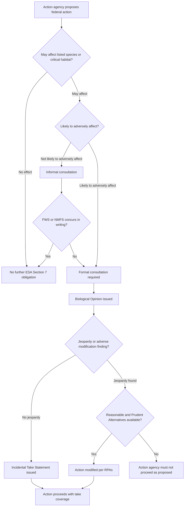

## Interagency Consultation Requirements and Coordination Across Environmental Statutes

### Overview

Federal environmental law frequently requires one agency to consult with another before taking action, creating a web of interagency coordination obligations layered on top of each agency's substantive permitting or licensing authority. These consultation requirements are designed to ensure that specialized expertise (e.g., wildlife biology, historic preservation, water quality) is brought to bear on decisions nominally housed within a different agency's jurisdiction (e.g., a pipeline permit, a highway project, a dam relicensing). This creates significant administrative law complexity: multiple agencies may have overlapping or sequential roles, each subject to distinct procedural requirements, standards of review, and deadlines, and failures of coordination are a leading source of environmental litigation.

### Core Statutory Consultation Regimes

**Key Points**

| Statute | Consulting/Lead Agency Pair | Trigger | Core Substantive Standard |
| --- | --- | --- | --- |
| Endangered Species Act (ESA) § 7 | Action agency consults with U.S. Fish & Wildlife Service (FWS) and/or National Marine Fisheries Service (NMFS) | Any federal action that "may affect" a listed species or critical habitat | Avoid actions likely to jeopardize the continued existence of listed species or destroy/adversely modify critical habitat |
| National Historic Preservation Act (NHPA) § 106 | Agency consults with State Historic Preservation Officer (SHPO)/Tribal Historic Preservation Officer (THPO) and Advisory Council on Historic Preservation (ACHP) | Federal undertaking with potential effects on historic properties | "Take into account" effects; procedural (no substantive mandate to avoid harm) |
| Clean Water Act § 401 | Federal licensing/permitting agency requires state (or authorized tribal) water quality certification | Any federal license or permit for activity that may result in a discharge to waters of the U.S. | State certifies compliance with state water quality standards; state can impose conditions |
| Magnuson-Stevens Fishery Conservation and Management Act | Action agency consults with NMFS on Essential Fish Habitat (EFH) | Federal action that may adversely affect EFH | NMFS provides EFH conservation recommendations; agency must respond but is not bound |
| National Environmental Policy Act (NEPA) | Lead agency coordinates with cooperating agencies having jurisdiction by law or special expertise | Major federal actions significantly affecting the environment | Procedural: full and fair disclosure and consideration of impacts, not a particular substantive outcome |
| Coastal Zone Management Act (CZMA) § 307 | Federal agency consultation with state coastal management program (consistency review) | Federal activity affecting the coastal zone | Federal action must be "consistent to the maximum extent practicable" with state program |

### Endangered Species Act Section 7 Consultation — Detailed Mechanics

**Key Points**

- **Step 1 — Effects determination:** the action agency determines whether its action "may affect" listed species or critical habitat. "No effect" ends the ESA § 7 analysis; "may affect" triggers consultation.
- **Step 2 — Informal consultation:** if the action agency determines effects are "not likely to adversely affect" (NLAA), and FWS/NMFS concurs in writing, formal consultation is avoided.
- **Step 3 — Formal consultation:** required where the action is "likely to adversely affect" listed species; results in a **Biological Opinion (BiOp)**.
- **Jeopardy/adverse modification determination:** the BiOp states whether the action is likely to jeopardize the species or adversely modify critical habitat.
- **Reasonable and Prudent Alternatives (RPAs):** if jeopardy is found, the consulting agency must identify RPAs that avoid jeopardy while allowing the action to proceed in modified form, where such alternatives exist.
- **Incidental Take Statement (ITS):** authorizes take that is incidental to an otherwise lawful activity, subject to specified terms and conditions; compliance with the ITS provides a safe harbor from ESA § 9 take liability.
- **Emergency consultation and the "no jeopardy" default:** absent timely completion, agencies may face default procedural obligations under implementing regulations (50 C.F.R. Part 402).

**Statutory Anchor:** 16 U.S.C. § 1536; implementing regulations at 50 C.F.R. Part 402.

**Judicial Deference Note:** Post-*Loper Bright*, courts reviewing a Biological Opinion's scientific and technical conclusions continue to apply a deferential "arbitrary and capricious" standard under APA § 706(2)(A) because this is review of factual/technical agency judgment, not statutory interpretation — the two deference regimes are analytically distinct. [Inference: courts have generally maintained this distinction post-*Loper Bright*, but the precise doctrinal boundary between technical-judgment deference and statutory-interpretation independence is still being worked out in circuit-level case law.]

### Mermaid Diagram: ESA Section 7 Consultation Process

### National Historic Preservation Act Section 106 — Consultation Mechanics

**Key Points**

- Purely **procedural**: NHPA § 106 requires agencies to "take into account" effects on historic properties but does not mandate a particular substantive outcome (contrast with ESA § 7's substantive jeopardy standard).
- **Area of Potential Effects (APE)** defines the geographic scope of review.
- Consultation involves SHPO/THPO, and may include the ACHP, Indian tribes, and consulting parties (including the public in some circumstances).
- Outcome is typically a **Memorandum of Agreement (MOA)** or **Programmatic Agreement (PA)** specifying mitigation measures.
- Implementing regulations: 36 C.F.R. Part 800.

### NEPA's Coordinating Role: Lead and Cooperating Agencies

**Key Points**

- NEPA does not itself impose substantive consultation duties toward wildlife or historic resources, but its procedural framework is often used as the **integrating document** into which ESA, NHPA, CZMA, and other consultation outputs are folded (e.g., a single Environmental Impact Statement addressing all applicable consultation requirements).
- **Lead agency:** the agency with primary responsibility for preparing the NEPA analysis when multiple agencies are involved (40 C.F.R. § 1501.7, as amended).
- **Cooperating agencies:** agencies with jurisdiction by law or special expertise that assist the lead agency; can include state, tribal, and local governments.
- **Programmatic consultation / concurrent review:** agencies increasingly seek to combine ESA, NHPA, and NEPA review timelines to avoid sequential delay — a persistent point of practical friction given differing statutory clocks and standards.
- Post-2020 and subsequent CEQ regulatory revisions have altered NEPA's categorical exclusions, cumulative effects analysis, and page/time limits; practitioners must verify current CEQ regulations and any agency-specific NEPA procedures in effect at the time of the action, since NEPA implementing regulations have been amended multiple times in recent years. [Unverified: precise current-year regulatory text should be confirmed against the Federal Register at time of use, as CEQ's NEPA regulations have been subject to ongoing litigation and revision.]

### Clean Water Act Section 401 Certification

**Key Points**

- Applies to any activity requiring a federal license or permit (e.g., a Clean Water Act § 404 dredge-and-fill permit, a Federal Energy Regulatory Commission hydropower license) that may result in a discharge to waters of the United States.
- States (or EPA-authorized tribes) certify that the activity will comply with state water quality standards; states may impose additional conditions that become embedded in the federal permit/license.
- **Waiver rule:** if the state fails to act on a certification request within a reasonable period (not to exceed one year under the statute), the certification requirement is waived.
- **2020 EPA Clean Water Act Section 401 Certification Rule** narrowed the scope of state review (limiting review to water-quality-related conditions and tightening procedural deadlines); this rule was vacated by a federal district court in 2021, reinstating pre-2020 practice, and EPA subsequently promulgated a 2023 rule revising the certification framework again. [Inference: given the history of rule vacatur and revision in this area, the current operative § 401 rule should be verified against EPA's current regulations at the time of any specific matter, as this is an area of continuing regulatory and litigation flux.]

### Magnuson-Stevens Act Essential Fish Habitat Consultation

**Key Points**

- Distinct from ESA consultation — EFH consultation applies to federally managed fish species' habitat generally, not only listed/endangered species.
- NMFS issues **EFH Conservation Recommendations**; the action agency must provide a **written response** within 30 days describing its plans to address the recommendations, but the agency is **not legally bound** to adopt them (weaker substantive bite than ESA § 7).
- Often coordinated with ESA consultation when the same federal action affects both EFH and ESA-listed species under NMFS jurisdiction (e.g., certain anadromous fish), permitting combined analysis in a single consultation document.

### Coastal Zone Management Act Consistency Review

**Key Points**

- Requires federal agency activities, federal license/permit activities, and federally funded activities **affecting the coastal zone** to be consistent "to the maximum extent practicable" with a state's federally approved coastal management program.
- States can object to a federal consistency determination, triggering mediation by the Department of Commerce or potential litigation.
- Interacts with CWA § 401 certification and ESA consultation where coastal infrastructure projects (e.g., LNG terminals, offshore wind) require multiple simultaneous interagency and federal-state coordination processes.

### Cross-Cutting Administrative Law Problems in Multi-Statute Coordination

**Key Points**

1. **Sequencing and timing conflicts** — Different statutes impose different deadlines (ESA formal consultation: generally 90 days plus 45 days for BiOp preparation, extendable by agreement; CWA § 401: up to one year; NHPA: no fixed statutory deadline, driving frequent delay complaints). Misalignment can create bottlenecks or force agencies to choose between statutory compliance and project timelines.
2. **Which agency's substantive standard controls** — Because ESA imposes a substantive no-jeopardy mandate while NHPA and NEPA are essentially procedural, a project can satisfy NHPA/NEPA process requirements while still being blocked entirely by an ESA jeopardy finding — illustrating that "coordination" does not mean equivalent substantive weight across statutes.
3. **Programmatic and general consultations** — Agencies increasingly rely on **programmatic biological opinions**, **regional general permits**, and **program agreements** to streamline repetitive consultations for large classes of similar actions (e.g., nationwide CWA § 404 permits, ESA programmatic consultations for pesticide registration or forest management), raising administrative law questions about the adequacy of "efficient but generalized" review versus project-specific analysis.
4. **Judicial review of interagency products** — A Biological Opinion, § 401 certification, or § 106 MOA can each independently be challenged as final agency action under APA § 704, and courts have had to determine whether such intermediate consultative documents are themselves "final" or merely inputs into the ultimate agency decision (relevant *Bennett v. Spear* finality analysis, discussed further under finality doctrine).
5. **Tribal consultation overlay** — Numerous statutes and Executive Order 13175 impose government-to-government tribal consultation obligations that run parallel to (and sometimes duplicate or conflict with) agency-to-agency consultation, particularly under NHPA (THPO role) and NEPA (tribal cooperating agency status).

### SVG Diagram: Multi-Statute Consultation Convergence on a Single Federal Action (svg_diagram)

<svg xmlns="http://www.w3.org/2000/svg" viewBox="0 0 760 320">
<text x="380" y="24" text-anchor="middle" font-size="16" font-weight="bold" fill="#1a1a1a">Multi-Statute Consultation Convergence (svg_diagram)</text>
<rect x="300" y="140" width="160" height="50" rx="8" fill="#2c3e50" />
<text x="380" y="170" text-anchor="middle" font-size="13" fill="#fff" font-weight="bold">Federal Action</text>
<rect x="30" y="30" width="150" height="50" rx="8" fill="#4a90d9" />
<text x="105" y="60" text-anchor="middle" font-size="11" fill="#fff">FWS / NMFS</text>
<line x1="105" y1="80" x2="330" y2="150" stroke="#4a90d9" stroke-width="2" />
<text x="180" y="100" font-size="10" fill="#4a90d9">ESA Section 7</text>
<rect x="580" y="30" width="150" height="50" rx="8" fill="#e0a030" />
<text x="655" y="60" text-anchor="middle" font-size="11" fill="#fff">SHPO / ACHP</text>
<line x1="655" y1="80" x2="440" y2="150" stroke="#e0a030" stroke-width="2" />
<text x="540" y="100" font-size="10" fill="#e0a030">NHPA Section 106</text>
<rect x="30" y="240" width="150" height="50" rx="8" fill="#27ae60" />
<text x="105" y="270" text-anchor="middle" font-size="11" fill="#fff">State Water Board</text>
<line x1="105" y1="240" x2="330" y2="180" stroke="#27ae60" stroke-width="2" />
<text x="150" y="220" font-size="10" fill="#27ae60">CWA Section 401</text>
<rect x="580" y="240" width="150" height="50" rx="8" fill="#c0392b" />
<text x="655" y="270" text-anchor="middle" font-size="11" fill="#fff">NMFS EFH / State CZMA</text>
<line x1="655" y1="240" x2="440" y2="180" stroke="#c0392b" stroke-width="2" />
<text x="560" y="220" font-size="10" fill="#c0392b">MSA EFH / CZMA</text>
<rect x="290" y="30" width="180" height="40" rx="6" fill="#8e44ad" opacity="0.85" />
<text x="380" y="55" text-anchor="middle" font-size="11" fill="#fff">NEPA Lead Agency (integrates all above)</text>
</svg>

### Illustrative Example: Interstate Pipeline Project

A natural gas pipeline requiring a Federal Energy Regulatory Commission (FERC) certificate illustrates convergence: FERC serves as NEPA lead agency; the pipeline developer must obtain CWA § 404 permits from the Army Corps of Engineers (triggering CWA § 401 state certification); the Corps and FERC must separately or jointly consult with FWS/NMFS under ESA § 7 if listed species (e.g., freshwater mussels, migratory bird species) are present in the right-of-way; NHPA § 106 consultation with SHPO(s) is required along the entire route for potential archaeological and historic resources; and if the route crosses the coastal zone, CZMA consistency review applies. Failure to properly sequence or complete any one of these can result in vacatur of the FERC certificate or an injunction halting construction, even where the other consultations were completed properly — illustrating that these are independent, not substitutable, legal requirements.

### Conclusion

Interagency consultation requirements reflect Congress's judgment that specialized environmental, cultural, and fishery expertise housed in different agencies should inform decisions nominally controlled by a different lead agency. However, this creates significant coordination burdens because each consultation regime carries its own trigger, timeline, and — critically — its own substantive standard, ranging from ESA's binding no-jeopardy mandate to NHPA's purely procedural "take into account" requirement. Post-*Loper Bright*, courts will independently interpret the statutory triggers and scope of these consultation duties rather than deferring to agency readings, while continuing to apply deferential arbitrary-and-capricious review to the technical/scientific conclusions embedded within consultation products like Biological Opinions. Practitioners must map every applicable consultation regime early in project planning, since a single deficient consultation can void an otherwise complete agency approval.

**Related Topics**

- Endangered Species Act Section 7 jeopardy standard and critical habitat designation
- NEPA lead agency and cooperating agency procedures; categorical exclusions
- Clean Water Act Section 404 dredge-and-fill permitting and nationwide permits
- Tribal consultation obligations under Executive Order 13175 and NHPA
- Finality doctrine and judicial review of Biological Opinions (*Bennett v. Spear*)
- Programmatic environmental review and generic/regional permitting mechanisms
- CZMA federal consistency review and state objection procedures
- Post-*Loper Bright* judicial review of technical agency determinations