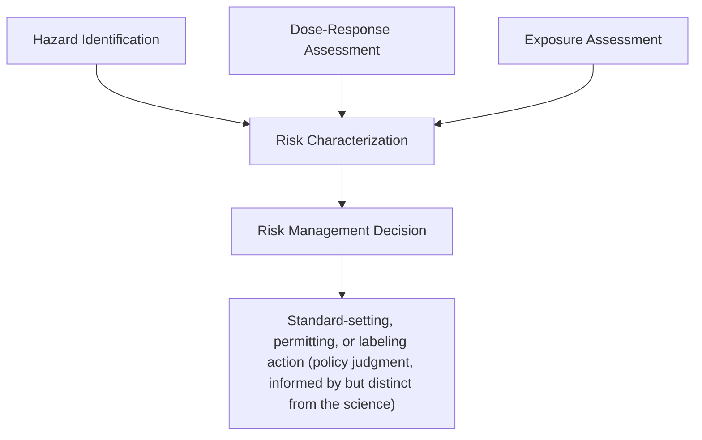

## Risk Assessment Methodology and Dose-Response Modeling

### Overview

Risk assessment is the analytical framework regulatory agencies (EPA, FDA, OSHA, and their state analogues) use to characterize the likelihood and magnitude of adverse health or environmental effects from exposure to a hazard, most commonly chemical substances. Dose-response modeling is the quantitative core of that framework, translating exposure levels into estimated probabilities or magnitudes of harm. This topic sits at the intersection of administrative law and regulatory science: courts reviewing agency risk-based rules must grapple with how much deference to give scientific and methodological choices embedded in a risk assessment, particularly post-*Loper Bright*.

### The Four-Step Risk Assessment Paradigm

The foundational framework, established by the National Research Council's 1983 "Red Book" (*Risk Assessment in the Federal Government: Managing the Process*), structures risk assessment into four sequential steps:

**Key Points**

1. **Hazard Identification** — Determines whether a substance is capable of causing an adverse effect (e.g., carcinogenicity, developmental toxicity, neurotoxicity) and in what circumstances, based on epidemiological, toxicological, and mechanistic data.
2. **Dose-Response Assessment** — Characterizes the quantitative relationship between the dose (exposure level) of an agent and the incidence or severity of an adverse effect.
3. **Exposure Assessment** — Estimates the magnitude, frequency, duration, and route of exposure for the population(s) of concern.
4. **Risk Characterization** — Integrates the outputs of the prior three steps into an estimate of the probability and severity of harm to the exposed population, along with a description of uncertainty and variability.

This paradigm deliberately separates **risk assessment** (the scientific/technical characterization) from **risk management** (the policy decision about what to do given the assessed risk), though in practice the line is often blurred and contested — a recurring administrative law flashpoint.

### Mermaid Diagram: Four-Step Risk Assessment Paradigm

### Dose-Response Modeling: Core Concepts

**Key Points**

- **Dose-response relationship:** the mathematical/statistical relationship fit to experimental (animal bioassay) or epidemiological (human) data describing how the frequency or severity of an effect changes with dose.
- **Point of Departure (POD):** a dose level derived from the dose-response data marking the boundary between the observed/modeled experimental range and the range requiring extrapolation to typical (often much lower) human exposure levels. Common PODs include the **No Observed Adverse Effect Level (NOAEL)**, the **Lowest Observed Adverse Effect Level (LOAEL)**, and the **Benchmark Dose (BMD)**.
- **Benchmark Dose (BMD) approach:** fits a statistical model to the full dose-response dataset and derives the dose associated with a pre-specified change in response (e.g., a 10% extra risk, denoted BMD10), along with a lower confidence bound (BMDL) used as the POD. This has increasingly supplanted the older NOAEL/LOAEL approach because it uses the full dataset rather than only the tested dose levels and provides a quantifiable confidence bound.
- **Extrapolation:** because human exposures of regulatory concern (e.g., background environmental levels) are typically far below the doses tested in animal studies, models must extrapolate from the observed data range down to low-dose human exposure levels — this extrapolation is the single most contested and consequential modeling choice in regulatory toxicology.

### Threshold vs. Non-Threshold Models

**Key Points**

Regulatory dose-response modeling bifurcates sharply based on an assumption about biological mechanism:

**Threshold Approach (typically for non-carcinogenic, non-mutagenic endpoints)**

- Assumes a dose exists below which no adverse effect occurs (a biological threshold), consistent with homeostatic/repair mechanisms.
- Regulatory reference values are derived by dividing the POD (NOAEL, LOAEL, or BMDL) by a series of **uncertainty factors (UFs)** (also called safety factors):
  - Interspecies (animal-to-human) extrapolation, typically 10x
  - Intraspecies (human variability, e.g., sensitive subpopulations) 10x
  - LOAEL-to-NOAEL extrapolation (if LOAEL used as POD), typically 10x
  - Subchronic-to-chronic extrapolation, typically 10x
  - Database deficiency factor, typically 1–10x
- Results in a **Reference Dose (RfD)** (oral) or **Reference Concentration (RfC)** (inhalation) under EPA's Integrated Risk Information System (IRIS) program, representing an estimate of daily exposure to the human population (including sensitive subgroups) that is likely to be without appreciable risk of deleterious effects over a lifetime.

**Non-Threshold (Linear) Approach (typically for genotoxic carcinogens)**

- Assumes that any exposure carries some non-zero probability of effect (no safe threshold), consistent with a mutagenic mode of action in which a single molecular interaction can theoretically initiate the carcinogenic process.
- Low-dose extrapolation typically uses a **linear multistage model** or simple linear extrapolation from the POD (e.g., BMDL10) down to the origin, yielding a **slope factor** (also called a cancer potency factor) expressed as risk per unit dose.
- Risk at a given human exposure level is then calculated as:

$$\text{Risk} = \text{Slope Factor} \times \text{Exposure}$$

- EPA typically targets an "acceptable" excess lifetime cancer risk range of $10^{-6}$ to $10^{-4}$ (one in a million to one in ten thousand) when setting regulatory limits for carcinogens, though the specific acceptable risk level is a risk management (policy) choice, not a scientific finding, and varies by statute and program.

### Formula Reference

Reference Dose derivation (threshold approach):

$$\text{RfD} = \frac{\text{POD}}{\text{UF}_{composite}}$$

where $\text{UF}_{composite}$ is the product of the applicable individual uncertainty factors (e.g., $10 \times 10 \times 10 = 1000$ for a case combining interspecies, intraspecies, and subchronic-to-chronic factors).

Hazard Quotient (used in non-cancer risk characterization):

$$\text{HQ} = \frac{\text{Exposure}}{\text{RfD}}$$

An $HQ > 1$ signals a potential concern warranting further evaluation (not itself proof of harm), while $HQ \leq 1$ is generally interpreted as unlikely to result in appreciable risk. [Inference: the interpretation of HQ as a bright-line "safe/unsafe" threshold oversimplifies its intended use as a screening-level indicator; regulatory practice treats it as one input among several rather than a dispositive determination.]

### Common Dose-Response Statistical Models

| Model | Typical Use | Key Characteristic |
| --- | --- | --- |
| Linear Multistage Model | Carcinogen low-dose extrapolation | Assumes linear low-dose behavior consistent with mutagenic MOA |
| Probit Model | Acute toxicity (e.g., LD50 studies) | Assumes underlying normal distribution of individual tolerances |
| Logistic/Log-logistic Model | Quantal (yes/no) response data | Sigmoidal dose-response curve |
| Weibull Model | Flexible quantal response modeling | Accommodates varying curve shapes |
| Benchmark Dose Software (BMDS) Model Suite | EPA standard toolset for BMD/BMDL derivation | Fits multiple candidate models, applies model-selection criteria (e.g., AIC, goodness-of-fit) |

**Example**

Suppose an animal bioassay yields a BMDL10 of 5 mg/kg-day for a genotoxic carcinogen. Using a linear extrapolation to the point of origin, the slope factor is calculated as:

$$\text{Slope Factor} = \frac{0.10}{5 \text{ mg/kg-day}} = 0.02 \text{ (mg/kg-day)}^{-1}$$

If estimated human exposure is 0.001 mg/kg-day, estimated excess lifetime cancer risk is:

$$\text{Risk} = 0.02 \times 0.001 = 2 \times 10^{-5}$$

This falls within EPA's typical $10^{-6}$ to $10^{-4}$ acceptable risk range, though whether that range is applied, and how, depends on the specific statutory program (e.g., Safe Drinking Water Act maximum contaminant level goals versus CERCLA cleanup levels may apply this range differently).

### Mode of Action (MOA) Analysis

**Key Points**

- Determines the biological pathway by which a substance produces an adverse effect, and is increasingly central to selecting threshold vs. non-threshold modeling approaches.
- EPA's *Guidelines for Carcinogen Risk Assessment* (2005) direct that if sufficient MOA data support a non-linear (threshold) mechanism for a carcinogenic endpoint (e.g., a cytotoxicity-driven regenerative hyperplasia mechanism rather than direct DNA reactivity), a threshold (margin-of-exposure) approach may be used instead of default linear low-dose extrapolation.
- MOA determinations are frequently contested in rulemaking and litigation because the choice between linear and threshold modeling can change risk estimates by orders of magnitude for the same chemical.

### Administrative Law Dimensions: Judicial Review of Risk Assessment Science

**Key Points**

1. **Deference to technical/scientific judgments:** Courts have historically extended substantial deference to agency choices among competing scientific models, statistical methodologies, and default assumptions (e.g., choice of uncertainty factors, choice of low-dose extrapolation model) under the "arbitrary and capricious" standard of APA § 706(2)(A), on the theory that such choices lie "at the frontiers of science" and within agency technical expertise. This is distinct from *Chevron*/*Loper Bright* deference to statutory interpretation — courts continue to defer to technical/scientific agency judgments (subject to arbitrary-and-capricious review) even after *Loper Bright* eliminated deference to legal interpretations, because these are different doctrinal questions (fact/policy judgment versus statutory meaning).
2. **Requirement of reasoned explanation:** Under *Motor Vehicle Mfrs. Ass'n v. State Farm*, 463 U.S. 29 (1983), the agency must articulate a satisfactory explanation for its choice, including a rational connection between the facts found and the choice made; an agency cannot simply assert a conclusion or ignore significant contrary evidence in the record.
3. **Data quality and peer review challenges:** Regulated parties frequently challenge risk assessments on grounds that underlying studies were not adequately peer-reviewed, that model selection was result-oriented, or that the agency failed to consider significant uncertainty or alternative models — raising records-based arbitrary-and-capricious claims rather than pure legal-interpretation claims.
4. **Statutory science-based standards:** Some statutes constrain the agency's risk-management discretion by specifying a scientific standard directly in the statute (e.g., the Clean Air Act's requirement that National Ambient Air Quality Standards be set at a level "requisite to protect the public health" with an "adequate margin of safety," interpreted in *Whitman v. American Trucking Ass'ns*, 531 U.S. 457 (2001), as not permitting cost consideration in that particular standard-setting step).
5. **Information Quality Act (IQA) / Data Quality Act challenges:** Regulated parties sometimes challenge the "quality, objectivity, utility, and integrity" of information disseminated by an agency (including risk assessments) under guidelines issued pursuant to the IQA, though courts have generally held IQA-based corrections requests are not themselves subject to judicial review as final agency action.

### Uncertainty and Variability: Distinguishing Concepts

**Key Points**

- **Uncertainty** refers to lack of knowledge about the true value of a parameter (reducible in principle with more/better data) — e.g., uncertainty about a chemical's true carcinogenic potency in humans.
- **Variability** refers to true heterogeneity across a population or situation (not reducible by more data on the same parameter) — e.g., genuine differences in individual susceptibility, exposure patterns, or body weight across the exposed population.
- Modern risk assessment practice increasingly favors **probabilistic (Monte Carlo) approaches** that characterize a distribution of risk estimates rather than a single point estimate, to better communicate both uncertainty and variability to decision-makers — though point estimates (e.g., "high-end" or "central tendency" exposure scenarios) remain standard in many regulatory contexts due to their administrative tractability.

### SVG Diagram: Threshold vs. Non-Threshold Dose-Response Curves (svg_diagram)

<svg xmlns="http://www.w3.org/2000/svg" viewBox="0 0 720 320">
<text x="360" y="24" text-anchor="middle" font-size="16" font-weight="bold" fill="#1a1a1a">Threshold vs. Non-Threshold Dose-Response Curves (svg_diagram)</text>
<line x1="80" y1="280" x2="680" y2="280" stroke="#333" stroke-width="2" />
<line x1="80" y1="280" x2="80" y2="50" stroke="#333" stroke-width="2" />
<text x="380" y="305" text-anchor="middle" font-size="12" fill="#555">Dose</text>
<text x="40" y="165" text-anchor="middle" font-size="12" fill="#555" transform="rotate(-90 40,165)">Response</text>
<path d="M 80 280 L 250 280 Q 320 270 400 200 Q 500 120 680 80" stroke="#4a90d9" stroke-width="3" fill="none" />
<text x="500" y="100" font-size="11" fill="#4a90d9" font-weight="bold">Threshold model</text>
<line x1="250" y1="280" x2="250" y2="50" stroke="#4a90d9" stroke-width="1" stroke-dasharray="4,3" />
<text x="250" y="45" text-anchor="middle" font-size="10" fill="#4a90d9">NOAEL / threshold</text>
<path d="M 80 280 L 680 90" stroke="#c0392b" stroke-width="3" fill="none" />
<text x="540" y="170" font-size="11" fill="#c0392b" font-weight="bold">Non-threshold (linear) model</text>
<circle cx="80" cy="280" r="4" fill="#333" />
<text x="80" y="298" text-anchor="middle" font-size="10" fill="#333">0</text>
</svg>

### Application Context: Where This Modeling Enters Regulatory Decisions

**Key Points**

- **Clean Air Act:** National Ambient Air Quality Standards (NAAQS) setting; hazardous air pollutant residual risk determinations
- **Safe Drinking Water Act:** Maximum Contaminant Level Goals (non-enforceable health-based goals set using RfD/slope factor methodology) informing enforceable Maximum Contaminant Levels
- **CERCLA/Superfund:** Baseline risk assessments determining whether and to what extent a contaminated site requires remediation, and setting cleanup levels
- **RCRA:** Corrective action risk assessments for hazardous waste facility contamination
- **TSCA:** Risk evaluations for existing chemicals under amended TSCA (2016 Lautenberg Act amendments), including EPA's determination of "unreasonable risk"
- **FIFRA:** Pesticide registration risk-benefit balancing incorporating dietary and occupational dose-response assessment

### Conclusion

Dose-response modeling operationalizes the scientific judgment at the core of health-protective regulation, translating laboratory and epidemiological data into quantitative benchmarks — reference doses, slope factors, and benchmark doses — that drive concrete regulatory numbers. The choice between threshold and non-threshold extrapolation models, and the selection of uncertainty factors, are simultaneously scientific and policy-laden decisions, which is precisely why they generate persistent administrative law disputes. Courts have generally preserved deference to agencies on these technical modeling choices even as *Loper Bright* eliminated deference to legal/statutory interpretations, producing a bifurcated post-*Loper Bright* landscape: independent judicial interpretation of what a statute requires agencies to do, paired with continued (though not unlimited) deference to how agencies technically execute the science once the legal question is settled.

**Related Topics**

- EPA Integrated Risk Information System (IRIS) assessment process
- Benchmark Dose Software (BMDS) methodology and model selection criteria
- *Motor Vehicle Mfrs. Ass'n v. State Farm* arbitrary-and-capricious review standard
- Cost-benefit analysis and Executive Order 12866/14094 regulatory review
- TSCA risk evaluation framework post-2016 Lautenberg amendments
- Cumulative and aggregate exposure assessment methodology
- Environmental justice and disproportionate exposure/susceptibility analysis
- Peer review requirements under the Information Quality Act and OMB Peer Review Bulletin