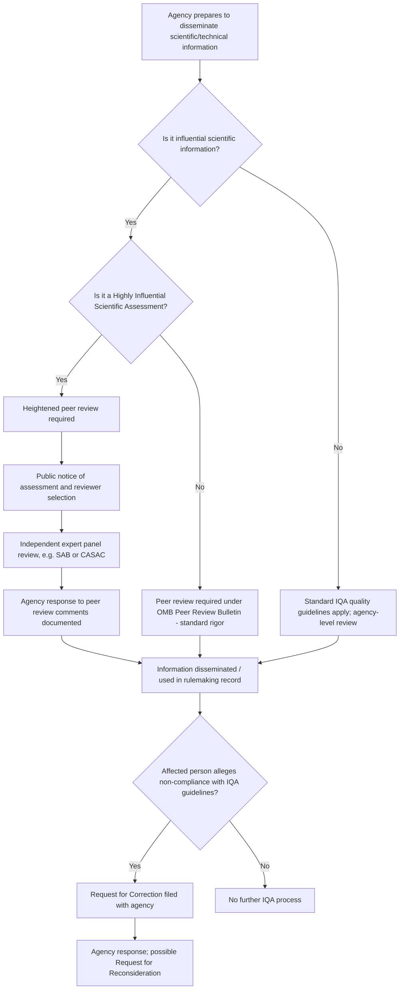

## Peer Review and the Information Quality Act

### Overview

The Information Quality Act (IQA), also known as the Data Quality Act, is a brief statutory rider that has generated an outsized body of administrative practice governing the quality, objectivity, and transparency of information — including scientific and risk-related information — disseminated by federal agencies. Peer review is the principal mechanism agencies use to satisfy IQA-driven quality obligations for influential scientific information, and it functions as a quasi-procedural safeguard operating alongside, but distinct from, notice-and-comment rulemaking. This topic is central to administrative law's treatment of regulatory science because it determines the pre-decisional quality controls applied to the technical inputs (e.g., risk assessments, dose-response models) that later inform binding regulatory action.

### Statutory Origin and Structure

**Key Points**

- The IQA was enacted as Section 515 of the Treasury and General Government Appropriations Act for Fiscal Year 2001, Pub. L. No. 106-554, § 515, 114 Stat. 2763, 2763A-153–154 (2000) — a rider, not a freestanding statute, codified as a note to 44 U.S.C. § 3516.
- It directs the Office of Management and Budget (OMB) to issue government-wide guidelines "ensuring and maximizing the quality, objectivity, utility, and integrity of information (including statistical information) disseminated by Federal agencies."
- It directs each covered agency to (1) issue its own implementing guidelines consistent with OMB's, and (2) establish **administrative mechanisms allowing affected persons to seek and obtain correction** of information maintained and disseminated by the agency that does not comply with OMB's guidelines.
- The IQA does not itself create new substantive standards; it is fundamentally a **procedural/administrative quality-control statute** layered on top of existing information dissemination practices.

### OMB Guidelines: The Four Core Quality Elements

**Key Points**

OMB's government-wide guidelines (67 Fed. Reg. 8452, Feb. 22, 2002) define the operative quality standards agencies must apply:

1. **Quality** — an encompassing term comprising utility, objectivity, and integrity
2. **Utility** — the usefulness of the information to its intended users
3. **Objectivity** — involves both substance (accurate, reliable, unbiased presentation) and presentation (clear, complete, and unbiased manner); for scientific/statistical information, objectivity requires transparency about data and methods to facilitate reproducibility, and use of reliable data sources and sound statistical/research methods
4. **Integrity** — protection of information from unauthorized access or revision, ensuring it is not compromised through corruption or falsification

**Heightened standard for "influential" information:** OMB's guidelines impose an elevated reproducibility standard for information the agency determines to have a clear and substantial impact on important public policy or private sector decisions ("influential" scientific, financial, or statistical information), generally requiring that the analytic results be sufficiently transparent to be reproduced (capable of being substantially reproduced, subject to an acceptable degree of imprecision).

### Peer Review as the Principal IQA Compliance Mechanism

**Key Points**

- OMB's separate **Peer Review Bulletin** (Final Information Quality Bulletin for Peer Review, 70 Fed. Reg. 2664, Jan. 14, 2005) elaborates specifically on peer review as the primary mechanism for satisfying IQA objectivity requirements for "influential scientific information" and, at a heightened level, for "highly influential scientific assessments."
- **Influential scientific information:** scientific information the agency reasonably determines will have a clear and substantial impact on important public policy or private sector decisions.
- **Highly influential scientific assessment (HISA):** a subset of influential scientific information where the agency determines that the dissemination could have a potential impact of more than $500 million in any year, or that the assessment is novel, controversial, or precedent-setting, or has significant interagency interest — triggering the most rigorous peer review requirements (e.g., public comment on the peer reviewer selection, transparency of reviewer identities in some circumstances, and formal response-to-comments documentation).
- **Peer review types along a spectrum of rigor:**
  - Ad hoc individual reviewer comments
  - Letter review
  - Panel review (convened panel discussion)
  - Formal advisory committee peer review (e.g., through a Federal Advisory Committee Act (FACA)-chartered body such as EPA's Science Advisory Board (SAB) or Clean Air Scientific Advisory Committee (CASAC))

### Mermaid Diagram: IQA Compliance and Peer Review Pathway

### The Correction Request Mechanism

**Key Points**

- Any affected person may submit a **Request for Correction (RFC)** to an agency alleging that disseminated information fails to meet the agency's IQA guidelines.
- If dissatisfied with the agency's response, the requester may submit a **Request for Reconsideration (RFR)**, typically reviewed by someone other than the original decision-maker within the agency.
- Agencies (e.g., EPA) maintain public logs of IQA correction requests and their dispositions as a transparency mechanism.
- **No private right of action:** the IQA does not expressly create a cause of action, and courts have consistently held there is no implied private right of action to sue an agency directly for an IQA violation.

### Judicial Review Status: Is IQA Compliance Reviewable?

**Key Points**

This is the single most significant administrative law feature of IQA practice:

- Courts have overwhelmingly held that an agency's denial of a Request for Correction is **not final agency action** subject to judicial review under APA § 704, because the correction mechanism does not itself determine rights or obligations, or because the underlying guidelines are themselves non-binding policy statements not having the force of law.
- Leading case: **Salt Institute v. Leavitt**, 440 F.3d 156 (4th Cir. 2006) — held the IQA and OMB's guidelines create no legal rights enforceable through judicial review; the IQA imposes no judicially enforceable obligation on agencies.
- **In re Operation of the Missouri River System Litigation**, 516 F.3d 688 (8th Cir. 2008), and other circuit decisions have reached similar conclusions.
- **Practical consequence:** the IQA functions largely as an internal, self-policing administrative quality-control regime rather than a judicially enforceable procedural right, in sharp contrast to notice-and-comment requirements under APA § 553, which are judicially enforceable. [Inference: characterizing IQA as "self-policing" reflects the consistent case-law trend across circuits; a definitive nationwide rule has not been established by the Supreme Court, so a circuit split or future doctrinal shift cannot be entirely ruled out.]
- However, IQA-compliant peer review documentation frequently becomes relevant **indirectly** in litigation — e.g., as part of the administrative record supporting or undermining an agency's ultimate rule under ordinary arbitrary-and-capricious review of that rule (not of the IQA process itself). A rule's underlying risk assessment being inadequately peer-reviewed can be cited as evidence the agency failed to engage in reasoned decision-making under *State Farm*, even though the IQA claim itself is not independently reviewable.

### IQA Peer Review in Environmental Agency Practice

**Key Points**

- **EPA Science Advisory Board (SAB):** FACA-chartered independent panel providing peer review on major EPA scientific and technical products, including IRIS assessments, NAAQS criteria documents, and major risk assessments.
- **Clean Air Scientific Advisory Committee (CASAC):** statutorily mandated under the Clean Air Act (42 U.S.C. § 7409(d)(2)) to review NAAQS criteria documents and recommend revisions — a peer review function that predates and operates alongside general IQA peer review guidelines, illustrating that some peer review obligations are independently statutorily required regardless of the IQA.
- **IRIS assessments:** EPA's Integrated Risk Information System toxicological assessments (reference doses, slope factors) are treated as influential scientific information and, in many cases, highly influential scientific assessments, triggering external peer review, often through the National Academies of Sciences, Engineering, and Medicine (NASEM) for particularly high-profile or contested chemicals.
- **Controversy history:** IRIS assessment peer review procedures have been the subject of repeated criticism and reform efforts (including a 2011 NASEM review of IRIS process recommending stronger, more consistent systematic review methodology), reflecting recurring tension between scientific rigor, transparency, and the pace needed to support timely regulation. [Unverified: specific procedural details of EPA's current IRIS peer review protocol should be verified against EPA's current program documentation, as this process has been revised multiple times.]

### Distinguishing IQA Peer Review from Notice-and-Comment Rulemaking

| Feature | IQA Peer Review | APA Notice-and-Comment Rulemaking |
| --- | --- | --- |
| Legal source | OMB guidelines under IQA rider (non-codified statute) | APA § 553 |
| Judicial enforceability | Generally not judicially reviewable as independent claim | Judicially enforceable procedural requirement |
| Trigger | Dissemination of influential/highly influential scientific information | Proposal of a legislative rule |
| Participants | Expert peer reviewers (often scientists), sometimes public comment on reviewer selection | General public |
| Outcome | Peer review report; agency response to comments | Final rule with response to significant comments |
| Primary purpose | Scientific/technical quality assurance | Democratic participation and reasoned rulemaking |

### Interaction with Other Administrative Law Doctrines

**Key Points**

1. **Reasoned decision-making (*State Farm*):** Although IQA claims are not independently reviewable, failure to conduct adequate peer review of a scientific basis for a rule can be woven into a broader arbitrary-and-capricious challenge to the rule itself, since *State Farm* requires the agency to have considered relevant data and articulated a rational connection between the evidence and its conclusions.
2. **Post-*Loper Bright* significance:** Because courts now independently interpret statutory triggers for agency action rather than deferring to agency legal conclusions, the underlying peer-reviewed scientific record supporting an agency's factual/technical premises becomes comparatively more important in litigation — a robust, well-peer-reviewed record strengthens the agency's position under arbitrary-and-capricious review even though the legal interpretation itself receives no deference.
3. **FACA overlay:** When peer review is conducted through a chartered advisory committee (e.g., SAB, CASAC, NASEM committees when convened under a federal contract triggering FACA), the Federal Advisory Committee Act imposes independent procedural requirements (balanced membership, open meetings, public records) layered on top of IQA peer review obligations.
4. **Distinction from Congressional Review Act and OIRA review:** IQA peer review of underlying science is analytically distinct from, but often temporally precedes, OMB/OIRA's separate cost-benefit and significance review of the resulting rule under Executive Order 12866 (as amended by E.O. 14094) — the two are sequential quality-control layers, not substitutes for one another.

### SVG Diagram: Layers of Scientific and Procedural Review Before Final Rule (svg_diagram)

<svg xmlns="http://www.w3.org/2000/svg" viewBox="0 0 740 260">
<text x="370" y="24" text-anchor="middle" font-size="16" font-weight="bold" fill="#1a1a1a">Layers of Review Before a Science-Based Rule (svg_diagram)</text>
<rect x="30" y="60" width="150" height="60" rx="8" fill="#4a90d9" />
<text x="105" y="85" text-anchor="middle" font-size="11" fill="#fff" font-weight="bold">Risk Assessment</text>
<text x="105" y="102" text-anchor="middle" font-size="10" fill="#fff">Scientific draft</text>
<rect x="220" y="60" width="150" height="60" rx="8" fill="#e0a030" />
<text x="295" y="85" text-anchor="middle" font-size="11" fill="#fff" font-weight="bold">IQA Peer Review</text>
<text x="295" y="102" text-anchor="middle" font-size="10" fill="#fff">SAB / CASAC / NASEM</text>
<rect x="410" y="60" width="150" height="60" rx="8" fill="#27ae60" />
<text x="485" y="85" text-anchor="middle" font-size="11" fill="#fff" font-weight="bold">Proposed Rule</text>
<text x="485" y="102" text-anchor="middle" font-size="10" fill="#fff">Notice-and-comment</text>
<rect x="600" y="60" width="120" height="60" rx="8" fill="#c0392b" />
<text x="660" y="85" text-anchor="middle" font-size="11" fill="#fff" font-weight="bold">Final Rule</text>
<text x="660" y="102" text-anchor="middle" font-size="10" fill="#fff">Judicial review</text>
<line x1="180" y1="90" x2="220" y2="90" stroke="#333" stroke-width="2" marker-end="url(#arrow)" />
<line x1="370" y1="90" x2="410" y2="90" stroke="#333" stroke-width="2" />
<line x1="560" y1="90" x2="600" y2="90" stroke="#333" stroke-width="2" />

<text x="105" y="160" text-anchor="middle" font-size="10" fill="#555">Not independently</text>

<text x="105" y="174" text-anchor="middle" font-size="10" fill="#555">reviewable</text>

<text x="295" y="160" text-anchor="middle" font-size="10" fill="#555">Not independently</text>

<text x="295" y="174" text-anchor="middle" font-size="10" fill="#555">reviewable</text>

<text x="485" y="160" text-anchor="middle" font-size="10" fill="#555">Judicially enforceable</text>

<text x="485" y="174" text-anchor="middle" font-size="10" fill="#555">procedural right</text>

<text x="660" y="160" text-anchor="middle" font-size="10" fill="#555">Arbitrary-and-capricious</text>

<text x="660" y="174" text-anchor="middle" font-size="10" fill="#555">review of full record</text>

</svg>

### Illustrative Example

A chemical manufacturer disagrees with the slope factor EPA's IRIS program assigns to its compound, arguing the underlying epidemiological study was inadequately peer-reviewed and the dose-response model selection was not adequately justified. The manufacturer files a Request for Correction under EPA's IQA guidelines; EPA denies it. The manufacturer cannot directly sue over the IQA denial (per *Salt Institute v. Leavitt*), but if EPA later uses that same IRIS slope factor as the scientific basis for a NAAQS revision or an effluent limitation guideline, the manufacturer can challenge the *resulting rule* under APA § 706(2)(A), arguing that inadequate peer review contributed to an irrational or unsupported technical basis for the rule — folding the IQA/peer-review critique into an ordinary *State Farm* arbitrary-and-capricious claim against final agency action.

### Conclusion

The Information Quality Act and its implementing peer review guidelines constitute a distinctive form of "soft" administrative law: they impose real, detailed procedural expectations on agencies regarding the scientific rigor and transparency of influential information, but courts have consistently declined to treat IQA compliance as independently judicially enforceable. This makes IQA peer review functionally different from notice-and-comment rulemaking — it operates as an internal quality-assurance regime whose value to affected parties lies less in direct litigation leverage and more in shaping the administrative record that later becomes the target of ordinary arbitrary-and-capricious review of the agency's substantive regulatory action. Understanding this bifurcation — enforceable procedural rights (APA rulemaking) versus non-enforceable quality-control norms (IQA) — is essential to correctly advising clients on where litigation leverage actually exists in challenges to science-based environmental regulation.

**Related Topics**

- EPA Integrated Risk Information System (IRIS) assessment process
- Federal Advisory Committee Act (FACA) requirements for scientific advisory panels
- *Motor Vehicle Mfrs. Ass'n v. State Farm* and arbitrary-and-capricious review
- OMB/OIRA regulatory review under Executive Order 12866 and 14094
- Clean Air Scientific Advisory Committee (CASAC) statutory peer review mandate
- Congressional Review Act procedures for disapproving final rules
- Administrative record development and supplementation in APA litigation
- Dose-response modeling and benchmark dose methodology