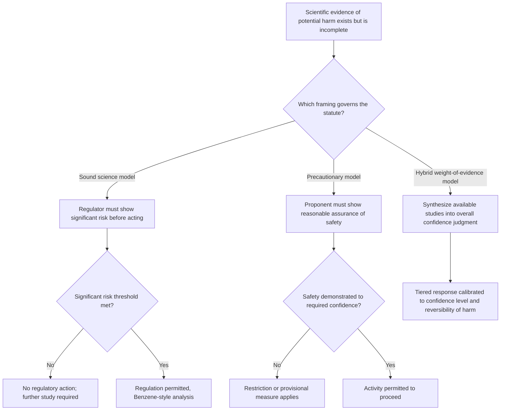

## Precautionary Versus Sound Science Framings in Rulemaking

### Conceptual Definitions

Two competing regulatory philosophies govern how agencies act under scientific uncertainty, and the choice between them frequently determines the outcome of a rulemaking independent of the underlying data:

- **The precautionary principle** holds that the absence of full scientific certainty should not be used as a reason to postpone measures to prevent harm, particularly where the potential harm is serious or irreversible. In its strongest form, it shifts the burden of proof onto the proponent of an activity or substance to demonstrate safety before the activity proceeds, rather than requiring the regulator to affirmatively prove harm.
- **The sound science standard** holds that regulation should be grounded in demonstrated, peer-reviewable evidence of risk, generally requiring the regulator to establish a threshold showing of harm — often a quantified or at least articulable "significant risk" — before restricting an activity. It treats scientific uncertainty as a reason for caution about *regulating*, not a reason to *presume* danger.

**[Inference]** Neither framing is a fixed legal doctrine so much as an interpretive lens that courts and agencies apply differently depending on statutory text, and most real-world regulatory systems blend elements of both rather than adopting either in pure form.

### Origins and International Comparison

The precautionary principle has its clearest legal pedigree outside U.S. domestic law:

- **Rio Declaration Principle 15** (1992) — "Where there are threats of serious or irreversible damage, lack of full scientific certainty shall not be used as a reason for postponing cost-effective measures to prevent environmental degradation."
- **German *Vorsorgeprinzip*** ("foresight principle") — an earlier domestic articulation that influenced EU environmental law generally.
- **EU Treaty on the Functioning of the European Union, Article 191(2)** — codifies precaution as a foundational principle of EU environmental policy, informing EU approaches to chemicals regulation (REACH), genetically modified organisms, and endocrine disruptors.
- **Wingspread Statement on the Precautionary Principle** (1998) — an influential non-governmental articulation used by U.S. environmental advocates to argue for importing the principle more explicitly into domestic law.

By contrast, the "sound science" framing is more closely associated with U.S. regulatory tradition and is often explicitly invoked by regulated industry and some administrations as a counterweight to precaution-based rulemaking. Its institutional anchors include:

- The **Information Quality Act (Data Quality Act)** of 2001, which directs OMB to issue guidelines ensuring the "quality, objectivity, utility, and integrity" of information disseminated by federal agencies, and creates an administrative mechanism for regulated parties to challenge agency scientific determinations.
- Agency peer-review policies and OMB's Peer Review Bulletin, requiring independent scientific review of influential or highly influential scientific assessments before they may support a rule.
- Scientific integrity policies developed within OSTP and individual agencies, aimed at insulating agency science from political interference in either direction.

### International Trade Law Contrast: The EC–Hormones Dispute

The clearest institutional collision between these two framings occurred in international trade law. The **WTO Agreement on the Application of Sanitary and Phytosanitary Measures (SPS Agreement)** requires that SPS measures be "based on" a risk assessment and permits only *provisional* precautionary measures under Article 5.7 where relevant scientific evidence is genuinely insufficient — a comparatively narrow, sound-science-oriented standard. In **EC – Measures Concerning Meat and Meat Products (Hormones)** (WTO Appellate Body, 1998), the Appellate Body found the European Communities' ban on hormone-treated beef inconsistent with SPS obligations because the EU had not conducted a risk assessment specifically evaluating the risks it claimed to address, even though the EU defended the ban as an application of the precautionary principle. The decision illustrates that a body committed to (or invoking) precaution domestically can still be constrained by an international sound-science-based evidentiary requirement when its measures affect trade.

### U.S. Statutory Embodiments

U.S. environmental and public health law does not adopt either framing uniformly; individual statutes lean toward one or the other depending on the era and political context of their drafting:

**Precautionary-leaning provisions:**

- The **Delaney Clause** (former Federal Food, Drug, and Cosmetic Act provision) prohibited any food additive found to induce cancer in humans or animals at *any* dose — a zero-risk, burden-shifted standard later replaced by a "reasonable certainty of no harm" standard under the Food Quality Protection Act of 1996.
- The **Endangered Species Act**'s directive to give species "the benefit of the doubt" in listing and critical-habitat decisions, informed by the "best scientific and commercially available data" standard, which courts have read as tolerant of some uncertainty where the consequence of inaction (extinction) is irreversible.
- The **Toxic Substances Control Act**, as amended in 2016, requires EPA to evaluate chemicals against an "unreasonable risk" standard without considering cost at the hazard-identification stage, and to act on "the best available science" even where some uncertainty in dose-response data persists.

**Sound-science-leaning provisions:**

- The Information Quality Act mechanism described above, applicable across all agencies.
- The Occupational Safety and Health Act's implicit "significant risk" threshold, discussed below.

### Landmark Case Law

- ***Industrial Union Department, AFL-CIO v. American Petroleum Institute*** (the "Benzene case," 1980) — a plurality of the Supreme Court held that OSHA could not set a permissible exposure limit for a carcinogen without first making a threshold finding that the substance posed a "significant risk" of material health impairment at current exposure levels. This decision is widely read as a judicial check on precautionary overreach: OSHA could not regulate to the point of eliminating "any" risk, however small, without some articulable evidentiary showing that the risk was more than trivial.
- ***Ethyl Corp. v. EPA*** (D.C. Cir. 1976, en banc) — upheld EPA's authority under the Clean Air Act to regulate leaded gasoline based on a "reasonable extrapolation from existing data," even acknowledging that the underlying science on lead's health effects at the time contained genuine uncertainty. The court explicitly endorsed regulatory action prior to scientific certainty as consistent with an endangerment-based statutory standard — an early and influential embrace of precautionary logic within a nominally sound-science-oriented legal system.
- ***Reserve Mining Co. v. EPA*** (8th Cir. 1975) — addressed asbestos-like taconite tailings discharged into Lake Superior's drinking water supply under conditions of substantial scientific uncertainty about carcinogenicity at the exposure levels involved, and upheld relief based on a "reasonable medical concern" rather than demonstrated causation, an oft-cited early domestic articulation of precautionary reasoning in environmental law.
- ***Massachusetts v. EPA*** (2007) — held that EPA could not decline to determine whether greenhouse gases endanger public health and welfare under the Clean Air Act merely by invoking policy considerations or residual scientific uncertainty about attribution; once EPA undertakes the endangerment inquiry, it must ground its answer in the scientific record rather than in discretionary policy preference — reinforcing that scientific uncertainty is not, by itself, a lawful basis to *avoid* an evidence-based determination either way.

**Key Points**

- *Benzene* constrains precaution by requiring a threshold "significant risk" showing before OSHA-style regulation.
- *Ethyl Corp.* and *Reserve Mining* permit regulatory action on reasonable extrapolation from incomplete data under health/environmental endangerment standards.
- *Massachusetts v. EPA* forecloses using scientific uncertainty as a discretionary escape hatch once a statute requires an evidence-based endangerment finding.
- No single U.S. doctrine consistently mandates either framing; the operative test is always the specific statutory language authorizing the agency's action.

### The Burden-of-Proof and Error-Type Structure

The practical difference between the two framings can be reduced to two structural questions: **who bears the burden of proof**, and **which type of error the system is designed to minimize**.

- Under a **sound-science / burden-on-regulator** model, a **Type I error** (falsely restricting a safe activity — a "false positive" for harm) is treated as the more costly mistake to avoid, so the evidentiary bar for regulatory action is set relatively high.
- Under a **precautionary / burden-on-proponent** model, a **Type II error** (falsely permitting a harmful activity — a "false negative" for harm) is treated as the more costly mistake, particularly where the potential harm is irreversible (species extinction, persistent bioaccumulative toxins, catastrophic climate tipping points), so the evidentiary bar for continued permission is set relatively high instead.

$$\text{Expected regulatory cost} = P(\text{Type I}) \cdot C_{\text{restriction}} + P(\text{Type II}) \cdot C_{\text{harm}}$$

Where a framing implicitly weights $C_{\text{harm}}$ heavily for irreversible outcomes (species loss, catastrophic contamination) relative to $C_{\text{restriction}}$ (forgone economic activity), a precautionary posture becomes the analytically favored choice even without changing the underlying probability estimates — which is precisely why critics on each side often argue past one another: the dispute is frequently about the relative *weighting* of consequences, not the underlying facts.

### Principal Criticisms of Each Framing

**Criticisms of the precautionary principle:**

- Indeterminacy — critics argue the principle provides no operational stopping rule for how much caution is "enough," making it manipulable to justify almost any restriction.
- "Precautionary paralysis" — a concern that strict application could block beneficial innovation (new pharmaceuticals, agricultural biotechnology, low-carbon technologies) whose risks are unknown but whose benefits are foregone entirely by inaction.
- Cost-blindness — in its strongest form, the principle does not weigh the opportunity cost of forgone activity against the harm avoided, in tension with the cost-benefit framework governing much of U.S. domestic rulemaking.
- Asymmetric attention — critics note that a precautionary regime rarely applies precaution symmetrically to the risks of *not* adopting a new, potentially safer technology (e.g., delaying a safer pesticide substitute out of precaution toward the new substance while the more harmful legacy substance remains in use).

**Criticisms of the sound-science standard:**

- **Manufactured uncertainty** — a substantial historical and academic literature (most prominently documented in the tobacco-industry science-strategy record) documents how a demand for "sound science" and unequivocal proof has been strategically used by regulated industries to fund research designed to prolong scientific uncertainty rather than resolve it, delaying regulation.
- **Latency and irreversibility mismatch** — many environmental harms (carcinogenesis, endocrine disruption, ecological tipping points) manifest only after long latency periods; a strict burden-on-regulator standard can mean substantial harm accrues before sufficient "sound science" evidence accumulates to meet the threshold.
- **Burden allocation critique** — placing the full evidentiary burden on the regulator (rather than the party introducing a novel substance or activity) is argued by precaution proponents to reward information asymmetry, since the regulated party typically has superior access to safety data.
- **Publication and funding asymmetries** — industry-funded studies are, on some empirical accounts, more likely to report favorable safety findings than independently funded studies on the same substances, raising concerns about whether "sound science" inputs to a rulemaking record are representative of the full evidentiary landscape.

### Hybrid and Middle-Ground Approaches

Because neither pure framing has proven fully workable, most contemporary regulatory design borrows elements of both:

- **Weight-of-evidence approaches** — synthesizing multiple imperfect study types (epidemiological, toxicological, mechanistic) into an overall confidence judgment rather than requiring any single study to meet a rigid certainty threshold.
- **Tiered testing regimes** — as used in TSCA chemical review, requiring progressively more rigorous testing as initial screening data raise concern, allocating precautionary caution to the *pace* of data-gathering rather than to the ultimate regulatory outcome.
- **Adaptive management** — regulating provisionally under an initial precautionary standard, paired with mandatory monitoring and pre-set triggers for revisiting the standard as better data accumulate, common in fisheries and endangered-species management.
- **"Science-based precaution"** — a term of art in some EU and international policy discourse, attempting to require that even precautionary measures rest on *some* articulable scientific basis for concern (not zero evidence), narrowing the gap between the two philosophies without fully collapsing it — reflected in the SPS Agreement's Article 5.7 provisional-measures compromise discussed above.

### Illustration — Decision Logic Comparison

### Illustration — Burden of Proof and Error-Weighting Spectrum (svg_diagram)

<svg xmlns="http://www.w3.org/2000/svg" viewBox="0 0 900 220" font-family="Helvetica, Arial, sans-serif">
<text x="450" y="22" text-anchor="middle" font-size="16" font-weight="bold" fill="#1a1a1a">Burden of Proof Spectrum (svg_diagram)</text>
<rect x="60" y="70" width="780" height="40" fill="url(#grad1)" stroke="#4b5563" />
<text x="90" y="95" font-size="12" fill="#1a1a1a">Sound Science</text>
<text x="740" y="95" font-size="12" fill="#1a1a1a" text-anchor="end">Precautionary</text>
<line x1="150" y1="130" x2="150" y2="70" stroke="#1e40af" stroke-width="2" />
<text x="150" y="150" font-size="11" text-anchor="middle">Benzene case</text>
<text x="150" y="163" font-size="11" text-anchor="middle">(significant risk)</text>
<line x1="420" y1="130" x2="420" y2="70" stroke="#6b7280" stroke-width="2" />
<text x="420" y="150" font-size="11" text-anchor="middle">TSCA tiered</text>
<text x="420" y="163" font-size="11" text-anchor="middle">testing (hybrid)</text>
<line x1="700" y1="130" x2="700" y2="70" stroke="#9d174d" stroke-width="2" />
<text x="700" y="150" font-size="11" text-anchor="middle">EU REACH /</text>
<text x="700" y="163" font-size="11" text-anchor="middle">EC-Hormones dispute</text>
<text x="90" y="190" font-size="11" fill="#1a1a1a">Minimizes Type I error</text>
<text x="740" y="190" font-size="11" fill="#1a1a1a" text-anchor="end">Minimizes Type II error</text>
</svg>

### Example

A hypothetical new industrial chemical shows suggestive but non-definitive evidence of endocrine disruption at environmentally relevant concentrations. Under a sound-science/*Benzene*-style approach, the chemical remains on the market until a regulator affirmatively demonstrates a significant risk — potentially years of continued exposure while confirmatory studies accumulate. Under an EU-style precautionary approach informed by TFEU Article 191(2), the manufacturer would bear the burden of demonstrating safety before continued market access, and the suggestive evidence alone could justify provisional restriction pending further data — the same underlying study, read through two different legal defaults, produces opposite regulatory outcomes.

**Related Topics**

- The Endangered Species Act's "best scientific and commercially available data" standard and species-listing litigation
- EU REACH regulation and its precautionary registration/authorization structure
- The Information Quality Act and administrative science-challenge petitions
- WTO SPS Agreement Article 5.7 provisional measures and subsequent trade disputes
- Endocrine disruptor screening programs and tiered toxicological testing design
- Scientific integrity policy and the politicization of agency risk assessments
- Adaptive management frameworks in fisheries and wildlife regulation