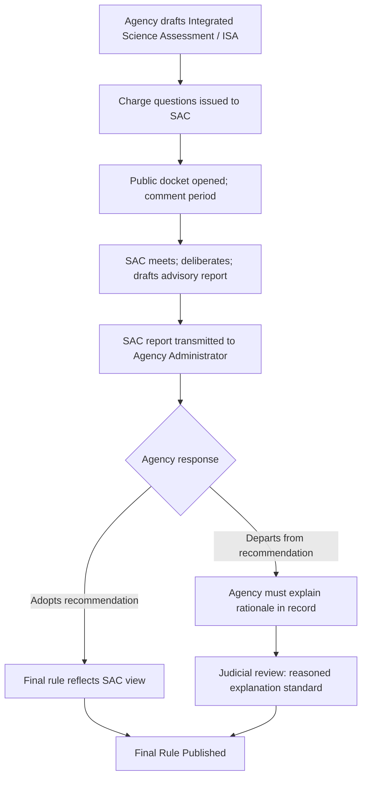

## The Role and Limits of Scientific Advisory Committees

### Overview

Scientific advisory committees (SACs) are formal bodies of external experts convened by regulatory agencies to provide scientific input into administrative decision-making. They occupy a structurally ambiguous position in administrative law: they are not decision-makers, yet their recommendations carry substantial de facto weight; they are meant to supply "pure" science, yet the framing of their charge questions is itself a policy choice; and they are procedurally regulated (in the U.S., primarily through the Federal Advisory Committee Act), yet courts generally treat their output as advisory rather than binding.

This topic sits at the intersection of administrative law doctrine (deference, arbitrary-and-capricious review, procedural requirements) and the science-policy literature on the "trans-science" problem — questions that are scientific in form but cannot be answered by science alone.

### Legal and Institutional Basis

**United States**

- **Federal Advisory Committee Act (FACA), 5 U.S.C. App. 2 (1972)**: Governs the creation, operation, and transparency of federal advisory committees, including most SACs. Requires:
  - Balanced membership representing relevant points of view
  - Open meetings (with exceptions for trade secrets, personnel matters, etc.)
  - Publicly available minutes and reports
  - A charter filed with GSA, renewable periodically
  - Agency (not committee) retains final decisional authority
- **Agency-specific statutes** frequently mandate or authorize SACs:
  - Clean Air Act §109(d)(2): requires EPA to maintain a **Clean Air Scientific Advisory Committee (CASAC)** to review National Ambient Air Quality Standards (NAAQS) criteria documents and standards
  - Safe Drinking Water Act: Science Advisory Board (SAB) review processes
  - FDCA and FDA regulations: numerous product-specific advisory committees (e.g., Vaccines and Related Biological Products Advisory Committee)
  - TSCA: Science Advisory Committee on Chemicals (SACC)

**Comparative context**

- EU: European Food Safety Authority (EFSA) panels, European Chemicals Agency (ECHA) committees (RAC, SEAC) operate under a formal "risk assessment/risk management" separation embedded in EU regulations (e.g., Regulation (EC) No 178/2002, General Food Law)
- International: IPCC assessment reports function as a quasi-advisory scientific body for climate policy, with formalized government review of the Summary for Policymakers — illustrating the science/policy blending problem at a global scale

### Function Within the Regulatory Process

**Key Points**

- SACs typically enter the process **after** an agency has drafted a proposed rule, standard, or risk assessment, and **before** finalization — creating a formal peer-review checkpoint within notice-and-comment rulemaking or licensing.
- Their formal output is usually a **written report or letter** responding to specific "charge questions" posed by the agency — not an independent evaluation of the full policy space.
- Agencies are generally **not legally bound** to adopt SAC recommendations, but must create an administrative record showing they considered them; unexplained departure from clear scientific consensus can be a hook for arbitrary-and-capricious challenge.

Typical procedural sequence (illustrated for a CASAC-style NAAQS review):

### The "Trans-Science" Problem

Coined by physicist Alvin Weinberg (1972), **trans-science** describes questions that are posed in the language of science but cannot, given practical or theoretical limits, be resolved by scientific methods alone.

Examples directly relevant to environmental/administrative regulation:

- **Low-dose extrapolation**: Whether a chemical exhibits a safe threshold below which no adverse effect occurs, when epidemiological studies cannot practically detect effects at very low exposure levels (statistical power limits).
- **Cross-species extrapolation**: Inferring human carcinogenicity from high-dose rodent bioassays.
- **Cumulative/synergistic effects**: Assessing combined exposure to multiple pollutants absent combinatorial testing data.
- **Long-latency causation**: Establishing causal attribution decades after exposure (e.g., asbestos, PFAS).

Because SACs are asked to answer trans-scientific questions, their reports inevitably embed **implicit policy judgments** (e.g., choice of default assumptions, weight-of-evidence frameworks, uncertainty factors) even while framed as "pure science." This is the central critique in the regulatory science literature (Jasanoff's *The Fifth Branch*, 1990, remains the foundational text).

### Structural Limits of Scientific Advisory Committees

**Key Points**

1. **Boundary-work and the science/policy line**

   SACs are institutionally expected to stay within a "risk assessment" lane and leave "risk management" (cost, feasibility, distributional equity) to the agency. In practice this line is porous — the selection of a default assumption (e.g., linear no-threshold vs. threshold dose-response) is simultaneously a scientific and a normative choice. Sheila Jasanoff's concept of **boundary work** describes how committees and agencies actively negotiate this line to preserve the appearance of scientific objectivity.
2. **Selection and composition effects**
   - FACA's "balance" requirement is difficult to operationalize; agencies retain discretion over appointments, which can shift a committee's center of gravity.
   - Industry-affiliated or academically prestigious experts may dominate deliberation asymmetrically.
   - [Inference] Empirical political-science literature (e.g., studies of FDA and EPA advisory panels) suggests appointment patterns can correlate with administration priorities, though causal attribution of outcome shifts to composition changes alone is contested and case-specific.
3. **Charge question framing**

   The agency, not the committee, drafts the charge questions. A narrowly or leadingly framed question can constrain the range of scientific input received, effectively pre-structuring the answer space before deliberation begins.
4. **Non-binding status and agency override**
   - Legally, the agency retains ultimate authority (this is a deliberate structural design under the non-delegation doctrine — agencies, as accountable political actors, cannot outsource final judgment to an unaccountable expert body).
   - This creates the recurring political controversy: agencies overriding an SAC's technical recommendation for policy reasons, or reconstituting a committee's membership to obtain a different recommendation. Notable historical flashpoints include disputes over CASAC's role in the ozone and particulate matter NAAQS reviews, and reconstitution controversies at EPA's SAB.
5. **Time and resource constraints**

   Committees typically meet for limited sessions and rely on agency-prepared background documents (e.g., an Integrated Science Assessment), meaning the committee's independent capacity to generate new analysis is limited; they largely **review and critique** rather than independently research.
6. **Manufactured uncertainty and adversarial science**

   SAC processes are a known target for strategic manufacture of scientific doubt by regulated industries (see Oreskes & Conway's *Merchants of Doubt* framework), since introducing minority dissent or unresolved uncertainty into an advisory record can be leveraged in subsequent litigation or comment-period challenges.
7. **Judicial deference dynamics**
   - Courts historically extended significant deference to agency technical judgments informed by SAC review, particularly under arbitrary-and-capricious review (*Motor Vehicle Mfrs. Ass'n v. State Farm*, 463 U.S. 29 (1983), for the "reasoned explanation" standard).
   - Following *Loper Bright Enterprises v. Raimondo*, 603 U.S. ___ (2024), which overruled *Chevron* deference to agency statutory interpretation, courts now exercise independent judgment on legal questions; however, deference to agency *factual and technical* determinations informed by SAC input is a related but analytically distinct doctrine (rooted in *State Farm* reasoned-decisionmaking review and record-based substantial-evidence review) and is not directly abrogated by *Loper Bright*. [Inference] The practical downstream effect of *Loper Bright* on litigation strategies challenging SAC-informed technical determinations is still developing in case law as of this writing.

### Illustration: Science/Policy Boundary in the Advisory Process

(svg_diagram)

<svg xmlns="http://www.w3.org/2000/svg" viewBox="0 0 760 380">
<text x="380" y="28" text-anchor="middle" font-size="18" font-weight="bold" fill="#1a1a1a">Science/Policy Boundary in SAC Review (svg_diagram)</text>
<rect x="30" y="60" width="320" height="260" rx="10" fill="#e8f1fb" stroke="#2b6cb0" stroke-width="2" />
<text x="190" y="90" text-anchor="middle" font-size="15" font-weight="bold" fill="#2b6cb0">Risk Assessment</text>
<text x="190" y="90" text-anchor="middle" font-size="15" font-weight="bold" fill="#2b6cb0" />
<text x="55" y="120" font-size="13" fill="#1a1a1a">• Hazard identification</text>
<text x="55" y="145" font-size="13" fill="#1a1a1a">• Dose-response assessment</text>
<text x="55" y="170" font-size="13" fill="#1a1a1a">• Exposure assessment</text>
<text x="55" y="195" font-size="13" fill="#1a1a1a">• Weight-of-evidence review</text>
<text x="55" y="220" font-size="13" fill="#1a1a1a">• Uncertainty characterization</text>
<text x="55" y="255" font-size="12" font-style="italic" fill="#2b6cb0">Nominal domain of the</text>
<text x="55" y="272" font-size="12" font-style="italic" fill="#2b6cb0">Scientific Advisory Committee</text>
<rect x="410" y="60" width="320" height="260" rx="10" fill="#fbeee8" stroke="#c05621" stroke-width="2" />
<text x="570" y="90" text-anchor="middle" font-size="15" font-weight="bold" fill="#c05621">Risk Management</text>
<text x="435" y="120" font-size="13" fill="#1a1a1a">• Cost-benefit tradeoffs</text>
<text x="435" y="145" font-size="13" fill="#1a1a1a">• Feasibility &amp; technology</text>
<text x="435" y="170" font-size="13" fill="#1a1a1a">• Distributional equity</text>
<text x="435" y="195" font-size="13" fill="#1a1a1a">• Statutory mandate weighing</text>
<text x="435" y="220" font-size="13" fill="#1a1a1a">• Final standard selection</text>
<text x="435" y="255" font-size="12" font-style="italic" fill="#c05621">Nominal domain of the</text>
<text x="435" y="272" font-size="12" font-style="italic" fill="#c05621">Agency Administrator</text>
<rect x="300" y="140" width="160" height="100" rx="8" fill="#f5f0e6" stroke="#8a6d3b" stroke-width="2" stroke-dasharray="6,4" />
<text x="380" y="170" text-anchor="middle" font-size="12" font-weight="bold" fill="#6b4f1d">Contested</text>
<text x="380" y="188" text-anchor="middle" font-size="12" font-weight="bold" fill="#6b4f1d">"Boundary Work"</text>
<text x="380" y="208" text-anchor="middle" font-size="11" fill="#6b4f1d">e.g., default</text>
<text x="380" y="223" text-anchor="middle" font-size="11" fill="#6b4f1d">assumption choice</text>
<line x1="350" y1="190" x2="300" y2="190" stroke="#4a4a4a" stroke-width="2" marker-end="url(#arrow1)" />
<line x1="410" y1="190" x2="460" y2="190" stroke="#4a4a4a" stroke-width="2" marker-end="url(#arrow1)" />
<text x="380" y="350" text-anchor="middle" font-size="12" fill="`#4a4a4a`">Jasanoff's "Fifth Branch": the boundary is institutionally asserted but practically negotiated</text>

</svg>

### Example: CASAC and the NAAQS Review Cycle

**Example**

Under Clean Air Act §109, EPA must review each NAAQS pollutant standard (e.g., ozone, PM2.5) on a five-year cycle:

1. EPA staff prepare an **Integrated Science Assessment (ISA)** synthesizing epidemiological and toxicological literature.
2. **CASAC** (a FACA-chartered panel of independent scientists, required by statute) reviews the ISA and a subsequent **Policy Assessment (PA)**, issuing formal letters to the EPA Administrator.
3. CASAC's letters frequently include **majority and minority views**, especially on trans-scientific questions like the appropriate margin of safety below the lowest-observed-adverse-effect level.
4. EPA proposes a standard, which need not exactly match CASAC's recommended range, but the agency must explain any departure in the rulemaking record.
5. Litigants challenging the final NAAQS frequently cite CASAC's letters as evidence the agency either followed or improperly departed from expert consensus — a recurring feature of NAAQS litigation in the D.C. Circuit.

[Inference] The degree to which CASAC's specific numerical recommendations move final NAAQS levels varies substantially by rulemaking cycle and pollutant, and is better assessed by reviewing the specific rulemaking record than assumed as a general pattern.

### Comparative Table: Risk Assessment vs. Risk Management Roles

| Dimension | Scientific Advisory Committee | Regulatory Agency |
| --- | --- | --- |
| Formal question answered | "What does the evidence show?" | "What should be done about it?" |
| Legal authority | Advisory only (non-binding) | Final decisional authority |
| Governing procedural framework | FACA (balance, transparency, charter) | APA notice-and-comment; agency-specific statute |
| Output | Written report / letters responding to charge questions | Proposed and final rules; permits; standards |
| Typical composition | External subject-matter experts | Career staff + political appointees |
| Judicial review posture | Not directly reviewable as final agency action | Reviewable under APA §706 (arbitrary/capricious, substantial evidence) |
| Vulnerability | Charge-question framing; membership selection; time constraints | Must build reasoned record addressing SAC input |

### Recurring Doctrinal and Policy Tensions

- **Non-delegation concerns**: Statutes requiring an agency to consult a SAC (or even statutes historically read as requiring near-automatic adoption of a committee recommendation) raise the question of whether decisional authority has been effectively delegated to an unelected body — courts have generally preserved final agency discretion to avoid this problem.
- **Political reconstitution disputes**: Because SAC members typically serve fixed terms subject to agency reappointment discretion, controversies periodically arise when an administration declines to renew members perceived as reaching unfavorable conclusions, or expands a committee to include additional viewpoints — critics on different sides characterize this as either correcting imbalance or politicizing science, depending on the administration and issue.
- **Litigation leverage from disagreement**: A documented SAC minority dissent, or an agency's departure from a majority recommendation, is a common basis pled in petitions for review, though success depends on whether the agency provided a reasoned explanation under *State Farm*.
- **Public participation overlay**: FACA's open-meeting requirements intersect with notice-and-comment rulemaking, creating multiple, sometimes redundant, public input points — a design feature intended to increase legitimacy but also a source of process duration criticism.

### Related Topics

- The Federal Advisory Committee Act (FACA): structure, exemptions, and litigation over "de facto" advisory committees
- *Chevron* deference, its overruling in *Loper Bright*, and downstream effects on technical/factual agency determinations
- The risk assessment/risk management dichotomy (National Research Council's 1983 "Red Book" framework)
- Weight-of-evidence and default assumption methodologies in chemical risk assessment
- Judicial review standards for agency science: arbitrary-and-capricious vs. substantial-evidence review
- Sheila Jasanoff's "boundary work" and regulatory science theory
- Case study: CASAC's role in NAAQS ozone and particulate matter rulemakings
- Case study: EPA Science Advisory Board reconstitution controversies
- Manufactured scientific uncertainty and industry-funded science in the regulatory record
- Comparative models: EFSA/ECHA risk assessment separation under EU law
- The precautionary principle as an alternative decision framework under scientific uncertainty