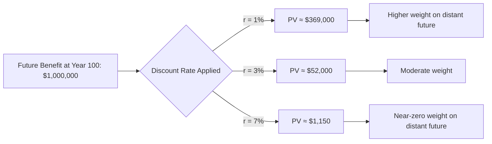
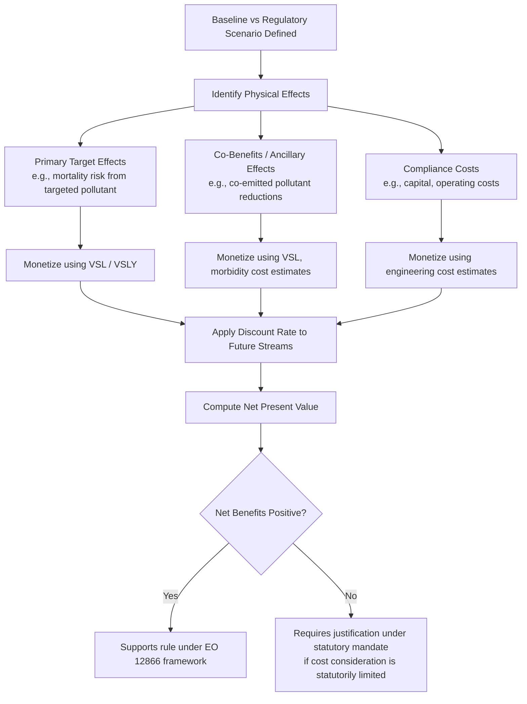

## Discounting, Co-Benefits, and the Valuation of Statistical Life in Cost-Benefit Analysis

### Overview

Regulatory cost-benefit analysis (CBA) requires converting heterogeneous future effects — deaths avoided, illnesses prevented, ecosystem changes, economic costs — into a single comparable metric, typically present-value dollars. Three technical components drive much of the controversy and litigation risk in environmental and health regulation: **discounting** (how to weigh future effects against present ones), the **Value of a Statistical Life (VSL)** (how to monetize mortality risk reduction), and **co-benefits** (ancillary benefits of a regulation beyond its primary target). Each involves methodological choices that are simultaneously technical and normative, making them recurring targets of judicial and political challenge.

### Legal and Institutional Basis

- **Executive Order 12866** (1993) and **Executive Order 13563** (2011): require executive agencies to conduct CBA for economically significant rules and to maximize net benefits.
- **OMB Circular A-4** (2003, revised 2023): the primary technical guidance document governing discount rates, VSL methodology, and benefit categorization for federal regulatory analysis. The 2023 revision materially changed the recommended discount rate framework (discussed below).
- Statutory constraints vary by agency: some organic statutes (e.g., certain Clean Air Act provisions) limit or preclude cost consideration in setting a standard itself, even though CBA is still often required for the separate regulatory impact analysis; others (e.g., TSCA as amended in 2016) explicitly require cost-benefit weighing in specific determinations.
- Judicial review: agency CBA methodology is reviewed under the APA's arbitrary-and-capricious standard (*Motor Vehicle Mfrs. Ass'n v. State Farm*, 463 U.S. 29 (1983)); courts generally defer to reasonable, well-explained methodological choices but vacate analyses that ignore significant benefit or cost categories, or that apply methods inconsistently across a rule.

### Discounting

**Key Points**

- Discounting converts future costs and benefits into present-value terms because a dollar (or a life saved) in the future is generally treated as worth less than the same unit today, reflecting time preference and the opportunity cost of capital.
- The general present-value formula for a benefit or cost $B_t$ occurring $t$ years in the future, given discount rate $r$:

$$PV = \frac{B_t}{(1+r)^t}$$

- For a stream of values across years $0$ to $n$:

$$PV = \sum_{t=0}^{n} \frac{B_t}{(1+r)^t}$$

**Two traditional theoretical approaches:**

1. **Social Rate of Time Preference (SRTP)**: reflects how society values present versus future consumption, often approximated using the real rate of return on long-term government bonds.
2. **Social Opportunity Cost of Capital (SOC)**: reflects the rate of return that resources would have earned in their next-best private investment use, typically higher than SRTP.

**Historical OMB guidance (Circular A-4, 2003)** recommended agencies present results using **both a 3% rate (approximating SRTP)** and a **7% rate (approximating the pre-tax return on private capital / SOC)**.

**2023 Circular A-4 revision**: OMB replaced the 3%/7% dual-rate default with a **single default discount rate of approximately 2%**, derived from updated estimates of the real long-term rate of return on government debt, reflecting secular declines in interest rates since 2003. Agencies were directed to periodically update this rate rather than treating 7% as a standing default. [Unverified] The precise updating mechanism and frequency should be confirmed against the current version of Circular A-4 in force at the time of any specific rulemaking, since OMB guidance is subject to further revision.

**Intergenerational discounting controversy**

- Standard exponential discounting implies that harms occurring far in the future (e.g., climate damages decades or centuries out) are assigned near-zero present value, which critics argue is ethically problematic for long-horizon problems like climate change.
- Alternative approaches debated in the literature and used in specialized contexts (e.g., the Social Cost of Carbon):
  - **Declining discount rate schedules** (lower rates applied to more distant time horizons), grounded in uncertainty about future interest rates (Weitzman's "gamma discounting" argument).
  - **Ramsey formula** decomposition, separating the discount rate into a pure time preference component ($\rho$) and a component reflecting expected consumption growth and risk aversion ($\eta g$):

$$r = \rho + \eta g$$

where $\rho$ is the pure rate of time preference, $\eta$ is the elasticity of marginal utility of consumption, and $g$ is the expected growth rate of consumption.

- The **Social Cost of Carbon (SCC)** interagency working group methodology is the most prominent applied example of these debates, since the chosen discount rate can change the SCC estimate by a large multiple — a lower discount rate substantially increases the present value of avoided future climate damages, which is why the discount rate choice is frequently the central point of legal and political contestation in SCC-based rulemakings.

**Illustration: Effect of Discount Rate on Present Value of a Distant Benefit**

### Value of a Statistical Life (VSL)

**Key Points**

- VSL does **not** measure the value of any identified individual's life; it aggregates individuals' willingness to pay (WTP) for small reductions in mortality risk, then rescales to a "statistical" life.
- Canonical derivation: if a population of $N$ people is each willing to pay $WTP$ for a risk reduction of $\Delta p$ (a small probability), and this collectively prevents $E$ statistical deaths, where $E = N \times \Delta p$, then:

$$VSL = \frac{N \times WTP}{N \times \Delta p} = \frac{WTP}{\Delta p}$$

- Example: If 100,000 people are each willing to pay $70 for a reduction in annual mortality risk of 1-in-100,000 (i.e., $\Delta p = 0.00001$), this reduction statistically prevents 1 death ($100{,}000 \times 0.00001 = 1$). Aggregate WTP is $100{,}000 \times \$70 = \$7{,}000{,}000$, so:

$$VSL = \frac{\$7{,}000{,}000}{1} = \$7{,}000{,}000$$

**Methodological sourcing**

- Primarily derived from **hedonic wage studies**: labor economists estimate the wage premium workers demand to accept jobs with marginally higher occupational fatality risk, then back out an implied VSL.
- Secondary approaches: **stated preference (contingent valuation) surveys** asking respondents directly about WTP for hypothetical risk reductions.
- **EPA's current VSL** (as periodically updated for inflation and income growth) has historically been in the range of roughly $7–$11 million (2020s USD), varying by year and update methodology. [Unverified] The precise current figure should be checked against the specific EPA or agency guidance document in effect at the time of the rulemaking being analyzed, since these figures are updated periodically and vary by agency (e.g., DOT historically used a different VSL than EPA, though agencies have moved toward more consistent approaches).

**Common critiques and limits**

1. **Income elasticity and equity**: Since VSL is derived from WTP, and WTP scales with income/wealth, a strict application implies valuing statistical lives in wealthier populations or countries more highly than in poorer ones — a result widely regarded as ethically troubling and generally rejected as a basis for differentiating regulatory protections domestically, though it remains a live methodological question in international and intergenerational contexts.
2. **Age adjustment ("senior discount") controversy**: Proposals to adjust VSL downward for older populations (reflecting fewer expected remaining life-years, sometimes using a *Value of a Statistical Life-Year*, VSLY, metric instead) generated significant public and political backlash when floated by EPA in the early 2000s (the so-called "senior death discount" controversy), and are now generally avoided in practice by most agencies, which typically apply a constant VSL across age groups.
3. **Context-of-death mismatch**: VSL estimates derived from occupational risk (typically involving relatively young, healthy workers facing acute injury risk) may not transfer well to contexts involving elderly populations, chronic disease, or latent risks (e.g., long-term cancer risk from environmental exposure) — a recurring critique in environmental health regulation specifically.
4. **Aggregation obscures distribution**: A single VSL-based total benefit figure does not reveal who bears the risk being reduced or who bears the compliance cost, raising environmental justice concerns when the population facing highest exposure differs from the population bearing regulatory cost.
5. **Ethical objection to commodifying life**: A standing philosophical critique holds that framing life-and-death outcomes in dollar terms is a category error regardless of methodological rigor, though this critique operates largely outside — rather than within — the current administrative CBA framework, which requires monetization for any rule subject to OMB review under the applicable executive orders.

### Co-Benefits (Ancillary Benefits)

**Key Points**

- **Co-benefits** are welfare gains from a regulation that accrue outside its primary statutory target — e.g., a rule aimed at reducing carbon dioxide emissions from power plants may simultaneously reduce co-emitted particulate matter (PM2.5), sulfur dioxide, and nitrogen oxides, generating substantial monetized public health benefits unrelated to the rule's stated climate purpose.
- Co-benefits are **legitimate components of CBA under OMB guidance** (Circular A-4 directs agencies to consider all foreseeable benefits and costs, not only those tied to the rule's primary statutory purpose) but are frequently the most litigated and politically contested line item in a regulatory impact analysis.

**Recurring controversies**

1. **Magnitude relative to direct benefits**: In several high-profile EPA rules (e.g., the Mercury and Air Toxics Standards, MATS, and various Clean Power Plan-era analyses), monetized PM2.5 co-benefits from reduced criteria pollutant emissions substantially exceeded the monetized value of the rule's direct target benefit (e.g., mercury exposure reduction), leading critics to argue the rule was effectively justified by benefits Congress did not intend the specific statutory provision to address.
2. **Litigation touchpoint**: *Michigan v. EPA*, 576 U.S. 743 (2015), addressed (in part, and among other issues) EPA's consideration of cost under the Clean Air Act's Hazardous Air Pollutants provision for MATS; the case is frequently cited in the co-benefits debate because of the surrounding controversy over the relative size of direct versus co-benefits in that rule's supporting analysis, though the Court's holding centered on the statutory requirement to consider cost at the threshold "appropriate and necessary" finding stage, not on a general rule barring co-benefit accounting. [Inference] Characterizations of *Michigan v. EPA* as directly resolving the propriety of counting co-benefits should be treated cautiously, since the opinion's holding is narrower than that broader claim; the case is better read as informing, rather than definitively settling, the co-benefits debate.
3. **Directionality**: Co-benefits can run in either direction — a rule might also generate ancillary *costs* not captured in its primary cost estimate (sometimes termed "co-harms" or countervailing risks), which a complete and non-arbitrary analysis should also identify.
4. **Double-counting risk**: Analysts must ensure co-benefits attributed to one rule are not simultaneously claimed as primary benefits in an overlapping regulation targeting the same emissions reductions, which can occur when multiple rules affect the same source category.

### Integrated Illustration: Structure of a Regulatory CBA

### Comparative Table: Key Methodological Choices and Their Effects

| Parameter | Lower value effect | Higher value effect | Primary controversy driver |
| --- | --- | --- | --- |
| Discount rate | Increases present value of long-term benefits/costs | Decreases present value of long-term benefits/costs | Intergenerational equity; SCC magnitude |
| VSL | Reduces monetized value of mortality benefits | Increases monetized value of mortality benefits | Income elasticity; age adjustment; life-context mismatch |
| Co-benefit inclusion scope | Narrower analysis, closer to statutory target only | Broader analysis capturing more ancillary effects | Whether ancillary pollutant reductions should justify a rule targeting a different pollutant |

### Practical Example: Simplified Illustrative Calculation

**Example**

A hypothetical air toxics rule is projected to prevent 50 statistical deaths per year from its primary target pollutant, and an additional 200 statistical deaths per year from co-emitted PM2.5 reductions, evaluated over a 10-year period at a 2% discount rate, using a VSL of $10 million (nominal, undiscounted for simplicity of illustration):

- Annual primary benefit: $50 \times \$10{,}000{,}000 = \$500{,}000{,}000$
- Annual co-benefit: $200 \times \$10{,}000{,}000 = \$2{,}000{,}000{,}000$
- Total annual monetized mortality benefit: $\$2{,}500{,}000{,}000$

Present value of this constant annual benefit stream over 10 years at $r = 0.02$:

$$PV = \sum_{t=1}^{10} \frac{\$2{,}500{,}000{,}000}{(1.02)^t} \approx \$22.4\text{ billion}$$

Here, co-benefits represent 80% of the total monetized mortality benefit ($2 billion of $2.5 billion annually) — illustrating why, in real rulemakings with a similar profile, opponents challenge whether the rule is effectively justified by effects outside its statutory target, while proponents argue all foreseeable welfare effects are properly within CBA's scope under OMB guidance.

### Related Topics

- The Social Cost of Carbon: interagency methodology, discount rate sensitivity, and litigation history
- *Michigan v. EPA* and the "appropriate and necessary" cost-consideration threshold under the Clean Air Act
- OMB Circular A-4 (2023 revision) full methodological framework
- Distributional and environmental justice analysis in regulatory impact assessment
- Value of a Statistical Life-Year (VSLY) as an alternative mortality valuation metric
- Hedonic wage estimation methodology and its critiques
- The precautionary principle versus cost-benefit balancing as competing regulatory decision frameworks
- Judicial review of agency cost-benefit methodology under arbitrary-and-capricious review
- Countervailing risk / risk-risk tradeoff analysis in regulatory design
- Statutory cost-consideration mandates: comparing Clean Air Act, TSCA, and Clean Water Act approaches