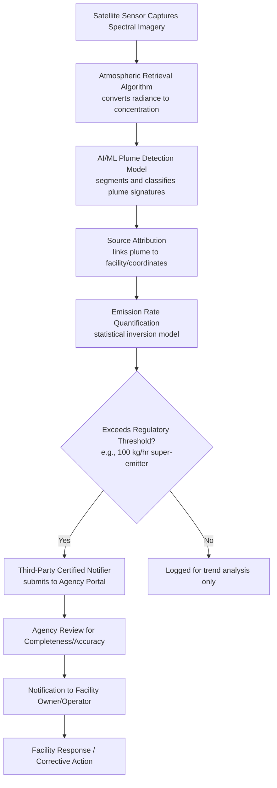

## Emerging Monitoring Technology and Artificial Intelligence in Environmental Compliance

### Overview

Environmental compliance monitoring has historically relied on self-reported facility data, periodic on-site inspections, and ground-based fixed monitors — a model of limited spatial and temporal coverage that gives regulators only a partial picture of actual emissions and discharges. Since the early 2020s, satellite remote sensing, distributed sensor networks, and machine-learning analytics have begun supplementing and, in defined circumstances, substituting for these traditional methods. This creates new administrative law questions around evidentiary reliability, due process in enforcement actions built on algorithmic detection, agency transparency obligations for AI-assisted decisions, and the proper procedural pathway for validating novel technologies within existing statutory monitoring frameworks.

### Categories of Emerging Monitoring Technology

**Key Points**

1. **Satellite remote sensing** — orbital platforms detecting pollutant plumes (primarily methane, and increasingly CO2 and other trace gases) via spectroscopic absorption signatures.
2. **Aerial and mobile remote sensing** — aircraft-mounted or vehicle-mounted sensors offering higher spatial resolution than satellites, often used to validate or supplement satellite detections.
3. **Continuous emissions monitoring systems (CEMS)** and next-generation low-cost sensor networks — fixed, often internet-connected devices providing higher-frequency data than periodic stack testing.
4. **AI/machine-learning analytics layered on top of monitoring data** — used for automated plume detection and source attribution, predictive enforcement targeting, exposure and dispersion modeling, and screening-level chemical hazard assessment (e.g., quantitative structure-activity relationship, or QSAR, tools).
5. **Digital reporting and tracking systems** — electronic waste-tracking and compliance-management platforms replacing paper-based recordkeeping, enabling agency-side data analytics across large regulated populations.

### Satellite and Remote Sensing Technology: Technical Architecture

**Detection principle**: Most operational methane-sensing satellites use passive spectrometry, measuring sunlight reflected from the Earth's surface and identifying absorption features characteristic of methane's spectral signature in the shortwave infrared band. Key operational systems include:

- **TROPOMI** (on the Sentinel-5P satellite): wide-area daily global coverage at moderate resolution, useful for regional-scale flux estimation but generally insufficient for attributing emissions to a specific facility.
- **GHGSat** (commercial constellation): high-resolution, targeted "point-and-shoot" tasking capable of resolving individual facility-level sources.
- **MethaneSAT**: a joint project of the Environmental Defense Fund and the New Zealand Space Agency, with a swath width greater than 200 km, spatial resolution of 100 m x 400 m, and a detection threshold of approximately 3 parts per billion of methane, positioned between wide-area survey satellites such as TROPOMI and high-resolution satellites such as Tanager-1 in its coverage-versus-resolution tradeoff. [Congress.gov](https://www.congress.gov/crs_external_products/IF/HTML/IF12072.html)[Congress.gov](https://www.congress.gov/crs_external_products/IF/HTML/IF12072.html)
- **Hyperspectral platforms** (e.g., PRISMA, the Copernicus Hyperspectral Imaging Mission for the Environment): collect data on hundreds of narrow bands across the electromagnetic spectrum and can achieve spatial resolution better than 50 m x 50 m, likely sufficient to allow fugitive emissions attribution to a specific facility. [Congress.gov](https://www.congress.gov/crs-product/IF12072)

**AI's role in the satellite pipeline**: Raw spectral imagery requires substantial computational processing before it becomes an actionable regulatory data point — atmospheric retrieval algorithms convert radiance measurements into concentration estimates, and machine-learning models then perform plume segmentation, source attribution, and emission-rate quantification. An illustrative operational example is **MARS-S2L**, an automated AI-driven methane emitter monitoring system for Sentinel-2 and Landsat satellite imagery deployed operationally at the United Nations Environment Programme's International Methane Emissions Observatory, which was reported to provide a 216% improvement in mean average precision over a prior state-of-the-art detection method when evaluated against a global training and evaluation dataset. [arxiv](https://arxiv.org/pdf/2408.04745)

### Regulatory Integration: EPA's Methane Super-Emitter Program

**Example**

EPA's 2024 methane rule under Clean Air Act §111 formally incorporated remote sensing into the regulatory compliance architecture, illustrating how emerging technology moves from research tool to legally operative compliance mechanism:

- **Program mechanics**: The rule established standards for methane release events greater than 100 kilograms per hour, known as super-emitter events, and created the Methane Super Emitter Program allowing certified third parties to submit data on such events to the EPA Super Emitter Portal. [Congress.gov](https://www.congress.gov/crs_external_products/IF/HTML/IF12072.html)
- **Approved technology categories**: Third parties apply for certification to submit data collected using EPA-approved remote-sensing technology, such as satellites, aerial vehicles, and mobile monitoring. [US EPA](https://www.epa.gov/compliance/methane-super-emitter-program)
- **Procedural timeline**: A certified notification must be submitted within 15 calendar days of the date the release event is detected, and EPA reviews the submission for completeness and accuracy before further action. [US EPA](https://www.epa.gov/compliance/methane-super-emitter-program)
- **Operator flexibility**: Under the rule, owners and operators of oil and natural gas facilities may use advanced methane detection technologies as an alternative to ground-based monitoring methods to satisfy their own compliance obligations, not only as a third-party surveillance mechanism. [Jenner & Block](https://environblog.jenner.com/2024/01/02/remote-sensing-as-a-supplement-to-emissions-monitoring-and-quantification/)

This structure is instructive: rather than agencies directly deploying satellites as primary enforcement instruments, the regulatory design creates an **intermediary certification layer** (EPA-approved technology + certified third-party notifiers) that functions similarly to how EPA has historically approved reference methods for stack testing — addressing reliability concerns by gatekeeping the technology and the submitter rather than case-by-case adjudicating every data point's admissibility.

### Legal and Evidentiary Issues

**Key Points**

1. **Admissibility and evidentiary weight**: A satellite- or AI-derived detection is not self-executing legal proof of a violation; it typically functions as a **trigger for agency investigation or enforcement inquiry** rather than dispositive evidence, though its evidentiary weight in subsequent administrative or civil proceedings depends on validation protocols, chain-of-custody-like documentation, and the technology's accepted error/uncertainty characteristics. [Inference] Courts and agencies are still developing consistent standards for weighing algorithmically-derived environmental data in contested enforcement proceedings, since case law specifically addressing satellite/AI-derived methane detections as adjudicated evidence remains sparse as of this writing.
2. **Quantification uncertainty**: Independent validation studies show meaningful variance in satellite-based emission-rate estimates. In one controlled single-blind test, teams correctly identified 71% of all emissions ranging from 0.20 to 7.2 metric tons per hour, and three-quarters of quantified estimates fell within ±50% of the metered value, comparable to airplane-based remote sensing technologies. A ±50% quantification band is a material consideration for any enforcement action or penalty calculation resting on a specific emission-rate figure. [nih](https://www.ncbi.nlm.nih.gov/pmc/articles/PMC9992358/)
3. **Regulatory reliance under the APA**: Where an agency's enforcement targeting, permit review, or rule-triggering determination depends materially on an AI model's output, principles from *Motor Vehicle Mfrs. Ass'n v. State Farm* (reasoned decisionmaking) suggest the agency should be prepared to explain the model's methodology, validation basis, and known limitations in the administrative record — an evolving compliance expectation flagged directly by practitioners: AI-assisted decision-making in areas ranging from enforcement targeting to scientific literature review raises important questions about transparency, accountability, and compliance with the Administrative Procedure Act. [Mondaq](https://www.mondaq.com/unitedstates/environmental-law/1781310/an-assessment-of-epas-progress-in-deploying-artificial-intelligence-in-regulatory-decision-making)
4. **Federal AI governance overlay**: EPA's AI Compliance Plan details how the agency will meet federal requirements for responsible AI use by strengthening governance, maintaining an annual AI use case inventory, and implementing risk management practices, issued in response to federal AI oversight directives. Practically, this creates a public inventory mechanism — EPA's AI Use Case Inventory for 2025 was published in February 2026 and updated in April 2026, comprising a total of 82 specific items reflecting deployed, pilot, pre-deployment, and retired use cases — through which regulated parties and the public can track which AI tools the agency is actually using in compliance and enforcement contexts, though observers note practical adoption of AI by EPA appears much more aspirational than the raw count of listed items might suggest. [AI Compliance Plan | US EPA +2](https://www.epa.gov/data/ai-compliance-plan)
5. **Federal-state-industry data asymmetry**: Where a federal agency scales back use of a monitoring dataset or program, states and non-governmental actors may fill the gap using the same underlying technology base, creating jurisdictional and evidentiary complexity — illustrated by a state launching its own satellite-based methane detection project explicitly framed as a response to federal rollback of related protections, intended to allow state and local agencies to work with industry to address leaks using independently gathered data. [CA](https://www.gov.ca.gov/2025/03/21/as-u-s-epa-rolls-back-protections-california-launches-satellite-project-to-detect-and-reduce-dangerous-methane-leaks/)
6. **Citizen suit and third-party enforcement leverage**: Because remote-sensing data can be gathered independently of the regulated facility's cooperation, it materially lowers the information barrier that previously constrained third-party and citizen-suit enforcement, an effect practitioners are actively tracking as data-center and industrial buildout accelerates: citizen suits challenging facilities under the Clean Air Act, Clean Water Act, and other major environmental statutes may be on the rise as independent monitoring data becomes more accessible to advocacy organizations. [Crowell & Moring](https://www.crowell.com/en/insights/client-alerts/epa-hands-over-ai-data-center-regulation-to-states-and-communities-to-develop-best-practices)

### Non-U.S. Comparative Development

- **United Kingdom**: The Environment Agency has moved toward AI-supported inspection targeting and case management, alongside mandatory digital waste tracking — a system beginning its first mandatory rollout for waste-receiving sites in October 2026, expected to provide a centralized record of waste movements from production to disposal and reduce opportunities for illegal transport or deposit, responding directly to enforcement visibility gaps, since a 2025 national waste crime survey estimated only 27% of waste crimes were reported to the regulator. [Envirotec](https://envirotecmagazine.com/2026/08/26/environment-agency-to-deploy-ai-to-target-waste-crime-and-non-compliance/)[Envirotec](https://envirotecmagazine.com/2026/08/26/environment-agency-to-deploy-ai-to-target-waste-crime-and-non-compliance/)
- **Ethiopia**: The Ethiopian Environmental Protection Authority, in collaboration with the Ethiopian Artificial Intelligence Institute, launched a Digital Environmental Pollution Compliance Governance System as part of a broader national digital governance strategy, illustrating that AI-based compliance infrastructure is being adopted across a range of institutional and resource contexts, not only in high-capacity regulatory systems. [Briefly](https://www.wansom.ai/briefly/news/epa-in-collaboration-with-the-ethiopian-artificial-intelligence-institute-eai-has-officially-launched-the-digital-environmental-pollution-compliance-governance-system-2026-07-08_63d656cb-805a-40d5-b055-5d5ca8228bc1)
- These parallel developments illustrate a broader structural pattern: monitoring capability is increasingly decoupled from the traditional model of a single national regulator as sole data source, with implications for which entity's data is treated as authoritative in cross-border or federal-subnational disputes.

### Limits and Open Administrative Law Questions

**Key Points**

1. **Model transparency versus trade secrecy**: Detailed disclosure of an AI detection or attribution model's training data and architecture may be necessary for meaningful due process in a contested enforcement action, but can conflict with a vendor's trade-secret protections over proprietary algorithms — an unresolved tension without settled doctrine specific to environmental enforcement.
2. **Validation and standard-setting lag**: Practitioner commentary notes a persistent structural gap: the pace of AI adoption across federal environmental agencies has outstripped the development of clear policy guardrails to ensure unbiased and accurate AI-infused products, meaning technology deployment frequently precedes formal validation or rulemaking addressing its evidentiary status. [Lawbc](https://www.lawbc.com/environmental-ai-in-2025-adoption-accelerated-but-policy-still-lagging-behind/)
3. **Regulatory reference-method status**: Not every emerging sensor or algorithm has been formally designated as an approved reference or equivalent method; where a facility complies using an alternative advanced technology, disputes can arise over whether agency-approved status has actually been obtained versus merely technically available.
4. **Bias and generalization risk in ML models**: A detection model trained predominantly on certain source types, geographies, or emission magnitudes may generalize poorly to different facility profiles or regions — a standard machine-learning limitation with direct regulatory consequences if under- or over-detection is systematically skewed toward particular source categories.
5. **Coverage gaps remain physical, not just algorithmic**: Even sophisticated sensing platforms face fundamental physical constraints — for instance, passive-sensing satellites have low potential for frequent monitoring of large methane emissions in tropical and high-latitude regions due to cloud cover and solar-angle limitations, meaning AI analytics cannot fully compensate for gaps in the underlying physical measurement capability. [nih](https://www.ncbi.nlm.nih.gov/pmc/articles/PMC10555993/)
6. **Institutional capacity and political variability**: The scope and pace of an agency's reliance on these tools is not solely a function of the technology's maturity but also of shifting institutional priorities — for example, evolving federal posture toward deferring certain environmental oversight (e.g., of AI data-center buildout) to state and local authorities, which shifts where and how such monitoring technology gets deployed and by whom.

### Comparative Table: Traditional vs. Emerging Compliance Monitoring

| Dimension | Traditional Monitoring | Emerging Technology Monitoring |
| --- | --- | --- |
| Primary data source | Self-reported facility data; periodic on-site inspection | Satellite/aerial remote sensing; continuous sensor networks |
| Temporal resolution | Periodic (e.g., annual stack test, scheduled inspection) | Near-continuous or frequent-revisit (daily to sub-daily for some satellites) |
| Spatial coverage | Facility-specific, dependent on inspection scheduling | Regional-to-global, with facility-level attribution at higher resolution tiers |
| Detection of concealed/unreported events | Limited; depends on self-reporting or complaint-driven inspection | Enhanced; independent of operator cooperation |
| Primary uncertainty source | Sampling method error; reporting compliance/honesty | Quantification/attribution algorithm error; sensor detection threshold |
| Procedural integration | Long-established reference methods and chain-of-custody norms | Emerging certification/approval frameworks (e.g., EPA Super Emitter Program) |
| Evidentiary maturity | Well-settled admissibility practice | Developing; limited case law directly adjudicating algorithmic detections |

### Related Topics

- EPA's Methane Super Emitter Program: certification standards and third-party notifier procedures
- Administrative Procedure Act transparency requirements for algorithmic and AI-assisted agency decision-making
- Chain-of-custody and evidentiary reliability standards for novel environmental monitoring technologies
- Citizen suit provisions under the Clean Air Act and Clean Water Act in an era of independently accessible monitoring data
- Federal AI governance framework: OMB Memoranda M-25-21/M-25-22 and agency AI use-case inventories
- Trade secret protection versus due process disclosure obligations for proprietary detection algorithms
- Comparative international approaches to digital environmental compliance systems (UK Environment Agency, Ethiopia EPA)
- Reference method and equivalent method approval processes under the Clean Air Act
- Environmental justice implications of monitoring technology deployment and coverage gaps
- The Social Cost of Carbon and satellite-derived methane data as inputs to climate policy modeling