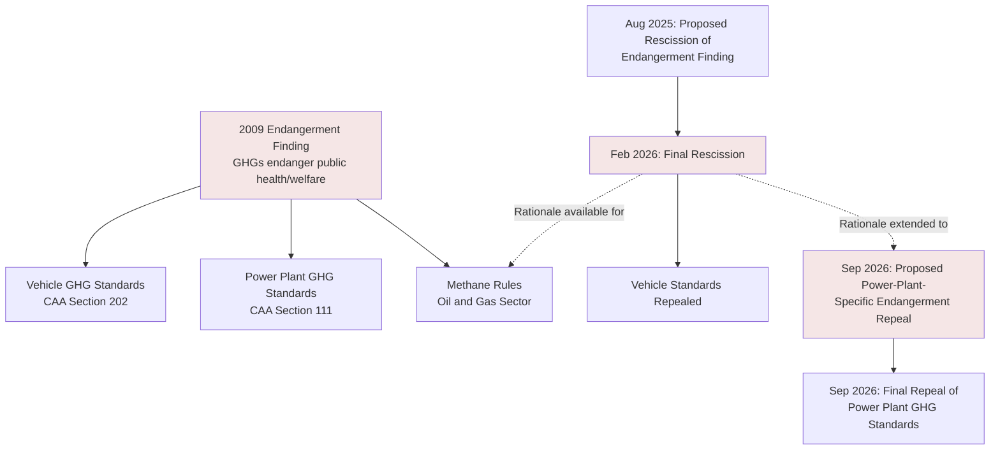

## Mapping the 2025 to 2026 Wave of Administrative and Environmental Deregulation

### Overview

Beginning in January 2025, the second Trump administration pursued a coordinated deregulatory campaign across environmental and administrative law, combining (1) direct agency action rescinding or repealing substantive rules, (2) a foundational legal challenge to the scientific and statutory predicate underlying an entire regulatory program (the endangerment finding), and (3) a shifted judicial landscape — post-*Loper Bright* and post-*Corner Post* — that both enables and complicates deregulatory strategy. This item maps the structure of that wave: its key regulatory actions, its doctrinal foundations, its internal legal tensions, and its anticipated litigation trajectory.

### Timeline of Key Actions

**Key Points**

| Date | Action | Description |
| --- | --- | --- |
| Jan. 2025 | Executive orders on energy and AI | Administration begins deregulatory campaign within hours of taking office, directing agencies to weaken or eliminate rules across cars, power plants, and oil fields. |
| Early 2025 | "Most consequential day of deregulation" | EPA Administrator announces roughly three dozen environmental regulations targeted for repeal or reconsideration in a single coordinated announcement. |
| June 11, 2025 | Proposed repeal of power plant carbon standards | EPA proposes repealing CAA §111(b)(1) greenhouse gas standards for new fossil-fuel power plants, and separately proposes repealing standards for existing fossil-fuel plants on the grounds that the Biden-era standards were not "adequately demonstrated." |
| Aug. 1, 2025 | Proposed rescission of the Endangerment Finding | EPA proposes rescinding the 2009 finding that GHG emissions endanger public health and welfare — the foundational predicate for essentially all federal GHG regulation under the Clean Air Act. |
| Sept. 2025 | TSCA risk evaluation procedure revisions proposed | EPA proposes revised TSCA risk evaluation procedures emphasizing stakeholder collaboration and transparent methodology, illustrative of a broader post-*Loper Bright* agency posture. |
| Feb. 12, 2026 | Final rescission of the Endangerment Finding | EPA finalizes rescission, eliminating light-, medium-, and heavy-duty vehicle GHG standards along with related test-procedure, averaging-banking-trading (ABT), and reporting requirements; EPA's stated rationale is that CAA §202(a)(1) does not permit regulation of vehicle GHG emissions based on global climate-change concerns. |
| Early 2026 | Mercury and Air Toxics Standards (MATS) rollback proposed | EPA proposes removing a 2024 Biden-era update to coal-plant mercury standards. |
| Sept. 14, 2026 | Final repeal of power plant GHG standards + proposed power-plant-specific endangerment repeal | EPA repeals remaining federal GHG emission caps on coal- and gas-fired power plants and proposes a separate endangerment finding repeal specific to power plants, asserting that regulating power-plant climate emissions is beyond EPA's statutory authority under the CAA. |

[Unverified] Specific rule effective dates, docket numbers, and the precise procedural posture of any single action should be confirmed against the current Federal Register entry and litigation docket, since deregulatory actions in this period have been subject to shifting timelines (attributed in part to a government shutdown affecting DOJ litigation schedules) and ongoing amendment.

### Structural Anatomy of the Deregulatory Strategy

**Key Points**

1. **Predicate-level attack rather than rule-by-rule repeal alone**: Rather than solely repealing individual downstream rules, the central strategic move targets the **foundational finding** underlying an entire regulatory program — the 2009 Endangerment Finding — which, if it survives judicial review, eliminates the legal basis for the full family of GHG rules built on it (vehicle standards, power plant standards, and potentially methane rules for oil and gas), functioning as a single point of failure for multiple downstream regulatory programs simultaneously.
2. **Statutory-authority reframing**: EPA's stated rationale is not that GHGs are harmless, but that the agency lacks statutory authority to regulate them under the specific provisions invoked (CAA §202(a) for vehicles; §111 for power plants), reflecting the doctrinal shift toward major-questions and plain-text statutory analysis rather than reliance on agency scientific judgment deference.
3. **Sequential dependency structure**: The rescission of the Endangerment Finding, the vehicle-standard repeal, and the power-plant-standard repeal, together with a power-plant-specific endangerment repeal, function as an interlocking package — the power plant proposal explicitly extends the Endangerment Finding rationale by arguing power plant emissions, like vehicle emissions, do not contribute significantly to global GHG concentrations, so cannot be regulated.

### Doctrinal Foundations Enabling the Wave

**Key Points**

1. ***Loper Bright Enterprises v. Raimondo*, 603 U.S. ___ (2024)**: Overturned the 40-year-old *Chevron* deference doctrine, under which courts had deferred to a reasonable agency interpretation of an ambiguous statute; courts now determine the "best" interpretation of a statute independently. This cuts both ways for deregulation: it removes a defensive shield agencies previously relied on to sustain expansive readings of their own authority, but it equally removes deference an agency previously needed to sustain a *narrower* reading adopted to justify repeal — commentary specifically cautions that *Loper Bright* can support deregulation, but it can also be used against it, since a court applying independent judgment might just as easily reject an agency's newly narrow self-interpretation as reject its prior expansive one.
2. ***Corner Post, Inc. v. Board of Governors*, 603 U.S. ___ (2024)**: Held that the six-year APA statute of limitations for challenging a final agency action runs from the date a plaintiff is first injured by the rule, not from the date the rule was promulgated — meaning long-settled rules remain newly vulnerable to challenge by parties only recently affected, and, symmetrically, newly repealed rules and their replacements face the same extended exposure window going forward.
3. **Major questions doctrine**: Invoked by the administration as a basis for repealing rules argued to have been issued without clear congressional authorization for matters of major economic and political significance; because the doctrine's underlying logic is not inherently partisan, commentary notes it is available to be turned against the administration's own actions in future litigation under a different administration.
4. **Interaction effect — "resetting the litigation clock"**: In response to the *Corner Post* exposure window, agencies have begun conducting systematic reviews of existing regulations, identifying vulnerabilities and either bolstering their justifications or proposing updates designed to reset the litigation clock with stronger legal foundations — a defensive rulemaking posture distinct from, but complementary to, the offensive deregulatory rulemakings themselves.
5. **Adjacent doctrinal shift — *SEC v. Jarkesy* (2024)**: Curbed agencies' use of in-house adjudication for certain civil penalty proceedings, requiring Seventh Amendment jury-trial rights in specified contexts; part of the same "trifecta" of decisions collectively transferring authority from agencies to the judiciary, relevant to environmental civil penalty enforcement structures more broadly.

### Anticipated and Ongoing Litigation

**Example**

Environmental and public health organizations have signaled immediate legal challenges to the power plant rule repeal, consistent with existing multiple pending lawsuits against the earlier vehicle-standard and Endangerment Finding rescissions. Key litigation vulnerabilities commentators are tracking:

- **Reasoned-explanation requirements** under *State Farm*: an agency reversing a prior factual/scientific finding (here, the Endangerment Finding itself) must supply a reasoned explanation for the change, including engaging with the scientific record it now departs from — a heightened burden given that reversing a foundational scientific finding is analytically different from adopting a new interpretation of ambiguous statutory text.
- **Post-*Loper Bright* statutory interpretation exposure**: because courts no longer defer to the agency's own reading of "contribute significantly" or its analogous statutory triggers, EPA's central legal argument (that GHG emissions from a given source category do not "contribute significantly" to endangerment) is subject to full, independent judicial scrutiny rather than reasonableness-based deference.
- **Newly viable challengers under *Corner Post***: parties who did not previously have standing or a timely injury to challenge the original Biden-era rules (or, prospectively, the repeal rules themselves) may now bring suit outside what would previously have been a time-barred window.
- **Cross-cutting uncertainty**: because the same doctrinal tools (*Loper Bright*, major questions) are available to challengers on both ideological sides, commentary emphasizes these changes are not inherently partisan in effect, nor do they invariably favor deregulation — a future administration's attempt to reinstate GHG regulation would face the same independent-judicial-review standard the current repeals are being evaluated under.

### Broader Pattern: Collaborative Rulemaking as a Litigation-Risk Hedge

**Key Points**

- A parallel, less headline-grabbing development is agencies shifting toward closer, earlier collaboration with regulated stakeholders during rule development — illustrated by EPA's September 2025 proposed TSCA risk evaluation procedure revisions, which emphasize stakeholder collaboration and transparent methodology as a means of building consensus around regulatory approaches rather than imposing them unilaterally.
- [Inference] This pattern suggests agencies operating in the post-*Loper Bright* landscape are adapting not only through outright repeal but through building more defensible, better-documented administrative records generally — a response applicable across both deregulatory and (for other agencies, in other policy areas) regulatory rulemakings, since the underlying litigation-risk logic is doctrinal rather than partisan.

### Comparative Table: Traditional vs. Post-2024 Deregulatory Legal Environment

| Dimension | Pre-*Loper Bright* (Chevron era) | Post-2024 (Current wave) |
| --- | --- | --- |
| Statutory ambiguity | Resolved via deference to reasonable agency interpretation | Resolved via independent judicial "best interpretation" |
| Statute of limitations for rule challenges | Generally ran from rule promulgation date | Runs from date of plaintiff's injury (*Corner Post*) — indefinite practical exposure |
| Agency deregulatory tool of choice | Direct rule repeal via new rulemaking | Direct repeal + foundational predicate rescission (endangerment finding) |
| In-house civil penalty adjudication | Broadly available to agencies | Constrained where Seventh Amendment jury-trial rights apply (*Jarkesy*) |
| Litigation predictability | Higher (deference reduced number of viable statutory challenges) | Lower ("tsunami" of litigation anticipated by dissenting justices and commentators) |

### Related Topics

- The Endangerment Finding: scientific basis, 2009 origin, and the 2026 rescission rationale under CAA §202(a)
- *Loper Bright Enterprises v. Raimondo* and the end of *Chevron* deference: doctrinal mechanics and case law developments
- *Corner Post, Inc. v. Board of Governors*: statute-of-limitations exposure for long-settled agency rules
- The major questions doctrine and its symmetric availability to regulatory and deregulatory challengers
- *SEC v. Jarkesy* and constraints on agency in-house civil penalty adjudication
- TSCA risk evaluation procedure reform and stakeholder-collaborative rulemaking as a litigation-risk hedge
- Mercury and Air Toxics Standards (MATS) rollback and its relationship to *Michigan v. EPA*
- Comparative state-level responses to federal environmental deregulation (e.g., state-level satellite methane monitoring initiatives)
- Reasoned decisionmaking (*State Farm*) standards for agency reversal of prior factual findings
- Anticipated litigation trajectory: standing, ripeness, and reviewability of the 2025–2026 rule repeals