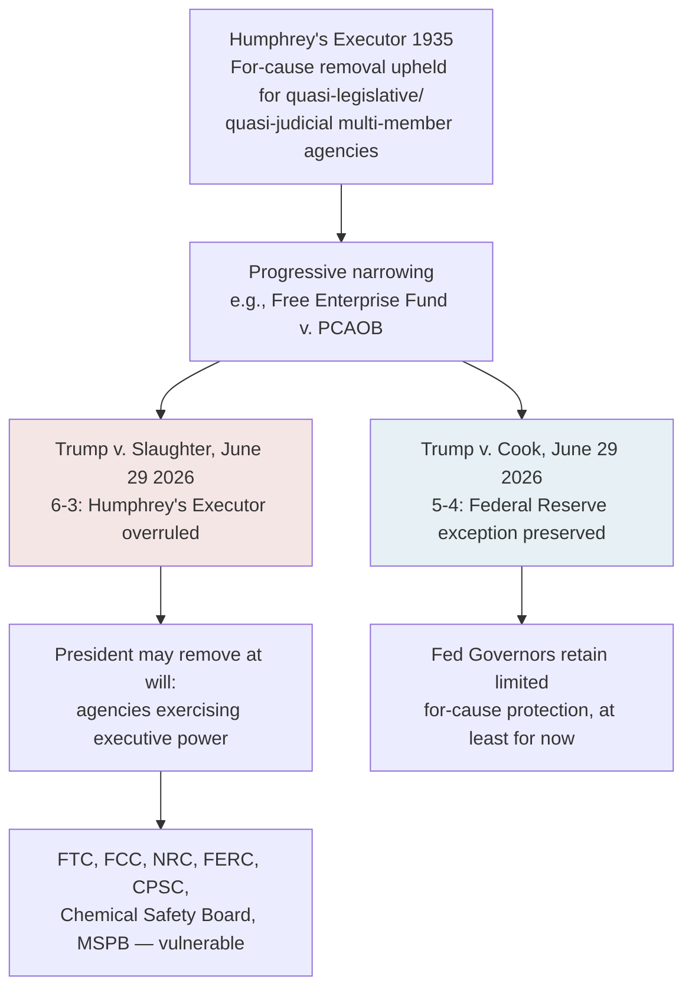

## Structural Change to Independent Agencies After Slaughter and Cook and Its Implications for Environmental Regulators

### Overview

On June 29, 2026, the Supreme Court decided two companion cases — *Trump v. Slaughter* and *Trump v. Cook* — that fundamentally restructured the constitutional status of independent multi-member federal agencies. *Slaughter* overruled *Humphrey's Executor v. United States*, 295 U.S. 602 (1935), the 90-year-old precedent that had permitted Congress to insulate certain agency heads from at-will presidential removal. *Cook*, decided the same day, preserved a narrow exception for the Federal Reserve. Together, these decisions dismantle the legal architecture supporting agency independence across a wide range of federal regulators — including several with direct environmental and energy regulatory functions — with significant downstream implications for administrative law, regulatory continuity, and environmental governance specifically.

### Legal Background: Humphrey's Executor and the Independent Agency Model

**Key Points**

- **Myers v. United States**, 272 U.S. 52 (1926): established the baseline rule that the President generally may remove executive officers at will.
- **Humphrey's Executor v. United States** (1935): carved out an exception to *Myers* for multi-member agencies exercising "quasi-legislative" or "quasi-judicial" functions rather than purely executive power — the Federal Trade Commission Act's for-cause removal provision (removal only for "inefficiency, neglect of duty, or malfeasance in office") was upheld on this basis.
- This framework became the constitutional foundation for the modern "independent agency" model: multi-member commissions led by officials removable only for cause, insulated from direct presidential political control, on the theory that their functions were not purely executive.
- In subsequent decades, the Supreme Court in cases such as *Free Enterprise Fund v. PCAOB* progressively confined *Humphrey's* to traditional multimember commissions with defined, limited functions, narrowing its scope even before its formal overruling.

### Trump v. Slaughter: Holding and Reasoning

**Key Points**

- **Facts**: In March 2025, President Trump fired FTC Commissioner Rebecca Kelly Slaughter without cause, asserting the FTC Act's for-cause removal provision was unconstitutional. Slaughter sued; the district court granted summary judgment in her favor and issued a permanent injunction; the Supreme Court stayed that injunction and granted certiorari before judgment, bypassing the court of appeals.
- **Holding**: In a 6–3 decision authored by Chief Justice Roberts, the Court held that the FTC's for-cause removal provision violates the separation of powers, expressly overruling *Humphrey's Executor*.
- **Reasoning**: The majority held that officers exercising executive power must be accountable to the President, and that accountability requires removability at will; the Court stated that the tasks the FTC undertakes are the very essence of "execution" of the law — precisely the President's constitutional role. The majority characterized what remains of *Humphrey's Executor* as limited to its narrow observation about agency structure, effectively stripping the case of operative force.
- **Vote**: 6–3 along ideological lines; Justice Sotomayor read a dissent summary from the bench, a signal of strong disagreement.

### Trump v. Cook: The Federal Reserve Exception

**Key Points**

- Decided the same day as *Slaughter*, by a narrower 5–4 vote, also authored by Chief Justice Roberts.
- **Holding**: Federal Reserve Governor Lisa Cook could remain in office while her removal challenge proceeded through the lower courts; the majority held the government was unlikely to succeed because the Federal Reserve falls within a class of entities that do not exercise executive power in the relevant constitutional sense, grounding the exception in the Fed's unique historical lineage as successor to the First and Second Banks of the United States and its distinct role in monetary policy.
- **Effect**: Creates a narrow, agency-specific carve-out rather than a general principle — commentary notes the two opinions were both written by Chief Justice Roberts but do not go to great length to explain how they are doctrinally consistent with one another, leaving the precise theoretical boundary of the Fed exception somewhat unsettled and, per some commentary, potentially vulnerable to future litigation.

### Direct Implications for Environmental and Energy Regulators

**Key Points**

1. **Federal Energy Regulatory Commission (FERC)**: FERC's organizing statute, the Department of Energy Organization Act, contains for-cause removal protections structurally identical to those struck down in *Slaughter*. Commentary notes that although the Court cautioned it did not determine the fate of officials not before it, that disclaimer may be insufficient to insulate FERC commissioners from a parallel challenge, given the statutory parity. Because FERC combines rulemaking, adjudication (including trial-type hearings before FERC administrative law judges), and enforcement functions, at-will removal exposure raises specific due process, fairness, and impartiality concerns where the ultimate decisionmakers in a FERC adjudicative proceeding are subject to removal by the President at will.
2. **Nuclear Regulatory Commission (NRC)**: Commentary specifically flags that nuclear facility operators and licensees should anticipate that safety oversight, licensing decisions, and decommissioning policy could shift in alignment with administration priorities as NRC leadership becomes subject to at-will removal.
3. **Chemical Safety Board**: Named directly among agencies whose for-cause removal protections dissenting justices warned would become vulnerable under the majority's reasoning.
4. **Consumer Product Safety Commission (CPSC)**: Also directly named as exposed, relevant to environmental-health-adjacent product safety regulation (e.g., chemical content standards in consumer products).
5. **Broader "independence" erosion across environmental-adjacent regulators**: The dissent in *Slaughter* specifically warned the decision would allow the President to remove without cause the heads of numerous independent agencies, including FERC, CPSC, the Chemical Safety Board, NRC, and the Merit Systems Protection Board — a list directly overlapping with agencies exercising environmental, energy, and workplace/chemical safety functions.
6. **EPA is not directly implicated by name in this line of cases** because EPA has historically been structured as a single-administrator agency (not a multi-member commission) already serving at the President's pleasure without *Humphrey's Executor*-style protection; the *Slaughter*/*Cook* line is therefore most directly consequential for the **multi-member commission-style environmental and energy regulators** (FERC, NRC, Chemical Safety Board) rather than for EPA's own leadership structure. [Inference] This distinction is a structural inference from the agencies' differing statutory designs rather than a point addressed directly in the *Slaughter* or *Cook* opinions themselves, which concerned the FTC and the Federal Reserve specifically.

### Systemic Consequences for Environmental Regulatory Continuity

**Key Points**

1. **Regulatory volatility across administrations**: Because commission leadership at exposed agencies can now be replaced immediately and without cause upon a change in administration priorities, environmental and energy policy set through commission-level action (e.g., FERC rate and infrastructure siting policy, NRC safety and licensing posture) becomes more susceptible to rapid reversal each time political control of the presidency changes, compared to the previous model in which sitting commissioners typically served out fixed terms across administrations.
2. **Erosion of "quasi-judicial" insulation in adjudicative contexts**: Where a commission (such as FERC) also performs adjudicatory functions, at-will removability of the adjudicators raises separation-of-powers-adjacent fairness questions distinct from, but related to, the concerns addressed in *SEC v. Jarkesy* regarding in-house adjudication — both lines of cases erode traditional structural insulation for administrative adjudication, though on different constitutional theories (removal power versus jury-trial rights).
3. **Compliance and planning uncertainty for regulated industries**: Commentary directed at regulated parties broadly (extending beyond environmental sectors) advises that compliance programs built on assumptions of regulatory continuity should be reconsidered, and that companies should prepare for more volatile enforcement environments and rapid policy reversals between administrations, alongside new constitutional arguments now available to challenge agency actions taken (or reversed) under altered leadership.
4. **Interaction with the broader deregulatory and post-*Loper Bright* landscape**: *Slaughter* and *Cook* compound the litigation and policy volatility already introduced by *Loper Bright*'s elimination of *Chevron* deference and *Corner Post*'s extension of rule-challenge exposure windows — an environmental rule now faces not only reduced judicial deference to the agency's statutory interpretation and an indefinite challenge window, but also the prospect that the very commissioners who adopted or might reverse the rule can be replaced by the President for purely political reasons at any point.
5. **Untested boundary of the Federal Reserve exception**: Because *Cook*'s reasoning rests on the Fed's unique historical pedigree and monetary-policy function rather than on a generally applicable principle, commentary describes the boundaries of this carve-out as untested — meaning it is not presently clear whether any environmental or energy regulator could plausibly claim an analogous "unique historical function" exception, though none of the environmental/energy agencies named in the dissent (FERC, NRC, Chemical Safety Board, CPSC) shares the Fed's specific institutional lineage or rationale.

### Comparative Table: Agency Exposure After Slaughter and Cook

| Agency | Historical Removal Protection | Post-Slaughter/Cook Status | Environmental/Energy Relevance |
| --- | --- | --- | --- |
| FTC | For-cause (Humphrey's Executor) | Overruled — at-will removal now permitted | Indirect (consumer protection, some environmental marketing claims) |
| FERC | For-cause (identical statutory language to FTC Act) | Highly exposed per commentary; not yet directly adjudicated | Direct — energy infrastructure, rates, pipeline/transmission siting |
| NRC | For-cause | Named as vulnerable in dissent | Direct — nuclear safety, licensing, decommissioning |
| Chemical Safety Board | For-cause | Named as vulnerable in dissent | Direct — chemical incident investigation and safety recommendations |
| CPSC | For-cause | Named as vulnerable in dissent | Indirect — chemical/environmental content of consumer products |
| Federal Reserve Board | For-cause | Preserved (Trump v. Cook), narrow and untested exception | Not directly environmental |
| EPA | Single administrator; no Humphrey's-style protection historically | Largely unaffected in structural terms (already at-will) | N/A — distinguishable agency design |

### Related Topics

- *Free Enterprise Fund v. PCAOB* and the pre-*Slaughter* narrowing of *Humphrey's Executor*
- FERC's dual rulemaking/adjudicative function and due process implications of at-will commissioner removal
- *SEC v. Jarkesy* and constraints on in-house administrative adjudication as a parallel structural-insulation case
- The interaction of *Slaughter*/*Cook* with *Loper Bright* and *Corner Post* in the broader post-2024 administrative law landscape
- NRC licensing and safety policy volatility under politically contingent leadership
- The Federal Reserve's "unique historical pedigree" exception and its potential future extension or limitation
- Comparative agency design: single-administrator agencies (EPA) versus multi-member commissions (FERC, NRC, FTC)
- Separation-of-powers theory: unitary executive theory and its application to modern administrative agencies
- Statutory removal provisions across environmental and energy regulators: a post-*Slaughter* audit
- Anticipated litigation testing the boundaries of the *Cook* Federal Reserve exception