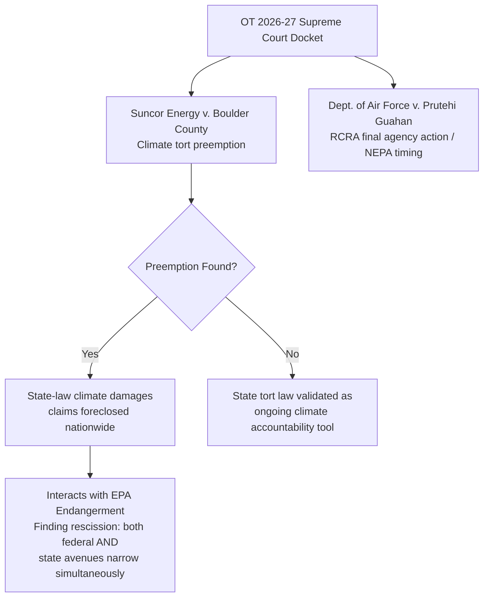

## Anticipated Supreme Court and Circuit Court Dockets to Monitor

### Overview

The 2026–2027 Supreme Court term and the concurrent D.C. Circuit docket present an unusually dense concentration of environmental and administrative law litigation, driven by the convergence of three forces: (1) direct legal challenges to the 2025–2026 deregulatory wave (Endangerment Finding rescission, WOTUS revision, ESA rollbacks); (2) a major climate-tort preemption case testing whether state law remains available for climate damages claims; and (3) continued doctrinal fallout from *Loper Bright*, *Corner Post*, and the *Slaughter*/*Cook* removal-power decisions working through lower courts. This item maps the specific dockets practitioners and students should track, organized by court and by legal theory at stake.

### Supreme Court: October Term 2026–2027

**Key Points**

**1. *Suncor Energy Inc. v. Board of County Commissioners of Boulder County*, No. 25-170** — the term's marquee environmental case.

- **Question presented**: Whether federal law precludes state-law claims seeking relief for injuries allegedly caused by the effects of interstate and international greenhouse-gas emissions on the global climate; the Court also directed the parties to address whether it has jurisdiction to hear the case.
- **Stakes**: The dispute could determine the fate of more than two dozen lawsuits filed by cities, counties, and states against fossil fuel companies over climate-related damages. A ruling favoring preemption could effectively close the courthouse door on state-court climate litigation nationwide; a ruling permitting the claims to proceed would validate state tort law as a continuing vehicle for climate accountability litigation.
- **Posture**: Oral argument scheduled for October 5, 2026, opening the term; the federal government filed an unsolicited amicus brief before certiorari was even granted, arguing Colorado cannot apply its law to conduct occurring outside the state, while more than two dozen amicus briefs were filed in support of the local governments arguing the suits fall within states' traditional authority to protect residents.
- **Broader significance**: A ruling is expected by mid-2027 and is being watched closely by municipalities, energy companies, and insurers, given its potential to reshape climate-liability exposure and litigation strategy nationally — and its direct interaction with the concurrent EPA Endangerment Finding rollback, since a finding of broad federal preemption could simultaneously foreclose the state-law avenue just as the primary federal regulatory avenue (CAA GHG authority) is being narrowed.

**2. *Department of the Air Force v. Prutehi Guahan*, No. 25-579**

- **Question presented**: Whether a federal agency's submission of a RCRA permit-renewal application to a state or territorial regulator constitutes "final agency action" reviewable under the APA, and whether the agency must complete NEPA review before submitting such an application.
- **Significance**: A technical but consequential APA/NEPA procedural question — the only case the Court added to its 2026–27 docket specifically framed as an environmental-law dispute in the initial grant round, signaling the Court's continued interest in the scope of "final agency action" as a threshold reviewability question, an issue with broad application across environmental permitting programs generally.

**3. Certiorari denials worth tracking (signal value)**

- ***Alaska v. United States*, No. 25-320**: On January 12, 2026, the Court denied certiorari on whether the United States can regulate fishing on Alaska's navigable waters under the Alaska National Interest Lands Conservation Act, leaving in place a Ninth Circuit ruling favoring federal authority over the interpretation of "public lands." [Inference] A certiorari denial carries no precedential weight of its own, but the denial here leaves circuit-level federal-versus-state jurisdictional reasoning intact for practitioners tracking natural resource federalism questions.

### D.C. Circuit: The Primary Venue for Deregulatory Challenges

**Key Points**

The D.C. Circuit is the statutorily designated venue for challenges to nationally applicable EPA actions under CAA §307(b)(1), making it the central forum for the current wave of deregulatory litigation.

1. **Endangerment Finding rescission challenge**: A broad coalition — including the American Public Health Association, the Center for Community Action and Environmental Justice, the Union of Concerned Scientists, and the Sierra Club — filed suit in the D.C. Circuit shortly after EPA's February 2026 final rescission, challenging both the Endangerment Finding repeal and the elimination of vehicle GHG standards. The litigation is expected by analysts to eventually reach the Supreme Court, given its role in determining how much latitude future administrations retain to regulate (or deregulate) emissions under the Clean Air Act.
   - Petitioners' central legal theories: that the repeal is unlawful, contradicts well-established climate science, and rests on legal theories courts have repeatedly rejected; filings also frame the dispute as a broader question of administrative authority — specifically, whether and under what conditions an agency may revisit or reverse its own prior factual/scientific determination.
   - **Procedural posture as of mid-2026**: Observers note the litigation has been marked by extended procedural motions and abeyance requests, with petitioners reportedly pursuing a strategy of delaying merits briefing — commentary from sources skeptical of the litigation's merits characterizes this as reflecting petitioners' own uncertainty about their prospects even in a sympathetic circuit. [Inference] The underlying motivation for any particular procedural strategy is contested between commentators with differing views on the merits, and should be treated as advocacy characterization rather than an established fact.
2. **Power plant GHG standard repeal**: Given the pattern from the Endangerment Finding litigation and the earlier Clean Power Plan litigation history (which saw the D.C. Circuit repeatedly hold cases in abeyance during the first Trump administration while EPA reconsidered the underlying rule), practitioners should anticipate a comparable challenge to the September 2026 power plant rule repeal, filed in the same venue, likely raising overlapping legal theories with the Endangerment Finding case.
3. **WOTUS rulemaking**: EPA is facing competing calls for how to revise the WOTUS definition even within the bounds set by *Sackett*, and commentary assesses the agency is almost certainly going to face new litigation once the rule is finalized — a pattern consistent with every WOTUS rulemaking since 2015, which has produced five finalized rules and one Supreme Court decision, with resulting state-by-state variability in practical CWA coverage during pending litigation.
4. **PFAS rules and TSCA policy litigation**: Federal courts are also expected to issue key decisions on EPA grant freezes, PFAS regulatory standards, and TSCA implementation policies during 2026, while the Supreme Court is separately positioned to weigh venue questions for states' PFAS contamination claims — a distinct but related litigation cluster.

### General Litigation Risk Pattern Across the Deregulatory Docket

**Key Points**

- Legal commentary specifically flags that many 2026 EPA final rulemakings are expected to be vulnerable to litigation due to procedural haste and corner-cutting — including compressed timelines, efforts to abbreviate notice-and-comment procedures, and politicized rhetoric accompanying rulemakings — compounded by significant EPA staff losses that may affect the agency's capacity to build a defensible administrative record.
- Countervailing factor: commentary also notes such deregulatory efforts will almost certainly face headwinds from conservative judges, but may simultaneously benefit from recent Supreme Court administrative law rulings (*Loper Bright*, reduced deference generally) that could bolster the deregulatory agenda's chances on the merits — creating genuine uncertainty about net litigation outcomes rather than a one-sided prediction in either direction.
- **Practical implication for monitoring**: Because procedural vulnerability (haste, incomplete record-building) and doctrinal favorability (reduced deference to challenge agency self-reversals) point in different directions, the same case can present a strong procedural argument for petitioners while EPA simultaneously benefits from the substantive interpretive framework — meaning outcomes are likely to turn heavily on case-specific administrative-record quality rather than the deregulatory theory in the abstract.

### Comparative Table: Key Dockets by Legal Theory

| Docket / Case | Court | Core Legal Theory | Expected Resolution Timing |
| --- | --- | --- | --- |
| *Suncor Energy v. Boulder County* | U.S. Supreme Court | Federal preemption of state-law climate tort claims | Decision expected by mid-2027 |
| *Dept. of Air Force v. Prutehi Guahan* | U.S. Supreme Court | APA "final agency action" / NEPA timing under RCRA | Argued as part of Oct. 2026 opening docket |
| Endangerment Finding rescission challenge | D.C. Circuit | Reasoned-explanation requirement for reversing a prior scientific finding; statutory authority under CAA §202(a) | In early-to-mid procedural stages as of mid-2026; abeyance motions pending |
| Power plant GHG standard repeal (anticipated) | D.C. Circuit | CAA §111 authority; adequacy of "does not contribute significantly" finding | Filing anticipated following Sept. 2026 final rule |
| WOTUS revision (anticipated upon finalization) | Multiple circuits (historical pattern) | Consistency with *Sackett*'s "relatively permanent"/"continuous surface connection" test | Litigation expected upon rule finalization; SNPRM comment period open through Oct. 9, 2026 |
| PFAS/TSCA policy litigation | D.C. Circuit / Supreme Court (venue question) | TSCA risk evaluation procedure validity; CWA/SDWA PFAS standard adequacy; proper venue for state contamination claims | Ongoing through 2026 |

### Practical Monitoring Guidance

**Key Points**

- **For CAA-related tracking**: Monitor D.C. Circuit docket activity under the consolidated Endangerment Finding and power-plant-rule case numbers; procedural motions (abeyance requests, extension motions) are themselves informative signals of litigation strategy and timeline, independent of the eventual merits ruling.
- **For climate-tort tracking**: *Suncor Energy* oral argument (October 5, 2026) and the eventual opinion are the single highest-leverage events for the entire landscape of pending state-court climate-damages litigation nationally; a ruling need not resolve the case on the preemption merits, since the Court also asked the parties to brief its own jurisdiction to hear the case, meaning a threshold jurisdictional disposition remains a live possibility.
- **For CWA tracking**: Monitor the WOTUS docket through the current supplemental notice-and-comment cycle (closing October 9, 2026) rather than assuming a near-term final rule, since the rulemaking has already proceeded through multiple iterations without finalization.
- **For cross-cutting doctrinal tracking**: Any of the above cases may generate additional *Loper Bright* "best meaning" statutory interpretation holdings, additional *Corner Post* limitations-period applications, or removal-power holdings extending the *Slaughter*/*Cook* framework to environmental or energy commission-style agencies (e.g., FERC) — practitioners should track these doctrinal threads across cases, not only within the environmental-law-labeled dockets specifically.

### Related Topics

- *Suncor Energy Inc. v. Boulder County*: state-law climate tort claims and the federal preemption question
- D.C. Circuit procedural posture in the Endangerment Finding rescission litigation
- The Clean Power Plan litigation history as a precedent for abeyance strategy in climate rule challenges
- *Massachusetts v. EPA* (2007) as the foundational precedent underlying Endangerment Finding litigation
- PFAS regulatory litigation and pending venue questions for state contamination claims
- The reasoned-explanation standard (*State Farm*) as applied to an agency's reversal of its own prior factual finding
- RCRA permit-renewal "final agency action" doctrine and its cross-application to other permitting statutes
- Comparative litigation posture: WOTUS rulemaking history since 2015 and its five iterations
- *Loper Bright* and *Corner Post* doctrinal threads as they surface across the 2026–2027 docket
- Removal-power litigation (post-*Slaughter*/*Cook*) as applied to FERC, NRC, and other environmental/energy commissions